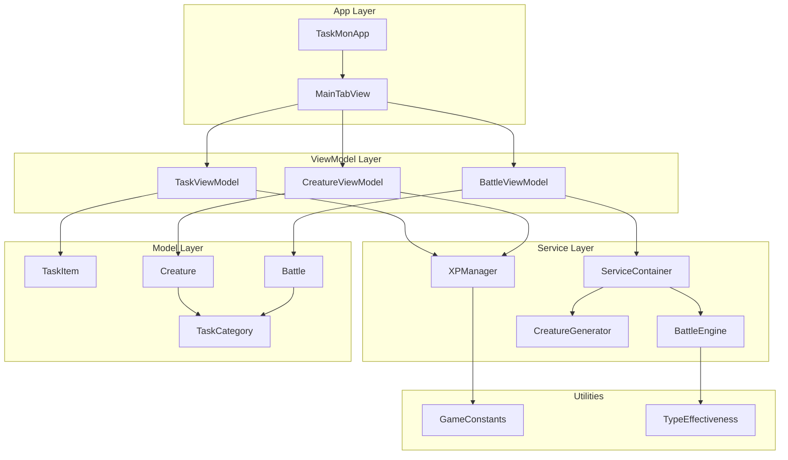
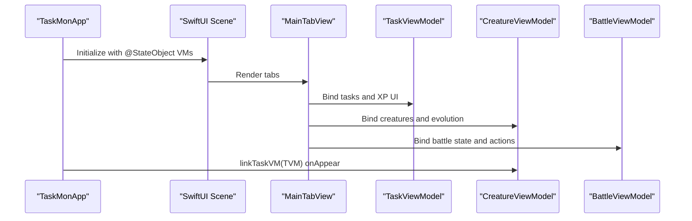
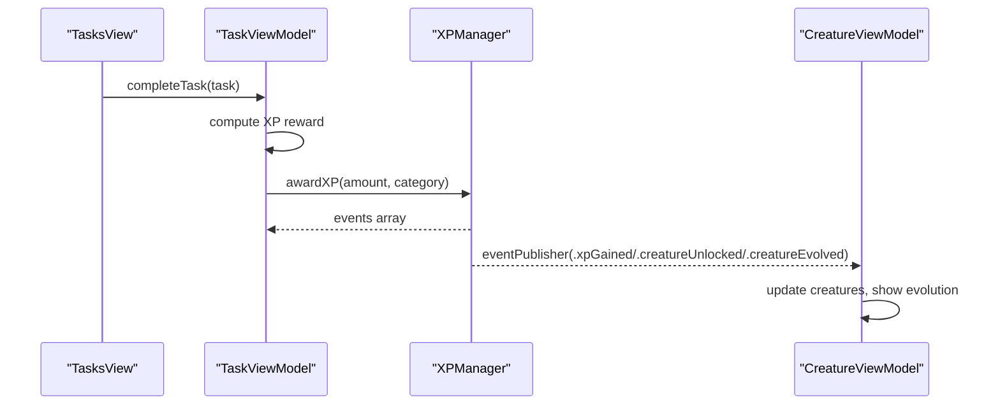
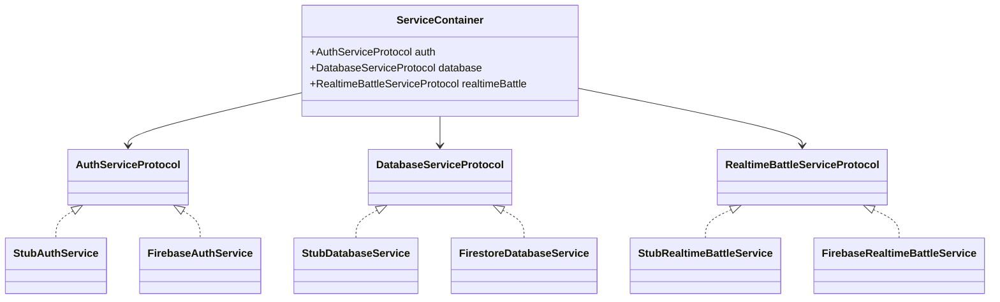
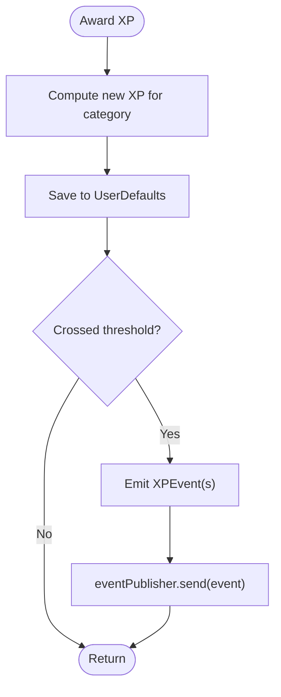
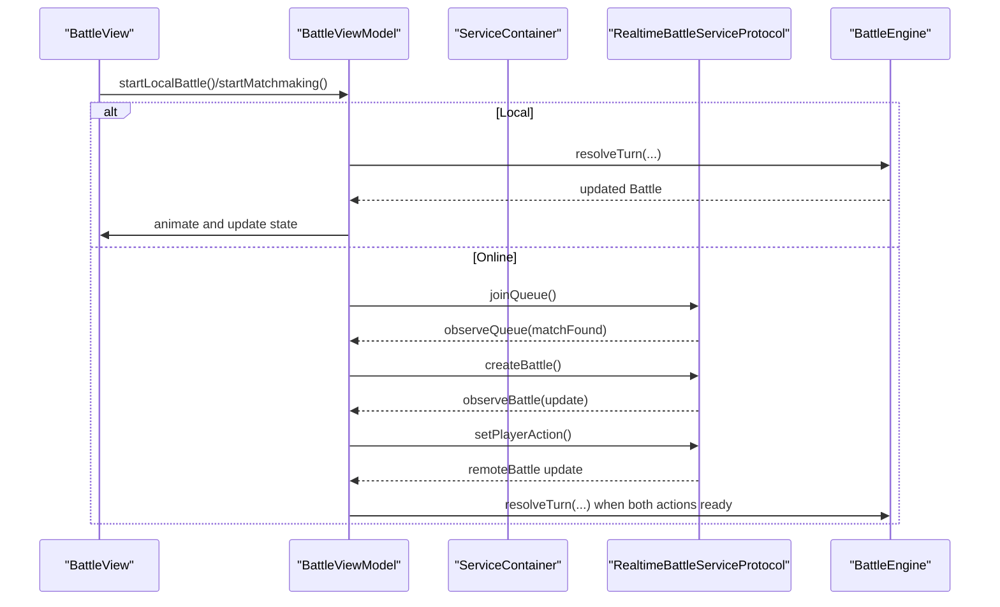
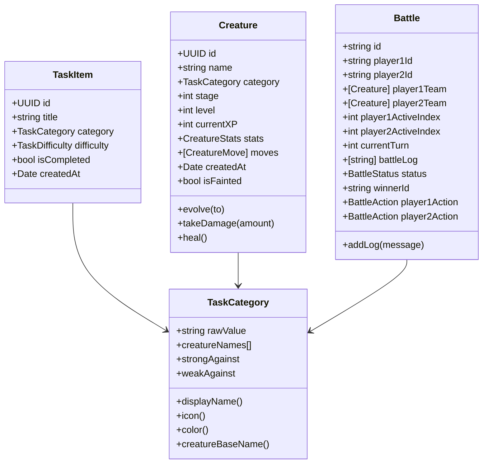
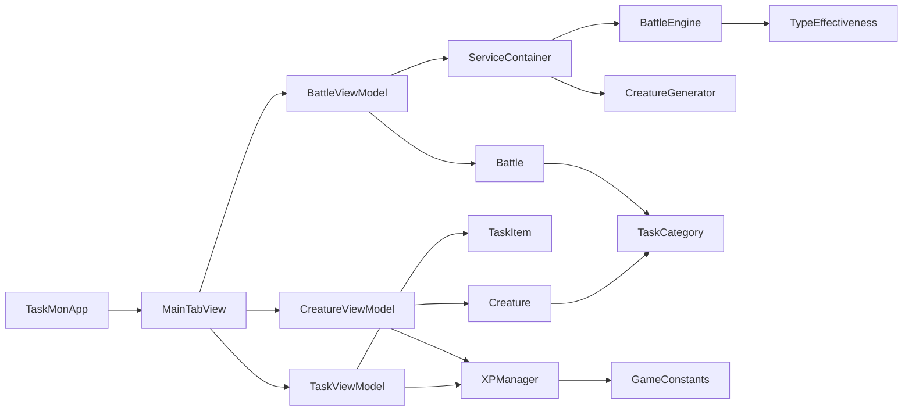
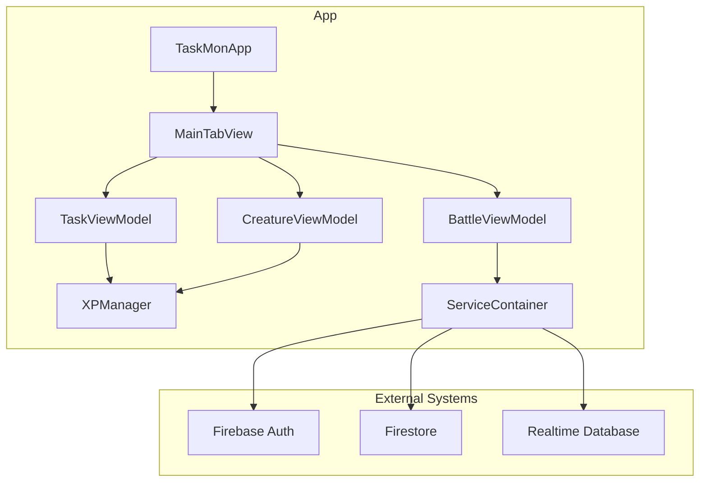

# Architecture Overview

<cite>
**Referenced Files in This Document**
- [TaskMonApp.swift](file://TaskMon/TaskMon/TaskMonApp.swift)
- [MainTabView.swift](file://TaskMon/TaskMon/Views/MainTabView.swift)
- [TaskViewModel.swift](file://TaskMon/TaskMon/ViewModels/TaskViewModel.swift)
- [CreatureViewModel.swift](file://TaskMon/TaskMon/ViewModels/CreatureViewModel.swift)
- [BattleViewModel.swift](file://TaskMon/TaskMon/ViewModels/BattleViewModel.swift)
- [XPManager.swift](file://TaskMon/TaskMon/Services/XPManager.swift)
- [FirebaseService.swift](file://TaskMon/TaskMon/Services/FirebaseService.swift)
- [FirebaseImplementation.swift](file://TaskMon/TaskMon/Services/FirebaseImplementation.swift)
- [ServiceContainer.swift](file://TaskMon/TaskMon/Services/FirebaseImplementation.swift)
- [BattleEngine.swift](file://TaskMon/TaskMon/Services/BattleEngine.swift)
- [CreatureGenerator.swift](file://TaskMon/TaskMon/Services/CreatureGenerator.swift)
- [Battle.swift](file://TaskMon/TaskMon/Models/Battle.swift)
- [Creature.swift](file://TaskMon/TaskMon/Models/Creature.swift)
- [TaskItem.swift](file://TaskMon/TaskMon/Models/TaskItem.swift)
- [TaskCategory.swift](file://TaskMon/TaskMon/Models/TaskCategory.swift)
- [Constants.swift](file://TaskMon/TaskMon/Utils/Constants.swift)
- [TypeEffectiveness.swift](file://TaskMon/TaskMon/Utils/TypeEffectiveness.swift)
</cite>

## Table of Contents
1. [Introduction](#introduction)
2. [Project Structure](#project-structure)
3. [Core Components](#core-components)
4. [Architecture Overview](#architecture-overview)
5. [Detailed Component Analysis](#detailed-component-analysis)
6. [Dependency Analysis](#dependency-analysis)
7. [Performance Considerations](#performance-considerations)
8. [Troubleshooting Guide](#troubleshooting-guide)
9. [Conclusion](#conclusion)
10. [Appendices](#appendices)

## Introduction
This document describes the architecture of the TaskMon iOS application, focusing on the MVVM design pattern, reactive programming with Combine, protocol-oriented service abstractions, and the central XPManager event coordinator. It explains how the app’s entry point TaskMonApp initializes ViewModels and injects them into the SwiftUI hierarchy, how MainTabView acts as a navigation hub, and how ViewModels coordinate with Services and Models. It also documents the optional Firebase integration, persistence strategies, and scalability considerations for future enhancements such as new creature types or battle modes.

## Project Structure
TaskMon follows a layered MVVM architecture:
- App entry point initializes and exposes three primary ViewModels to the SwiftUI scene.
- Views are organized by feature (Tasks, Creatures, Battle) under a tabbed navigation hub.
- Models define the domain data structures and game mechanics.
- Services encapsulate data access and external integrations behind protocol interfaces.
- Utilities provide constants and type effectiveness calculations.

**Diagram sources**
- [TaskMonApp.swift](file://TaskMon/TaskMon/TaskMonApp.swift#L12-L32)
- [MainTabView.swift](file://TaskMon/TaskMon/Views/MainTabView.swift#L3-L28)
- [TaskViewModel.swift](file://TaskMon/TaskMon/ViewModels/TaskViewModel.swift#L5-L16)
- [CreatureViewModel.swift](file://TaskMon/TaskMon/ViewModels/CreatureViewModel.swift#L5-L18)
- [BattleViewModel.swift](file://TaskMon/TaskMon/ViewModels/BattleViewModel.swift#L10-L43)
- [ServiceContainer.swift](file://TaskMon/TaskMon/Services/FirebaseImplementation.swift#L182-L189)
- [XPManager.swift](file://TaskMon/TaskMon/Services/XPManager.swift#L10-L20)
- [BattleEngine.swift](file://TaskMon/TaskMon/Services/BattleEngine.swift#L3-L6)
- [CreatureGenerator.swift](file://TaskMon/TaskMon/Services/CreatureGenerator.swift#L3-L7)
- [Battle.swift](file://TaskMon/TaskMon/Models/Battle.swift#L32-L68)
- [Creature.swift](file://TaskMon/TaskMon/Models/Creature.swift#L33-L97)
- [TaskItem.swift](file://TaskMon/TaskMon/Models/TaskItem.swift#L27-L43)
- [TaskCategory.swift](file://TaskMon/TaskMon/Models/TaskCategory.swift#L4-L84)
- [Constants.swift](file://TaskMon/TaskMon/Utils/Constants.swift#L4-L24)
- [TypeEffectiveness.swift](file://TaskMon/TaskMon/Utils/TypeEffectiveness.swift#L3-L33)

**Section sources**
- [TaskMonApp.swift](file://TaskMon/TaskMon/TaskMonApp.swift#L12-L32)
- [MainTabView.swift](file://TaskMon/TaskMon/Views/MainTabView.swift#L3-L28)

## Core Components
- TaskMonApp: Declares the SwiftUI App, creates and injects three ViewModels into the scene, and links CreatureViewModel to TaskViewModel after the UI appears.
- MainTabView: Provides a tabbed interface routing to TasksView, CreaturesView, and BattleView.
- TaskViewModel: Manages tasks, computes XP rewards, and coordinates with XPManager to emit XP events.
- CreatureViewModel: Manages creatures, persists to UserDefaults, subscribes to XPManager events, and triggers evolution animations.
- BattleViewModel: Orchestrates local and online battles, manages matchmaking, observes remote state, resolves turns, and animates outcomes.
- XPManager: Central event coordinator emitting XPEvent instances and persisting category XP via UserDefaults.
- ServiceContainer and FirebaseService/FirebaseImplementation: Protocol-oriented service layer enabling stub implementations and optional Firebase integration.
- BattleEngine and CreatureGenerator: Pure logic services for turn resolution and AI team generation.
- Models: TaskItem, Creature, Battle, TaskCategory define the core domain data and behaviors.
- Utilities: GameConstants and TypeEffectiveness provide constants and battle mechanics.

**Section sources**
- [TaskMonApp.swift](file://TaskMon/TaskMon/TaskMonApp.swift#L12-L32)
- [MainTabView.swift](file://TaskMon/TaskMon/Views/MainTabView.swift#L3-L28)
- [TaskViewModel.swift](file://TaskMon/TaskMon/ViewModels/TaskViewModel.swift#L5-L75)
- [CreatureViewModel.swift](file://TaskMon/TaskMon/ViewModels/CreatureViewModel.swift#L5-L89)
- [BattleViewModel.swift](file://TaskMon/TaskMon/ViewModels/BattleViewModel.swift#L10-L461)
- [XPManager.swift](file://TaskMon/TaskMon/Services/XPManager.swift#L10-L95)
- [FirebaseService.swift](file://TaskMon/TaskMon/Services/FirebaseService.swift#L8-L35)
- [FirebaseImplementation.swift](file://TaskMon/TaskMon/Services/FirebaseImplementation.swift#L182-L189)
- [BattleEngine.swift](file://TaskMon/TaskMon/Services/BattleEngine.swift#L3-L169)
- [CreatureGenerator.swift](file://TaskMon/TaskMon/Services/CreatureGenerator.swift#L3-L43)
- [Battle.swift](file://TaskMon/TaskMon/Models/Battle.swift#L32-L68)
- [Creature.swift](file://TaskMon/TaskMon/Models/Creature.swift#L33-L97)
- [TaskItem.swift](file://TaskMon/TaskMon/Models/TaskItem.swift#L27-L43)
- [TaskCategory.swift](file://TaskMon/TaskMon/Models/TaskCategory.swift#L4-L84)
- [Constants.swift](file://TaskMon/TaskMon/Utils/Constants.swift#L4-L39)
- [TypeEffectiveness.swift](file://TaskMon/TaskMon/Utils/TypeEffectiveness.swift#L3-L33)

## Architecture Overview
The app adheres to MVVM:
- Views are SwiftUI views bound to ViewModel state.
- ViewModels own and publish state via @Published properties and Combine streams.
- Services abstract data access and external integrations behind protocols.
- Models encapsulate domain data and behaviors.

Reactive programming with Combine:
- ViewModels publish state changes via @Published properties.
- XPManager publishes XPEvent through a PassthroughSubject to decouple task completion from creature evolution.
- BattleViewModel subscribes to remote battle updates and transforms them into local state.

Protocol-oriented service layer:
- AuthServiceProtocol, DatabaseServiceProtocol, RealtimeBattleServiceProtocol define contracts.
- Stub implementations enable local-only operation; Firebase implementations are provided but disabled by default.
- ServiceContainer centralizes service instantiation and allows swapping implementations.

**Diagram sources**
- [TaskMonApp.swift](file://TaskMon/TaskMon/TaskMonApp.swift#L16-L29)
- [MainTabView.swift](file://TaskMon/TaskMon/Views/MainTabView.swift#L6-L26)
- [TaskViewModel.swift](file://TaskMon/TaskMon/ViewModels/TaskViewModel.swift#L5-L16)
- [CreatureViewModel.swift](file://TaskMon/TaskMon/ViewModels/CreatureViewModel.swift#L20-L22)
- [BattleViewModel.swift](file://TaskMon/TaskMon/ViewModels/BattleViewModel.swift#L10-L25)

## Detailed Component Analysis

### MVVM and Reactive State Management
- TaskViewModel publishes tasks and XP-related UI signals; on task completion, it awards XP via XPManager and emits events.
- CreatureViewModel subscribes to XPManager.shared.eventPublisher to react to XP milestones, unlocking and evolving creatures.
- BattleViewModel publishes battle state and animates outcomes; it also integrates with online services via ServiceContainer.

**Diagram sources**
- [TaskViewModel.swift](file://TaskMon/TaskMon/ViewModels/TaskViewModel.swift#L26-L39)
- [XPManager.swift](file://TaskMon/TaskMon/Services/XPManager.swift#L22-L50)
- [CreatureViewModel.swift](file://TaskMon/TaskMon/ViewModels/CreatureViewModel.swift#L33-L63)

**Section sources**
- [TaskViewModel.swift](file://TaskMon/TaskMon/ViewModels/TaskViewModel.swift#L5-L75)
- [CreatureViewModel.swift](file://TaskMon/TaskMon/ViewModels/CreatureViewModel.swift#L5-L89)
- [XPManager.swift](file://TaskMon/TaskMon/Services/XPManager.swift#L10-L95)

### Service Layer Abstraction and Dependency Injection
- ServiceContainer.shared provides access to AuthServiceProtocol, DatabaseServiceProtocol, and RealtimeBattleServiceProtocol.
- Stub implementations are ready-to-use and require no Firebase configuration.
- FirebaseImplementation provides real implementations guarded by comments and imports; switching requires enabling Firebase and updating ServiceContainer.

**Diagram sources**
- [ServiceContainer.swift](file://TaskMon/TaskMon/Services/FirebaseImplementation.swift#L182-L189)
- [FirebaseService.swift](file://TaskMon/TaskMon/Services/FirebaseService.swift#L8-L35)
- [FirebaseImplementation.swift](file://TaskMon/TaskMon/Services/FirebaseImplementation.swift#L18-L37)
- [FirebaseImplementation.swift](file://TaskMon/TaskMon/Services/FirebaseImplementation.swift#L41-L94)
- [FirebaseImplementation.swift](file://TaskMon/TaskMon/Services/FirebaseImplementation.swift#L98-L177)

**Section sources**
- [ServiceContainer.swift](file://TaskMon/TaskMon/Services/FirebaseImplementation.swift#L182-L189)
- [FirebaseService.swift](file://TaskMon/TaskMon/Services/FirebaseService.swift#L8-L35)
- [FirebaseImplementation.swift](file://TaskMon/TaskMon/Services/FirebaseImplementation.swift#L18-L37)
- [FirebaseImplementation.swift](file://TaskMon/TaskMon/Services/FirebaseImplementation.swift#L41-L94)
- [FirebaseImplementation.swift](file://TaskMon/TaskMon/Services/FirebaseImplementation.swift#L98-L177)

### XPManager as Central Event Coordinator
- XPManager maintains per-category XP, persists to UserDefaults, and emits XPEvent through a Combine subject.
- Events include XP gained, creature unlocked, and creature evolved.
- CreatureViewModel listens to these events to drive evolution and UI updates.

**Diagram sources**
- [XPManager.swift](file://TaskMon/TaskMon/Services/XPManager.swift#L22-L50)
- [CreatureViewModel.swift](file://TaskMon/TaskMon/ViewModels/CreatureViewModel.swift#L33-L63)

**Section sources**
- [XPManager.swift](file://TaskMon/TaskMon/Services/XPManager.swift#L10-L95)
- [CreatureViewModel.swift](file://TaskMon/TaskMon/ViewModels/CreatureViewModel.swift#L24-L63)

### Battle System Orchestration
- BattleViewModel coordinates local and online battles:
  - Local: starts a battle, selects AI actions, resolves turns, and animates outcomes.
  - Online: handles matchmaking, joins/leaves queue, observes remote battle state, and resolves turns when both players submit actions.
- BattleEngine performs turn resolution, move execution, type effectiveness, fainting checks, and win conditions.
- CreatureGenerator generates AI teams and matched teams for balanced gameplay.

**Diagram sources**
- [BattleViewModel.swift](file://TaskMon/TaskMon/ViewModels/BattleViewModel.swift#L66-L146)
- [BattleViewModel.swift](file://TaskMon/TaskMon/ViewModels/BattleViewModel.swift#L167-L281)
- [BattleViewModel.swift](file://TaskMon/TaskMon/ViewModels/BattleViewModel.swift#L285-L357)
- [BattleEngine.swift](file://TaskMon/TaskMon/Services/BattleEngine.swift#L5-L66)
- [CreatureGenerator.swift](file://TaskMon/TaskMon/Services/CreatureGenerator.swift#L24-L42)

**Section sources**
- [BattleViewModel.swift](file://TaskMon/TaskMon/ViewModels/BattleViewModel.swift#L10-L461)
- [BattleEngine.swift](file://TaskMon/TaskMon/Services/BattleEngine.swift#L3-L169)
- [CreatureGenerator.swift](file://TaskMon/TaskMon/Services/CreatureGenerator.swift#L3-L43)

### Models and Mechanics
- TaskItem defines tasks with category and difficulty; difficulty maps to XP rewards.
- Creature defines stats, evolution stages, moves, and helpers for healing/fainting.
- Battle defines battle state, actions, and logging.
- TaskCategory defines creature naming, icons, colors, and type effectiveness relationships.
- TypeEffectiveness provides the damage multiplier logic.
- GameConstants centralizes numeric constants for XP thresholds, team size, and UI.

**Diagram sources**
- [TaskItem.swift](file://TaskMon/TaskMon/Models/TaskItem.swift#L27-L43)
- [Creature.swift](file://TaskMon/TaskMon/Models/Creature.swift#L33-L97)
- [Battle.swift](file://TaskMon/TaskMon/Models/Battle.swift#L32-L68)
- [TaskCategory.swift](file://TaskMon/TaskMon/Models/TaskCategory.swift#L4-L84)

**Section sources**
- [TaskItem.swift](file://TaskMon/TaskMon/Models/TaskItem.swift#L27-L43)
- [Creature.swift](file://TaskMon/TaskMon/Models/Creature.swift#L33-L97)
- [Battle.swift](file://TaskMon/TaskMon/Models/Battle.swift#L32-L68)
- [TaskCategory.swift](file://TaskMon/TaskMon/Models/TaskCategory.swift#L4-L84)
- [TypeEffectiveness.swift](file://TaskMon/TaskMon/Utils/TypeEffectiveness.swift#L3-L33)
- [Constants.swift](file://TaskMon/TaskMon/Utils/Constants.swift#L4-L24)

## Dependency Analysis
- TaskMonApp depends on SwiftUI lifecycle and environmentObject injection to share ViewModels.
- MainTabView depends on feature views and tab selection.
- TaskViewModel depends on XPManager and UserDefaults for persistence.
- CreatureViewModel depends on XPManager and UserDefaults for persistence.
- BattleViewModel depends on ServiceContainer for authentication, database, and realtime battle services.
- BattleEngine and CreatureGenerator are pure logic services consumed by BattleViewModel.
- Models are data-only with minimal behavior, depending on TaskCategory and GameConstants.

**Diagram sources**
- [TaskMonApp.swift](file://TaskMon/TaskMon/TaskMonApp.swift#L16-L29)
- [MainTabView.swift](file://TaskMon/TaskMon/Views/MainTabView.swift#L6-L26)
- [TaskViewModel.swift](file://TaskMon/TaskMon/ViewModels/TaskViewModel.swift#L11-L16)
- [CreatureViewModel.swift](file://TaskMon/TaskMon/ViewModels/CreatureViewModel.swift#L13-L18)
- [BattleViewModel.swift](file://TaskMon/TaskMon/ViewModels/BattleViewModel.swift#L36-L37)
- [ServiceContainer.swift](file://TaskMon/TaskMon/Services/FirebaseImplementation.swift#L182-L189)
- [BattleEngine.swift](file://TaskMon/TaskMon/Services/BattleEngine.swift#L3-L6)
- [CreatureGenerator.swift](file://TaskMon/TaskMon/Services/CreatureGenerator.swift#L3-L7)
- [Battle.swift](file://TaskMon/TaskMon/Models/Battle.swift#L32-L68)
- [Creature.swift](file://TaskMon/TaskMon/Models/Creature.swift#L33-L97)
- [TaskItem.swift](file://TaskMon/TaskMon/Models/TaskItem.swift#L27-L43)
- [TaskCategory.swift](file://TaskMon/TaskMon/Models/TaskCategory.swift#L4-L84)
- [TypeEffectiveness.swift](file://TaskMon/TaskMon/Utils/TypeEffectiveness.swift#L3-L33)
- [Constants.swift](file://TaskMon/TaskMon/Utils/Constants.swift#L4-L24)

**Section sources**
- [TaskMonApp.swift](file://TaskMon/TaskMon/TaskMonApp.swift#L16-L29)
- [MainTabView.swift](file://TaskMon/TaskMon/Views/MainTabView.swift#L6-L26)
- [TaskViewModel.swift](file://TaskMon/TaskMon/ViewModels/TaskViewModel.swift#L11-L16)
- [CreatureViewModel.swift](file://TaskMon/TaskMon/ViewModels/CreatureViewModel.swift#L13-L18)
- [BattleViewModel.swift](file://TaskMon/TaskMon/ViewModels/BattleViewModel.swift#L36-L37)
- [ServiceContainer.swift](file://TaskMon/TaskMon/Services/FirebaseImplementation.swift#L182-L189)

## Performance Considerations
- Combine publishers and @Published properties minimize unnecessary UI updates; ensure subscriptions are stored and cancelled appropriately to prevent retain cycles.
- Battle animations and timers should be invalidated on reset to avoid background processing.
- Persisting to UserDefaults is efficient for small datasets; consider migrating to a lightweight database if data volume grows.
- Online matchmaking and battle observation should clean up observers promptly to reduce memory footprint.
- Type effectiveness and stat calculations are constant-time; keep logic in BattleEngine and CreatureStats to maintain performance predictability.

[No sources needed since this section provides general guidance]

## Troubleshooting Guide
- If XP does not unlock or evolve creatures:
  - Verify XPManager.saveXP and loadXP are invoked and UserDefaults keys match expectations.
  - Confirm CreatureViewModel subscribes to XPManager.shared.eventPublisher.
- If online battles do not connect:
  - Ensure ServiceContainer uses Firebase implementations and GoogleService-Info.plist is present.
  - Verify authentication via AuthServiceProtocol and that BattleViewModel cleans up observers on reset.
- If UI flickers or animations stutter:
  - Check that animations are dispatched on the main thread and timers are invalidated.
- If tasks or creatures do not persist:
  - Confirm JSON encoding/decoding paths and UserDefaults keys.

**Section sources**
- [XPManager.swift](file://TaskMon/TaskMon/Services/XPManager.swift#L79-L94)
- [CreatureViewModel.swift](file://TaskMon/TaskMon/ViewModels/CreatureViewModel.swift#L78-L88)
- [BattleViewModel.swift](file://TaskMon/TaskMon/ViewModels/BattleViewModel.swift#L388-L414)
- [FirebaseImplementation.swift](file://TaskMon/TaskMon/Services/FirebaseImplementation.swift#L182-L189)

## Conclusion
TaskMon employs a clean MVVM architecture with reactive state management via Combine, a protocol-oriented service layer supporting local-only and Firebase-enabled deployments, and a central XPManager coordinating task completion with creature evolution. The SwiftUI-based UI remains responsive and modular, while the separation of concerns enables straightforward extension for new creature types, battle modes, and persistence backends.

[No sources needed since this section summarizes without analyzing specific files]

## Appendices

### System Context Diagram

**Diagram sources**
- [TaskMonApp.swift](file://TaskMon/TaskMon/TaskMonApp.swift#L12-L32)
- [MainTabView.swift](file://TaskMon/TaskMon/Views/MainTabView.swift#L3-L28)
- [TaskViewModel.swift](file://TaskMon/TaskMon/ViewModels/TaskViewModel.swift#L5-L16)
- [CreatureViewModel.swift](file://TaskMon/TaskMon/ViewModels/CreatureViewModel.swift#L5-L18)
- [BattleViewModel.swift](file://TaskMon/TaskMon/ViewModels/BattleViewModel.swift#L10-L43)
- [ServiceContainer.swift](file://TaskMon/TaskMon/Services/FirebaseImplementation.swift#L182-L189)
- [FirebaseImplementation.swift](file://TaskMon/TaskMon/Services/FirebaseImplementation.swift#L18-L37)
- [FirebaseImplementation.swift](file://TaskMon/TaskMon/Services/FirebaseImplementation.swift#L41-L94)
- [FirebaseImplementation.swift](file://TaskMon/TaskMon/Services/FirebaseImplementation.swift#L98-L177)