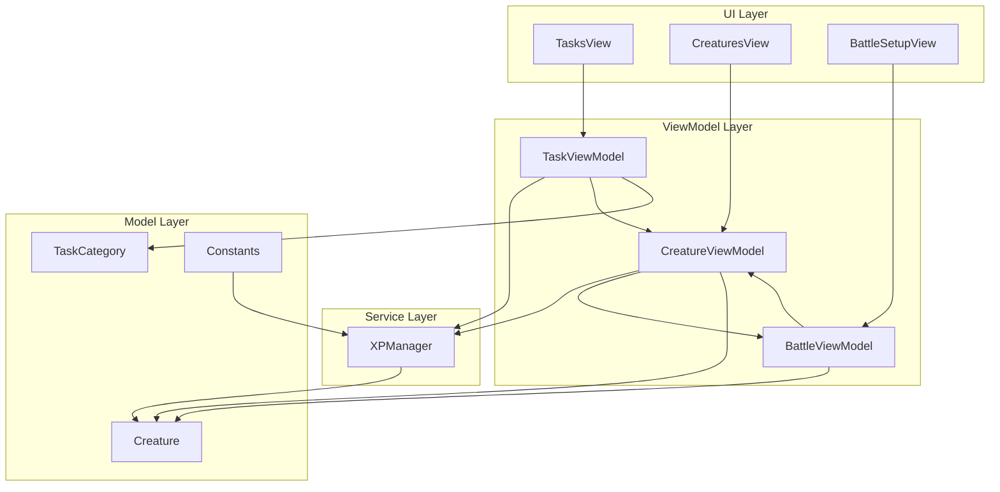
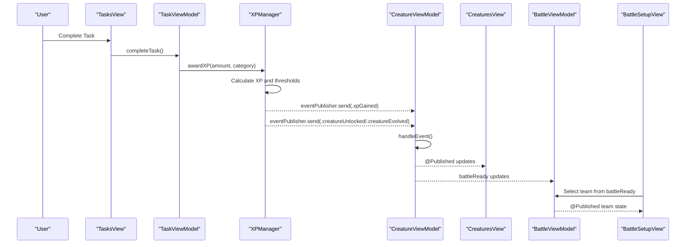
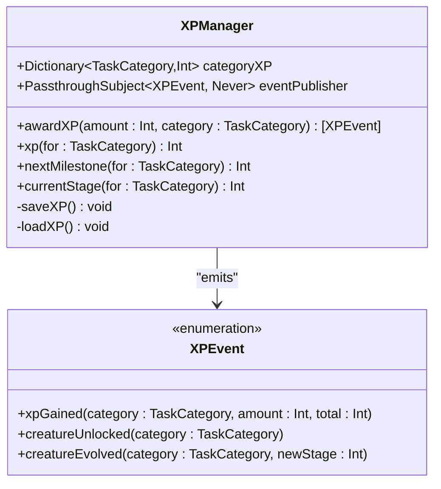
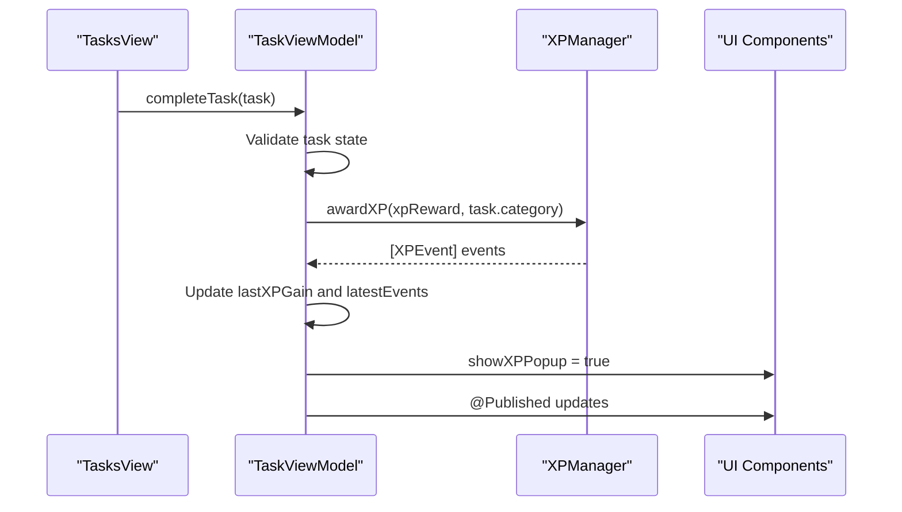
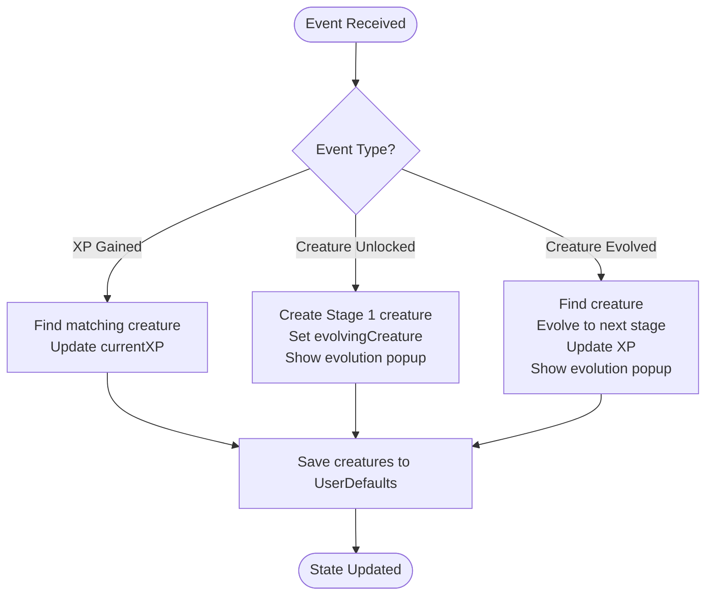
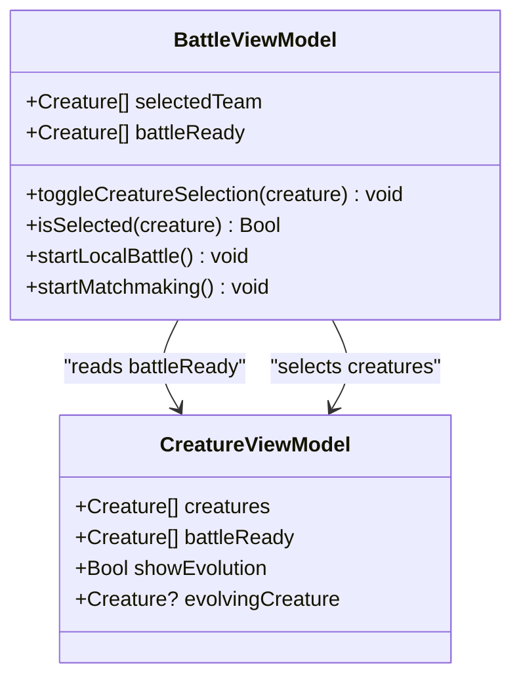
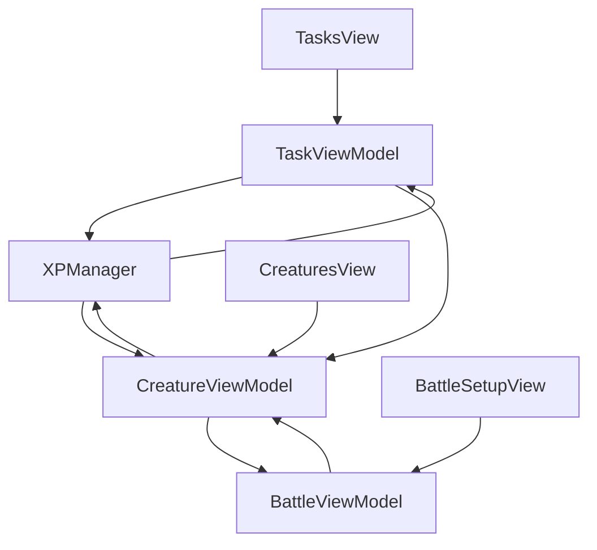

# Cross-Component Communication

<cite>
**Referenced Files in This Document**
- [XPManager.swift](file://TaskMon/TaskMon/Services/XPManager.swift)
- [TaskViewModel.swift](file://TaskMon/TaskMon/ViewModels/TaskViewModel.swift)
- [CreatureViewModel.swift](file://TaskMon/TaskMon/ViewModels/CreatureViewModel.swift)
- [BattleViewModel.swift](file://TaskMon/TaskMon/ViewModels/BattleViewModel.swift)
- [TaskMonApp.swift](file://TaskMon/TaskMon/TaskMonApp.swift)
- [TasksView.swift](file://TaskMon/TaskMon/Views/Tasks/TasksView.swift)
- [CreaturesView.swift](file://TaskMon/TaskMon/Views/Creatures/CreaturesView.swift)
- [BattleSetupView.swift](file://TaskMon/TaskMon/Views/Battle/BattleSetupView.swift)
- [Creature.swift](file://TaskMon/TaskMon/Models/Creature.swift)
- [TaskCategory.swift](file://TaskMon/TaskMon/Models/TaskCategory.swift)
- [Constants.swift](file://TaskMon/TaskMon/Utils/Constants.swift)
</cite>

## Table of Contents
1. [Introduction](#introduction)
2. [Project Structure](#project-structure)
3. [Core Components](#core-components)
4. [Architecture Overview](#architecture-overview)
5. [Detailed Component Analysis](#detailed-component-analysis)
6. [Dependency Analysis](#dependency-analysis)
7. [Performance Considerations](#performance-considerations)
8. [Troubleshooting Guide](#troubleshooting-guide)
9. [Conclusion](#conclusion)

## Introduction
This document explains TaskMon's cross-component communication mechanisms that enable loose coupling between ViewModels and services. It focuses on how XPManager acts as the central event coordinator, broadcasting XP events from task completion to trigger creature evolution and battle readiness notifications. The system uses the observer pattern implemented with Combine publishers and subscribers to achieve decoupled, event-driven communication across the application.

## Project Structure
The application follows a layered MVVM architecture with clear separation of concerns:
- Services: Business logic and state coordination (XPManager)
- ViewModels: Presentation logic and state for UI components (TaskViewModel, CreatureViewModel, BattleViewModel)
- Views: SwiftUI UI components that bind to ViewModel state
- Models: Data structures for game entities (Creature, TaskCategory)
- Utilities: Constants and helpers

**Diagram sources**
- [TaskMonApp.swift](file://TaskMon/TaskMon/TaskMonApp.swift#L16-L19)
- [TaskViewModel.swift](file://TaskMon/TaskMon/ViewModels/TaskViewModel.swift#L5-L11)
- [CreatureViewModel.swift](file://TaskMon/TaskMon/ViewModels/CreatureViewModel.swift#L5-L13)
- [BattleViewModel.swift](file://TaskMon/TaskMon/ViewModels/BattleViewModel.swift#L10-L36)
- [XPManager.swift](file://TaskMon/TaskMon/Services/XPManager.swift#L10-L14)
- [Creature.swift](file://TaskMon/TaskMon/Models/Creature.swift#L33-L42)
- [TaskCategory.swift](file://TaskMon/TaskMon/Models/TaskCategory.swift#L4-L11)
- [Constants.swift](file://TaskMon/TaskMon/Utils/Constants.swift#L4-L24)

**Section sources**
- [TaskMonApp.swift](file://TaskMon/TaskMon/TaskMonApp.swift#L16-L32)
- [TaskViewModel.swift](file://TaskMon/TaskMon/ViewModels/TaskViewModel.swift#L5-L11)
- [CreatureViewModel.swift](file://TaskMon/TaskMon/ViewModels/CreatureViewModel.swift#L5-L13)
- [BattleViewModel.swift](file://TaskMon/TaskMon/ViewModels/BattleViewModel.swift#L10-L36)

## Core Components
This section documents the key components involved in cross-component communication:

- XPManager: Central event coordinator that manages XP state and broadcasts XPEvent instances to subscribers
- TaskViewModel: Orchestrates task completion and delegates XP awarding to XPManager
- CreatureViewModel: Subscribes to XPManager events to update creature evolution and notify UI
- BattleViewModel: Uses CreatureViewModel's battle-ready creatures for team selection and battle logic

Key implementation patterns:
- Event-driven architecture using Combine publishers/subscribers
- Loose coupling through shared service instances
- Decoupled UI updates via @Published properties and SwiftUI bindings
- Centralized XP state management with persistence

**Section sources**
- [XPManager.swift](file://TaskMon/TaskMon/Services/XPManager.swift#L4-L14)
- [TaskViewModel.swift](file://TaskMon/TaskMon/ViewModels/TaskViewModel.swift#L5-L11)
- [CreatureViewModel.swift](file://TaskMon/TaskMon/ViewModels/CreatureViewModel.swift#L5-L13)
- [BattleViewModel.swift](file://TaskMon/TaskMon/ViewModels/BattleViewModel.swift#L10-L13)

## Architecture Overview
The cross-component communication follows an event-driven pattern with XPManager as the central hub:

**Diagram sources**
- [TaskViewModel.swift](file://TaskMon/TaskMon/ViewModels/TaskViewModel.swift#L26-L39)
- [XPManager.swift](file://TaskMon/TaskMon/Services/XPManager.swift#L22-L50)
- [CreatureViewModel.swift](file://TaskMon/TaskMon/ViewModels/CreatureViewModel.swift#L24-L63)
- [BattleViewModel.swift](file://TaskMon/TaskMon/ViewModels/BattleViewModel.swift#L65-L82)

## Detailed Component Analysis

### XPManager: Central Event Coordinator
XPManager serves as the single source of truth for XP events and state:

**Diagram sources**
- [XPManager.swift](file://TaskMon/TaskMon/Services/XPManager.swift#L4-L14)

Key responsibilities:
- Manages XP state per task category
- Calculates milestone crossings and emits appropriate events
- Persists XP data to UserDefaults
- Provides utility methods for UI displays

Event emission flow:
1. Task completion triggers XP awarding
2. XPManager calculates new XP totals
3. Milestone thresholds are checked
4. Events are emitted in order: XP gained → creature unlocked → creature evolved
5. All subscribers receive events via Combine publisher

**Section sources**
- [XPManager.swift](file://TaskMon/TaskMon/Services/XPManager.swift#L22-L50)
- [Constants.swift](file://TaskMon/TaskMon/Utils/Constants.swift#L10-L13)

### TaskViewModel: Task Completion Orchestrator
TaskViewModel coordinates task completion and delegates XP management:

**Diagram sources**
- [TaskViewModel.swift](file://TaskMon/TaskMon/ViewModels/TaskViewModel.swift#L26-L39)
- [TasksView.swift](file://TaskMon/TaskMon/Views/Tasks/TasksView.swift#L53-L61)

Communication patterns:
- Direct dependency on XPManager.shared for XP operations
- Emits UI state changes via @Published properties
- Passes events to UI for popup display

**Section sources**
- [TaskViewModel.swift](file://TaskMon/TaskMon/ViewModels/TaskViewModel.swift#L26-L39)
- [TasksView.swift](file://TaskMon/TaskMon/Views/Tasks/TasksView.swift#L53-L61)

### CreatureViewModel: Evolution and Notification Handler
CreatureViewModel subscribes to XPManager events and manages creature evolution:

**Diagram sources**
- [CreatureViewModel.swift](file://TaskMon/TaskMon/ViewModels/CreatureViewModel.swift#L33-L63)

Subscription mechanism:
- Creates Combine subscription to XPManager.eventPublisher
- Receives events on main queue for UI updates
- Handles three event types: XP gained, creature unlocked, creature evolved
- Updates @Published properties for UI binding

**Section sources**
- [CreatureViewModel.swift](file://TaskMon/TaskMon/ViewModels/CreatureViewModel.swift#L24-L63)
- [CreaturesView.swift](file://TaskMon/TaskMon/Views/Creatures/CreaturesView.swift#L59-L68)

### BattleViewModel: Team Management and Battle Readiness
BattleViewModel consumes CreatureViewModel's battle-ready state:

**Diagram sources**
- [BattleViewModel.swift](file://TaskMon/TaskMon/ViewModels/BattleViewModel.swift#L65-L67)
- [BattleViewModel.swift](file://TaskMon/TaskMon/ViewModels/BattleViewModel.swift#L65-L67)

Integration points:
- Uses CreatureViewModel.battleReady for team selection
- Reads CreatureViewModel.showEvolution for evolution animations
- Coordinates with CreatureViewModel.evolvingCreature for UI feedback

**Section sources**
- [BattleViewModel.swift](file://TaskMon/TaskMon/ViewModels/BattleViewModel.swift#L65-L67)
- [BattleSetupView.swift](file://TaskMon/TaskMon/Views/Battle/BattleSetupView.swift#L25-L75)

## Dependency Analysis
The communication dependencies form a unidirectional event flow:

**Diagram sources**
- [TaskViewModel.swift](file://TaskMon/TaskMon/ViewModels/TaskViewModel.swift#L11-L11)
- [CreatureViewModel.swift](file://TaskMon/TaskMon/ViewModels/CreatureViewModel.swift#L13-L13)
- [BattleViewModel.swift](file://TaskMon/TaskMon/ViewModels/BattleViewModel.swift#L10-L13)

Key dependency characteristics:
- Unidirectional data flow: Task completion → XP events → Creature evolution → Battle team updates
- Shared service pattern: All ViewModels depend on XPManager.shared
- Weak references in subscriptions to prevent retain cycles
- Main queue dispatch for UI thread safety

**Section sources**
- [TaskViewModel.swift](file://TaskMon/TaskMon/ViewModels/TaskViewModel.swift#L11-L11)
- [CreatureViewModel.swift](file://TaskMon/TaskMon/ViewModels/CreatureViewModel.swift#L13-L13)
- [BattleViewModel.swift](file://TaskMon/TaskMon/ViewModels/BattleViewModel.swift#L10-L13)

## Performance Considerations
The system employs several strategies to handle frequent state updates efficiently:

### Event Batching and Throttling
- Combine sink with main queue dispatch ensures UI updates occur on the main thread
- Batched UI updates through @Published properties minimize redundant redraws
- Event ordering is preserved through sequential emission from XPManager

### Memory Management
- Weak self references in Combine subscriptions prevent retain cycles
- Cancellables set prevents memory leaks from long-lived subscriptions
- Structured cleanup in ViewModel initialization/deinitialization

### Asynchronous Operations
- Background persistence operations using UserDefaults
- Main thread UI updates via DispatchQueue.main
- Proper async/await patterns in online battle operations

### Notification Storm Prevention
- Single source of truth reduces duplicate event emissions
- Event filtering prevents unnecessary UI updates
- Batched state updates consolidate frequent changes

**Section sources**
- [CreatureViewModel.swift](file://TaskMon/TaskMon/ViewModels/CreatureViewModel.swift#L25-L30)
- [TaskViewModel.swift](file://TaskMon/TaskMon/ViewModels/TaskViewModel.swift#L34-L36)

## Troubleshooting Guide
Common issues and their solutions:

### Event Delivery Problems
- **Issue**: Creatures not evolving after XP gain
- **Cause**: Subscription not established or event filtering logic
- **Solution**: Verify XPManager.subscription is active and handleEvent properly routes events

### UI State Synchronization
- **Issue**: Battle team selection disabled despite available creatures
- **Cause**: CreatureViewModel.battleReady not updating
- **Solution**: Check creature filtering logic and ensure @Published properties are triggering updates

### Memory Leaks
- **Issue**: Retain cycles in event subscriptions
- **Cause**: Strong reference captures in Combine sink closures
- **Solution**: Use [weak self] capture lists and store subscriptions in cancellables

### Performance Issues
- **Issue**: UI lag during rapid task completion
- **Cause**: Excessive event emissions or heavy UI updates
- **Solution**: Implement debouncing for rapid task completions and optimize UI rendering

**Section sources**
- [CreatureViewModel.swift](file://TaskMon/TaskMon/ViewModels/CreatureViewModel.swift#L24-L31)
- [BattleViewModel.swift](file://TaskMon/TaskMon/ViewModels/BattleViewModel.swift#L65-L67)

## Conclusion
TaskMon's cross-component communication demonstrates a clean implementation of event-driven architecture using Combine. XPManager serves as the central coordinator, enabling loose coupling between TaskViewModel, CreatureViewModel, and BattleViewModel. The observer pattern with publishers and subscribers provides decoupled communication while maintaining clear data flow and predictable event ordering. The system balances performance with efficient memory management and proper asynchronous operation handling, making it scalable for future enhancements.