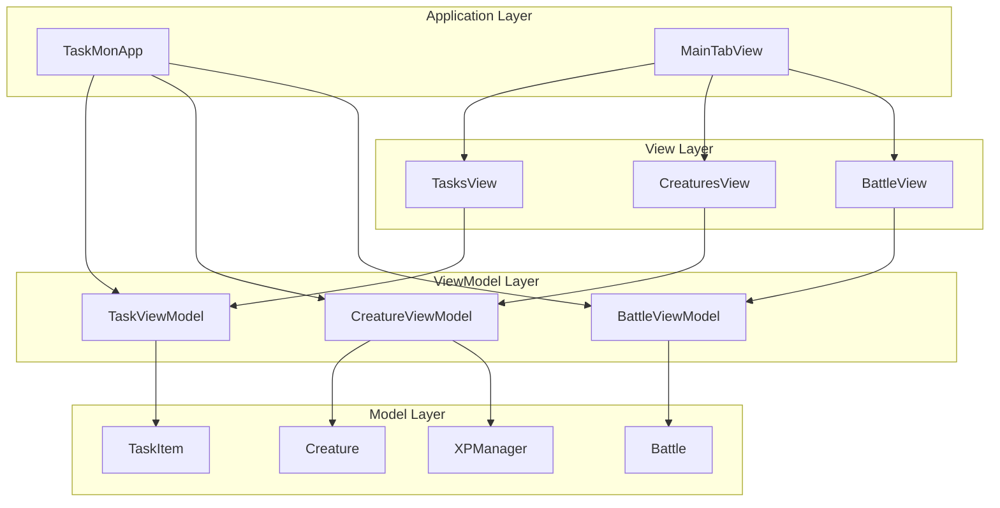
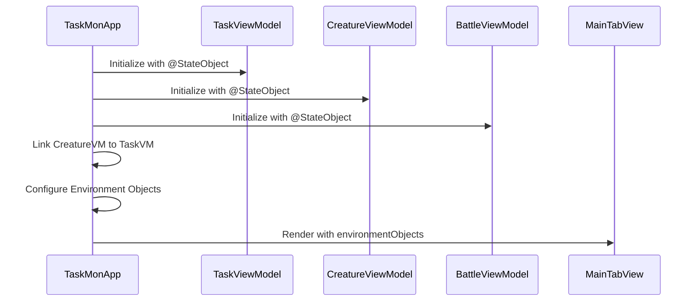
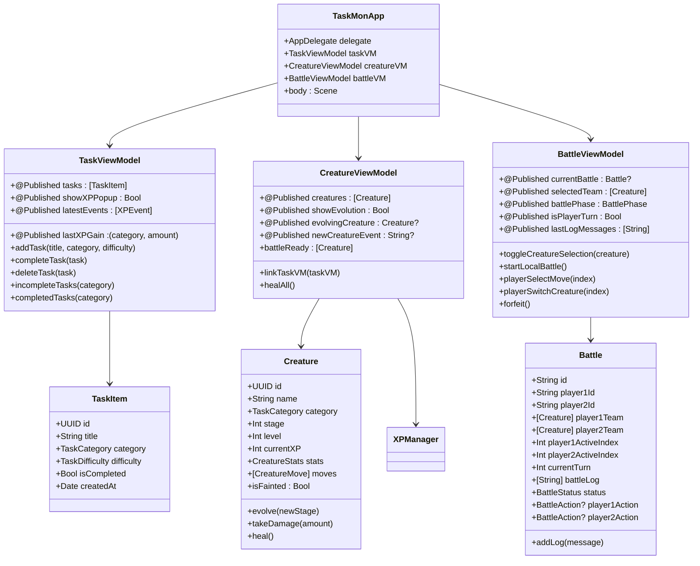
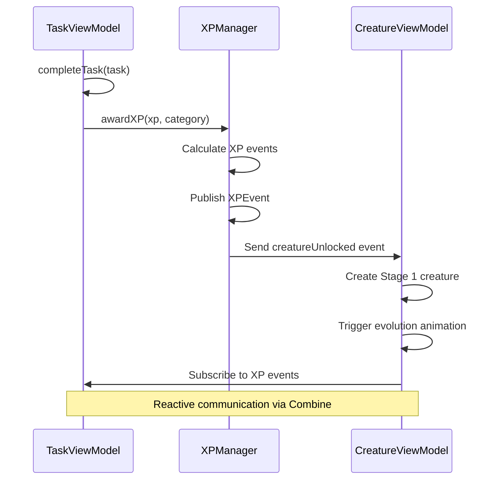
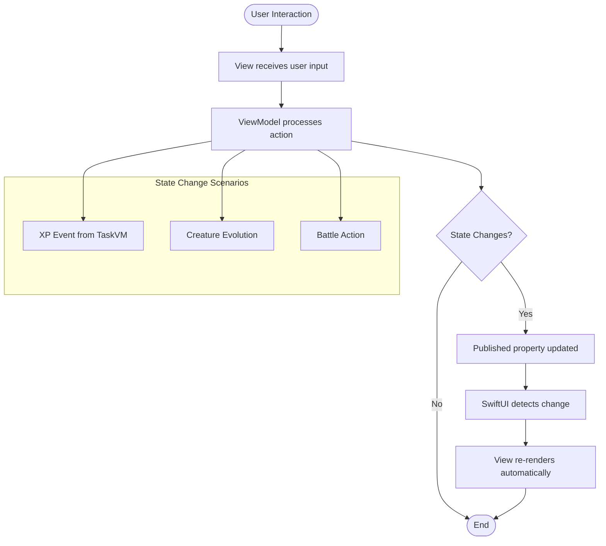
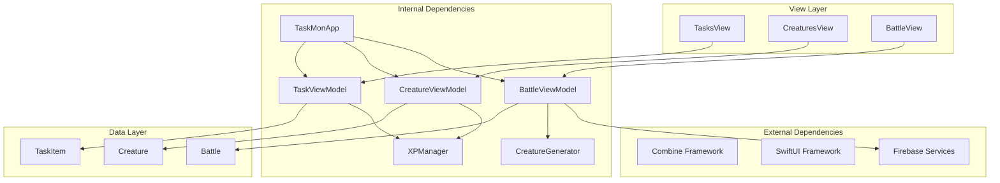

# MVVM Pattern Implementation

<cite>
**Referenced Files in This Document**
- [TaskMonApp.swift](file://TaskMon/TaskMon/TaskMonApp.swift)
- [TaskViewModel.swift](file://TaskMon/TaskMon/ViewModels/TaskViewModel.swift)
- [CreatureViewModel.swift](file://TaskMon/TaskMon/ViewModels/CreatureViewModel.swift)
- [BattleViewModel.swift](file://TaskMon/TaskMon/ViewModels/BattleViewModel.swift)
- [TaskItem.swift](file://TaskMon/TaskMon/Models/TaskItem.swift)
- [Creature.swift](file://TaskMon/TaskMon/Models/Creature.swift)
- [Battle.swift](file://TaskMon/TaskMon/Models/Battle.swift)
- [TasksView.swift](file://TaskMon/TaskMon/Views/Tasks/TasksView.swift)
- [CreaturesView.swift](file://TaskMon/TaskMon/Views/Creatures/CreaturesView.swift)
- [BattleView.swift](file://TaskMon/TaskMon/Views/Battle/BattleView.swift)
- [MainTabView.swift](file://TaskMon/TaskMon/Views/MainTabView.swift)
- [XPManager.swift](file://TaskMon/TaskMon/Services/XPManager.swift)
- [CreatureGenerator.swift](file://TaskMon/TaskMon/Services/CreatureGenerator.swift)
- [Constants.swift](file://TaskMon/TaskMon/Utils/Constants.swift)
</cite>

## Table of Contents
1. [Introduction](#introduction)
2. [Project Structure](#project-structure)
3. [Core Components](#core-components)
4. [Architecture Overview](#architecture-overview)
5. [Detailed Component Analysis](#detailed-component-analysis)
6. [Dependency Analysis](#dependency-analysis)
7. [Performance Considerations](#performance-considerations)
8. [Troubleshooting Guide](#troubleshooting-guide)
9. [Conclusion](#conclusion)

## Introduction
This document provides comprehensive documentation for TaskMon's MVVM (Model-View-ViewModel) pattern implementation. The application follows a clean separation of concerns where:
- **Models** represent data structures and business entities
- **ViewModels** manage state, business logic, and coordinate between models and views
- **Views** handle UI presentation and user interactions

The implementation demonstrates modern SwiftUI architecture with reactive state management, cross-view communication, and robust separation of concerns.

## Project Structure
TaskMon organizes its codebase using a feature-based structure with clear MVVM boundaries:

**Diagram sources**
- [TaskMonApp.swift](file://TaskMon/TaskMon/TaskMonApp.swift#L16-L29)
- [MainTabView.swift](file://TaskMon/TaskMon/Views/MainTabView.swift#L3-L28)

**Section sources**
- [TaskMonApp.swift](file://TaskMon/TaskMon/TaskMonApp.swift#L1-L33)
- [MainTabView.swift](file://TaskMon/TaskMon/Views/MainTabView.swift#L1-L29)

## Core Components

### Application Entry Point and State Initialization
The application initializes all ViewModels at the app level using `@StateObject` property wrappers, ensuring proper lifecycle management and state persistence.

**Diagram sources**
- [TaskMonApp.swift](file://TaskMon/TaskMon/TaskMonApp.swift#L16-L29)

### TaskViewModel Responsibilities
The TaskViewModel manages task-related state and business logic:

**Key Responsibilities:**
- Task CRUD operations (add, complete, delete)
- XP reward calculation and distribution
- Task filtering and statistics
- Local persistence using UserDefaults
- XP popup state management

**State Properties:**
- `@Published tasks`: Array of TaskItem objects
- `@Published showXPPopup`: Controls XP notification visibility
- `@Published lastXPGain`: Last XP gain information
- `@Published latestEvents`: Recent XP events

**Computed Variables:**
- `pendingTasks`: Filtered list of incomplete tasks
- `completedCount`: Count of completed tasks

**Section sources**
- [TaskViewModel.swift](file://TaskMon/TaskMon/ViewModels/TaskViewModel.swift#L5-L76)

### CreatureViewModel Responsibilities
The CreatureViewModel handles creature management and evolution mechanics:

**Key Responsibilities:**
- Creature lifecycle management (creation, evolution, healing)
- XP event subscription and handling
- Creature filtering and selection
- Evolution animations and notifications
- Local persistence

**State Properties:**
- `@Published creatures`: Array of Creature objects
- `@Published showEvolution`: Controls evolution animation
- `@Published evolvingCreature`: Currently evolving creature
- `@Published newCreatureEvent`: New creature notification text

**Computed Variables:**
- `battleReady`: Filtered list of non-fainted creatures

**Section sources**
- [CreatureViewModel.swift](file://TaskMon/TaskMon/ViewModels/CreatureViewModel.swift#L5-L90)

### BattleViewModel Responsibilities
The BattleViewModel coordinates complex battle mechanics including both local and online battles:

**Key Responsibilities:**
- Battle state management (setup, fighting, finished)
- Team selection and creature switching
- Turn resolution and AI logic
- Online matchmaking and real-time coordination
- Battle animations and visual feedback
- Cross-view communication

**State Properties:**
- `@Published currentBattle`: Active battle instance
- `@Published selectedTeam`: Player's chosen creatures
- `@Published battlePhase`: Current battle phase
- `@Published isPlayerTurn`: Turn ownership flag
- `@Published lastLogMessages`: Battle log entries
- `@Published showBattleResult`: Result screen visibility
- `@Published isMatchmaking`: Matchmaking state
- `@Published shakePlayer1/2`: Animation triggers

**Section sources**
- [BattleViewModel.swift](file://TaskMon/TaskMon/ViewModels/BattleViewModel.swift#L10-L462)

## Architecture Overview

**Diagram sources**
- [TaskMonApp.swift](file://TaskMon/TaskMon/TaskMonApp.swift#L16-L29)
- [TaskViewModel.swift](file://TaskMon/TaskMon/ViewModels/TaskViewModel.swift#L5-L76)
- [CreatureViewModel.swift](file://TaskMon/TaskMon/ViewModels/CreatureViewModel.swift#L5-L90)
- [BattleViewModel.swift](file://TaskMon/TaskMon/ViewModels/BattleViewModel.swift#L10-L462)
- [TaskItem.swift](file://TaskMon/TaskMon/Models/TaskItem.swift#L27-L44)
- [Creature.swift](file://TaskMon/TaskMon/Models/Creature.swift#L33-L98)
- [Battle.swift](file://TaskMon/TaskMon/Models/Battle.swift#L32-L69)

## Detailed Component Analysis

### ViewModel-to-ViewModel Communication

The application implements sophisticated ViewModel-to-ViewModel communication through the XPManager singleton:

**Diagram sources**
- [TaskViewModel.swift](file://TaskMon/TaskMon/ViewModels/TaskViewModel.swift#L26-L44)
- [XPManager.swift](file://TaskMon/TaskMon/Services/XPManager.swift#L22-L50)
- [CreatureViewModel.swift](file://TaskMon/TaskMon/ViewModels/CreatureViewModel.swift#L33-L63)

### State Synchronization Mechanisms

The application employs multiple state synchronization patterns:

1. **Combine Publishers**: Reactive state updates across ViewModels
2. **Environment Objects**: Cross-view communication
3. **Shared Services**: Singleton XPManager for global state
4. **Local Persistence**: UserDefaults for state persistence

**Section sources**
- [TaskMonApp.swift](file://TaskMon/TaskMon/TaskMonApp.swift#L23-L25)
- [XPManager.swift](file://TaskMon/TaskMon/Services/XPManager.swift#L13-L14)

### View-ViewModel Interaction Patterns

Views consume ViewModel state through `@EnvironmentObject` property wrappers and react to state changes automatically:

**Diagram sources**
- [TasksView.swift](file://TaskMon/TaskMon/Views/Tasks/TasksView.swift#L53-L61)
- [CreaturesView.swift](file://TaskMon/TaskMon/Views/Creatures/CreaturesView.swift#L59-L68)
- [BattleView.swift](file://TaskMon/TaskMon/Views/Battle/BattleView.swift#L42-L49)

**Section sources**
- [TasksView.swift](file://TaskMon/TaskMon/Views/Tasks/TasksView.swift#L4-L63)
- [CreaturesView.swift](file://TaskMon/TaskMon/Views/Creatures/CreaturesView.swift#L3-L70)
- [BattleView.swift](file://TaskMon/TaskMon/Views/Battle/BattleView.swift#L3-L52)

### Business Logic Separation

The application demonstrates excellent separation of business logic from UI presentation:

**Task Management Logic:**
- Difficulty-based XP rewards
- Task filtering and categorization
- Local persistence implementation

**Creature Management Logic:**
- Evolution thresholds and progression
- Stat calculations based on stage and level
- Battle readiness determination

**Battle Logic:**
- Turn-based combat mechanics
- AI action selection
- Online real-time coordination
- Animation timing and effects

**Section sources**
- [TaskViewModel.swift](file://TaskMon/TaskMon/ViewModels/TaskViewModel.swift#L18-L52)
- [Creature.swift](file://TaskMon/TaskMon/Models/Creature.swift#L10-L31)
- [BattleViewModel.swift](file://TaskMon/TaskMon/ViewModels/BattleViewModel.swift#L125-L146)

## Dependency Analysis

**Diagram sources**
- [TaskMonApp.swift](file://TaskMon/TaskMon/TaskMonApp.swift#L1-L10)
- [BattleViewModel.swift](file://TaskMon/TaskMon/ViewModels/BattleViewModel.swift#L36-L37)

**Section sources**
- [TaskMonApp.swift](file://TaskMon/TaskMon/TaskMonApp.swift#L1-L33)
- [BattleViewModel.swift](file://TaskMon/TaskMon/ViewModels/BattleViewModel.swift#L1-L462)

## Performance Considerations

### State Management Optimizations
- **Lazy Loading**: Creature and task data loaded only when needed
- **Efficient Filtering**: Computed properties minimize array operations
- **Animation Optimization**: Batched state updates prevent excessive re-renders
- **Memory Management**: Weak references in Combine publishers prevent retain cycles

### Data Persistence Strategy
- **Selective Saving**: Only changed data is persisted to UserDefaults
- **Batch Operations**: Multiple updates combined before persistence
- **Asynchronous Operations**: Heavy operations performed off the main thread

### Real-time Performance
- **Debounced Updates**: Battle log animations processed with controlled timing
- **Efficient State Transitions**: Minimal state changes during complex operations
- **Resource Cleanup**: Proper cancellation of timers and observers

## Troubleshooting Guide

### Common Issues and Solutions

**ViewModel Not Updating Views:**
- Ensure `@Published` properties are used for state changes
- Verify `@EnvironmentObject` injection in parent views
- Check for proper Combine publisher subscriptions

**State Synchronization Problems:**
- Confirm XPManager singleton initialization
- Verify weak self references in closures
- Ensure proper subscription cleanup

**Performance Issues:**
- Review excessive state updates in battle animations
- Check for unnecessary array copies in filtering operations
- Monitor Combine subscription memory usage

**Persistence Failures:**
- Validate JSON encoding/decoding for custom types
- Check UserDefaults quota limits
- Ensure proper error handling for persistence operations

**Section sources**
- [TaskViewModel.swift](file://TaskMon/TaskMon/ViewModels/TaskViewModel.swift#L64-L74)
- [CreatureViewModel.swift](file://TaskMon/TaskMon/ViewModels/CreatureViewModel.swift#L78-L88)
- [BattleViewModel.swift](file://TaskMon/TaskMon/ViewModels/BattleViewModel.swift#L285-L357)

## Conclusion

TaskMon's MVVM implementation demonstrates a mature approach to SwiftUI architecture with clear separation of concerns and robust state management. The application successfully:

- **Separates Business Logic**: All domain-specific logic resides in ViewModels
- **Enables Testability**: Pure data structures and isolated business logic
- **Maintains UI Responsiveness**: Reactive state updates without manual UI refresh
- **Supports Complex Interactions**: Multi-view communication through shared services
- **Provides Scalable Architecture**: Clear patterns for adding new features

The implementation serves as an excellent example of modern SwiftUI development, showcasing best practices for state management, cross-component communication, and maintainable code organization. The use of Combine publishers, environment objects, and shared services creates a cohesive architecture that scales well for future feature additions.