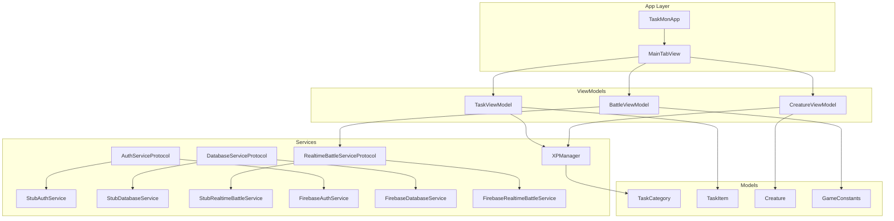
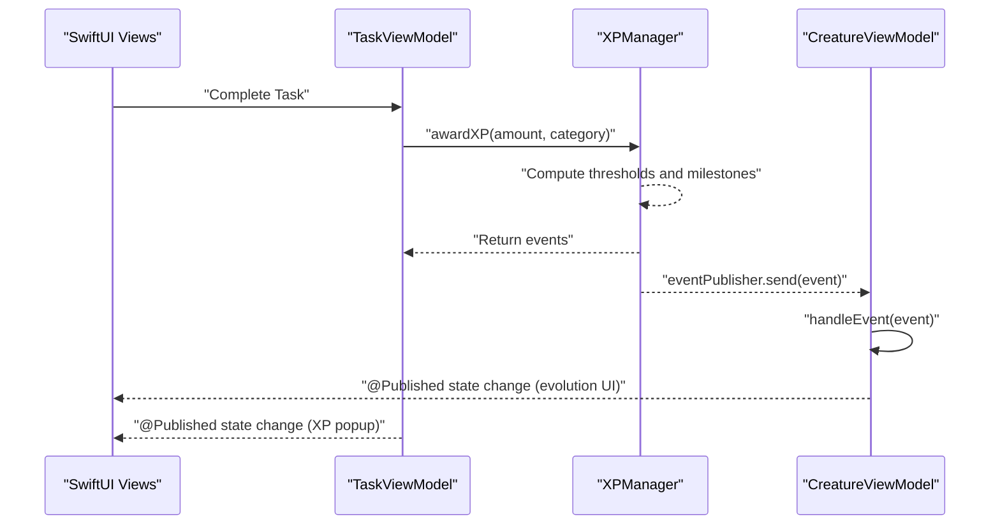
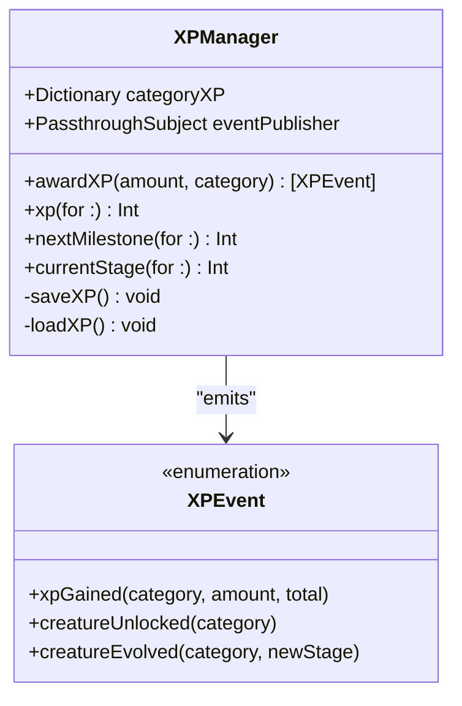
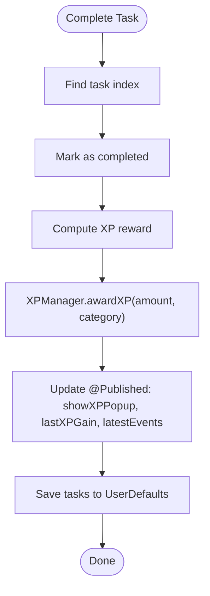
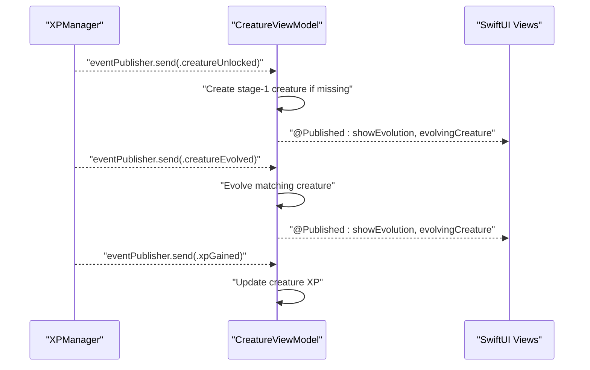
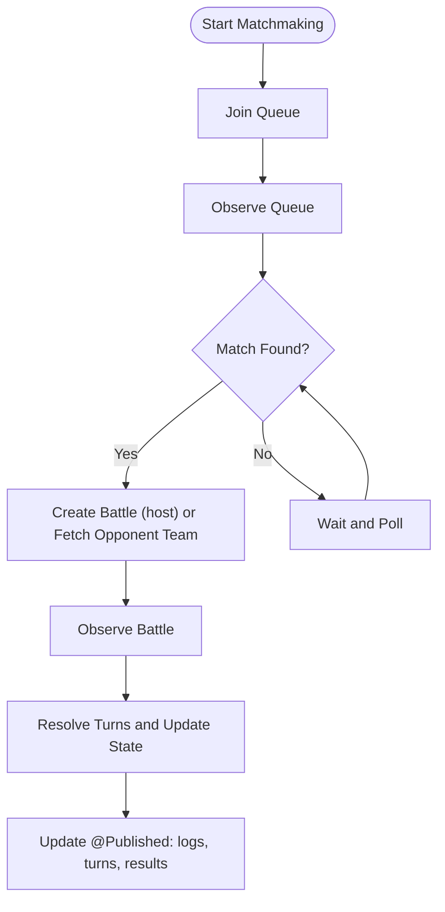
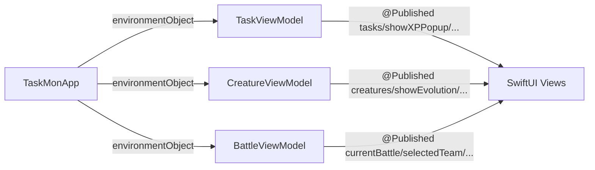
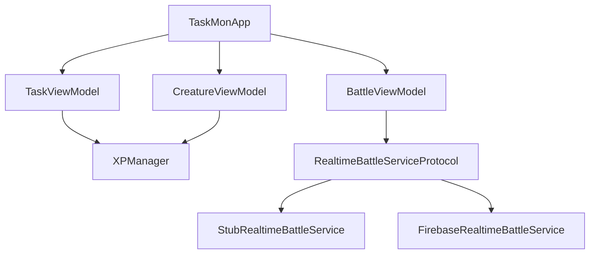

# Reactive Programming with Combine

<cite>
**Referenced Files in This Document**
- [TaskMonApp.swift](file://TaskMon/TaskMon/TaskMonApp.swift)
- [XPManager.swift](file://TaskMon/TaskMon/Services/XPManager.swift)
- [TaskViewModel.swift](file://TaskMon/TaskMon/ViewModels/TaskViewModel.swift)
- [CreatureViewModel.swift](file://TaskMon/TaskMon/ViewModels/CreatureViewModel.swift)
- [BattleViewModel.swift](file://TaskMon/TaskMon/ViewModels/BattleViewModel.swift)
- [FirebaseService.swift](file://TaskMon/TaskMon/Services/FirebaseService.swift)
- [FirebaseImplementation.swift](file://TaskMon/TaskMon/Services/FirebaseImplementation.swift)
- [Constants.swift](file://TaskMon/TaskMon/Utils/Constants.swift)
- [TaskCategory.swift](file://TaskMon/TaskMon/Models/TaskCategory.swift)
- [TaskItem.swift](file://TaskMon/TaskMon/Models/TaskItem.swift)
- [Creature.swift](file://TaskMon/TaskMon/Models/Creature.swift)
- [MainTabView.swift](file://TaskMon/TaskMon/Views/MainTabView.swift)
</cite>

## Table of Contents
1. [Introduction](#introduction)
2. [Project Structure](#project-structure)
3. [Core Components](#core-components)
4. [Architecture Overview](#architecture-overview)
5. [Detailed Component Analysis](#detailed-component-analysis)
6. [Dependency Analysis](#dependency-analysis)
7. [Performance Considerations](#performance-considerations)
8. [Troubleshooting Guide](#troubleshooting-guide)
9. [Conclusion](#conclusion)

## Introduction
This document explains TaskMon’s reactive programming implementation using Apple’s Combine framework. It focuses on how publishers and subscribers enable reactive state management across ViewModels, how XPManager acts as the central event coordinator broadcasting XP events to subscribed components, how @Published properties propagate state changes to SwiftUI views, and how Combine integrates with SwiftUI to keep the UI fresh. It also covers subscription patterns for cross-component communication (for example, task completion triggering creature evolution notifications), practical publisher chains and operators, error handling strategies, cancellation patterns for memory safety, and how to extend the system with custom publishers that integrate into the XP event system.

## Project Structure
TaskMon organizes reactive concerns across three layers:
- Services: Domain coordination and event broadcasting (XPManager), persistence abstractions (FirebaseService), and optional Firebase implementations (FirebaseImplementation).
- ViewModels: State containers with @Published properties and Combine subscriptions (TaskViewModel, CreatureViewModel, BattleViewModel).
- Models and Utilities: Data structures and constants that inform XP thresholds, categories, and game mechanics.

**Diagram sources**
- [TaskMonApp.swift](file://TaskMon/TaskMon/TaskMonApp.swift#L12-L32)
- [MainTabView.swift](file://TaskMon/TaskMon/Views/MainTabView.swift#L1-L28)
- [XPManager.swift](file://TaskMon/TaskMon/Services/XPManager.swift#L10-L20)
- [TaskViewModel.swift](file://TaskMon/TaskMon/ViewModels/TaskViewModel.swift#L5-L16)
- [CreatureViewModel.swift](file://TaskMon/TaskMon/ViewModels/CreatureViewModel.swift#L5-L18)
- [BattleViewModel.swift](file://TaskMon/TaskMon/ViewModels/BattleViewModel.swift#L10-L37)
- [FirebaseService.swift](file://TaskMon/TaskMon/Services/FirebaseService.swift#L8-L41)
- [FirebaseImplementation.swift](file://TaskMon/TaskMon/Services/FirebaseImplementation.swift#L21-L164)
- [TaskCategory.swift](file://TaskMon/TaskMon/Models/TaskCategory.swift#L4-L11)
- [TaskItem.swift](file://TaskMon/TaskMon/Models/TaskItem.swift#L27-L43)
- [Creature.swift](file://TaskMon/TaskMon/Models/Creature.swift#L33-L97)
- [Constants.swift](file://TaskMon/TaskMon/Utils/Constants.swift#L4-L24)

**Section sources**
- [TaskMonApp.swift](file://TaskMon/TaskMon/TaskMonApp.swift#L12-L32)
- [MainTabView.swift](file://TaskMon/TaskMon/Views/MainTabView.swift#L1-L28)
- [FirebaseService.swift](file://TaskMon/TaskMon/Services/FirebaseService.swift#L3-L41)

## Core Components
- XPManager: Central event coordinator broadcasting XP events to subscribers. It exposes a PassthroughSubject for event publishing and @Published categoryXP for reactive state.
- TaskViewModel: Manages tasks and triggers XP awards; updates @Published UI state (showXPPopup, lastXPGain, latestEvents).
- CreatureViewModel: Subscribes to XP events and reacts by evolving creatures or unlocking new ones; manages evolution UI state.
- BattleViewModel: Orchestrates battles with complex asynchronous flows; subscribes to external services and updates @Published state for SwiftUI.
- Service Protocols: Define pluggable persistence and realtime battle services; stub implementations enable local-only operation; Firebase implementations provide production backends.

Key reactive patterns:
- @Published properties in ViewModels automatically notify SwiftUI when state changes.
- Combine subscriptions in ViewModels receive events from XPManager and update state accordingly.
- Publishers chain operators to transform, filter, and coordinate multiple data streams.

**Section sources**
- [XPManager.swift](file://TaskMon/TaskMon/Services/XPManager.swift#L10-L50)
- [TaskViewModel.swift](file://TaskMon/TaskMon/ViewModels/TaskViewModel.swift#L5-L39)
- [CreatureViewModel.swift](file://TaskMon/TaskMon/ViewModels/CreatureViewModel.swift#L5-L63)
- [BattleViewModel.swift](file://TaskMon/TaskMon/ViewModels/BattleViewModel.swift#L10-L37)

## Architecture Overview
The app composes a reactive pipeline:
- Task completion in TaskViewModel triggers XPManager.awardXP, emitting XPEvent instances.
- CreatureViewModel subscribes to XPManager.eventPublisher and evolves creatures or unlocks new ones.
- SwiftUI views bind to @Published properties in ViewModels, updating automatically when state changes.

**Diagram sources**
- [TaskViewModel.swift](file://TaskMon/TaskMon/ViewModels/TaskViewModel.swift#L26-L39)
- [XPManager.swift](file://TaskMon/TaskMon/Services/XPManager.swift#L22-L50)
- [CreatureViewModel.swift](file://TaskMon/TaskMon/ViewModels/CreatureViewModel.swift#L24-L63)

## Detailed Component Analysis

### XPManager: Central Event Coordinator
XPManager encapsulates XP accounting and event broadcasting:
- Maintains @Published categoryXP dictionary for reactive state.
- Exposes eventPublisher (PassthroughSubject) to broadcast XPEvent instances.
- Computes thresholds and milestone crossings; emits appropriate XPEvent variants.

**Diagram sources**
- [XPManager.swift](file://TaskMon/TaskMon/Services/XPManager.swift#L4-L50)

**Section sources**
- [XPManager.swift](file://TaskMon/TaskMon/Services/XPManager.swift#L10-L95)

### TaskViewModel: Task Completion Triggers XP Events
TaskViewModel coordinates task lifecycle and interacts with XPManager:
- Adds tasks, marks them complete, and computes XP rewards from TaskItem difficulty.
- Calls XPManager.awardXP and updates @Published UI state (popup, last gain, recent events).
- Persists tasks to UserDefaults.

**Diagram sources**
- [TaskViewModel.swift](file://TaskMon/TaskMon/ViewModels/TaskViewModel.swift#L26-L39)
- [TaskItem.swift](file://TaskMon/TaskMon/Models/TaskItem.swift#L18-L24)

**Section sources**
- [TaskViewModel.swift](file://TaskMon/TaskMon/ViewModels/TaskViewModel.swift#L20-L39)
- [TaskItem.swift](file://TaskMon/TaskMon/Models/TaskItem.swift#L27-L43)

### CreatureViewModel: Reacting to XP Events
CreatureViewModel subscribes to XPManager.eventPublisher and reacts to XP events:
- On creatureUnlocked: creates a stage-1 creature if none exists for the category.
- On creatureEvolved: evolves an existing creature to the next stage.
- On xpGained: updates creature XP totals.
- Uses receive(on: DispatchQueue.main) and sink with weak self to prevent retain cycles.

**Diagram sources**
- [CreatureViewModel.swift](file://TaskMon/TaskMon/ViewModels/CreatureViewModel.swift#L24-L63)
- [XPManager.swift](file://TaskMon/TaskMon/Services/XPManager.swift#L22-L50)

**Section sources**
- [CreatureViewModel.swift](file://TaskMon/TaskMon/ViewModels/CreatureViewModel.swift#L5-L89)

### BattleViewModel: Complex Asynchronous Streams
BattleViewModel coordinates local and online battles with multiple asynchronous streams:
- Team selection and local battle resolution.
- Online matchmaking via queue observation and battle observation.
- Updates @Published state for UI animations and transitions.
- Uses timers, async/await, and Combine-like callbacks for service observation.

**Diagram sources**
- [BattleViewModel.swift](file://TaskMon/TaskMon/ViewModels/BattleViewModel.swift#L167-L281)
- [FirebaseService.swift](file://TaskMon/TaskMon/Services/FirebaseService.swift#L116-L156)

**Section sources**
- [BattleViewModel.swift](file://TaskMon/TaskMon/ViewModels/BattleViewModel.swift#L10-L462)
- [FirebaseService.swift](file://TaskMon/TaskMon/Services/FirebaseService.swift#L116-L156)

### Integration with SwiftUI: @Published and EnvironmentObjects
TaskMonApp wires ViewModels as @StateObject and injects them into views via environmentObject. SwiftUI binds to @Published properties in ViewModels, ensuring automatic UI updates when state changes.

**Diagram sources**
- [TaskMonApp.swift](file://TaskMon/TaskMon/TaskMonApp.swift#L16-L32)
- [TaskViewModel.swift](file://TaskMon/TaskMon/ViewModels/TaskViewModel.swift#L5-L16)
- [CreatureViewModel.swift](file://TaskMon/TaskMon/ViewModels/CreatureViewModel.swift#L5-L18)
- [BattleViewModel.swift](file://TaskMon/TaskMon/ViewModels/BattleViewModel.swift#L10-L37)

**Section sources**
- [TaskMonApp.swift](file://TaskMon/TaskMon/TaskMonApp.swift#L16-L32)
- [MainTabView.swift](file://TaskMon/TaskMon/Views/MainTabView.swift#L1-L28)

## Dependency Analysis
- XPManager is a singleton dependency used by TaskViewModel and CreatureViewModel.
- CreatureViewModel links to TaskViewModel indirectly via TaskMonApp.onAppear to re-subscribe to XP events after TaskViewModel initialization.
- BattleViewModel depends on ServiceContainer-provided services (AuthServiceProtocol, DatabaseServiceProtocol, RealtimeBattleServiceProtocol), with stub implementations enabling local-only operation and Firebase implementations for production.

**Diagram sources**
- [TaskViewModel.swift](file://TaskMon/TaskMon/ViewModels/TaskViewModel.swift#L11-L16)
- [CreatureViewModel.swift](file://TaskMon/TaskMon/ViewModels/CreatureViewModel.swift#L13-L18)
- [BattleViewModel.swift](file://TaskMon/TaskMon/ViewModels/BattleViewModel.swift#L36-L37)
- [FirebaseService.swift](file://TaskMon/TaskMon/Services/FirebaseService.swift#L30-L41)
- [FirebaseImplementation.swift](file://TaskMon/TaskMon/Services/FirebaseImplementation.swift#L158-L164)
- [TaskMonApp.swift](file://TaskMon/TaskMon/TaskMonApp.swift#L16-L32)

**Section sources**
- [TaskMonApp.swift](file://TaskMon/TaskMon/TaskMonApp.swift#L16-L32)
- [FirebaseService.swift](file://TaskMon/TaskMon/Services/FirebaseService.swift#L30-L41)
- [FirebaseImplementation.swift](file://TaskMon/TaskMon/Services/FirebaseImplementation.swift#L158-L164)

## Performance Considerations
- Use receive(on: DispatchQueue.main) to ensure UI updates occur on the main thread.
- Store subscriptions in a Set<AnyCancellable> to prevent leaks; cancel subscriptions during teardown.
- Minimize heavy work on the main thread; offload decoding/encoding to background queues when appropriate.
- Batch UI updates (e.g., animating log messages) to reduce layout thrash.
- Prefer filtering and transforming publishers early to reduce downstream work.

[No sources needed since this section provides general guidance]

## Troubleshooting Guide
Common issues and strategies:
- Retain cycles: Always capture self weakly in Combine sinks and closures.
- Threading: Ensure UI updates run on the main queue using receive(on: DispatchQueue.main).
- Subscription lifecycle: Store subscriptions in a cancellables set and cancel them when no longer needed.
- Error propagation: Wrap async/await calls in do-catch blocks and log errors for diagnostics.
- Service switching: Verify that stub vs. Firebase implementations are correctly wired in ServiceContainer.

**Section sources**
- [CreatureViewModel.swift](file://TaskMon/TaskMon/ViewModels/CreatureViewModel.swift#L24-L31)
- [BattleViewModel.swift](file://TaskMon/TaskMon/ViewModels/BattleViewModel.swift#L198-L202)

## Conclusion
TaskMon demonstrates a clean reactive architecture built on Combine and SwiftUI:
- XPManager centralizes XP accounting and event emission.
- ViewModels expose @Published state for declarative UI updates.
- Combine subscriptions coordinate cross-component behavior, such as task completion triggering creature evolution.
- Publishers and operators enable flexible pipelines for transforming and combining data streams.
- Proper cancellation and threading practices ensure robust, maintainable code.

[No sources needed since this section summarizes without analyzing specific files]