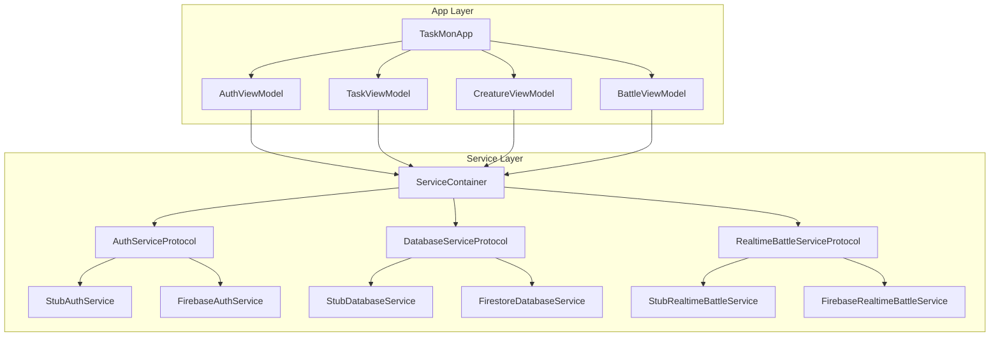
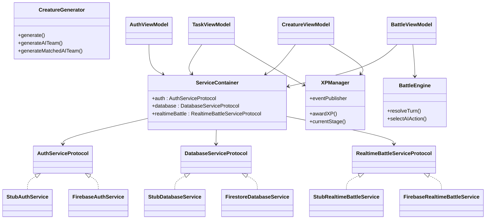
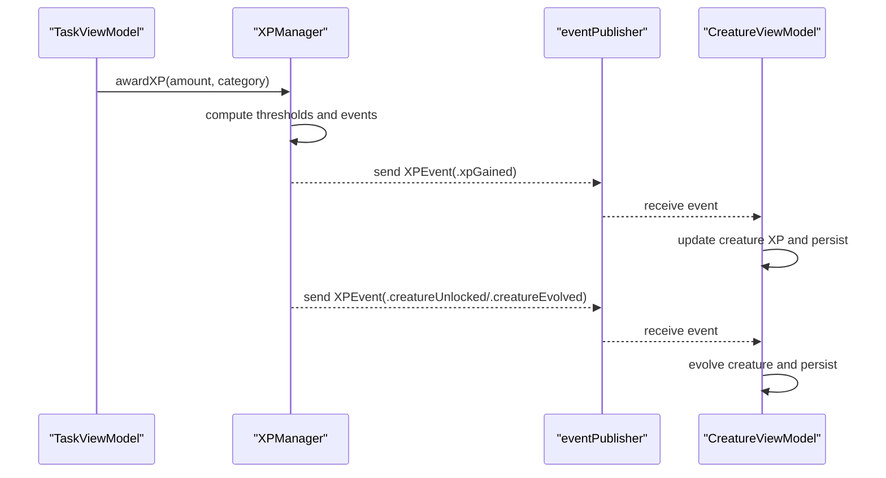
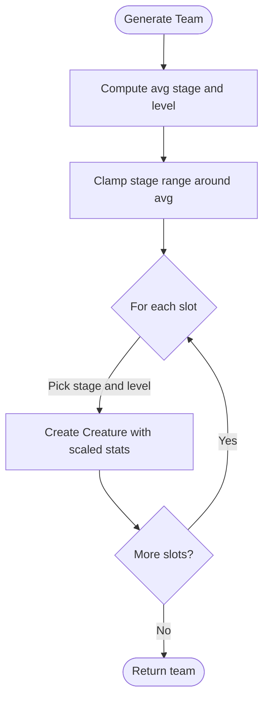
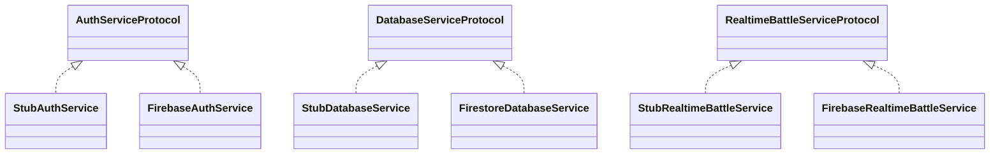
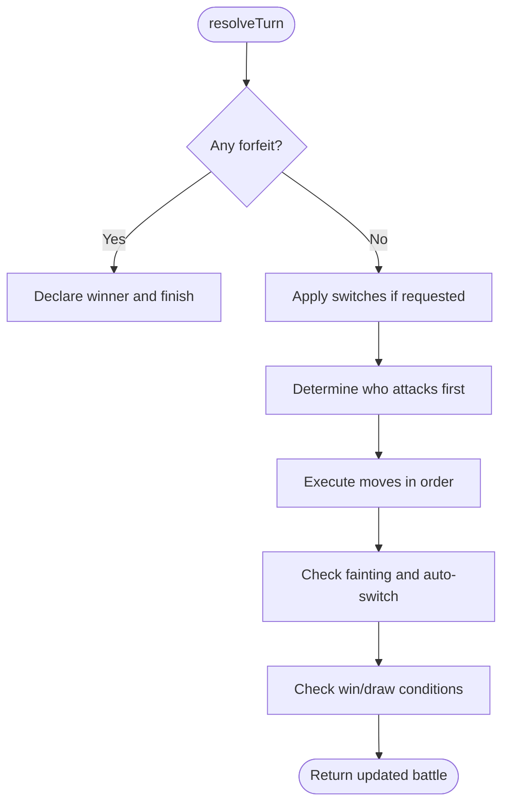
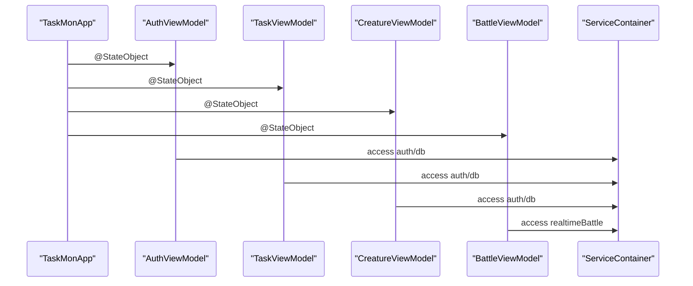
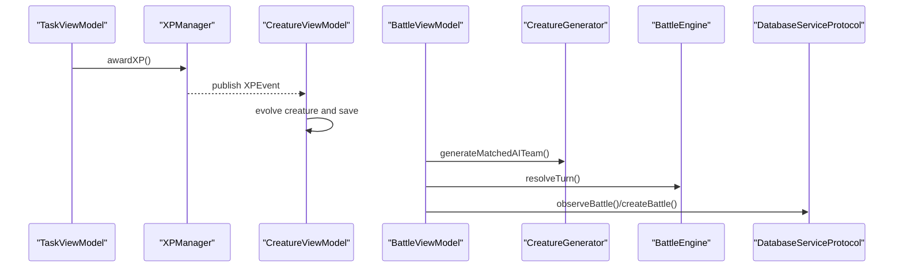
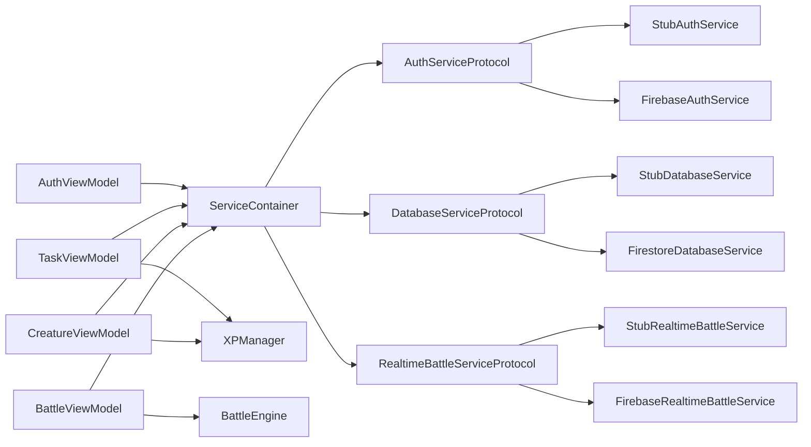
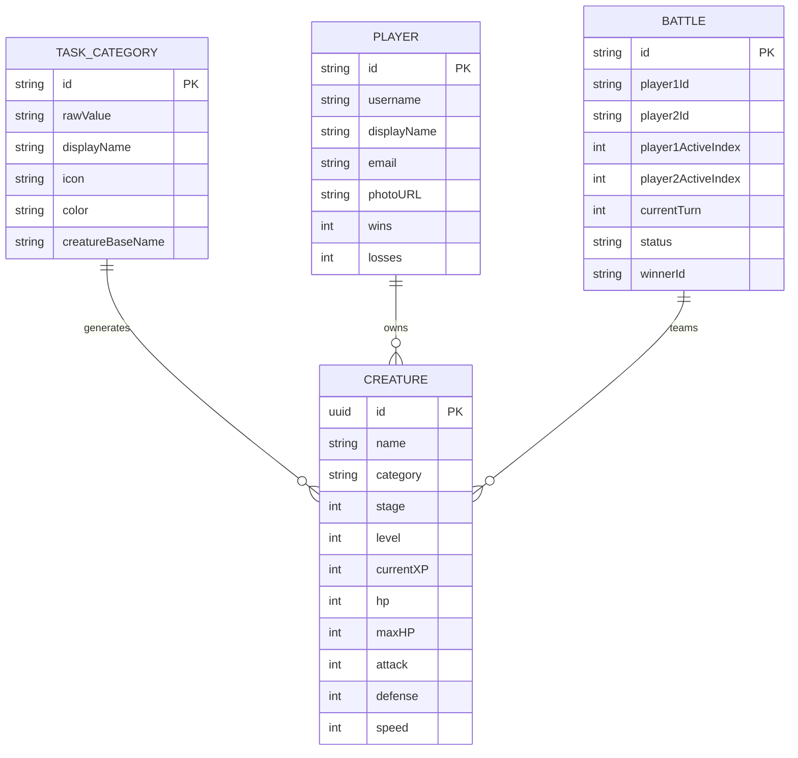

# Service Layer Architecture

<cite>
**Referenced Files in This Document**
- [TaskMonApp.swift](file://TaskMon/TaskMon/TaskMonApp.swift)
- [XPManager.swift](file://TaskMon/TaskMon/Services/XPManager.swift)
- [CreatureGenerator.swift](file://TaskMon/TaskMon/Services/CreatureGenerator.swift)
- [FirebaseService.swift](file://TaskMon/TaskMon/Services/FirebaseService.swift)
- [FirebaseImplementation.swift](file://TaskMon/TaskMon/Services/FirebaseImplementation.swift)
- [BattleEngine.swift](file://TaskMon/TaskMon/Services/BattleEngine.swift)
- [BattleViewModel.swift](file://TaskMon/TaskMon/ViewModels/BattleViewModel.swift)
- [CreatureViewModel.swift](file://TaskMon/TaskMon/ViewModels/CreatureViewModel.swift)
- [TaskViewModel.swift](file://TaskMon/TaskMon/ViewModels/TaskViewModel.swift)
- [AuthViewModel.swift](file://TaskMon/TaskMon/ViewModels/AuthViewModel.swift)
- [Creature.swift](file://TaskMon/TaskMon/Models/Creature.swift)
- [Battle.swift](file://TaskMon/TaskMon/Models/Battle.swift)
- [Player.swift](file://TaskMon/TaskMon/Models/Player.swift)
- [TaskCategory.swift](file://TaskMon/TaskMon/Models/TaskCategory.swift)
- [Constants.swift](file://TaskMon/TaskMon/Utils/Constants.swift)
</cite>

## Table of Contents
1. [Introduction](#introduction)
2. [Project Structure](#project-structure)
3. [Core Components](#core-components)
4. [Architecture Overview](#architecture-overview)
5. [Detailed Component Analysis](#detailed-component-analysis)
6. [Dependency Analysis](#dependency-analysis)
7. [Performance Considerations](#performance-considerations)
8. [Troubleshooting Guide](#troubleshooting-guide)
9. [Conclusion](#conclusion)
10. [Appendices](#appendices)

## Introduction
This document explains TaskMon’s service layer architecture with a focus on protocol-oriented design and dependency injection. It details how services abstract data access and external functionality behind clean interfaces, enabling seamless switching between local and cloud implementations. The XPManager service coordinates XP and evolution events across components. The CreatureGenerator service ensures consistent creature creation with proper stat scaling and evolution mechanics. Firebase service protocols and stub implementations demonstrate optional cloud integration without affecting local-only operation. Examples of dependency injection patterns are shown in TaskMonApp for initializing services and ViewModels. Benefits for testing, maintainability, and extensibility are highlighted, along with lifecycle management, error handling strategies, and coordination between services and ViewModels for persistence and retrieval.

## Project Structure
The service layer is organized around protocols and implementations:
- Protocol contracts define capabilities for authentication, database, and real-time battle services.
- Stub implementations provide local-only functionality.
- Optional Firebase-backed implementations replace stubs when configured.
- ViewModels depend on a shared ServiceContainer to access services via protocol references.

**Diagram sources**
- [TaskMonApp.swift](file://TaskMon/TaskMon/TaskMonApp.swift#L12-L42)
- [AuthViewModel.swift](file://TaskMon/TaskMon/ViewModels/AuthViewModel.swift#L12-L13)
- [TaskViewModel.swift](file://TaskMon/TaskMon/ViewModels/TaskViewModel.swift#L11)
- [CreatureViewModel.swift](file://TaskMon/TaskMon/ViewModels/CreatureViewModel.swift#L13)
- [BattleViewModel.swift](file://TaskMon/TaskMon/ViewModels/BattleViewModel.swift#L36-L37)
- [FirebaseService.swift](file://TaskMon/TaskMon/Services/FirebaseService.swift#L8-L41)
- [FirebaseImplementation.swift](file://TaskMon/TaskMon/Services/FirebaseImplementation.swift#L242-L249)

**Section sources**
- [TaskMonApp.swift](file://TaskMon/TaskMon/TaskMonApp.swift#L12-L42)
- [FirebaseService.swift](file://TaskMon/TaskMon/Services/FirebaseService.swift#L3-L41)
- [FirebaseImplementation.swift](file://TaskMon/TaskMon/Services/FirebaseImplementation.swift#L242-L249)

## Core Components
- XPManager: Central coordinator for XP tracking, milestones, and evolution events. Publishes XPEvent to observers and persists state locally.
- CreatureGenerator: Factory for consistent creature instances with stat scaling and evolution-aware move pools.
- Service protocols and stubs: Define contract boundaries for auth, database, and real-time battle; stubs enable local-only operation.
- Firebase implementations: Optional replacements for stubs when Firebase is configured.
- BattleEngine: Deterministic turn resolution and AI action selection for local battles.
- ViewModels: Consume services via ServiceContainer and coordinate UI state and persistence.

**Section sources**
- [XPManager.swift](file://TaskMon/TaskMon/Services/XPManager.swift#L10-L95)
- [CreatureGenerator.swift](file://TaskMon/TaskMon/Services/CreatureGenerator.swift#L3-L43)
- [FirebaseService.swift](file://TaskMon/TaskMon/Services/FirebaseService.swift#L8-L41)
- [FirebaseImplementation.swift](file://TaskMon/TaskMon/Services/FirebaseImplementation.swift#L21-L237)
- [BattleEngine.swift](file://TaskMon/TaskMon/Services/BattleEngine.swift#L3-L169)
- [TaskViewModel.swift](file://TaskMon/TaskMon/ViewModels/TaskViewModel.swift#L5-L75)
- [CreatureViewModel.swift](file://TaskMon/TaskMon/ViewModels/CreatureViewModel.swift#L5-L89)
- [BattleViewModel.swift](file://TaskMon/TaskMon/ViewModels/BattleViewModel.swift#L10-L461)

## Architecture Overview
The architecture follows a layered approach:
- ViewModels depend on protocol-typed services from ServiceContainer.
- Protocols decouple consumers from concrete implementations.
- Stubs provide local-only behavior; Firebase implementations plug in transparently.
- XPManager broadcasts events to ViewModels for UI updates and persistence.
- CreatureGenerator ensures consistent creature creation across local and online modes.

**Diagram sources**
- [FirebaseService.swift](file://TaskMon/TaskMon/Services/FirebaseService.swift#L8-L41)
- [FirebaseImplementation.swift](file://TaskMon/TaskMon/Services/FirebaseImplementation.swift#L242-L249)
- [XPManager.swift](file://TaskMon/TaskMon/Services/XPManager.swift#L10-L95)
- [CreatureGenerator.swift](file://TaskMon/TaskMon/Services/CreatureGenerator.swift#L3-L43)
- [BattleEngine.swift](file://TaskMon/TaskMon/Services/BattleEngine.swift#L3-L169)
- [AuthViewModel.swift](file://TaskMon/TaskMon/ViewModels/AuthViewModel.swift#L12-L13)
- [TaskViewModel.swift](file://TaskMon/TaskMon/ViewModels/TaskViewModel.swift#L11)
- [CreatureViewModel.swift](file://TaskMon/TaskMon/ViewModels/CreatureViewModel.swift#L13)
- [BattleViewModel.swift](file://TaskMon/TaskMon/ViewModels/BattleViewModel.swift#L36-L37)

## Detailed Component Analysis

### XPManager: Cross-Component Event Coordinator
XPManager encapsulates XP tracking, milestone detection, and event broadcasting. It persists state locally and publishes XPEvent to subscribers (e.g., CreatureViewModel). Its responsibilities include:
- Awarding XP per task completion and computing thresholds for creature unlocks and evolutions.
- Publishing XPEvent for XP gain, creature unlock, and evolution.
- Managing persistence via UserDefaults.

**Diagram sources**
- [TaskViewModel.swift](file://TaskMon/TaskMon/ViewModels/TaskViewModel.swift#L33-L36)
- [XPManager.swift](file://TaskMon/TaskMon/Services/XPManager.swift#L22-L50)
- [CreatureViewModel.swift](file://TaskMon/TaskMon/ViewModels/CreatureViewModel.swift#L24-L63)

**Section sources**
- [XPManager.swift](file://TaskMon/TaskMon/Services/XPManager.swift#L10-L95)
- [TaskViewModel.swift](file://TaskMon/TaskMon/ViewModels/TaskViewModel.swift#L26-L39)
- [CreatureViewModel.swift](file://TaskMon/TaskMon/ViewModels/CreatureViewModel.swift#L24-L63)

### CreatureGenerator: Consistent Creature Creation
CreatureGenerator provides deterministic creature creation with:
- Base stats scaled by stage and level.
- Evolution-aware move pools.
- AI team generation with randomized but balanced stats and levels.
- Matched AI teams aligned to player team average stage and level.

**Diagram sources**
- [CreatureGenerator.swift](file://TaskMon/TaskMon/Services/CreatureGenerator.swift#L24-L42)
- [Creature.swift](file://TaskMon/TaskMon/Models/Creature.swift#L10-L31)

**Section sources**
- [CreatureGenerator.swift](file://TaskMon/TaskMon/Services/CreatureGenerator.swift#L3-L43)
- [Creature.swift](file://TaskMon/TaskMon/Models/Creature.swift#L33-L97)

### Firebase Service Protocols and Stub Implementations
Protocols define the service contracts:
- AuthServiceProtocol: user identity and auth operations.
- DatabaseServiceProtocol: player, tasks, creatures, and leaderboard persistence.
- RealtimeBattleServiceProtocol: online battle orchestration and queueing.

Stub implementations provide local-only behavior:
- StubAuthService: anonymous sign-in with local user ID persistence.
- StubDatabaseService: local persistence via UserDefaults.
- StubRealtimeBattleService: no-op operations suitable for local simulation.

Optional Firebase-backed implementations:
- FirebaseAuthService: Firebase Auth integration.
- FirestoreDatabaseService: Firestore-backed persistence.
- FirebaseRealtimeBattleService: Firebase Realtime Database for live battles and matchmaking.

**Diagram sources**
- [FirebaseService.swift](file://TaskMon/TaskMon/Services/FirebaseService.swift#L8-L41)
- [FirebaseImplementation.swift](file://TaskMon/TaskMon/Services/FirebaseImplementation.swift#L21-L237)

**Section sources**
- [FirebaseService.swift](file://TaskMon/TaskMon/Services/FirebaseService.swift#L3-L157)
- [FirebaseImplementation.swift](file://TaskMon/TaskMon/Services/FirebaseImplementation.swift#L11-L250)

### BattleEngine: Deterministic Turn Resolution
BattleEngine resolves turns deterministically:
- Handles forfeits, switches, and move execution with speed tie-breaking.
- Applies type effectiveness and variance to damage calculation.
- Detects fainting and win conditions.
- Provides simple AI move selection based on type effectiveness.

**Diagram sources**
- [BattleEngine.swift](file://TaskMon/TaskMon/Services/BattleEngine.swift#L5-L143)
- [Battle.swift](file://TaskMon/TaskMon/Models/Battle.swift#L32-L68)

**Section sources**
- [BattleEngine.swift](file://TaskMon/TaskMon/Services/BattleEngine.swift#L3-L169)
- [Battle.swift](file://TaskMon/TaskMon/Models/Battle.swift#L9-L68)

### Dependency Injection Patterns in TaskMonApp
TaskMonApp initializes ViewModels and exposes them via environment objects. While the app-level initialization does not directly construct services, ViewModels rely on ServiceContainer.shared to access protocol-typed services. This pattern:
- Centralizes service instantiation and swapping.
- Enables stub vs. Firebase implementations without changing ViewModels.
- Supports testing by allowing test doubles to be injected into ServiceContainer.

**Diagram sources**
- [TaskMonApp.swift](file://TaskMon/TaskMon/TaskMonApp.swift#L16-L39)
- [AuthViewModel.swift](file://TaskMon/TaskMon/ViewModels/AuthViewModel.swift#L12-L13)
- [TaskViewModel.swift](file://TaskMon/TaskMon/ViewModels/TaskViewModel.swift#L11)
- [CreatureViewModel.swift](file://TaskMon/TaskMon/ViewModels/CreatureViewModel.swift#L13)
- [BattleViewModel.swift](file://TaskMon/TaskMon/ViewModels/BattleViewModel.swift#L36-L37)
- [FirebaseImplementation.swift](file://TaskMon/TaskMon/Services/FirebaseImplementation.swift#L242-L249)

**Section sources**
- [TaskMonApp.swift](file://TaskMon/TaskMon/TaskMonApp.swift#L12-L42)
- [AuthViewModel.swift](file://TaskMon/TaskMon/ViewModels/AuthViewModel.swift#L12-L13)
- [TaskViewModel.swift](file://TaskMon/TaskMon/ViewModels/TaskViewModel.swift#L11)
- [CreatureViewModel.swift](file://TaskMon/TaskMon/ViewModels/CreatureViewModel.swift#L13)
- [BattleViewModel.swift](file://TaskMon/TaskMon/ViewModels/BattleViewModel.swift#L36-L37)
- [FirebaseImplementation.swift](file://TaskMon/TaskMon/Services/FirebaseImplementation.swift#L242-L249)

### Service Lifecycle Management and Error Handling
- ServiceContainer holds singleton instances of services. Swap implementations at container construction to switch between stubs and Firebase.
- ViewModels manage lifecycle of observers and timers for matchmaking and battle observation. They remove observers and cancel timers on reset.
- Error handling:
  - AuthViewModel surfaces errors from sign-in/sign-out and player load/save.
  - BattleViewModel wraps matchmaking and queue operations with do-catch and cancels matchmaking on failure.
  - CreatureViewModel and TaskViewModel persist state locally and recover gracefully if decoding fails.

**Section sources**
- [FirebaseImplementation.swift](file://TaskMon/TaskMon/Services/FirebaseImplementation.swift#L242-L249)
- [BattleViewModel.swift](file://TaskMon/TaskMon/ViewModels/BattleViewModel.swift#L167-L221)
- [AuthViewModel.swift](file://TaskMon/TaskMon/ViewModels/AuthViewModel.swift#L23-L53)
- [CreatureViewModel.swift](file://TaskMon/TaskMon/ViewModels/CreatureViewModel.swift#L76-L88)
- [TaskViewModel.swift](file://TaskMon/TaskMon/ViewModels/TaskViewModel.swift#L64-L75)

### Coordination Between Services and ViewModels
- TaskViewModel triggers XP awards and updates UI with XP events.
- CreatureViewModel subscribes to XPManager events to unlock and evolve creatures, persisting state.
- BattleViewModel coordinates local and online battles, using CreatureGenerator for AI teams and BattleEngine for turn resolution.
- AuthViewModel loads or creates Player profiles via database service and updates leaderboard entries.

**Diagram sources**
- [TaskViewModel.swift](file://TaskMon/TaskMon/ViewModels/TaskViewModel.swift#L33-L36)
- [XPManager.swift](file://TaskMon/TaskMon/Services/XPManager.swift#L45-L50)
- [CreatureViewModel.swift](file://TaskMon/TaskMon/ViewModels/CreatureViewModel.swift#L33-L63)
- [BattleViewModel.swift](file://TaskMon/TaskMon/ViewModels/BattleViewModel.swift#L72-L146)
- [CreatureGenerator.swift](file://TaskMon/TaskMon/Services/CreatureGenerator.swift#L25-L42)
- [BattleEngine.swift](file://TaskMon/TaskMon/Services/BattleEngine.swift#L5-L143)
- [FirebaseService.swift](file://TaskMon/TaskMon/Services/FirebaseService.swift#L19-L41)

**Section sources**
- [TaskViewModel.swift](file://TaskMon/TaskMon/ViewModels/TaskViewModel.swift#L26-L39)
- [CreatureViewModel.swift](file://TaskMon/TaskMon/ViewModels/CreatureViewModel.swift#L24-L63)
- [BattleViewModel.swift](file://TaskMon/TaskMon/ViewModels/BattleViewModel.swift#L66-L146)
- [CreatureGenerator.swift](file://TaskMon/TaskMon/Services/CreatureGenerator.swift#L25-L42)
- [BattleEngine.swift](file://TaskMon/TaskMon/Services/BattleEngine.swift#L5-L143)
- [FirebaseService.swift](file://TaskMon/TaskMon/Services/FirebaseService.swift#L19-L41)

## Dependency Analysis
The following diagram highlights dependencies among services and ViewModels:

**Diagram sources**
- [AuthViewModel.swift](file://TaskMon/TaskMon/ViewModels/AuthViewModel.swift#L12-L13)
- [TaskViewModel.swift](file://TaskMon/TaskMon/ViewModels/TaskViewModel.swift#L11)
- [CreatureViewModel.swift](file://TaskMon/TaskMon/ViewModels/CreatureViewModel.swift#L13)
- [BattleViewModel.swift](file://TaskMon/TaskMon/ViewModels/BattleViewModel.swift#L36-L37)
- [FirebaseService.swift](file://TaskMon/TaskMon/Services/FirebaseService.swift#L8-L41)
- [FirebaseImplementation.swift](file://TaskMon/TaskMon/Services/FirebaseImplementation.swift#L242-L249)
- [XPManager.swift](file://TaskMon/TaskMon/Services/XPManager.swift#L10-L95)
- [BattleEngine.swift](file://TaskMon/TaskMon/Services/BattleEngine.swift#L3-L169)

**Section sources**
- [AuthViewModel.swift](file://TaskMon/TaskMon/ViewModels/AuthViewModel.swift#L12-L13)
- [TaskViewModel.swift](file://TaskMon/TaskMon/ViewModels/TaskViewModel.swift#L11)
- [CreatureViewModel.swift](file://TaskMon/TaskMon/ViewModels/CreatureViewModel.swift#L13)
- [BattleViewModel.swift](file://TaskMon/TaskMon/ViewModels/BattleViewModel.swift#L36-L37)
- [FirebaseService.swift](file://TaskMon/TaskMon/Services/FirebaseService.swift#L8-L41)
- [FirebaseImplementation.swift](file://TaskMon/TaskMon/Services/FirebaseImplementation.swift#L242-L249)
- [XPManager.swift](file://TaskMon/TaskMon/Services/XPManager.swift#L10-L95)
- [BattleEngine.swift](file://TaskMon/TaskMon/Services/BattleEngine.swift#L3-L169)

## Performance Considerations
- Protocol-based design minimizes coupling and allows lightweight stubs for local development, reducing overhead.
- Batch writes in FirestoreDatabaseService reduce network calls during bulk saves.
- Local persistence via UserDefaults avoids network latency for frequent reads/writes.
- BattleEngine computations are deterministic and lightweight; consider caching type effectiveness lookups if needed.
- ViewModels cancel timers and remove observers promptly to prevent leaks and unnecessary work.

[No sources needed since this section provides general guidance]

## Troubleshooting Guide
Common issues and resolutions:
- Firebase not configured:
  - Ensure GoogleService-Info.plist is present and Firebase SDKs are linked.
  - Switch ServiceContainer implementations from stubs to Firebase implementations.
- Authentication failures:
  - Verify Google Sign-In configuration and client ID.
  - Handle missing tokens and invalid configurations gracefully in AuthViewModel.
- Matchmaking and online battles:
  - Cancel matchmaking on error and remove queue observers.
  - Ensure queue cleanup and battle deletion on reset.
- Data persistence:
  - Validate JSON encoding/decoding and handle missing keys gracefully in local storage.

**Section sources**
- [FirebaseImplementation.swift](file://TaskMon/TaskMon/Services/FirebaseImplementation.swift#L44-L70)
- [AuthViewModel.swift](file://TaskMon/TaskMon/ViewModels/AuthViewModel.swift#L23-L53)
- [BattleViewModel.swift](file://TaskMon/TaskMon/ViewModels/BattleViewModel.swift#L167-L221)
- [FirebaseService.swift](file://TaskMon/TaskMon/Services/FirebaseService.swift#L76-L112)

## Conclusion
TaskMon’s service layer leverages protocol-oriented programming and dependency injection to cleanly abstract data access and external integrations. The XPManager centralizes XP and evolution coordination, while CreatureGenerator ensures consistent creature creation. Firebase protocols and stub implementations enable optional cloud integration without affecting local-only operation. ViewModels consume services through ServiceContainer, simplifying initialization and testing. This design improves modularity, testability, and extensibility, while maintaining robust lifecycle and error handling strategies.

[No sources needed since this section summarizes without analyzing specific files]

## Appendices

### Data Models Overview

**Diagram sources**
- [TaskCategory.swift](file://TaskMon/TaskMon/Models/TaskCategory.swift#L4-L84)
- [Creature.swift](file://TaskMon/TaskMon/Models/Creature.swift#L33-L97)
- [Player.swift](file://TaskMon/TaskMon/Models/Player.swift#L3-L50)
- [Battle.swift](file://TaskMon/TaskMon/Models/Battle.swift#L32-L68)

**Section sources**
- [TaskCategory.swift](file://TaskMon/TaskMon/Models/TaskCategory.swift#L4-L84)
- [Creature.swift](file://TaskMon/TaskMon/Models/Creature.swift#L33-L97)
- [Player.swift](file://TaskMon/TaskMon/Models/Player.swift#L3-L50)
- [Battle.swift](file://TaskMon/TaskMon/Models/Battle.swift#L32-L68)