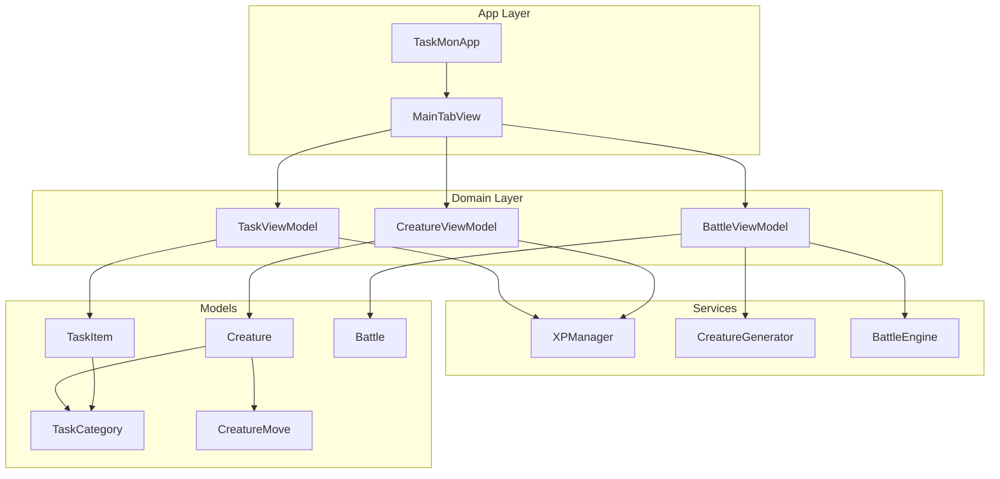
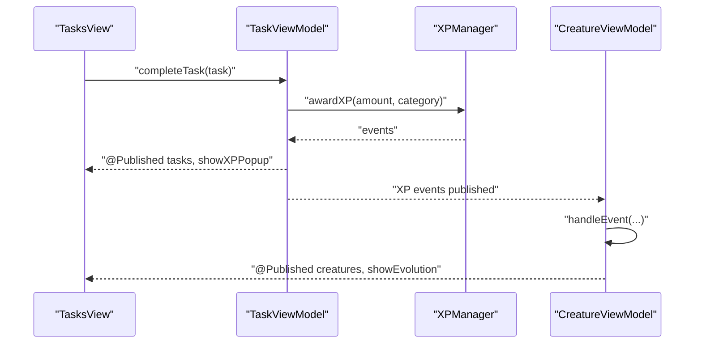
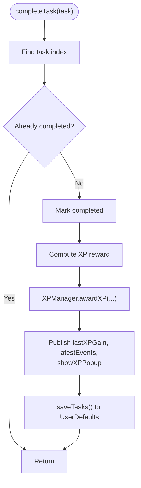
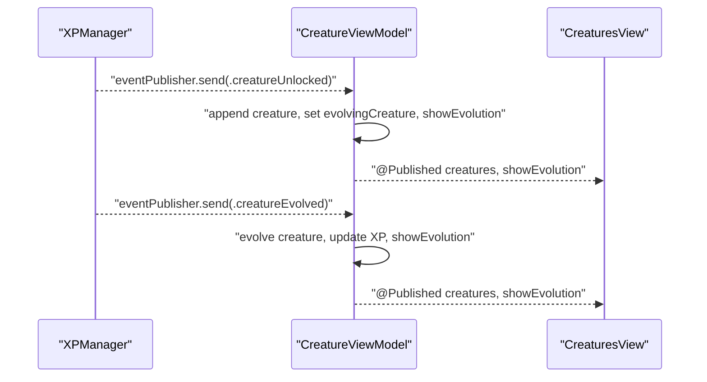
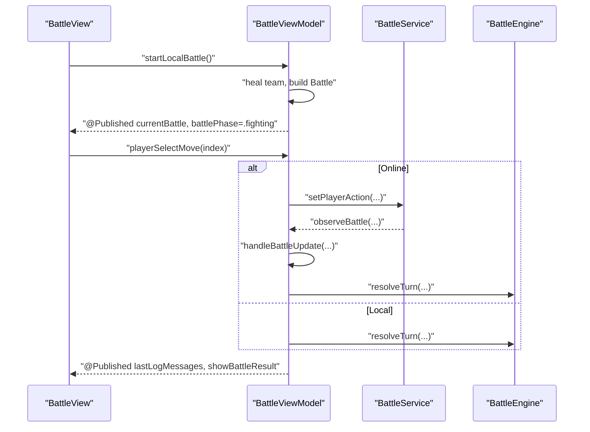
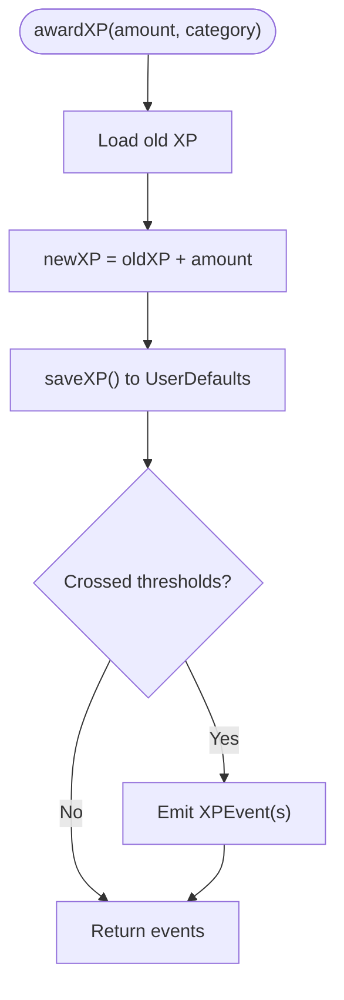
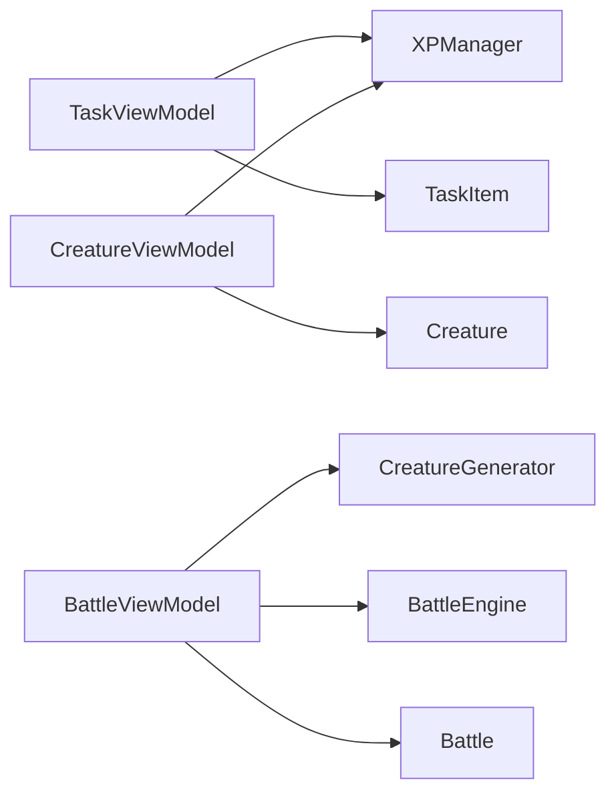

# State Management Patterns

<cite>
**Referenced Files in This Document**
- [TaskMonApp.swift](file://TaskMon/TaskMon/TaskMonApp.swift)
- [MainTabView.swift](file://TaskMon/TaskMon/Views/MainTabView.swift)
- [TasksView.swift](file://TaskMon/TaskMon/Views/Tasks/TasksView.swift)
- [CreaturesView.swift](file://TaskMon/TaskMon/Views/Creatures/CreaturesView.swift)
- [BattleView.swift](file://TaskMon/TaskMon/Views/Battle/BattleView.swift)
- [TaskViewModel.swift](file://TaskMon/TaskMon/ViewModels/TaskViewModel.swift)
- [CreatureViewModel.swift](file://TaskMon/TaskMon/ViewModels/CreatureViewModel.swift)
- [BattleViewModel.swift](file://TaskMon/TaskMon/ViewModels/BattleViewModel.swift)
- [XPManager.swift](file://TaskMon/TaskMon/Services/XPManager.swift)
- [Creature.swift](file://TaskMon/TaskMon/Models/Creature.swift)
- [TaskItem.swift](file://TaskMon/TaskMon/Models/TaskItem.swift)
- [Battle.swift](file://TaskMon/TaskMon/Models/Battle.swift)
- [TaskCategory.swift](file://TaskMon/TaskMon/Models/TaskCategory.swift)
- [CreatureMove.swift](file://TaskMon/TaskMon/Models/CreatureMove.swift)
- [CreatureGenerator.swift](file://TaskMon/TaskMon/Services/CreatureGenerator.swift)
- [BattleEngine.swift](file://TaskMon/TaskMon/Services/BattleEngine.swift)
- [Constants.swift](file://TaskMon/TaskMon/Utils/Constants.swift)
</cite>

## Table of Contents
1. [Introduction](#introduction)
2. [Project Structure](#project-structure)
3. [Core Components](#core-components)
4. [Architecture Overview](#architecture-overview)
5. [Detailed Component Analysis](#detailed-component-analysis)
6. [Dependency Analysis](#dependency-analysis)
7. [Performance Considerations](#performance-considerations)
8. [Troubleshooting Guide](#troubleshooting-guide)
9. [Conclusion](#conclusion)

## Introduction
This document explains TaskMon’s layered state management architecture. State originates from immutable Models (data-only structures), flows through ViewModels (reactive, observable state), and is presented in Views (SwiftUI UI). The hierarchy centers around three primary ViewModels:
- TaskViewModel: Manages task lists, XP awards, and persistence.
- CreatureViewModel: Manages creature collections, evolution triggers, and XP-driven updates.
- BattleViewModel: Coordinates battle lifecycle, turns, animations, and online matchmaking.

We detail how @Published properties drive reactive updates, how XP-driven events synchronize state across ViewModels, and how UserDefaults persists state across app sessions. We also cover consistency patterns, race-condition prevention, and complex state transitions such as evolution sequences.

## Project Structure
TaskMon follows a clean separation of concerns:
- Models: Immutable data structures and enums (TaskItem, Creature, Battle, TaskCategory, CreatureMove).
- Services: Cross-cutting concerns (XPManager, CreatureGenerator, BattleEngine).
- ViewModels: Observable state containers for each domain (TaskViewModel, CreatureViewModel, BattleViewModel).
- Views: SwiftUI UI that reads from ViewModels and triggers ViewModel actions.

**Diagram sources**
- [TaskMonApp.swift](file://TaskMon/TaskMon/TaskMonApp.swift#L12-L42)
- [MainTabView.swift](file://TaskMon/TaskMon/Views/MainTabView.swift#L3-L40)
- [TaskViewModel.swift](file://TaskMon/TaskMon/ViewModels/TaskViewModel.swift#L5-L75)
- [CreatureViewModel.swift](file://TaskMon/TaskMon/ViewModels/CreatureViewModel.swift#L5-L89)
- [BattleViewModel.swift](file://TaskMon/TaskMon/ViewModels/BattleViewModel.swift#L10-L461)
- [XPManager.swift](file://TaskMon/TaskMon/Services/XPManager.swift#L10-L95)
- [CreatureGenerator.swift](file://TaskMon/TaskMon/Services/CreatureGenerator.swift#L3-L43)
- [BattleEngine.swift](file://TaskMon/TaskMon/Services/BattleEngine.swift#L3-L169)
- [TaskItem.swift](file://TaskMon/TaskMon/Models/TaskItem.swift#L27-L43)
- [Creature.swift](file://TaskMon/TaskMon/Models/Creature.swift#L33-L97)
- [Battle.swift](file://TaskMon/TaskMon/Models/Battle.swift#L32-L68)
- [TaskCategory.swift](file://TaskMon/TaskMon/Models/TaskCategory.swift#L4-L84)
- [CreatureMove.swift](file://TaskMon/TaskMon/Models/CreatureMove.swift#L3-L67)

**Section sources**
- [TaskMonApp.swift](file://TaskMon/TaskMon/TaskMonApp.swift#L12-L42)
- [MainTabView.swift](file://TaskMon/TaskMon/Views/MainTabView.swift#L3-L40)

## Core Components
- Models encapsulate immutable data and derived computations:
  - TaskItem: Task metadata and completion state.
  - Creature: Stats, evolution, moves, and fainted state.
  - Battle: Teams, actions, logs, and status.
  - TaskCategory and CreatureMove: Type metadata and move pools.
- Services orchestrate domain logic:
  - XPManager: Centralized XP tracking and event emission.
  - CreatureGenerator: AI team generation and matching.
  - BattleEngine: Turn resolution and win condition checks.
- ViewModels manage observable state and persistence:
  - TaskViewModel: Tasks, XP popup, and UserDefaults persistence.
  - CreatureViewModel: Creatures, evolution UI flags, and XP event subscriptions.
  - BattleViewModel: Battle lifecycle, matchmaking, animations, and online sync.

**Section sources**
- [TaskItem.swift](file://TaskMon/TaskMon/Models/TaskItem.swift#L27-L43)
- [Creature.swift](file://TaskMon/TaskMon/Models/Creature.swift#L33-L97)
- [Battle.swift](file://TaskMon/TaskMon/Models/Battle.swift#L32-L68)
- [TaskCategory.swift](file://TaskMon/TaskMon/Models/TaskCategory.swift#L4-L84)
- [CreatureMove.swift](file://TaskMon/TaskMon/Models/CreatureMove.swift#L3-L67)
- [XPManager.swift](file://TaskMon/TaskMon/Services/XPManager.swift#L10-L95)
- [CreatureGenerator.swift](file://TaskMon/TaskMon/Services/CreatureGenerator.swift#L3-L43)
- [BattleEngine.swift](file://TaskMon/TaskMon/Services/BattleEngine.swift#L3-L169)
- [TaskViewModel.swift](file://TaskMon/TaskMon/ViewModels/TaskViewModel.swift#L5-L75)
- [CreatureViewModel.swift](file://TaskMon/TaskMon/ViewModels/CreatureViewModel.swift#L5-L89)
- [BattleViewModel.swift](file://TaskMon/TaskMon/ViewModels/BattleViewModel.swift#L10-L461)

## Architecture Overview
The state lifecycle:
1. Models define immutable data and computed properties.
2. ViewModels expose @Published properties and react to external events via Combine publishers.
3. Views observe @Published properties and render automatically.
4. Persistence stores and restores state using UserDefaults.

**Diagram sources**
- [TasksView.swift](file://TaskMon/TaskMon/Views/Tasks/TasksView.swift#L106-L108)
- [TaskViewModel.swift](file://TaskMon/TaskMon/ViewModels/TaskViewModel.swift#L26-L39)
- [XPManager.swift](file://TaskMon/TaskMon/Services/XPManager.swift#L22-L50)
- [CreatureViewModel.swift](file://TaskMon/TaskMon/ViewModels/CreatureViewModel.swift#L33-L63)

## Detailed Component Analysis

### TaskViewModel: Task List and XP Flow
Responsibilities:
- Manage a list of TaskItem entries.
- Award XP via XPManager and emit XP events.
- Drive UI feedback with @Published flags for XP popups.
- Persist tasks to UserDefaults.

Key behaviors:
- Completing a task updates its completion flag, computes XP reward, and invokes XPManager to award XP and produce events.
- The ViewModel publishes lastXPGain and latestEvents to TasksView for rendering.
- Persistence is handled via JSON encoding to UserDefaults under a dedicated key.

**Diagram sources**
- [TaskViewModel.swift](file://TaskMon/TaskMon/ViewModels/TaskViewModel.swift#L26-L39)
- [TaskItem.swift](file://TaskMon/TaskMon/Models/TaskItem.swift#L18-L24)
- [XPManager.swift](file://TaskMon/TaskMon/Services/XPManager.swift#L22-L50)

**Section sources**
- [TaskViewModel.swift](file://TaskMon/TaskMon/ViewModels/TaskViewModel.swift#L5-L75)
- [TaskItem.swift](file://TaskMon/TaskMon/Models/TaskItem.swift#L27-L43)

### CreatureViewModel: Creature Collections and Evolution
Responsibilities:
- Maintain a collection of Creature instances.
- Subscribe to XPManager events to unlock, evolve, and update XP per category.
- Trigger evolution UI animations and persist creatures to UserDefaults.

State synchronization:
- linkTaskVM(_:): Placeholder to re-subscribe to XP events after TaskMonApp initializes environment objects.
- subscribeToXPEvents(): Subscribes to XPManager.eventPublisher and routes events to handleEvent(_).
- handleEvent(_:): Processes XP gained, creature unlocked, and creature evolved events; updates creatures and triggers UI flags.

**Diagram sources**
- [CreatureViewModel.swift](file://TaskMon/TaskMon/ViewModels/CreatureViewModel.swift#L24-L63)
- [XPManager.swift](file://TaskMon/TaskMon/Services/XPManager.swift#L14-L47)
- [CreaturesView.swift](file://TaskMon/TaskMon/Views/Creatures/CreaturesView.swift#L59-L67)

**Section sources**
- [CreatureViewModel.swift](file://TaskMon/TaskMon/ViewModels/CreatureViewModel.swift#L5-L89)
- [Creature.swift](file://TaskMon/TaskMon/Models/Creature.swift#L33-L97)

### BattleViewModel: Battle Lifecycle and Online Synchronization
Responsibilities:
- Manage battle phase, turns, logs, and animations.
- Coordinate local and online battles, including matchmaking and real-time updates.
- Maintain team selection and perspective swapping for online battles.

Consistency and race-condition prevention:
- Uses observers and timers to ensure proper sequencing of matchmaking and battle observation.
- Applies incoming updates only when the battle is active, avoiding stale state application.
- Prevents concurrent turn resolution with isResolvingTurn and ensures both actions are ready before resolving.

**Diagram sources**
- [BattleView.swift](file://TaskMon/TaskMon/Views/Battle/BattleView.swift#L12-L32)
- [BattleViewModel.swift](file://TaskMon/TaskMon/ViewModels/BattleViewModel.swift#L66-L146)
- [BattleEngine.swift](file://TaskMon/TaskMon/Services/BattleEngine.swift#L5-L66)

**Section sources**
- [BattleViewModel.swift](file://TaskMon/TaskMon/ViewModels/BattleViewModel.swift#L10-L461)
- [BattleEngine.swift](file://TaskMon/TaskMon/Services/BattleEngine.swift#L3-L169)
- [Battle.swift](file://TaskMon/TaskMon/Models/Battle.swift#L32-L68)

### XPManager: Centralized XP and Events
Responsibilities:
- Track XP per TaskCategory.
- Emit XPEvent via Combine publisher when milestones are reached.
- Persist category XP to UserDefaults.

Patterns:
- awardXP(amount:to:) computes new XP, emits XP gained events, and emits unlock/evolve events when thresholds are crossed.
- Provides helpers to compute next milestone, current stage, and XP totals.

**Diagram sources**
- [XPManager.swift](file://TaskMon/TaskMon/Services/XPManager.swift#L22-L50)
- [Constants.swift](file://TaskMon/TaskMon/Utils/Constants.swift#L10-L13)

**Section sources**
- [XPManager.swift](file://TaskMon/TaskMon/Services/XPManager.swift#L10-L95)
- [Constants.swift](file://TaskMon/TaskMon/Utils/Constants.swift#L4-L24)

### State Synchronization Between ViewModels
Linking TaskViewModel and CreatureViewModel:
- TaskMonApp wires up environment objects and calls linkTaskVM(taskVM) on first appearance.
- CreatureViewModel subscribes to XPManager.shared.eventPublisher to react to XP events.
- This creates a unidirectional synchronization: tasks -> XP -> creatures.

Race condition mitigation:
- CreatureViewModel’s subscription runs on the main queue to ensure UI updates are safe.
- BattleViewModel uses isResolvingTurn to prevent overlapping turn resolutions and waits for both actions in online mode.

**Section sources**
- [TaskMonApp.swift](file://TaskMon/TaskMon/TaskMonApp.swift#L30-L32)
- [CreatureViewModel.swift](file://TaskMon/TaskMon/ViewModels/CreatureViewModel.swift#L24-L31)
- [BattleViewModel.swift](file://TaskMon/TaskMon/ViewModels/BattleViewModel.swift#L312-L336)

### Data Persistence with UserDefaults
- TaskViewModel persists tasks array.
- CreatureViewModel persists creatures array.
- XPManager persists category XP dictionary keyed by category raw string.
- Each ViewModel encodes to JSON and writes to UserDefaults; load functions decode and restore state on initialization.

Best practices:
- Use separate keys per domain to avoid collisions.
- Wrap encode/decode in try-catch to prevent crashes on corrupted data.

**Section sources**
- [TaskViewModel.swift](file://TaskMon/TaskMon/ViewModels/TaskViewModel.swift#L64-L74)
- [CreatureViewModel.swift](file://TaskMon/TaskMon/ViewModels/CreatureViewModel.swift#L78-L88)
- [XPManager.swift](file://TaskMon/TaskMon/Services/XPManager.swift#L79-L94)

### UI Responsiveness During State-Intensive Operations
- Battle animations are scheduled with delays to avoid blocking the main thread; shake effects and log animations are animated incrementally.
- Online battles debounce updates by applying only new log messages and updating state once per batch.
- Local battles resolve turns off the main actor where appropriate and return to main for UI updates.

**Section sources**
- [BattleViewModel.swift](file://TaskMon/TaskMon/ViewModels/BattleViewModel.swift#L418-L450)
- [BattleViewModel.swift](file://TaskMon/TaskMon/ViewModels/BattleViewModel.swift#L296-L357)

## Dependency Analysis
High-level dependencies:
- TaskViewModel depends on XPManager and UserDefaults.
- CreatureViewModel depends on XPManager and UserDefaults; it also depends on TaskViewModel indirectly via XP events.
- BattleViewModel depends on CreatureGenerator and BattleEngine; it observes online state via a service interface.

**Diagram sources**
- [TaskViewModel.swift](file://TaskMon/TaskMon/ViewModels/TaskViewModel.swift#L11-L12)
- [CreatureViewModel.swift](file://TaskMon/TaskMon/ViewModels/CreatureViewModel.swift#L13-L13)
- [BattleViewModel.swift](file://TaskMon/TaskMon/ViewModels/BattleViewModel.swift#L36-L37)
- [CreatureGenerator.swift](file://TaskMon/TaskMon/Services/CreatureGenerator.swift#L3-L43)
- [BattleEngine.swift](file://TaskMon/TaskMon/Services/BattleEngine.swift#L3-L169)
- [TaskItem.swift](file://TaskMon/TaskMon/Models/TaskItem.swift#L27-L43)
- [Creature.swift](file://TaskMon/TaskMon/Models/Creature.swift#L33-L97)
- [Battle.swift](file://TaskMon/TaskMon/Models/Battle.swift#L32-L68)

**Section sources**
- [TaskViewModel.swift](file://TaskMon/TaskMon/ViewModels/TaskViewModel.swift#L11-L12)
- [CreatureViewModel.swift](file://TaskMon/TaskMon/ViewModels/CreatureViewModel.swift#L13-L13)
- [BattleViewModel.swift](file://TaskMon/TaskMon/ViewModels/BattleViewModel.swift#L36-L37)

## Performance Considerations
- Prefer immutable models and small, focused @Published properties to minimize redraws.
- Batch UI updates (e.g., applying only new log messages) to reduce layout thrash.
- Offload heavy computation to background queues and dispatch UI updates to main.
- Use lazy grids and conditional overlays to avoid unnecessary view construction.

## Troubleshooting Guide
Common issues and remedies:
- Tasks not persisting: Verify UserDefaults write succeeded and JSON decoding did not throw. Check storage keys and data validity.
- Creatures not evolving: Ensure XP thresholds are met and XPManager emitted the evolve event; confirm CreatureViewModel subscribed to the event publisher.
- Battle stuck on waiting: Confirm both players’ actions were submitted in online mode and isResolvingTurn was cleared.
- UI not updating: Ensure @Published properties are mutated on the main thread and Combine subscriptions receive events on main.

**Section sources**
- [TaskViewModel.swift](file://TaskMon/TaskMon/ViewModels/TaskViewModel.swift#L64-L74)
- [CreatureViewModel.swift](file://TaskMon/TaskMon/ViewModels/CreatureViewModel.swift#L24-L31)
- [BattleViewModel.swift](file://TaskMon/TaskMon/ViewModels/BattleViewModel.swift#L312-L336)

## Conclusion
TaskMon’s state management cleanly separates immutable Models, reactive ViewModels, and declarative Views. XP-driven events unify task and creature domains, while BattleViewModel coordinates complex, asynchronous state transitions. Persistence via UserDefaults ensures continuity across sessions, and careful use of Combine and main-thread updates maintains UI responsiveness.