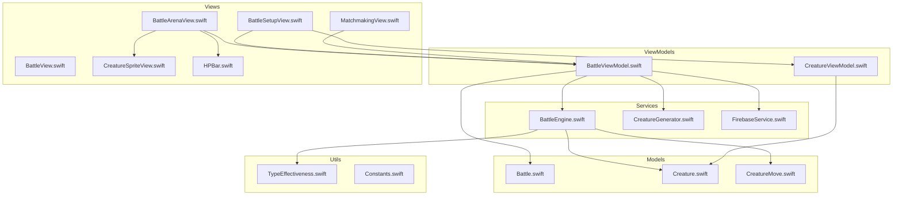
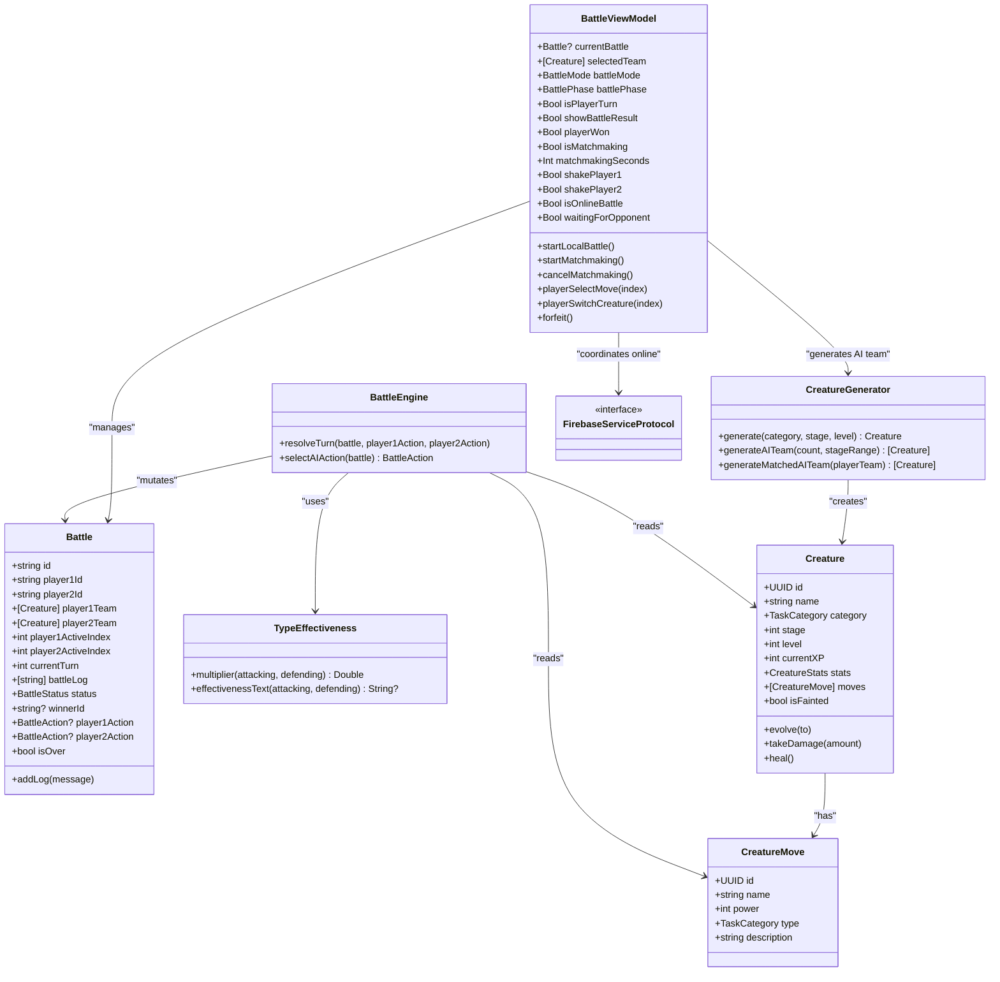
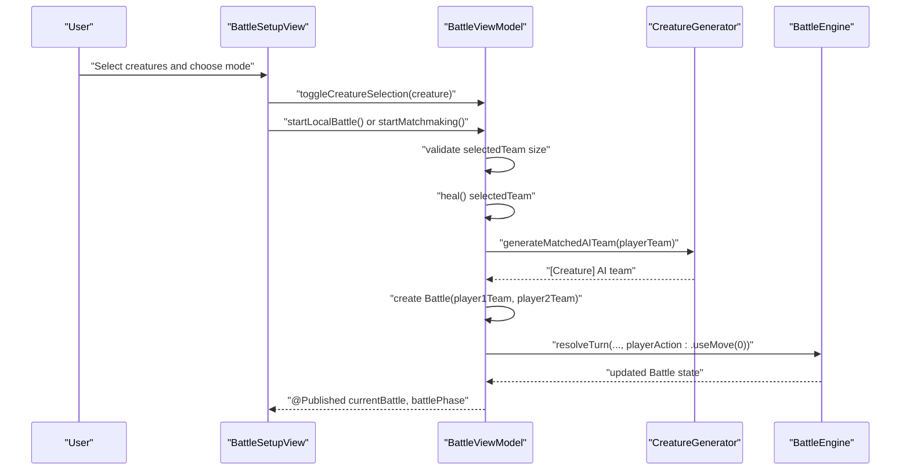
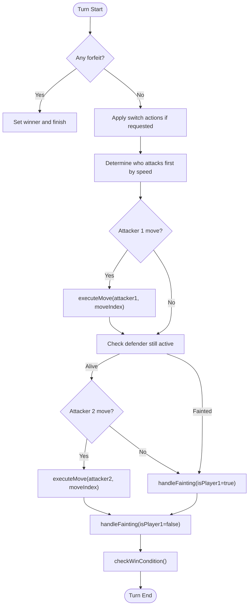
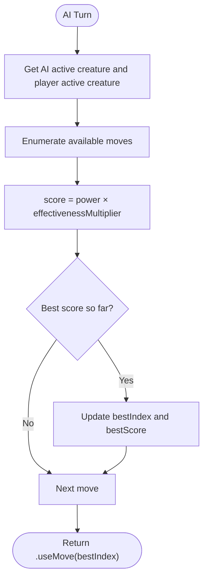
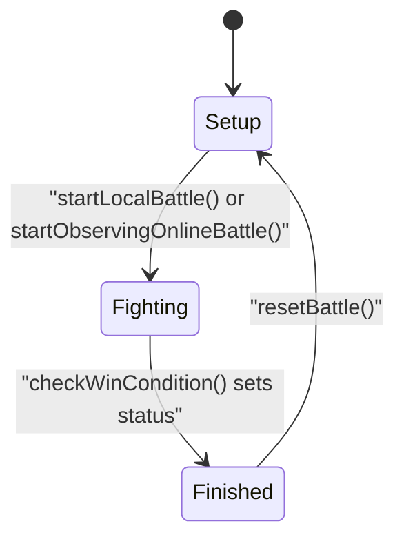
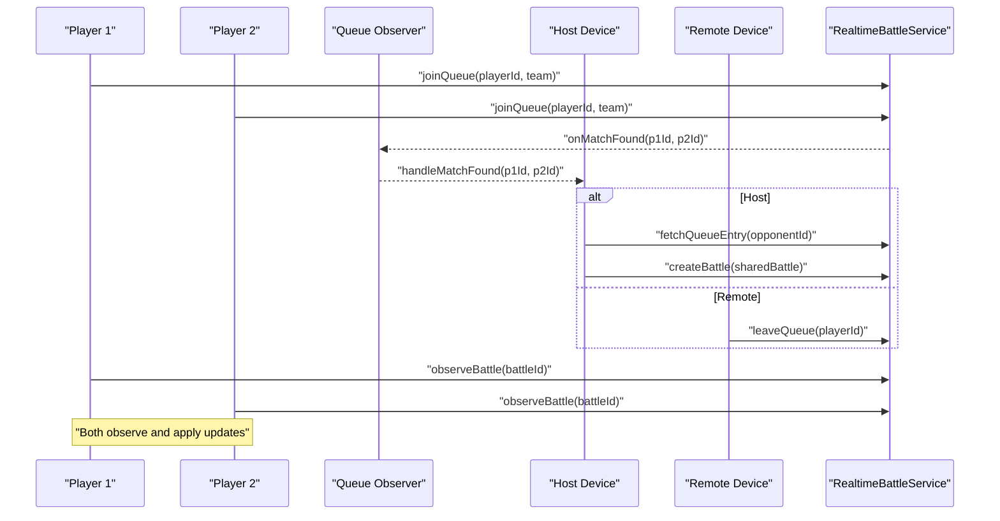
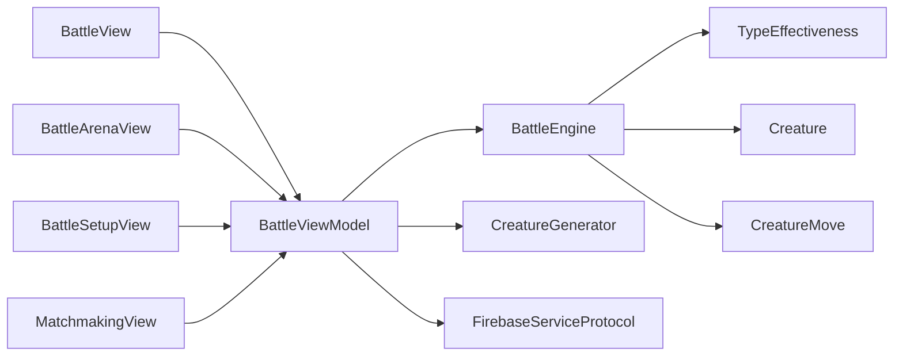

# Battle System

<cite>
**Referenced Files in This Document**
- [Battle.swift](file://TaskMon/TaskMon/Models/Battle.swift)
- [BattleEngine.swift](file://TaskMon/TaskMon/Services/BattleEngine.swift)
- [TypeEffectiveness.swift](file://TaskMon/TaskMon/Utils/TypeEffectiveness.swift)
- [BattleViewModel.swift](file://TaskMon/TaskMon/ViewModels/BattleViewModel.swift)
- [BattleView.swift](file://TaskMon/TaskMon/Views/Battle/BattleView.swift)
- [BattleArenaView.swift](file://TaskMon/TaskMon/Views/Battle/BattleArenaView.swift)
- [BattleSetupView.swift](file://TaskMon/TaskMon/Views/Battle/BattleSetupView.swift)
- [MatchmakingView.swift](file://TaskMon/TaskMon/Views/Battle/MatchmakingView.swift)
- [Creature.swift](file://TaskMon/TaskMon/Models/Creature.swift)
- [CreatureMove.swift](file://TaskMon/TaskMon/Models/CreatureMove.swift)
- [CreatureGenerator.swift](file://TaskMon/TaskMon/Services/CreatureGenerator.swift)
- [FirebaseService.swift](file://TaskMon/TaskMon/Services/FirebaseService.swift)
- [CreatureViewModel.swift](file://TaskMon/TaskMon/ViewModels/CreatureViewModel.swift)
- [CreatureSpriteView.swift](file://TaskMon/TaskMon/Views/Components/CreatureSpriteView.swift)
- [HPBar.swift](file://TaskMon/TaskMon/Views/Components/HPBar.swift)
- [Constants.swift](file://TaskMon/TaskMon/Utils/Constants.swift)
</cite>

## Table of Contents
1. [Introduction](#introduction)
2. [Project Structure](#project-structure)
3. [Core Components](#core-components)
4. [Architecture Overview](#architecture-overview)
5. [Detailed Component Analysis](#detailed-component-analysis)
6. [Dependency Analysis](#dependency-analysis)
7. [Performance Considerations](#performance-considerations)
8. [Troubleshooting Guide](#troubleshooting-guide)
9. [Conclusion](#conclusion)
10. [Appendices](#appendices)

## Introduction
This document provides comprehensive documentation for the Battle System, covering battle setup and team management, turn-based combat mechanics, AI logic, state management, multiplayer matchmaking and synchronization, and the ViewModels and UI components that drive the experience. It also includes implementation details for the battle engine calculations, type effectiveness matrix, and AI decision trees, along with code example paths for common workflows such as initializing a battle, resolving turns, and coordinating multiplayer battles.

## Project Structure
The Battle System spans Models, Services, ViewModels, Views, and Utilities. The central data model defines the battle state, while the Battle Engine performs turn resolution and damage calculation. ViewModels orchestrate UI state, user actions, and multiplayer coordination. Views render the battle arena, team selection, and matchmaking screens. Utilities define constants and type effectiveness.

**Diagram sources**
- [Battle.swift](file://TaskMon/TaskMon/Models/Battle.swift#L32-L68)
- [BattleEngine.swift](file://TaskMon/TaskMon/Services/BattleEngine.swift#L3-L169)
- [TypeEffectiveness.swift](file://TaskMon/TaskMon/Utils/TypeEffectiveness.swift#L3-L33)
- [BattleViewModel.swift](file://TaskMon/TaskMon/ViewModels/BattleViewModel.swift#L10-L462)
- [BattleView.swift](file://TaskMon/TaskMon/Views/Battle/BattleView.swift#L3-L52)
- [BattleArenaView.swift](file://TaskMon/TaskMon/Views/Battle/BattleArenaView.swift#L3-L287)
- [BattleSetupView.swift](file://TaskMon/TaskMon/Views/Battle/BattleSetupView.swift#L3-L164)
- [MatchmakingView.swift](file://TaskMon/TaskMon/Views/Battle/MatchmakingView.swift#L3-L95)
- [Creature.swift](file://TaskMon/TaskMon/Models/Creature.swift#L33-L98)
- [CreatureMove.swift](file://TaskMon/TaskMon/Models/CreatureMove.swift#L3-L68)
- [CreatureGenerator.swift](file://TaskMon/TaskMon/Services/CreatureGenerator.swift#L3-L44)
- [FirebaseService.swift](file://TaskMon/TaskMon/Services/FirebaseService.swift#L30-L41)
- [CreatureViewModel.swift](file://TaskMon/TaskMon/ViewModels/CreatureViewModel.swift#L5-L90)
- [CreatureSpriteView.swift](file://TaskMon/TaskMon/Views/Components/CreatureSpriteView.swift#L3-L52)
- [HPBar.swift](file://TaskMon/TaskMon/Views/Components/HPBar.swift#L3-L110)
- [Constants.swift](file://TaskMon/TaskMon/Utils/Constants.swift#L4-L40)

**Section sources**
- [Battle.swift](file://TaskMon/TaskMon/Models/Battle.swift#L1-L69)
- [BattleEngine.swift](file://TaskMon/TaskMon/Services/BattleEngine.swift#L1-L170)
- [TypeEffectiveness.swift](file://TaskMon/TaskMon/Utils/TypeEffectiveness.swift#L1-L34)
- [BattleViewModel.swift](file://TaskMon/TaskMon/ViewModels/BattleViewModel.swift#L1-L462)
- [BattleView.swift](file://TaskMon/TaskMon/Views/Battle/BattleView.swift#L1-L53)
- [BattleArenaView.swift](file://TaskMon/TaskMon/Views/Battle/BattleArenaView.swift#L1-L287)
- [BattleSetupView.swift](file://TaskMon/TaskMon/Views/Battle/BattleSetupView.swift#L1-L164)
- [MatchmakingView.swift](file://TaskMon/TaskMon/Views/Battle/MatchmakingView.swift#L1-L95)
- [Creature.swift](file://TaskMon/TaskMon/Models/Creature.swift#L1-L98)
- [CreatureMove.swift](file://TaskMon/TaskMon/Models/CreatureMove.swift#L1-L68)
- [CreatureGenerator.swift](file://TaskMon/TaskMon/Services/CreatureGenerator.swift#L1-L44)
- [FirebaseService.swift](file://TaskMon/TaskMon/Services/FirebaseService.swift#L1-L157)
- [CreatureViewModel.swift](file://TaskMon/TaskMon/ViewModels/CreatureViewModel.swift#L1-L90)
- [CreatureSpriteView.swift](file://TaskMon/TaskMon/Views/Components/CreatureSpriteView.swift#L1-L52)
- [HPBar.swift](file://TaskMon/TaskMon/Views/Components/HPBar.swift#L1-L110)
- [Constants.swift](file://TaskMon/TaskMon/Utils/Constants.swift#L1-L40)

## Core Components
- Battle Model: Defines battle state, teams, active creatures, turn tracking, logs, and status.
- Battle Engine: Implements turn resolution, move execution, damage calculation, type effectiveness, fainting checks, and win conditions.
- Type Effectiveness: Provides multiplier logic and textual feedback for type matchups.
- Battle ViewModel: Manages UI state, team selection, local and online battle flows, matchmaking, action submission, and battle observation.
- Creature and Moves: Define stats, evolution, movesets, and damage mechanics.
- Creature Generator: Generates AI teams and matched AI teams based on player team characteristics.
- Firebase Service Protocols: Define authentication, database, and realtime battle service interfaces (with stub implementations).
- UI Components: Battle arena, team setup, matchmaking, creature sprites, and HP bars.

**Section sources**
- [Battle.swift](file://TaskMon/TaskMon/Models/Battle.swift#L32-L68)
- [BattleEngine.swift](file://TaskMon/TaskMon/Services/BattleEngine.swift#L3-L169)
- [TypeEffectiveness.swift](file://TaskMon/TaskMon/Utils/TypeEffectiveness.swift#L3-L33)
- [BattleViewModel.swift](file://TaskMon/TaskMon/ViewModels/BattleViewModel.swift#L10-L462)
- [Creature.swift](file://TaskMon/TaskMon/Models/Creature.swift#L33-L98)
- [CreatureMove.swift](file://TaskMon/TaskMon/Models/CreatureMove.swift#L3-L68)
- [CreatureGenerator.swift](file://TaskMon/TaskMon/Services/CreatureGenerator.swift#L3-L44)
- [FirebaseService.swift](file://TaskMon/TaskMon/Services/FirebaseService.swift#L30-L41)
- [CreatureSpriteView.swift](file://TaskMon/TaskMon/Views/Components/CreatureSpriteView.swift#L3-L52)
- [HPBar.swift](file://TaskMon/TaskMon/Views/Components/HPBar.swift#L3-L110)

## Architecture Overview
The Battle System follows a MVVM architecture with clear separation of concerns:
- Models encapsulate game state and data.
- Services implement core logic (battle engine, AI, persistence).
- ViewModels coordinate UI state, user actions, and external services.
- Views render the UI and bind to ViewModel state.
- Utilities provide constants and type effectiveness.

**Diagram sources**
- [Battle.swift](file://TaskMon/TaskMon/Models/Battle.swift#L32-L68)
- [BattleEngine.swift](file://TaskMon/TaskMon/Services/BattleEngine.swift#L3-L169)
- [TypeEffectiveness.swift](file://TaskMon/TaskMon/Utils/TypeEffectiveness.swift#L3-L33)
- [BattleViewModel.swift](file://TaskMon/TaskMon/ViewModels/BattleViewModel.swift#L10-L462)
- [Creature.swift](file://TaskMon/TaskMon/Models/Creature.swift#L33-L98)
- [CreatureMove.swift](file://TaskMon/TaskMon/Models/CreatureMove.swift#L3-L68)
- [CreatureGenerator.swift](file://TaskMon/TaskMon/Services/CreatureGenerator.swift#L3-L44)
- [FirebaseService.swift](file://TaskMon/TaskMon/Services/FirebaseService.swift#L30-L41)

## Detailed Component Analysis

### Battle Setup and Team Management
- Team Composition: Players select 1–GameConstants.maxTeamSize creatures for battle. The selection toggles via the ViewModel and is validated against the limit.
- Preparation Workflow:
  - Local Battle: Selected team is healed, an AI team is generated, and a Battle instance is created with initial logs.
  - Online Battle: Team is submitted to matchmaking; the host creates the shared battle and observers receive updates.
- UI: BattleSetupView renders available creatures, selected team preview, mode selection, and start button.

**Diagram sources**
- [BattleSetupView.swift](file://TaskMon/TaskMon/Views/Battle/BattleSetupView.swift#L3-L164)
- [BattleViewModel.swift](file://TaskMon/TaskMon/ViewModels/BattleViewModel.swift#L52-L82)
- [CreatureGenerator.swift](file://TaskMon/TaskMon/Services/CreatureGenerator.swift#L24-L42)
- [BattleEngine.swift](file://TaskMon/TaskMon/Services/BattleEngine.swift#L5-L66)

**Section sources**
- [BattleViewModel.swift](file://TaskMon/TaskMon/ViewModels/BattleViewModel.swift#L52-L82)
- [BattleSetupView.swift](file://TaskMon/TaskMon/Views/Battle/BattleSetupView.swift#L3-L164)
- [Constants.swift](file://TaskMon/TaskMon/Utils/Constants.swift#L15-L17)
- [CreatureGenerator.swift](file://TaskMon/TaskMon/Services/CreatureGenerator.swift#L24-L42)

### Turn-Based Combat Mechanics
- Turn Resolution:
  - Actions: Player and AI submit actions (useMove, switchCreature, forfeit).
  - Order: Speed determines who attacks first; ties resolved randomly.
  - Execution: Moves apply damage considering type effectiveness and variance.
  - Fainting: Active creature faints if HP <= 0; auto-switch to next available creature.
  - Win Condition: All of one side’s creatures faint → declare winner/draw.
- Damage Calculation:
  - Base damage derived from attacker stats and move power, scaled by defense and type effectiveness.
  - Random variance applied to introduce stochasticity.
- Type Effectiveness:
  - Matrix defines super-effective, not very effective, and neutral against Work/Learning/Creative/Health with Personal being neutral to all.
  - Textual feedback is logged when effectiveness differs from neutral.

**Diagram sources**
- [BattleEngine.swift](file://TaskMon/TaskMon/Services/BattleEngine.swift#L5-L143)
- [TypeEffectiveness.swift](file://TaskMon/TaskMon/Utils/TypeEffectiveness.swift#L11-L32)

**Section sources**
- [BattleEngine.swift](file://TaskMon/TaskMon/Services/BattleEngine.swift#L5-L143)
- [TypeEffectiveness.swift](file://TaskMon/TaskMon/Utils/TypeEffectiveness.swift#L3-L33)

### AI Opponent Logic
- Decision-Making:
  - AI selects the move with the highest score, computed as move.power multiplied by the type effectiveness multiplier against the player’s active creature.
  - If no moves are available, defaults to using the first move.
- Difficulty and Behavior:
  - Current implementation is a simple optimal-choice heuristic; no explicit difficulty tiers are present in code.
  - Strategy pattern allows future extension to include randomness, risk assessment, or status-based decisions.

**Diagram sources**
- [BattleEngine.swift](file://TaskMon/TaskMon/Services/BattleEngine.swift#L147-L168)

**Section sources**
- [BattleEngine.swift](file://TaskMon/TaskMon/Services/BattleEngine.swift#L147-L168)

### Battle State Management
- State Tracking:
  - Turn counter increments per resolved turn.
  - BattleAction stores type and index for moves or switches.
  - Logs capture all events; animations play out messages sequentially.
- Health Management:
  - Creatures track HP and can be healed or damaged.
  - Fainting triggers automatic replacement with the next healthy creature.
- Result Processing:
  - Win conditions checked after each turn; logs declare outcomes and status transitions to finished.

**Diagram sources**
- [Battle.swift](file://TaskMon/TaskMon/Models/Battle.swift#L32-L68)
- [BattleEngine.swift](file://TaskMon/TaskMon/Services/BattleEngine.swift#L127-L143)
- [BattleViewModel.swift](file://TaskMon/TaskMon/ViewModels/BattleViewModel.swift#L388-L414)

**Section sources**
- [Battle.swift](file://TaskMon/TaskMon/Models/Battle.swift#L32-L68)
- [BattleEngine.swift](file://TaskMon/TaskMon/Services/BattleEngine.swift#L105-L143)
- [BattleViewModel.swift](file://TaskMon/TaskMon/ViewModels/BattleViewModel.swift#L388-L414)

### Multiplayer Features
- Matchmaking Coordination:
  - Queue joining and observation to detect matches.
  - Host determines battle ID and creates the shared battle document.
  - Non-host leaves queue and observes the created battle.
- Real-Time Synchronization:
  - Observers receive updates and apply new logs with animations.
  - Host resolves turns when both actions are present.
- Opponent Management:
  - Perspective swapping ensures the local player always sees themselves as player1.
  - Friendly log text replaces IDs with “You” and “Opponent”.

**Diagram sources**
- [BattleViewModel.swift](file://TaskMon/TaskMon/ViewModels/BattleViewModel.swift#L167-L281)
- [FirebaseService.swift](file://TaskMon/TaskMon/Services/FirebaseService.swift#L30-L41)

**Section sources**
- [BattleViewModel.swift](file://TaskMon/TaskMon/ViewModels/BattleViewModel.swift#L167-L281)
- [FirebaseService.swift](file://TaskMon/TaskMon/Services/FirebaseService.swift#L30-L41)

### ViewModels Responsibilities
- BattleViewModel:
  - Team selection and validation.
  - Local and online battle lifecycle.
  - Action submission and turn resolution.
  - Matchmaking timers and UI state.
  - Shake animations and log message sequencing.
- CreatureViewModel:
  - Loads and persists creatures.
  - Exposes battle-ready creatures and heals them.
  - Subscribes to XP events to evolve creatures.

**Section sources**
- [BattleViewModel.swift](file://TaskMon/TaskMon/ViewModels/BattleViewModel.swift#L10-L462)
- [CreatureViewModel.swift](file://TaskMon/TaskMon/ViewModels/CreatureViewModel.swift#L5-L90)

### UI Components
- BattleArenaView:
  - Renders opponent and player sides with sprites, HP bars, and team indicators.
  - Displays battle log with color-coded messages and animations.
  - Presents move buttons, switch menu, and forfeit controls.
- BattleSetupView:
  - Grid of selectable creatures, selected team preview, and mode buttons.
  - Start button triggers either local fight or matchmaking.
- MatchmakingView:
  - Animated radar/wifi visuals, elapsed time, and team preview.
  - Cancel button to exit matchmaking.
- Components:
  - CreatureSpriteView: Renders creature sprites with fallback icons.
  - HPBar: Visual HP indicator with color thresholds.

**Section sources**
- [BattleArenaView.swift](file://TaskMon/TaskMon/Views/Battle/BattleArenaView.swift#L3-L287)
- [BattleSetupView.swift](file://TaskMon/TaskMon/Views/Battle/BattleSetupView.swift#L3-L164)
- [MatchmakingView.swift](file://TaskMon/TaskMon/Views/Battle/MatchmakingView.swift#L3-L95)
- [CreatureSpriteView.swift](file://TaskMon/TaskMon/Views/Components/CreatureSpriteView.swift#L3-L52)
- [HPBar.swift](file://TaskMon/TaskMon/Views/Components/HPBar.swift#L3-L110)

## Dependency Analysis
- BattleEngine depends on:
  - TypeEffectiveness for damage multipliers.
  - Creature and CreatureMove for stats and moves.
- BattleViewModel depends on:
  - BattleEngine for turn resolution.
  - CreatureGenerator for AI teams.
  - FirebaseServiceProtocol for matchmaking and battle observation.
- UI binds to ViewModels via @EnvironmentObject and reacts to @Published state changes.

**Diagram sources**
- [BattleEngine.swift](file://TaskMon/TaskMon/Services/BattleEngine.swift#L3-L169)
- [TypeEffectiveness.swift](file://TaskMon/TaskMon/Utils/TypeEffectiveness.swift#L3-L33)
- [BattleViewModel.swift](file://TaskMon/TaskMon/ViewModels/BattleViewModel.swift#L10-L462)
- [FirebaseService.swift](file://TaskMon/TaskMon/Services/FirebaseService.swift#L30-L41)
- [BattleView.swift](file://TaskMon/TaskMon/Views/Battle/BattleView.swift#L3-L52)
- [BattleArenaView.swift](file://TaskMon/TaskMon/Views/Battle/BattleArenaView.swift#L3-L287)
- [BattleSetupView.swift](file://TaskMon/TaskMon/Views/Battle/BattleSetupView.swift#L3-L164)
- [MatchmakingView.swift](file://TaskMon/TaskMon/Views/Battle/MatchmakingView.swift#L3-L95)

**Section sources**
- [BattleEngine.swift](file://TaskMon/TaskMon/Services/BattleEngine.swift#L3-L169)
- [BattleViewModel.swift](file://TaskMon/TaskMon/ViewModels/BattleViewModel.swift#L10-L462)
- [FirebaseService.swift](file://TaskMon/TaskMon/Services/FirebaseService.swift#L30-L41)

## Performance Considerations
- Animation and Rendering:
  - Pixel art scaling and minimal re-renders improve frame stability.
  - Scroll-to-bottom animations for logs are throttled by delays.
- Network and State Updates:
  - Debounce log application and turn resolution to prevent redundant updates.
  - Use observer handles to clean up listeners and avoid memory leaks.
- Calculation Complexity:
  - Turn resolution is O(1) per action; type effectiveness lookup is constant.
  - Consider caching type effectiveness multipliers if extended to dynamic charts.

## Troubleshooting Guide
- No Creatures Available:
  - Ensure creatures are unlocked and not fainted; use CreatureViewModel.healAll() to restore HP.
- Matchmaking Stalls:
  - Verify queue observers are registered and timer runs; cancel and retry matchmaking.
- Online Battle Not Syncing:
  - Confirm battleId correctness and that both devices observe the same ID.
  - Check perspective swapping and friendly log replacements.
- Turn Not Resolving:
  - Ensure both actions are submitted (or default fallback used) and isResolvingTurn flag is cleared.

**Section sources**
- [CreatureViewModel.swift](file://TaskMon/TaskMon/ViewModels/CreatureViewModel.swift#L69-L74)
- [BattleViewModel.swift](file://TaskMon/TaskMon/ViewModels/BattleViewModel.swift#L167-L281)
- [BattleViewModel.swift](file://TaskMon/TaskMon/ViewModels/BattleViewModel.swift#L285-L357)

## Conclusion
The Battle System integrates a robust turn-based engine with intuitive UI, flexible team management, and scalable multiplayer support. The modular design enables straightforward enhancements such as AI difficulty tiers, advanced type charts, and richer multiplayer features while maintaining clear separation between models, services, ViewModels, and views.

## Appendices

### Implementation Details and Example Paths
- Battle Initialization:
  - Local: [BattleViewModel.startLocalBattle](file://TaskMon/TaskMon/ViewModels/BattleViewModel.swift#L66-L82)
  - Online Host: [BattleViewModel.handleMatchFound](file://TaskMon/TaskMon/ViewModels/BattleViewModel.swift#L225-L281)
- Turn Resolution Pattern:
  - [BattleEngine.resolveTurn](file://TaskMon/TaskMon/Services/BattleEngine.swift#L5-L66)
  - [BattleEngine.executeMove](file://TaskMon/TaskMon/Services/BattleEngine.swift#L68-L103)
- Multiplayer Coordination:
  - [BattleViewModel.startMatchmaking](file://TaskMon/TaskMon/ViewModels/BattleViewModel.swift#L167-L203)
  - [BattleViewModel.startObservingOnlineBattle](file://TaskMon/TaskMon/ViewModels/BattleViewModel.swift#L285-L294)
  - [BattleViewModel.handleBattleUpdate](file://TaskMon/TaskMon/ViewModels/BattleViewModel.swift#L296-L357)
- Type Effectiveness Matrix:
  - [TypeEffectiveness.multiplier](file://TaskMon/TaskMon/Utils/TypeEffectiveness.swift#L11-L22)
  - [TypeEffectiveness.effectivenessText](file://TaskMon/TaskMon/Utils/TypeEffectiveness.swift#L24-L32)
- AI Decision Tree:
  - [BattleEngine.selectAIAction](file://TaskMon/TaskMon/Services/BattleEngine.swift#L147-L168)