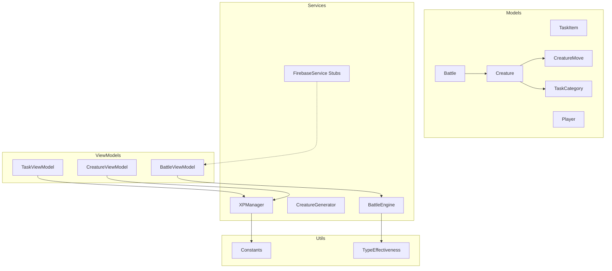
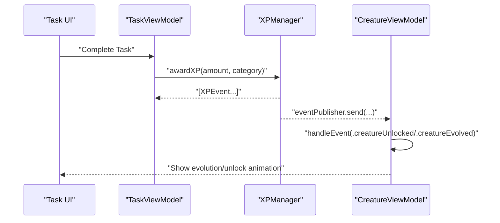
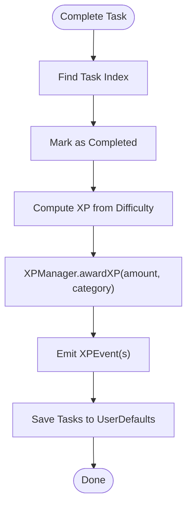
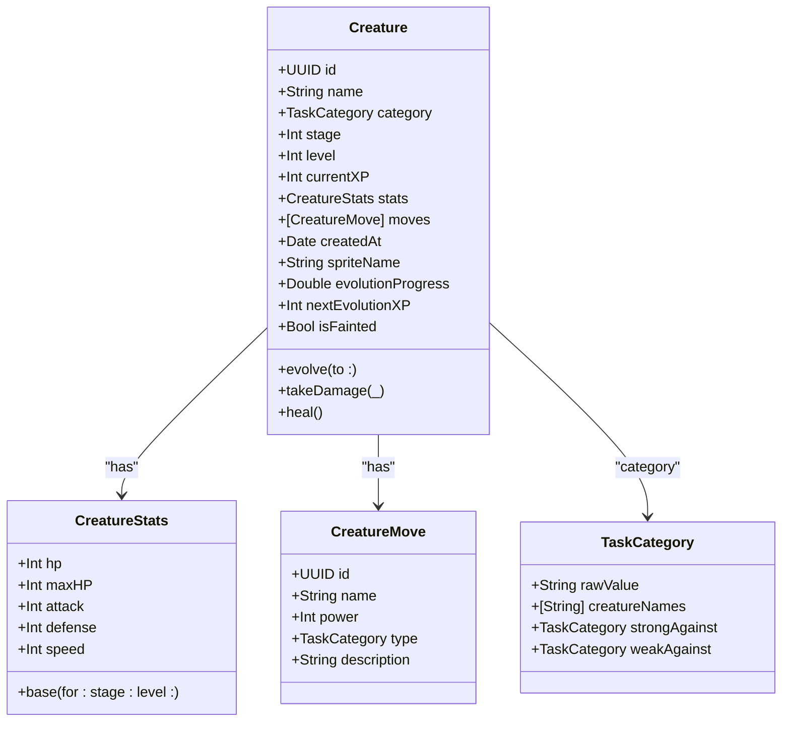
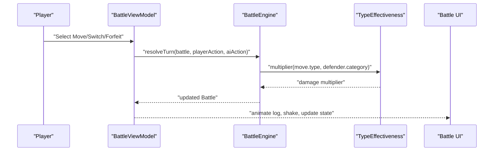
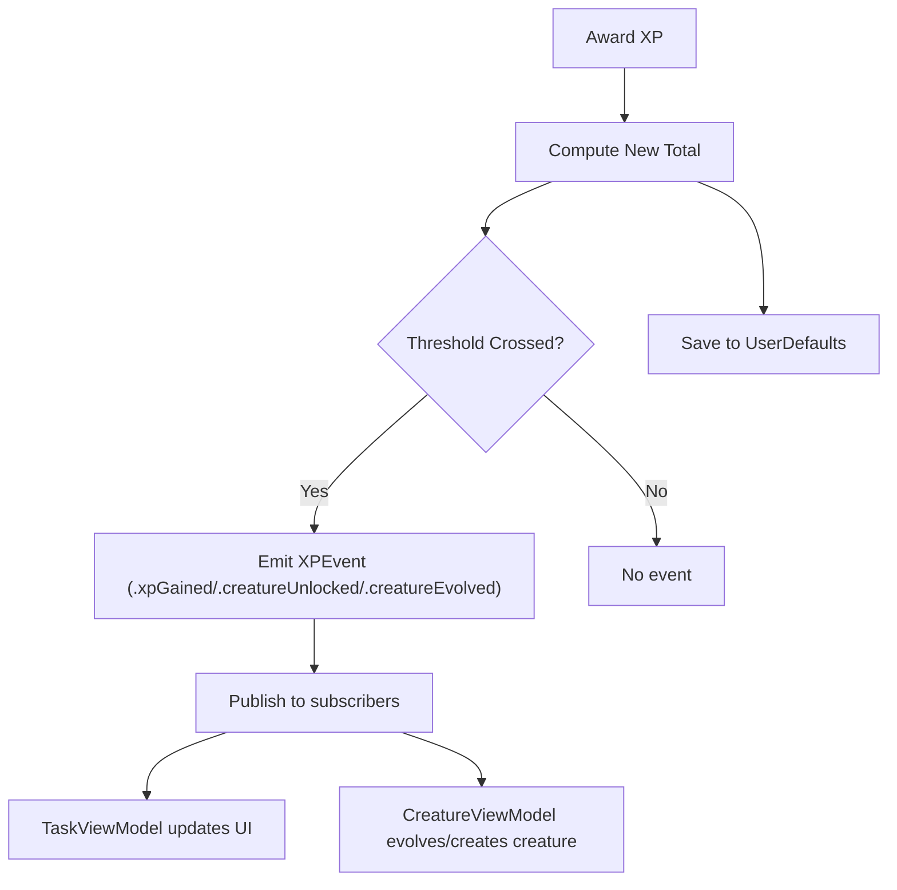
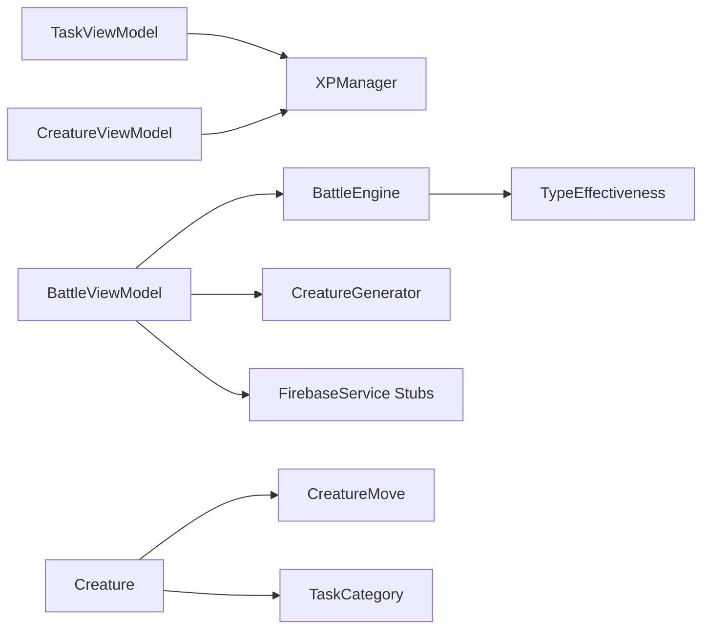

# Core Features

<cite>
**Referenced Files in This Document**
- [TaskItem.swift](file://TaskMon/TaskMon/Models/TaskItem.swift)
- [TaskCategory.swift](file://TaskMon/TaskMon/Models/TaskCategory.swift)
- [Creature.swift](file://TaskMon/TaskMon/Models/Creature.swift)
- [CreatureMove.swift](file://TaskMon/TaskMon/Models/CreatureMove.swift)
- [Battle.swift](file://TaskMon/TaskMon/Models/Battle.swift)
- [Player.swift](file://TaskMon/TaskMon/Models/Player.swift)
- [XPManager.swift](file://TaskMon/TaskMon/Services/XPManager.swift)
- [CreatureGenerator.swift](file://TaskMon/TaskMon/Services/CreatureGenerator.swift)
- [BattleEngine.swift](file://TaskMon/TaskMon/Services/BattleEngine.swift)
- [FirebaseService.swift](file://TaskMon/TaskMon/Services/FirebaseService.swift)
- [TaskViewModel.swift](file://TaskMon/TaskMon/ViewModels/TaskViewModel.swift)
- [CreatureViewModel.swift](file://TaskMon/TaskMon/ViewModels/CreatureViewModel.swift)
- [BattleViewModel.swift](file://TaskMon/TaskMon/ViewModels/BattleViewModel.swift)
- [Constants.swift](file://TaskMon/TaskMon/Utils/Constants.swift)
- [TypeEffectiveness.swift](file://TaskMon/TaskMon/Utils/TypeEffectiveness.swift)
</cite>

## Table of Contents
1. [Introduction](#introduction)
2. [Project Structure](#project-structure)
3. [Core Components](#core-components)
4. [Architecture Overview](#architecture-overview)
5. [Detailed Component Analysis](#detailed-component-analysis)
6. [Dependency Analysis](#dependency-analysis)
7. [Performance Considerations](#performance-considerations)
8. [Troubleshooting Guide](#troubleshooting-guide)
9. [Conclusion](#conclusion)
10. [Appendices](#appendices)

## Introduction
This document explains TaskMon’s core features with a focus on implementation details, data models, ViewModels, services, and workflows. It covers:
- Task management: creation, completion tracking, and XP rewards per difficulty
- Creature collection: unlocking thresholds, evolution stages, stat scaling, and naming conventions
- Battle system: turn-based combat, type effectiveness, AI logic, and team management
- XP progression: milestone thresholds, cross-component event communication, and persistence
- Interdependencies and data flow across components

## Project Structure
TaskMon is organized around models, services, ViewModels, and utilities. The app uses UserDefaults for local persistence and a stubbed service layer to support offline/local play. Key areas:
- Models: TaskItem, TaskCategory, Creature, CreatureMove, Battle, Player
- Services: XPManager, CreatureGenerator, BattleEngine, FirebaseService stubs
- ViewModels: TaskViewModel, CreatureViewModel, BattleViewModel
- Utilities: Constants, TypeEffectiveness

**Diagram sources**
- [TaskItem.swift](file://TaskMon/TaskMon/Models/TaskItem.swift#L27-L43)
- [Creature.swift](file://TaskMon/TaskMon/Models/Creature.swift#L33-L97)
- [CreatureMove.swift](file://TaskMon/TaskMon/Models/CreatureMove.swift#L3-L67)
- [Battle.swift](file://TaskMon/TaskMon/Models/Battle.swift#L32-L68)
- [Player.swift](file://TaskMon/TaskMon/Models/Player.swift#L3-L28)
- [TaskCategory.swift](file://TaskMon/TaskMon/Models/TaskCategory.swift#L4-L84)
- [XPManager.swift](file://TaskMon/TaskMon/Services/XPManager.swift#L10-L95)
- [CreatureGenerator.swift](file://TaskMon/TaskMon/Services/CreatureGenerator.swift#L3-L43)
- [BattleEngine.swift](file://TaskMon/TaskMon/Services/BattleEngine.swift#L3-L169)
- [FirebaseService.swift](file://TaskMon/TaskMon/Services/FirebaseService.swift#L3-L142)
- [TaskViewModel.swift](file://TaskMon/TaskMon/ViewModels/TaskViewModel.swift#L5-L75)
- [CreatureViewModel.swift](file://TaskMon/TaskMon/ViewModels/CreatureViewModel.swift#L5-L89)
- [BattleViewModel.swift](file://TaskMon/TaskMon/ViewModels/BattleViewModel.swift#L10-L461)
- [Constants.swift](file://TaskMon/TaskMon/Utils/Constants.swift#L4-L39)
- [TypeEffectiveness.swift](file://TaskMon/TaskMon/Utils/TypeEffectiveness.swift#L3-L33)

**Section sources**
- [TaskItem.swift](file://TaskMon/TaskMon/Models/TaskItem.swift#L1-L44)
- [TaskCategory.swift](file://TaskMon/TaskMon/Models/TaskCategory.swift#L1-L85)
- [Creature.swift](file://TaskMon/TaskMon/Models/Creature.swift#L1-L98)
- [CreatureMove.swift](file://TaskMon/TaskMon/Models/CreatureMove.swift#L1-L68)
- [Battle.swift](file://TaskMon/TaskMon/Models/Battle.swift#L1-L69)
- [Player.swift](file://TaskMon/TaskMon/Models/Player.swift#L1-L29)
- [XPManager.swift](file://TaskMon/TaskMon/Services/XPManager.swift#L1-L96)
- [CreatureGenerator.swift](file://TaskMon/TaskMon/Services/CreatureGenerator.swift#L1-L44)
- [BattleEngine.swift](file://TaskMon/TaskMon/Services/BattleEngine.swift#L1-L170)
- [FirebaseService.swift](file://TaskMon/TaskMon/Services/FirebaseService.swift#L1-L143)
- [TaskViewModel.swift](file://TaskMon/TaskMon/ViewModels/TaskViewModel.swift#L1-L76)
- [CreatureViewModel.swift](file://TaskMon/TaskMon/ViewModels/CreatureViewModel.swift#L1-L90)
- [BattleViewModel.swift](file://TaskMon/TaskMon/ViewModels/BattleViewModel.swift#L1-L462)
- [Constants.swift](file://TaskMon/TaskMon/Utils/Constants.swift#L1-L40)
- [TypeEffectiveness.swift](file://TaskMon/TaskMon/Utils/TypeEffectiveness.swift#L1-L34)

## Core Components
- Task management: TaskViewModel manages tasks and triggers XP awards via XPManager. Difficulty determines XP reward.
- Creature collection: Creature models encapsulate stats, evolution, and moves. CreatureViewModel listens to XPManager events to unlock and evolve creatures.
- Battle system: BattleEngine resolves turns, applies type effectiveness, and handles AI decisions. BattleViewModel orchestrates local and online battles.
- XP progression: XPManager persists category XP, emits events on milestones, and exposes helpers for stage detection and next milestone.

**Section sources**
- [TaskViewModel.swift](file://TaskMon/TaskMon/ViewModels/TaskViewModel.swift#L5-L75)
- [XPManager.swift](file://TaskMon/TaskMon/Services/XPManager.swift#L10-L95)
- [Creature.swift](file://TaskMon/TaskMon/Models/Creature.swift#L33-L97)
- [CreatureViewModel.swift](file://TaskMon/TaskMon/ViewModels/CreatureViewModel.swift#L5-L89)
- [BattleEngine.swift](file://TaskMon/TaskMon/Services/BattleEngine.swift#L3-L169)
- [BattleViewModel.swift](file://TaskMon/TaskMon/ViewModels/BattleViewModel.swift#L10-L461)

## Architecture Overview
The system follows a layered MVVM pattern with a central XPManager coordinating XP gains and evolution unlocks. Services provide domain logic (battle resolution, creature generation) and are backed by stub implementations for offline play. ViewModels coordinate UI state and persist data locally.

**Diagram sources**
- [TaskViewModel.swift](file://TaskMon/TaskMon/ViewModels/TaskViewModel.swift#L26-L39)
- [XPManager.swift](file://TaskMon/TaskMon/Services/XPManager.swift#L22-L50)
- [CreatureViewModel.swift](file://TaskMon/TaskMon/ViewModels/CreatureViewModel.swift#L33-L63)

## Detailed Component Analysis

### Task Management System
- Data model: TaskItem stores title, category, difficulty, completion state, and timestamps.
- Difficulty-based XP: TaskDifficulty defines XP rewards per difficulty.
- Completion flow: TaskViewModel marks a task complete, computes XP, notifies XPManager, and persists tasks.

**Diagram sources**
- [TaskViewModel.swift](file://TaskMon/TaskMon/ViewModels/TaskViewModel.swift#L26-L39)
- [TaskItem.swift](file://TaskMon/TaskMon/Models/TaskItem.swift#L3-L25)
- [XPManager.swift](file://TaskMon/TaskMon/Services/XPManager.swift#L22-L50)

**Section sources**
- [TaskItem.swift](file://TaskMon/TaskMon/Models/TaskItem.swift#L27-L43)
- [TaskViewModel.swift](file://TaskMon/TaskMon/ViewModels/TaskViewModel.swift#L20-L39)
- [Constants.swift](file://TaskMon/TaskMon/Utils/Constants.swift#L6-L8)

### Creature Collection System
- Stats scaling: CreatureStats.base computes base stats per category and scales by stage and level.
- Evolution thresholds: Creature.nextEvolutionXP and evolutionProgress compute progress between stages.
- Naming conventions: TaskCategory.creatureNames provides stage-specific names.
- Moves: MovePools.moves returns category-specific moves, increasing with stage.
- Unlock and evolve: CreatureViewModel subscribes to XPManager events to create stage-1 creatures and evolve them upon milestones.

**Diagram sources**
- [Creature.swift](file://TaskMon/TaskMon/Models/Creature.swift#L33-L97)
- [Creature.swift](file://TaskMon/TaskMon/Models/Creature.swift#L3-L31)
- [CreatureMove.swift](file://TaskMon/TaskMon/Models/CreatureMove.swift#L3-L17)
- [TaskCategory.swift](file://TaskMon/TaskMon/Models/TaskCategory.swift#L4-L84)

**Section sources**
- [Creature.swift](file://TaskMon/TaskMon/Models/Creature.swift#L10-L97)
- [CreatureMove.swift](file://TaskMon/TaskMon/Models/CreatureMove.swift#L21-L67)
- [TaskCategory.swift](file://TaskMon/TaskMon/Models/TaskCategory.swift#L53-L61)
- [CreatureViewModel.swift](file://TaskMon/TaskMon/ViewModels/CreatureViewModel.swift#L33-L63)

### Battle System
- Turn-based mechanics: BattleEngine.resolveTurn handles forfeits, switches, move execution, speed tiebreakers, fainting, and win conditions.
- Type effectiveness: TypeEffectiveness.multiplier and effectivenessText compute damage modifiers based on TaskCategory matchups.
- AI logic: BattleEngine.selectAIAction chooses the move with highest damage considering type effectiveness.
- Team management: BattleViewModel supports local battles, AI team generation, and online matchmaking with stubbed services.

**Diagram sources**
- [BattleViewModel.swift](file://TaskMon/TaskMon/ViewModels/BattleViewModel.swift#L86-L146)
- [BattleEngine.swift](file://TaskMon/TaskMon/Services/BattleEngine.swift#L5-L66)
- [TypeEffectiveness.swift](file://TaskMon/TaskMon/Utils/TypeEffectiveness.swift#L11-L22)

**Section sources**
- [Battle.swift](file://TaskMon/TaskMon/Models/Battle.swift#L32-L68)
- [BattleEngine.swift](file://TaskMon/TaskMon/Services/BattleEngine.swift#L5-L169)
- [TypeEffectiveness.swift](file://TaskMon/TaskMon/Utils/TypeEffectiveness.swift#L3-L33)
- [BattleViewModel.swift](file://TaskMon/TaskMon/ViewModels/BattleViewModel.swift#L66-L146)

### XP Progression System
- Milestones: XPManager evaluates thresholds for stage unlocks and evolutions and emits XPEvent notifications.
- Cross-component communication: Publishers notify TaskViewModel and CreatureViewModel of XP gains and milestones.
- Persistence: XPManager saves and loads category XP via UserDefaults.

**Diagram sources**
- [XPManager.swift](file://TaskMon/TaskMon/Services/XPManager.swift#L22-L50)
- [TaskViewModel.swift](file://TaskMon/TaskMon/ViewModels/TaskViewModel.swift#L33-L35)
- [CreatureViewModel.swift](file://TaskMon/TaskMon/ViewModels/CreatureViewModel.swift#L33-L63)

**Section sources**
- [XPManager.swift](file://TaskMon/TaskMon/Services/XPManager.swift#L4-L75)
- [Constants.swift](file://TaskMon/TaskMon/Utils/Constants.swift#L10-L13)
- [TaskViewModel.swift](file://TaskMon/TaskMon/ViewModels/TaskViewModel.swift#L33-L35)
- [CreatureViewModel.swift](file://TaskMon/TaskMon/ViewModels/CreatureViewModel.swift#L33-L63)

## Dependency Analysis
- TaskViewModel depends on XPManager and UserDefaults for tasks.
- CreatureViewModel depends on XPManager for XP events and UserDefaults for creatures.
- BattleViewModel depends on BattleEngine, CreatureGenerator, and FirebaseService stubs.
- BattleEngine depends on TypeEffectiveness and CreatureMove.
- Models depend on TaskCategory for naming, type matchups, and move pools.

**Diagram sources**
- [TaskViewModel.swift](file://TaskMon/TaskMon/ViewModels/TaskViewModel.swift#L11-L11)
- [CreatureViewModel.swift](file://TaskMon/TaskMon/ViewModels/CreatureViewModel.swift#L13-L13)
- [BattleViewModel.swift](file://TaskMon/TaskMon/ViewModels/BattleViewModel.swift#L36-L37)
- [BattleEngine.swift](file://TaskMon/TaskMon/Services/BattleEngine.swift#L3-L3)
- [TypeEffectiveness.swift](file://TaskMon/TaskMon/Utils/TypeEffectiveness.swift#L3-L3)
- [Creature.swift](file://TaskMon/TaskMon/Models/Creature.swift#L33-L41)
- [CreatureMove.swift](file://TaskMon/TaskMon/Models/CreatureMove.swift#L3-L8)
- [TaskCategory.swift](file://TaskMon/TaskMon/Models/TaskCategory.swift#L4-L11)

**Section sources**
- [TaskViewModel.swift](file://TaskMon/TaskMon/ViewModels/TaskViewModel.swift#L11-L11)
- [CreatureViewModel.swift](file://TaskMon/TaskMon/ViewModels/CreatureViewModel.swift#L13-L13)
- [BattleViewModel.swift](file://TaskMon/TaskMon/ViewModels/BattleViewModel.swift#L36-L37)
- [BattleEngine.swift](file://TaskMon/TaskMon/Services/BattleEngine.swift#L3-L3)
- [TypeEffectiveness.swift](file://TaskMon/TaskMon/Utils/TypeEffectiveness.swift#L3-L3)
- [Creature.swift](file://TaskMon/TaskMon/Models/Creature.swift#L33-L41)
- [CreatureMove.swift](file://TaskMon/TaskMon/Models/CreatureMove.swift#L3-L8)
- [TaskCategory.swift](file://TaskMon/TaskMon/Models/TaskCategory.swift#L4-L11)

## Performance Considerations
- Local persistence: Using UserDefaults avoids network overhead but can be a bottleneck for large datasets. Consider batching writes and limiting frequent saves.
- Turn resolution: BattleEngine computations are lightweight; however, repeated animations and UI updates can cause frame drops. Keep animations concise and throttle logs.
- Randomness: CreatureGenerator introduces randomness for AI teams. For deterministic testing, seed RNGs when needed.
- Event propagation: Combine publishers fan-out to multiple subscribers; ensure minimal work in event handlers to keep UI responsive.

## Troubleshooting Guide
- Tasks not persisting: Verify UserDefaults keys and JSON encoding/decoding paths in TaskViewModel.
- Creatures not evolving: Confirm XPManager thresholds and event emission; ensure CreatureViewModel subscription is active.
- Battles not resolving: Check BattleEngine resolveTurn logic and ensure both actions are submitted in online mode.
- Type effectiveness unexpected: Validate TaskCategory matchups and TypeEffectiveness multiplier logic.
- Online battles not connecting: Stub services simulate local behavior; integrate FirebaseService implementations to enable real-time play.

**Section sources**
- [TaskViewModel.swift](file://TaskMon/TaskMon/ViewModels/TaskViewModel.swift#L64-L74)
- [CreatureViewModel.swift](file://TaskMon/TaskMon/ViewModels/CreatureViewModel.swift#L78-L88)
- [XPManager.swift](file://TaskMon/TaskMon/Services/XPManager.swift#L79-L94)
- [BattleEngine.swift](file://TaskMon/TaskMon/Services/BattleEngine.swift#L5-L66)
- [TypeEffectiveness.swift](file://TaskMon/TaskMon/Utils/TypeEffectiveness.swift#L11-L22)
- [FirebaseService.swift](file://TaskMon/TaskMon/Services/FirebaseService.swift#L102-L142)

## Conclusion
TaskMon’s core features are implemented with clear separation of concerns: models define game data, services encapsulate domain logic, ViewModels manage UI state and persistence, and XPManager coordinates progression. The system supports both local and online modes, with stubbed services enabling development without backend configuration. Users can complete tasks to gain XP, unlock creatures, evolve them through stages, and engage in turn-based battles with type-based strategy.

## Appendices

### User Workflows

- Complete productive tasks to unlock new creatures
  - Create tasks in TasksView, mark as complete in TaskViewModel, earn XP via XPManager, receive XPEvent, and unlock a stage-1 creature in CreatureViewModel.
  - Reference: [TaskViewModel.completeTask](file://TaskMon/TaskMon/ViewModels/TaskViewModel.swift#L26-L39), [XPManager.awardXP](file://TaskMon/TaskMon/Services/XPManager.swift#L22-L50), [CreatureViewModel.handleEvent](file://TaskMon/TaskMon/ViewModels/CreatureViewModel.swift#L33-L44)

- Manage evolving teams for battles
  - Select creatures in BattleViewModel, start local or online battles, and rely on CreatureGenerator for balanced AI teams.
  - Reference: [BattleViewModel.startLocalBattle](file://TaskMon/TaskMon/ViewModels/BattleViewModel.swift#L66-L82), [CreatureGenerator.generateMatchedAITeam](file://TaskMon/TaskMon/Services/CreatureGenerator.swift#L25-L42)

- Progress through XP milestones
  - Earn XP from tasks, observe XPEvent emissions, and track stage progression via XPManager helpers.
  - Reference: [XPManager.nextMilestone](file://TaskMon/TaskMon/Services/XPManager.swift#L56-L67), [XPManager.currentStage](file://TaskMon/TaskMon/Services/XPManager.swift#L69-L75)

### Implementation Patterns and Customization Options
- Difficulty XP rewards: Adjust constants for XPEasy/XPMedium/XPHard in [Constants.swift](file://TaskMon/TaskMon/Utils/Constants.swift#L6-L8).
- Evolution thresholds: Modify stage1/stage2/stage3 thresholds in [Constants.swift](file://TaskMon/TaskMon/Utils/Constants.swift#L11-L13).
- Type effectiveness chart: Update matchups in [TaskCategory.strongAgainst/weakAgainst](file://TaskMon/TaskMon/Models/TaskCategory.swift#L64-L82) and [TypeEffectiveness.multiplier](file://TaskMon/TaskMon/Utils/TypeEffectiveness.swift#L11-L22).
- Move pools: Extend or customize moves per category in [MovePools.allMoves](file://TaskMon/TaskMon/Models/CreatureMove.swift#L28-L66).
- Persistence keys: Change storage keys in [TaskViewModel.saveTasks/loadTasks](file://TaskMon/TaskMon/ViewModels/TaskViewModel.swift#L64-L74), [CreatureViewModel.saveCreatures/loadCreatures](file://TaskMon/TaskMon/ViewModels/CreatureViewModel.swift#L78-L88), [XPManager.saveXP/loadXP](file://TaskMon/TaskMon/Services/XPManager.swift#L79-L94).