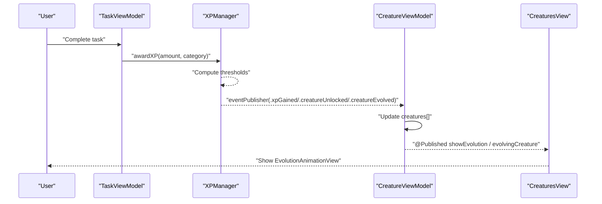
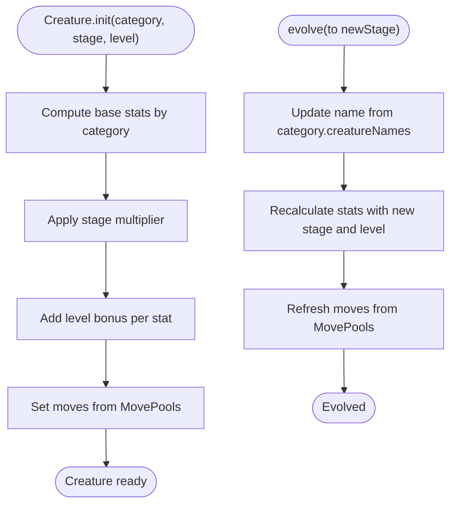
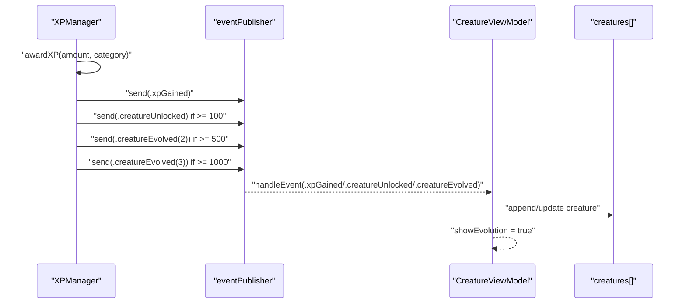
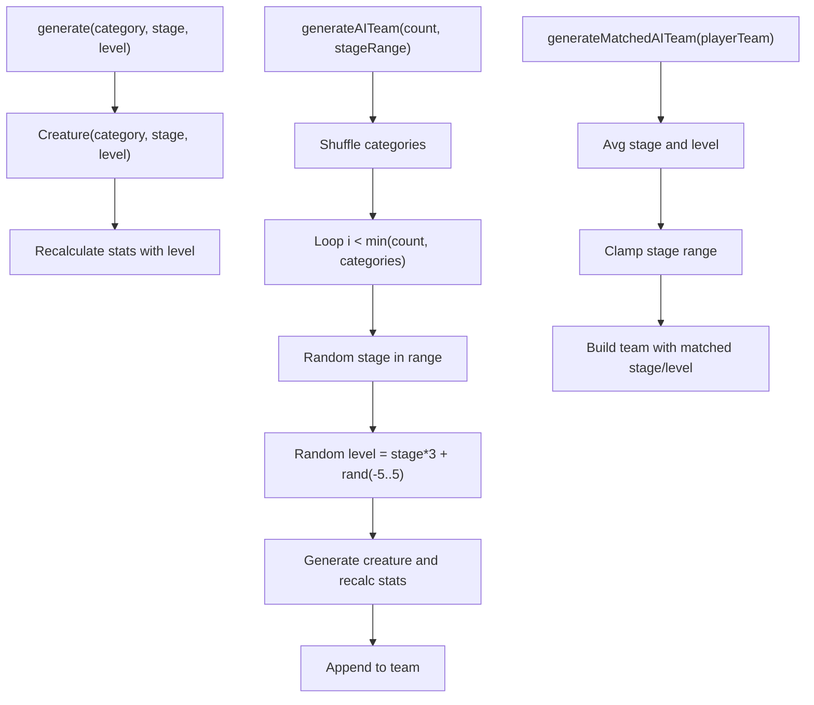
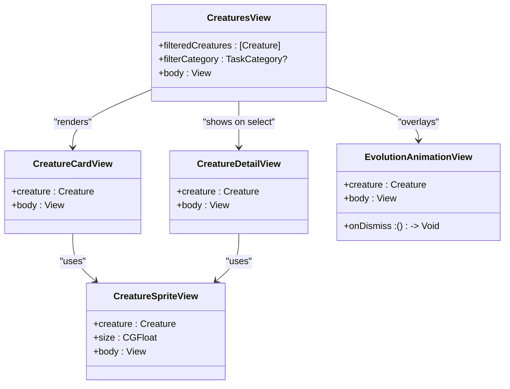
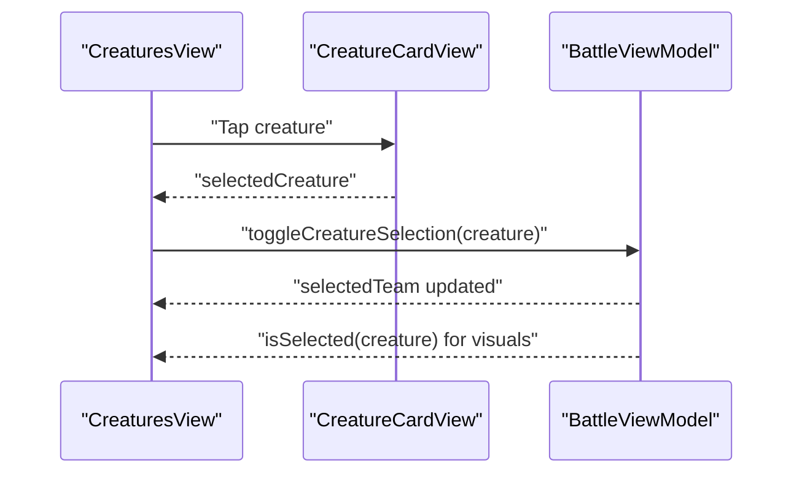
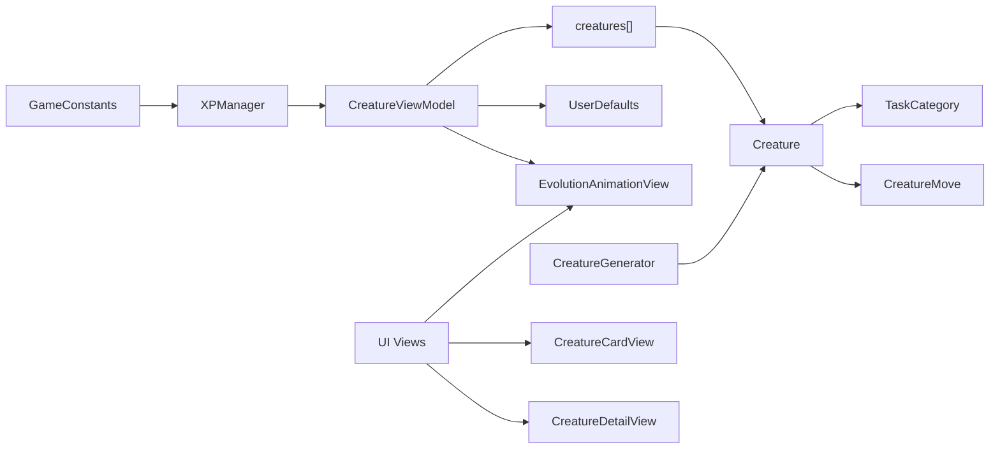

# Creature Collection System

<cite>
**Referenced Files in This Document**
- [TaskMonApp.swift](file://TaskMon/TaskMon/TaskMonApp.swift)
- [Creature.swift](file://TaskMon/TaskMon/Models/Creature.swift)
- [TaskCategory.swift](file://TaskMon/TaskMon/Models/TaskCategory.swift)
- [CreatureMove.swift](file://TaskMon/TaskMon/Models/CreatureMove.swift)
- [CreatureViewModel.swift](file://TaskMon/TaskMon/ViewModels/CreatureViewModel.swift)
- [CreatureGenerator.swift](file://TaskMon/TaskMon/Services/CreatureGenerator.swift)
- [XPManager.swift](file://TaskMon/TaskMon/Services/XPManager.swift)
- [Constants.swift](file://TaskMon/TaskMon/Utils/Constants.swift)
- [CreaturesView.swift](file://TaskMon/TaskMon/Views/Creatures/CreaturesView.swift)
- [CreatureCardView.swift](file://TaskMon/TaskMon/Views/Creatures/CreatureCardView.swift)
- [CreatureDetailView.swift](file://TaskMon/TaskMon/Views/Creatures/CreatureDetailView.swift)
- [EvolutionAnimationView.swift](file://TaskMon/TaskMon/Views/Creatures/EvolutionAnimationView.swift)
- [CreatureSpriteView.swift](file://TaskMon/TaskMon/Views/Components/CreatureSpriteView.swift)
- [BattleViewModel.swift](file://TaskMon/TaskMon/ViewModels/BattleViewModel.swift)
- [FirebaseService.swift](file://TaskMon/TaskMon/Services/FirebaseService.swift)
</cite>

## Table of Contents
1. [Introduction](#introduction)
2. [Project Structure](#project-structure)
3. [Core Components](#core-components)
4. [Architecture Overview](#architecture-overview)
5. [Detailed Component Analysis](#detailed-component-analysis)
6. [Dependency Analysis](#dependency-analysis)
7. [Performance Considerations](#performance-considerations)
8. [Troubleshooting Guide](#troubleshooting-guide)
9. [Conclusion](#conclusion)
10. [Appendices](#appendices)

## Introduction
This document describes the Creature Collection System, focusing on how XP milestones unlock creatures, how evolution works across three stages with stat scaling, how creatures are generated and persisted, and how the UI surfaces evolution progress and team composition. It also documents the ViewModels responsible for state management and the UI components that render creature cards, details, and evolution animations.

## Project Structure
The system is organized around models, services, ViewModels, and SwiftUI views. Key areas:
- Models: Creature, TaskCategory, CreatureMove
- Services: XPManager (XP tracking and events), CreatureGenerator (team generation)
- ViewModels: CreatureViewModel (collection and evolution), BattleViewModel (team selection and battles)
- Views: CreaturesView (grid), CreatureCardView (mini), CreatureDetailView (stats and evolution), EvolutionAnimationView (visuals), CreatureSpriteView (sprite rendering)
- Utilities: Constants (thresholds and game constants)

```mermaid
graph TB
subgraph "App"
App["TaskMonApp"]
end
subgraph "ViewModels"
CVm["CreatureViewModel"]
BVm["BattleViewModel"]
end
subgraph "Services"
Xp["XPManager"]
Gen["CreatureGenerator"]
end
subgraph "Models"
Cr["Creature"]
Cat["TaskCategory"]
Mov["CreatureMove"]
end
subgraph "Views"
Cv["CreaturesView"]
Ccv["CreatureCardView"]
Cd["CreatureDetailView"]
Ev["EvolutionAnimationView"]
Sp["CreatureSpriteView"]
end
App --> CVm
App --> BVm
CVm --> Xp
CVm --> Cr
BVm --> Cr
Gen --> Cr
Cr --> Cat
Cr --> Mov
Cv --> Ccv
Cv --> Cd
Cv --> Ev
Ccv --> Sp
Cd --> Sp
Ev --> Sp
```

**Diagram sources**
- [TaskMonApp.swift](file://TaskMon/TaskMon/TaskMonApp.swift#L12-L42)
- [CreatureViewModel.swift](file://TaskMon/TaskMon/ViewModels/CreatureViewModel.swift#L5-L89)
- [BattleViewModel.swift](file://TaskMon/TaskMon/ViewModels/BattleViewModel.swift#L10-L461)
- [XPManager.swift](file://TaskMon/TaskMon/Services/XPManager.swift#L10-L95)
- [CreatureGenerator.swift](file://TaskMon/TaskMon/Services/CreatureGenerator.swift#L3-L43)
- [Creature.swift](file://TaskMon/TaskMon/Models/Creature.swift#L33-L97)
- [TaskCategory.swift](file://TaskMon/TaskMon/Models/TaskCategory.swift#L4-L84)
- [CreatureMove.swift](file://TaskMon/TaskMon/Models/CreatureMove.swift#L3-L67)
- [CreaturesView.swift](file://TaskMon/TaskMon/Views/Creatures/CreaturesView.swift#L3-L139)
- [CreatureCardView.swift](file://TaskMon/TaskMon/Views/Creatures/CreatureCardView.swift#L3-L52)
- [CreatureDetailView.swift](file://TaskMon/TaskMon/Views/Creatures/CreatureDetailView.swift#L3-L159)
- [EvolutionAnimationView.swift](file://TaskMon/TaskMon/Views/Creatures/EvolutionAnimationView.swift#L3-L92)
- [CreatureSpriteView.swift](file://TaskMon/TaskMon/Views/Components/CreatureSpriteView.swift#L3-L51)

**Section sources**
- [TaskMonApp.swift](file://TaskMon/TaskMon/TaskMonApp.swift#L12-L42)
- [Creature.swift](file://TaskMon/TaskMon/Models/Creature.swift#L33-L97)
- [TaskCategory.swift](file://TaskMon/TaskMon/Models/TaskCategory.swift#L4-L84)
- [CreatureMove.swift](file://TaskMon/TaskMon/Models/CreatureMove.swift#L3-L67)
- [CreatureViewModel.swift](file://TaskMon/TaskMon/ViewModels/CreatureViewModel.swift#L5-L89)
- [CreatureGenerator.swift](file://TaskMon/TaskMon/Services/CreatureGenerator.swift#L3-L43)
- [XPManager.swift](file://TaskMon/TaskMon/Services/XPManager.swift#L10-L95)
- [Constants.swift](file://TaskMon/TaskMon/Utils/Constants.swift#L4-L24)
- [CreaturesView.swift](file://TaskMon/TaskMon/Views/Creatures/CreaturesView.swift#L3-L139)
- [CreatureCardView.swift](file://TaskMon/TaskMon/Views/Creatures/CreatureCardView.swift#L3-L52)
- [CreatureDetailView.swift](file://TaskMon/TaskMon/Views/Creatures/CreatureDetailView.swift#L3-L159)
- [EvolutionAnimationView.swift](file://TaskMon/TaskMon/Views/Creatures/EvolutionAnimationView.swift#L3-L92)
- [CreatureSpriteView.swift](file://TaskMon/TaskMon/Views/Components/CreatureSpriteView.swift#L3-L51)
- [BattleViewModel.swift](file://TaskMon/TaskMon/ViewModels/BattleViewModel.swift#L10-L461)
- [FirebaseService.swift](file://TaskMon/TaskMon/Services/FirebaseService.swift#L3-L156)

## Core Components
- Creature model encapsulates identity, name, category, evolution stage, level, XP, stats, moves, and helpers for evolution progress and sprite naming.
- TaskCategory defines creature naming, icons, colors, and type effectiveness.
- CreatureMove defines moves with power and type, and MovePools provides category-specific move pools.
- XPManager tracks per-category XP, emits XPEvent notifications, and computes thresholds for unlocks and evolutions.
- CreatureViewModel manages the creature collection, subscribes to XP events, persists data, and coordinates evolution UI.
- CreatureGenerator creates starter creatures and AI teams with randomized levels and recalculated stats.
- Constants define XP thresholds and gameplay limits.
- UI components render collections, details, and evolution animations; sprites fall back gracefully if assets are missing.

**Section sources**
- [Creature.swift](file://TaskMon/TaskMon/Models/Creature.swift#L33-L97)
- [TaskCategory.swift](file://TaskMon/TaskMon/Models/TaskCategory.swift#L4-L84)
- [CreatureMove.swift](file://TaskMon/TaskMon/Models/CreatureMove.swift#L3-L67)
- [XPManager.swift](file://TaskMon/TaskMon/Services/XPManager.swift#L10-L95)
- [CreatureViewModel.swift](file://TaskMon/TaskMon/ViewModels/CreatureViewModel.swift#L5-L89)
- [CreatureGenerator.swift](file://TaskMon/TaskMon/Services/CreatureGenerator.swift#L3-L43)
- [Constants.swift](file://TaskMon/TaskMon/Utils/Constants.swift#L4-L24)
- [CreatureSpriteView.swift](file://TaskMon/TaskMon/Views/Components/CreatureSpriteView.swift#L3-L51)

## Architecture Overview
The system follows MVVM with reactive events:
- XPManager publishes XPEvent when XP crosses thresholds.
- CreatureViewModel subscribes to XPManager and updates the in-memory collection, triggering evolution UI overlays.
- UI views bind to published properties and react to state changes.



**Diagram sources**
- [XPManager.swift](file://TaskMon/TaskMon/Services/XPManager.swift#L22-L50)
- [CreatureViewModel.swift](file://TaskMon/TaskMon/ViewModels/CreatureViewModel.swift#L24-L63)
- [CreaturesView.swift](file://TaskMon/TaskMon/Views/Creatures/CreaturesView.swift#L55-L67)

## Detailed Component Analysis

### Creature Model and Evolution Mechanics
- Evolution thresholds: Stage 1 unlock at 100 XP, evolve to Stage 2 at 500 XP, evolve to Stage 3 at 1000 XP.
- Stat scaling: stage multiplier increases per stage (Stage 1: ×1.0, Stage 2: ×1.5, Stage 3: ×2.0); level contributes a bonus per stat.
- Base stats vary by category; evolution updates name, stats, and moves pool.



**Diagram sources**
- [Creature.swift](file://TaskMon/TaskMon/Models/Creature.swift#L66-L86)
- [Creature.swift](file://TaskMon/TaskMon/Models/Creature.swift#L10-L30)
- [TaskCategory.swift](file://TaskMon/TaskMon/Models/TaskCategory.swift#L53-L61)
- [CreatureMove.swift](file://TaskMon/TaskMon/Models/CreatureMove.swift#L21-L26)

**Section sources**
- [Creature.swift](file://TaskMon/TaskMon/Models/Creature.swift#L33-L97)
- [TaskCategory.swift](file://TaskMon/TaskMon/Models/TaskCategory.swift#L43-L61)
- [CreatureMove.swift](file://TaskMon/TaskMon/Models/CreatureMove.swift#L21-L26)

### XP Unlocking and Evolution Triggers
- XPManager maintains per-category XP and emits XPEvent when thresholds are crossed.
- Thresholds: 100 XP unlocks Stage 1 creature; 500 XP evolves to Stage 2; 1000 XP evolves to Stage 3.
- CreatureViewModel reacts to events to unlock, evolve, and update XP.



**Diagram sources**
- [XPManager.swift](file://TaskMon/TaskMon/Services/XPManager.swift#L22-L50)
- [CreatureViewModel.swift](file://TaskMon/TaskMon/ViewModels/CreatureViewModel.swift#L33-L63)
- [Constants.swift](file://TaskMon/TaskMon/Utils/Constants.swift#L10-L13)

**Section sources**
- [XPManager.swift](file://TaskMon/TaskMon/Services/XPManager.swift#L10-L95)
- [CreatureViewModel.swift](file://TaskMon/TaskMon/ViewModels/CreatureViewModel.swift#L24-L63)
- [Constants.swift](file://TaskMon/TaskMon/Utils/Constants.swift#L10-L13)

### Creature Generation and Team Composition
- CreatureGenerator generates a creature for a category and stage, optionally recalculates stats for a given level.
- AI team generation selects shuffled categories, random stages, and levels, then recalculates stats.
- Matched AI team balances stage and level around the player’s average.



**Diagram sources**
- [CreatureGenerator.swift](file://TaskMon/TaskMon/Services/CreatureGenerator.swift#L5-L42)

**Section sources**
- [CreatureGenerator.swift](file://TaskMon/TaskMon/Services/CreatureGenerator.swift#L3-L43)

### Creature Management UI
- CreaturesView displays a grid of CreatureCardView with filtering by category and opens CreatureDetailView on tap.
- CreatureCardView shows sprite, name, category badge, stage stars, and mini stats.
- CreatureDetailView shows hero sprite, name/type, stats bars, evolution progress, and moves.
- EvolutionAnimationView plays a flash and sparkle sequence when a creature evolves or is newly unlocked.



**Diagram sources**
- [CreaturesView.swift](file://TaskMon/TaskMon/Views/Creatures/CreaturesView.swift#L3-L139)
- [CreatureCardView.swift](file://TaskMon/TaskMon/Views/Creatures/CreatureCardView.swift#L3-L52)
- [CreatureDetailView.swift](file://TaskMon/TaskMon/Views/Creatures/CreatureDetailView.swift#L3-L159)
- [EvolutionAnimationView.swift](file://TaskMon/TaskMon/Views/Creatures/EvolutionAnimationView.swift#L3-L92)
- [CreatureSpriteView.swift](file://TaskMon/TaskMon/Views/Components/CreatureSpriteView.swift#L3-L51)

**Section sources**
- [CreaturesView.swift](file://TaskMon/TaskMon/Views/Creatures/CreaturesView.swift#L3-L139)
- [CreatureCardView.swift](file://TaskMon/TaskMon/Views/Creatures/CreatureCardView.swift#L3-L52)
- [CreatureDetailView.swift](file://TaskMon/TaskMon/Views/Creatures/CreatureDetailView.swift#L3-L159)
- [EvolutionAnimationView.swift](file://TaskMon/TaskMon/Views/Creatures/EvolutionAnimationView.swift#L3-L92)
- [CreatureSpriteView.swift](file://TaskMon/TaskMon/Views/Components/CreatureSpriteView.swift#L3-L51)

### Team Selection and Battle Integration
- BattleViewModel supports selecting up to three creatures for battle, toggling selection, and resolving turns.
- Team selection integrates with CreaturesView via CreatureCardView taps and BattleViewModel’s selection logic.



**Diagram sources**
- [CreaturesView.swift](file://TaskMon/TaskMon/Views/Creatures/CreaturesView.swift#L35-L41)
- [BattleViewModel.swift](file://TaskMon/TaskMon/ViewModels/BattleViewModel.swift#L52-L62)

**Section sources**
- [BattleViewModel.swift](file://TaskMon/TaskMon/ViewModels/BattleViewModel.swift#L50-L82)
- [CreaturesView.swift](file://TaskMon/TaskMon/Views/Creatures/CreaturesView.swift#L35-L41)

## Dependency Analysis
- CreatureViewModel depends on XPManager for events and UserDefaults for persistence.
- Creature depends on TaskCategory for naming and sprite naming, and on CreatureMove for moves.
- CreatureGenerator depends on TaskCategory and CreatureStats for stat recalculation.
- XPManager depends on GameConstants for thresholds and publishes XPEvent.
- UI components depend on models and each other for navigation and overlays.



**Diagram sources**
- [CreatureViewModel.swift](file://TaskMon/TaskMon/ViewModels/CreatureViewModel.swift#L12-L88)
- [XPManager.swift](file://TaskMon/TaskMon/Services/XPManager.swift#L13-L50)
- [Creature.swift](file://TaskMon/TaskMon/Models/Creature.swift#L33-L97)
- [TaskCategory.swift](file://TaskMon/TaskMon/Models/TaskCategory.swift#L4-L84)
- [CreatureMove.swift](file://TaskMon/TaskMon/Models/CreatureMove.swift#L3-L67)
- [CreatureGenerator.swift](file://TaskMon/TaskMon/Services/CreatureGenerator.swift#L3-L43)
- [Constants.swift](file://TaskMon/TaskMon/Utils/Constants.swift#L4-L24)
- [CreaturesView.swift](file://TaskMon/TaskMon/Views/Creatures/CreaturesView.swift#L3-L139)

**Section sources**
- [CreatureViewModel.swift](file://TaskMon/TaskMon/ViewModels/CreatureViewModel.swift#L11-L88)
- [XPManager.swift](file://TaskMon/TaskMon/Services/XPManager.swift#L13-L50)
- [Creature.swift](file://TaskMon/TaskMon/Models/Creature.swift#L33-L97)
- [TaskCategory.swift](file://TaskMon/TaskMon/Models/TaskCategory.swift#L4-L84)
- [CreatureMove.swift](file://TaskMon/TaskMon/Models/CreatureMove.swift#L3-L67)
- [CreatureGenerator.swift](file://TaskMon/TaskMon/Services/CreatureGenerator.swift#L3-L43)
- [Constants.swift](file://TaskMon/TaskMon/Utils/Constants.swift#L4-L24)
- [CreaturesView.swift](file://TaskMon/TaskMon/Views/Creatures/CreaturesView.swift#L3-L139)

## Performance Considerations
- Stats recalculation is O(1) per stat; repeated recalculation during AI team generation is acceptable given small team sizes.
- Filtering and grid rendering are efficient with LazyVGrid and minimal recomputation.
- Animations use lightweight SwiftUI transitions; avoid heavy images for sprites to maintain crispness.
- Persistence uses UserDefaults; consider migration to CloudKit or Firebase for scalability.

## Troubleshooting Guide
- No creatures appear: Verify XPManager thresholds and that XP events are emitted and handled by CreatureViewModel.
- Evolution not triggering: Confirm XP crosses thresholds and that CreatureViewModel updates evolvingCreature and showEvolution.
- Sprites missing: FallbackCreatureView renders category-appropriate icons when asset images are absent.
- Team selection issues: Ensure BattleViewModel’s selectedTeam length does not exceed GameConstants.maxTeamSize.

**Section sources**
- [CreatureViewModel.swift](file://TaskMon/TaskMon/ViewModels/CreatureViewModel.swift#L78-L88)
- [XPManager.swift](file://TaskMon/TaskMon/Services/XPManager.swift#L79-L94)
- [EvolutionAnimationView.swift](file://TaskMon/TaskMon/Views/Creatures/EvolutionAnimationView.swift#L14-L22)
- [BattleViewModel.swift](file://TaskMon/TaskMon/ViewModels/BattleViewModel.swift#L50-L62)
- [Constants.swift](file://TaskMon/TaskMon/Utils/Constants.swift#L15-L17)

## Conclusion
The Creature Collection System cleanly separates XP tracking, creature modeling, and UI presentation. XP milestones unlock creatures and drive evolution, while stat scaling and move pools provide meaningful progression. The UI offers intuitive collection browsing, detailed views, and animated evolution feedback. Team selection integrates seamlessly with battle workflows.

## Appendices

### Implementation Details and Examples
- Unlocking a new creature at 100 XP:
  - See XPManager thresholds and event emission.
  - See CreatureViewModel handling .creatureUnlocked and appending a Stage 1 creature.
  - Reference: [XPManager.swift](file://TaskMon/TaskMon/Services/XPManager.swift#L32-L43), [CreatureViewModel.swift](file://TaskMon/TaskMon/ViewModels/CreatureViewModel.swift#L33-L44)

- Evolving a creature:
  - Stage 1 → Stage 2 at 500 XP; Stage 2 → Stage 3 at 1000 XP.
  - Creature.evolve(to:) updates name, stats, and moves.
  - Reference: [XPManager.swift](file://TaskMon/TaskMon/Services/XPManager.swift#L32-L35), [Creature.swift](file://TaskMon/TaskMon/Models/Creature.swift#L80-L86)

- Stat calculation formula:
  - Stage multiplier: Stage 1=1.0, Stage 2=1.5, Stage 3=2.0.
  - Level bonus: level × 2 per stat.
  - Base stats differ by category.
  - Reference: [Creature.swift](file://TaskMon/TaskMon/Models/Creature.swift#L10-L30), [TaskCategory.swift](file://TaskMon/TaskMon/Models/TaskCategory.swift#L14-L21)

- Creature generation patterns:
  - Random AI team with varied stages and levels.
  - Matched AI team aligned to player team averages.
  - Reference: [CreatureGenerator.swift](file://TaskMon/TaskMon/Services/CreatureGenerator.swift#L9-L42)

- Team management workflow:
  - Toggle selection in BattleViewModel and enforce max team size.
  - Reference: [BattleViewModel.swift](file://TaskMon/TaskMon/ViewModels/BattleViewModel.swift#L52-L62)

- Persistence:
  - Creatures and XP saved to UserDefaults; stub Firebase service included for cloud migration.
  - Reference: [CreatureViewModel.swift](file://TaskMon/TaskMon/ViewModels/CreatureViewModel.swift#L78-L88), [XPManager.swift](file://TaskMon/TaskMon/Services/XPManager.swift#L79-L94), [FirebaseService.swift](file://TaskMon/TaskMon/Services/FirebaseService.swift#L78-L112)