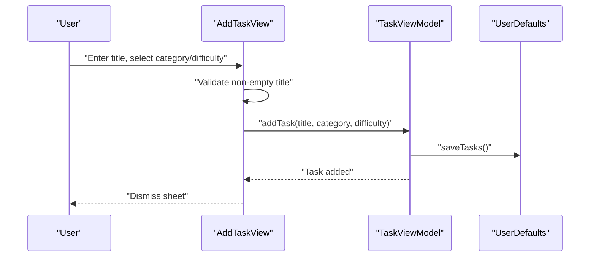
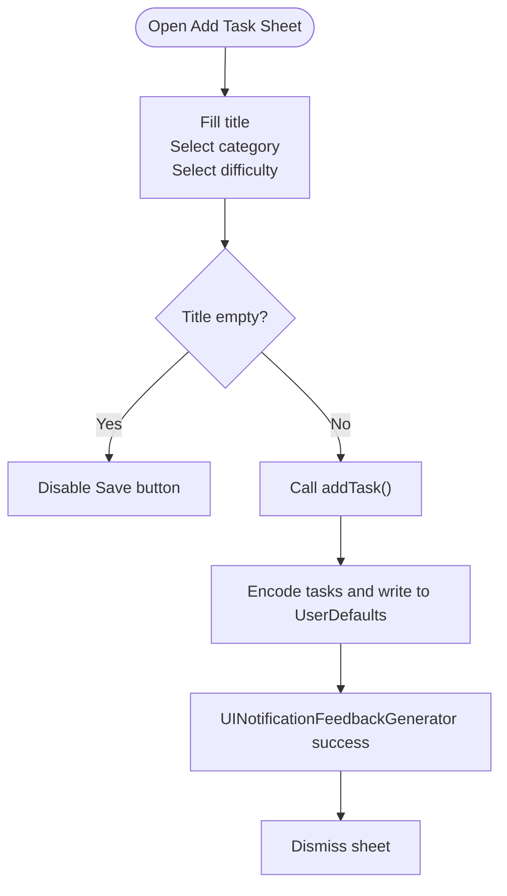
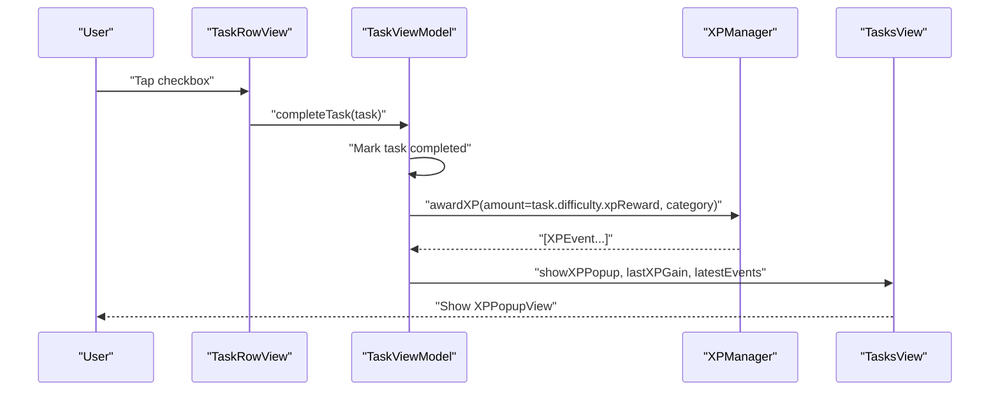
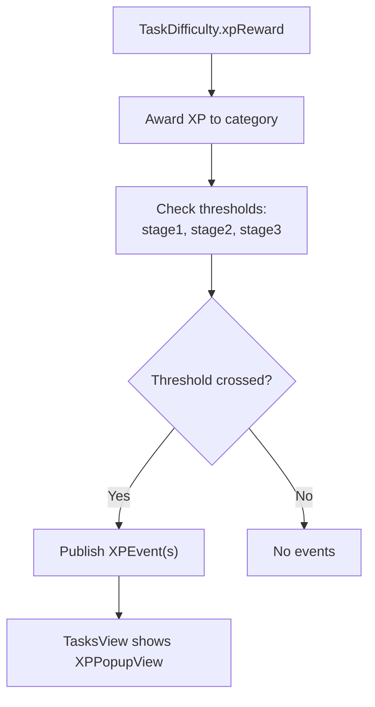
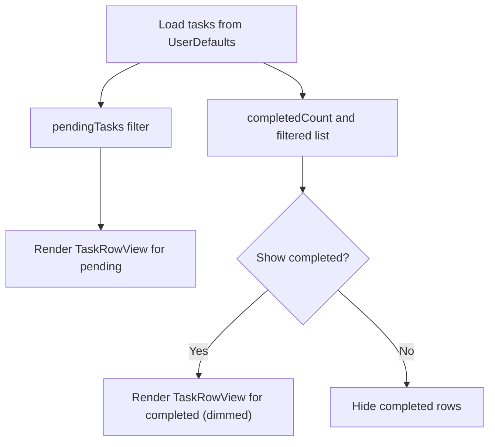
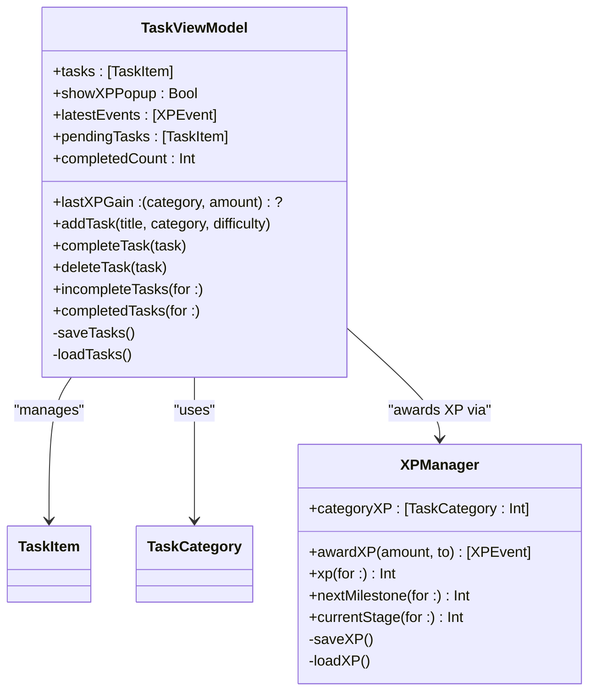
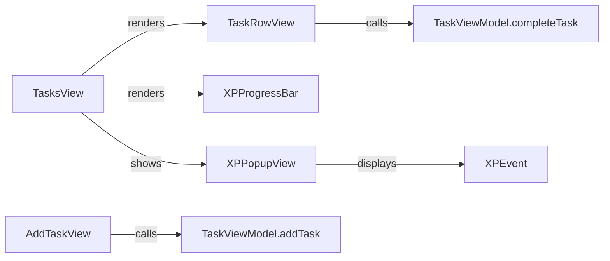
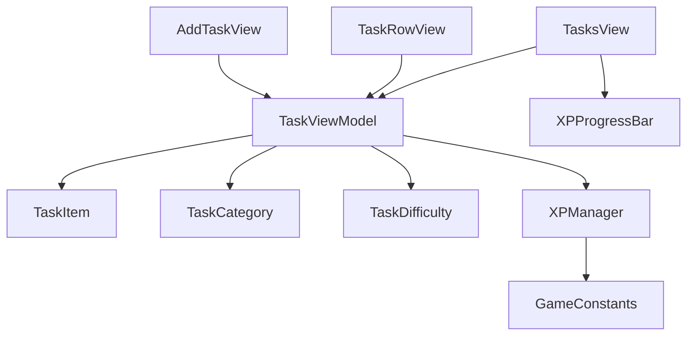

# Task Management System

<cite>
**Referenced Files in This Document**
- [TaskItem.swift](file://TaskMon/TaskMon/Models/TaskItem.swift)
- [TaskCategory.swift](file://TaskMon/TaskMon/Models/TaskCategory.swift)
- [TaskViewModel.swift](file://TaskMon/TaskMon/ViewModels/TaskViewModel.swift)
- [AddTaskView.swift](file://TaskMon/TaskMon/Views/Tasks/AddTaskView.swift)
- [TasksView.swift](file://TaskMon/TaskMon/Views/Tasks/TasksView.swift)
- [TaskRowView.swift](file://TaskMon/TaskMon/Views/Tasks/TaskRowView.swift)
- [XPManager.swift](file://TaskMon/TaskMon/Services/XPManager.swift)
- [Constants.swift](file://TaskMon/TaskMon/Utils/Constants.swift)
- [HPBar.swift](file://TaskMon/TaskMon/Views/Components/HPBar.swift)
- [PixelButton.swift](file://TaskMon/TaskMon/Views/Components/PixelButton.swift)
- [TaskMonApp.swift](file://TaskMon/TaskMon/TaskMonApp.swift)
</cite>

## Table of Contents
1. [Introduction](#introduction)
2. [Project Structure](#project-structure)
3. [Core Components](#core-components)
4. [Architecture Overview](#architecture-overview)
5. [Detailed Component Analysis](#detailed-component-analysis)
6. [Dependency Analysis](#dependency-analysis)
7. [Performance Considerations](#performance-considerations)
8. [Troubleshooting Guide](#troubleshooting-guide)
9. [Conclusion](#conclusion)
10. [Appendices](#appendices)

## Introduction
This document describes the Task Management System within the TaskMon application. It covers the end-to-end task lifecycle: creation, validation, categorization, difficulty assignment, persistence, completion tracking, XP awarding, and progress visualization. It also documents the ViewModels responsible for state management, the UI components used to render tasks and collect input, and the underlying data models and services that power the system.

## Project Structure
The Task Management System is organized around SwiftUI views, Combine-based ViewModels, and service-layer models. Key areas:
- Models: TaskItem, TaskCategory, and XP-related enums/services
- ViewModels: TaskViewModel orchestrating tasks and XP events
- Views: Task list, add/edit forms, and row rendering
- Services: XPManager for XP accounting and milestones
- Utilities: Game constants and pixel-style UI helpers

```mermaid
graph TD
subgraph "App"
App["TaskMonApp"]
end
subgraph "ViewModels"
TVM["TaskViewModel"]
CVM["CreatureViewModel"]
BVM["BattleViewModel"]
end
subgraph "Views"
TasksView["TasksView"]
AddTaskView["AddTaskView"]
TaskRowView["TaskRowView"]
XPBar["XPProgressBar"]
end
subgraph "Models"
TaskItem["TaskItem"]
TaskCategory["TaskCategory"]
XPManager["XPManager"]
Constants["GameConstants"]
end
App --> TasksView
TasksView --> TVM
AddTaskView --> TVM
TaskRowView --> TVM
TasksView --> XPBar
TVM --> TaskItem
TVM --> TaskCategory
TVM --> XPManager
XPManager --> Constants
```

**Diagram sources**
- [TaskMonApp.swift](file://TaskMon/TaskMon/TaskMonApp.swift#L12-L32)
- [TaskViewModel.swift](file://TaskMon/TaskMon/ViewModels/TaskViewModel.swift#L5-L75)
- [TasksView.swift](file://TaskMon/TaskMon/Views/Tasks/TasksView.swift#L3-L135)
- [AddTaskView.swift](file://TaskMon/TaskMon/Views/Tasks/AddTaskView.swift#L3-L147)
- [TaskRowView.swift](file://TaskMon/TaskMon/Views/Tasks/TaskRowView.swift#L3-L72)
- [TaskItem.swift](file://TaskMon/TaskMon/Models/TaskItem.swift#L27-L43)
- [TaskCategory.swift](file://TaskMon/TaskMon/Models/TaskCategory.swift#L4-L84)
- [XPManager.swift](file://TaskMon/TaskMon/Services/XPManager.swift#L10-L95)
- [Constants.swift](file://TaskMon/TaskMon/Utils/Constants.swift#L4-L24)

**Section sources**
- [TaskMonApp.swift](file://TaskMon/TaskMon/TaskMonApp.swift#L12-L32)

## Core Components
- TaskItem: Immutable task entity with identity, title, category, difficulty, completion state, and creation timestamp.
- TaskCategory: Enumerates five categories with display names, icons, colors, creature naming, and type-effectiveness mappings.
- TaskDifficulty: Enumerates difficulty levels with XP rewards.
- TaskViewModel: Orchestrates task CRUD, completion tracking, XP popup state, and persistence via UserDefaults.
- XPManager: Central XP accounting with thresholds for creature evolution unlocks and milestones, publishing XP events.
- GameConstants: Defines XP rewards and evolution thresholds.
- UI Components: TasksView renders lists and XP progress; AddTaskView collects inputs and validates; TaskRowView renders rows with completion and swipe-to-delete; XPProgressBar visualizes category XP; TypeBadge displays category metadata.

**Section sources**
- [TaskItem.swift](file://TaskMon/TaskMon/Models/TaskItem.swift#L27-L43)
- [TaskCategory.swift](file://TaskMon/TaskMon/Models/TaskCategory.swift#L4-L84)
- [TaskViewModel.swift](file://TaskMon/TaskMon/ViewModels/TaskViewModel.swift#L5-L75)
- [XPManager.swift](file://TaskMon/TaskMon/Services/XPManager.swift#L10-L95)
- [Constants.swift](file://TaskMon/TaskMon/Utils/Constants.swift#L4-L24)
- [TasksView.swift](file://TaskMon/TaskMon/Views/Tasks/TasksView.swift#L65-L135)
- [AddTaskView.swift](file://TaskMon/TaskMon/Views/Tasks/AddTaskView.swift#L132-L138)
- [TaskRowView.swift](file://TaskMon/TaskMon/Views/Tasks/TaskRowView.swift#L11-L18)
- [HPBar.swift](file://TaskMon/TaskMon/Views/Components/HPBar.swift#L50-L88)

## Architecture Overview
The system follows MVVM with SwiftUI reactive updates:
- Views observe ViewModel state (@Published properties).
- TaskViewModel coordinates task operations and persists to UserDefaults.
- XPManager manages XP totals per category and emits events for UI reactions.
- UI components bind to ViewModel-provided computed properties and actions.



**Diagram sources**
- [AddTaskView.swift](file://TaskMon/TaskMon/Views/Tasks/AddTaskView.swift#L132-L138)
- [TaskViewModel.swift](file://TaskMon/TaskMon/ViewModels/TaskViewModel.swift#L20-L24)
- [TaskViewModel.swift](file://TaskMon/TaskMon/ViewModels/TaskViewModel.swift#L64-L68)

## Detailed Component Analysis

### Task Creation Workflow
- Inputs: title, category, difficulty.
- Validation: title must be non-empty after trimming.
- Persistence: TaskViewModel saves tasks immediately after insertion.
- UI Feedback: Success feedback generator on save.



**Diagram sources**
- [AddTaskView.swift](file://TaskMon/TaskMon/Views/Tasks/AddTaskView.swift#L132-L138)
- [TaskViewModel.swift](file://TaskMon/TaskMon/ViewModels/TaskViewModel.swift#L20-L24)
- [TaskViewModel.swift](file://TaskMon/TaskMon/ViewModels/TaskViewModel.swift#L64-L68)

**Section sources**
- [AddTaskView.swift](file://TaskMon/TaskMon/Views/Tasks/AddTaskView.swift#L132-L138)
- [TaskViewModel.swift](file://TaskMon/TaskMon/ViewModels/TaskViewModel.swift#L20-L24)
- [TaskViewModel.swift](file://TaskMon/TaskMon/ViewModels/TaskViewModel.swift#L64-L68)

### Task Completion Tracking and XP Awarding
- Completion triggers: tapping the row’s checkbox.
- Guard clauses prevent re-completing or completing already-completed tasks.
- XP awarding: TaskViewModel delegates to XPManager, which computes thresholds and publishes XP events.
- UI reaction: TasksView overlays an XP popup displaying XP gained and any evolution/unlock events.



**Diagram sources**
- [TaskRowView.swift](file://TaskMon/TaskMon/Views/Tasks/TaskRowView.swift#L11-L18)
- [TaskViewModel.swift](file://TaskMon/TaskMon/ViewModels/TaskViewModel.swift#L26-L39)
- [XPManager.swift](file://TaskMon/TaskMon/Services/XPManager.swift#L22-L50)
- [TasksView.swift](file://TaskMon/TaskMon/Views/Tasks/TasksView.swift#L53-L61)

**Section sources**
- [TaskRowView.swift](file://TaskMon/TaskMon/Views/Tasks/TaskRowView.swift#L11-L18)
- [TaskViewModel.swift](file://TaskMon/TaskMon/ViewModels/TaskViewModel.swift#L26-L39)
- [XPManager.swift](file://TaskMon/TaskMon/Services/XPManager.swift#L22-L50)
- [TasksView.swift](file://TaskMon/TaskMon/Views/Tasks/TasksView.swift#L53-L61)

### Difficulty-Based XP Reward Calculation
- TaskDifficulty defines XP rewards per level.
- XPManager stores per-category XP totals and checks thresholds to trigger evolution/unlock events.
- XPProgressBar visualizes progress toward the next milestone.



**Diagram sources**
- [TaskItem.swift](file://TaskMon/TaskMon/Models/TaskItem.swift#L18-L24)
- [XPManager.swift](file://TaskMon/TaskMon/Services/XPManager.swift#L22-L50)
- [Constants.swift](file://TaskMon/TaskMon/Utils/Constants.swift#L10-L13)
- [TasksView.swift](file://TaskMon/TaskMon/Views/Tasks/TasksView.swift#L139-L194)

**Section sources**
- [TaskItem.swift](file://TaskMon/TaskMon/Models/TaskItem.swift#L18-L24)
- [XPManager.swift](file://TaskMon/TaskMon/Services/XPManager.swift#L22-L50)
- [Constants.swift](file://TaskMon/TaskMon/Utils/Constants.swift#L10-L13)
- [TasksView.swift](file://TaskMon/TaskMon/Views/Tasks/TasksView.swift#L139-L194)

### Filtering and Organization Features
- Pending vs completed: TaskViewModel exposes computed filters and counts.
- Completed tasks visibility: TasksView conditionally renders completed tasks behind a toggle.
- Category XP visualization: TasksView renders XPProgressBar for each category.



**Diagram sources**
- [TaskViewModel.swift](file://TaskMon/TaskMon/ViewModels/TaskViewModel.swift#L46-L60)
- [TasksView.swift](file://TaskMon/TaskMon/Views/Tasks/TasksView.swift#L106-L133)

**Section sources**
- [TaskViewModel.swift](file://TaskMon/TaskMon/ViewModels/TaskViewModel.swift#L46-L60)
- [TasksView.swift](file://TaskMon/TaskMon/Views/Tasks/TasksView.swift#L106-L133)

### ViewModels and State Management
- TaskViewModel:
  - Manages tasks array and @Published flags for XP popup and recent events.
  - Provides addTask, completeTask, deleteTask, and convenience filters.
  - Persists to UserDefaults under a dedicated key.
- XPManager:
  - Maintains category XP totals and publishes XPEvent updates.
  - Computes next milestone and current stage per category.



**Diagram sources**
- [TaskViewModel.swift](file://TaskMon/TaskMon/ViewModels/TaskViewModel.swift#L5-L75)
- [XPManager.swift](file://TaskMon/TaskMon/Services/XPManager.swift#L10-L95)
- [TaskItem.swift](file://TaskMon/TaskMon/Models/TaskItem.swift#L27-L43)
- [TaskCategory.swift](file://TaskMon/TaskMon/Models/TaskCategory.swift#L4-L84)

**Section sources**
- [TaskViewModel.swift](file://TaskMon/TaskMon/ViewModels/TaskViewModel.swift#L5-L75)
- [XPManager.swift](file://TaskMon/TaskMon/Services/XPManager.swift#L10-L95)

### UI Components
- TasksView: Renders XP progress bars, pending tasks, optional completed tasks, and the XP popup overlay.
- AddTaskView: Collects title, category, and difficulty; validates input; saves task; provides preview.
- TaskRowView: Displays task info, difficulty badge, XP reward hint, completion checkbox, and swipe-to-delete.
- XPProgressBar: Visualizes category XP progress towards the next milestone.
- TypeBadge: Displays category icon and name.
- PixelButton and PixelCard: Consistent UI primitives for buttons and cards.



**Diagram sources**
- [TasksView.swift](file://TaskMon/TaskMon/Views/Tasks/TasksView.swift#L65-L135)
- [AddTaskView.swift](file://TaskMon/TaskMon/Views/Tasks/AddTaskView.swift#L132-L138)
- [TaskRowView.swift](file://TaskMon/TaskMon/Views/Tasks/TaskRowView.swift#L11-L18)
- [HPBar.swift](file://TaskMon/TaskMon/Views/Components/HPBar.swift#L50-L88)

**Section sources**
- [TasksView.swift](file://TaskMon/TaskMon/Views/Tasks/TasksView.swift#L65-L135)
- [AddTaskView.swift](file://TaskMon/TaskMon/Views/Tasks/AddTaskView.swift#L132-L138)
- [TaskRowView.swift](file://TaskMon/TaskMon/Views/Tasks/TaskRowView.swift#L11-L18)
- [HPBar.swift](file://TaskMon/TaskMon/Views/Components/HPBar.swift#L50-L88)

## Dependency Analysis
- TaskViewModel depends on TaskItem, TaskCategory, TaskDifficulty, and XPManager.
- XPManager depends on TaskCategory and GameConstants.
- Views depend on ViewModels and UI primitives.
- Persistence is centralized in UserDefaults via encode/decode patterns.



**Diagram sources**
- [TaskViewModel.swift](file://TaskMon/TaskMon/ViewModels/TaskViewModel.swift#L5-L75)
- [TaskItem.swift](file://TaskMon/TaskMon/Models/TaskItem.swift#L27-L43)
- [TaskCategory.swift](file://TaskMon/TaskMon/Models/TaskCategory.swift#L4-L84)
- [TaskViewModel.swift](file://TaskMon/TaskMon/ViewModels/TaskViewModel.swift#L11-L11)
- [XPManager.swift](file://TaskMon/TaskMon/Services/XPManager.swift#L10-L95)
- [Constants.swift](file://TaskMon/TaskMon/Utils/Constants.swift#L4-L24)
- [AddTaskView.swift](file://TaskMon/TaskMon/Views/Tasks/AddTaskView.swift#L3-L147)
- [TaskRowView.swift](file://TaskMon/TaskMon/Views/Tasks/TaskRowView.swift#L3-L72)
- [TasksView.swift](file://TaskMon/TaskMon/Views/Tasks/TasksView.swift#L3-L135)
- [HPBar.swift](file://TaskMon/TaskMon/Views/Components/HPBar.swift#L50-L88)

**Section sources**
- [TaskViewModel.swift](file://TaskMon/TaskMon/ViewModels/TaskViewModel.swift#L5-L75)
- [XPManager.swift](file://TaskMon/TaskMon/Services/XPManager.swift#L10-L95)
- [Constants.swift](file://TaskMon/TaskMon/Utils/Constants.swift#L4-L24)

## Performance Considerations
- Reactive updates: @Published properties trigger SwiftUI redraws; keep payload minimal and avoid unnecessary recomputation.
- Persistence: JSON encoding/decoding occurs on main thread; consider offloading to a background queue if task lists grow large.
- Animations: Spring animations and progress bar updates are lightweight but avoid excessive concurrent animations.
- Filtering: Computed properties are efficient; ensure filters are not recalculated unnecessarily by grouping UI updates.

## Troubleshooting Guide
- Task not saving: Verify UserDefaults key and JSON encoding/decoding paths.
- XP not updating: Confirm XPManager thresholds and event publishing; check TasksView overlay binding.
- Duplicate XP popup: Ensure TaskViewModel resets showXPPopup after dismissal.
- Stale data after reset: Clear UserDefaults keys for tasks and categoryXP.

Common checks:
- Persistence keys and decode expectations in TaskViewModel and XPManager.
- XP thresholds and milestone computation in XPManager.
- UI bindings for lastXPGain and latestEvents in TasksView.

**Section sources**
- [TaskViewModel.swift](file://TaskMon/TaskMon/ViewModels/TaskViewModel.swift#L64-L74)
- [XPManager.swift](file://TaskMon/TaskMon/Services/XPManager.swift#L79-L94)
- [TasksView.swift](file://TaskMon/TaskMon/Views/Tasks/TasksView.swift#L53-L61)

## Conclusion
The Task Management System integrates SwiftUI, Combine, and UserDefaults to deliver a reactive, persistent task workflow. Users can create tasks with validation, categorize and grade them, track completion with XP rewards, and visualize progress per category. The modular design separates concerns across models, ViewModels, services, and views, enabling maintainability and extensibility.

## Appendices

### Example Workflows (by file reference)
- Create a task:
  - [AddTaskView.saveTask](file://TaskMon/TaskMon/Views/Tasks/AddTaskView.swift#L132-L138)
  - [TaskViewModel.addTask](file://TaskMon/TaskMon/ViewModels/TaskViewModel.swift#L20-L24)
  - [TaskViewModel.saveTasks](file://TaskMon/TaskMon/ViewModels/TaskViewModel.swift#L64-L68)
- Complete a task and receive XP:
  - [TaskRowView.checkbox action](file://TaskMon/TaskMon/Views/Tasks/TaskRowView.swift#L11-L18)
  - [TaskViewModel.completeTask](file://TaskMon/TaskMon/ViewModels/TaskViewModel.swift#L26-L39)
  - [XPManager.awardXP](file://TaskMon/TaskMon/Services/XPManager.swift#L22-L50)
  - [TasksView.XPPopupView](file://TaskMon/TaskMon/Views/Tasks/TasksView.swift#L139-L194)
- Filter and organize tasks:
  - [TaskViewModel.pendingTasks/completedCount](file://TaskMon/TaskMon/ViewModels/TaskViewModel.swift#L54-L60)
  - [TasksView.completedSection](file://TaskMon/TaskMon/Views/Tasks/TasksView.swift#L113-L134)