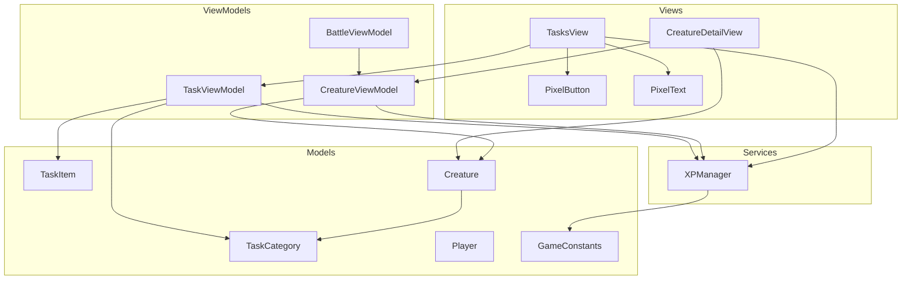
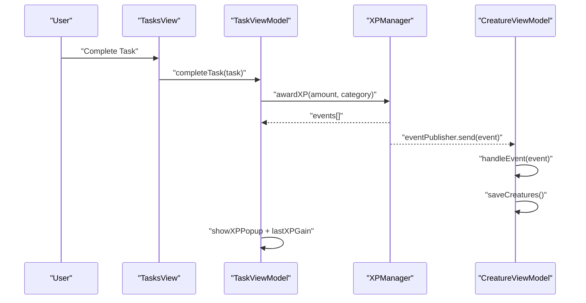
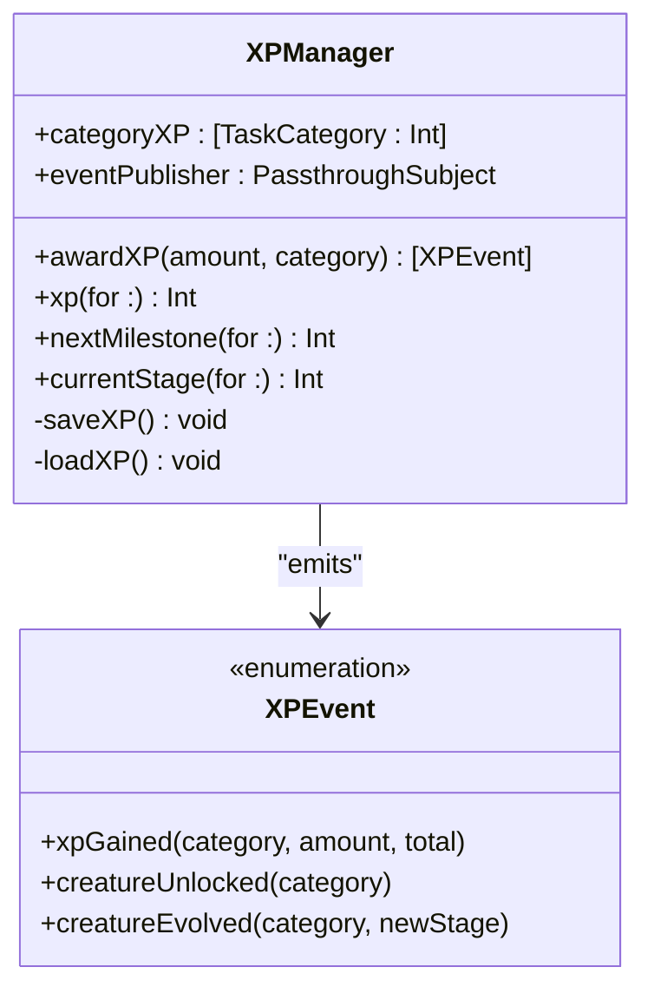
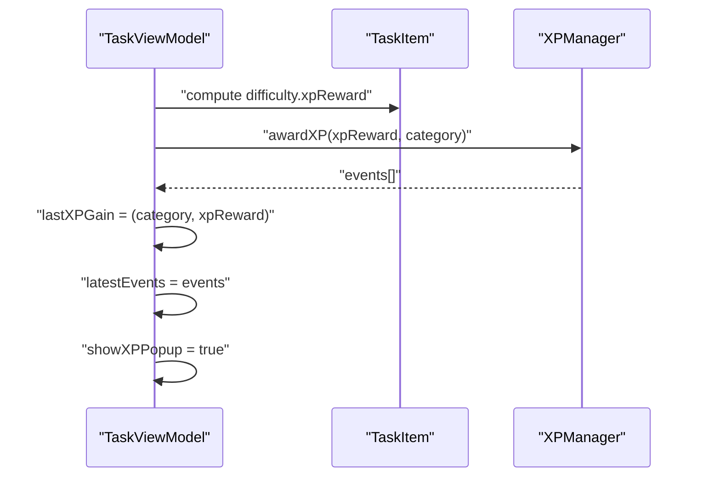
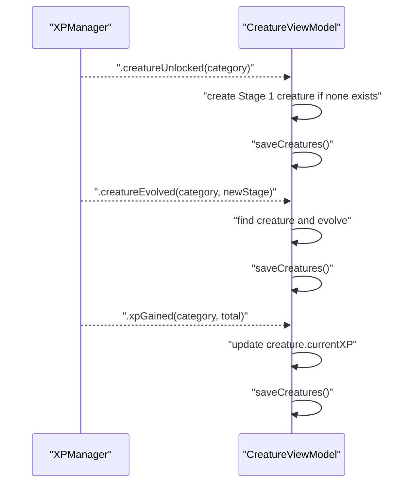
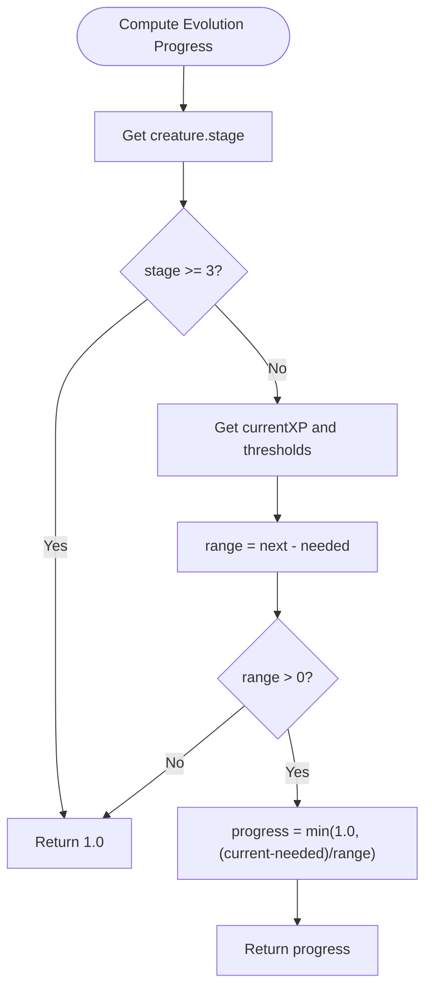
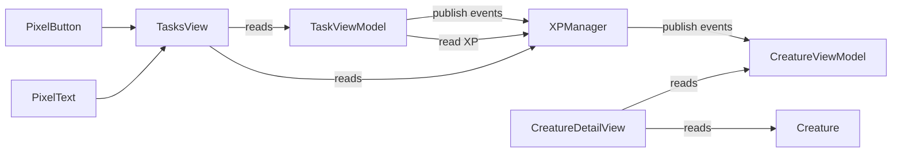
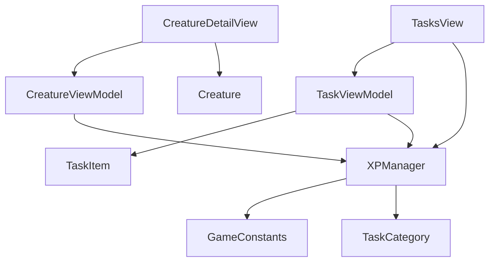

# XP & Progression System

<cite>
**Referenced Files in This Document**
- [XPManager.swift](file://TaskMon/TaskMon/Services/XPManager.swift)
- [TaskViewModel.swift](file://TaskMon/TaskMon/ViewModels/TaskViewModel.swift)
- [CreatureViewModel.swift](file://TaskMon/TaskMon/ViewModels/CreatureViewModel.swift)
- [BattleViewModel.swift](file://TaskMon/TaskMon/ViewModels/BattleViewModel.swift)
- [Creature.swift](file://TaskMon/TaskMon/Models/Creature.swift)
- [Player.swift](file://TaskMon/TaskMon/Models/Player.swift)
- [TaskCategory.swift](file://TaskMon/TaskMon/Models/TaskCategory.swift)
- [TaskItem.swift](file://TaskMon/TaskMon/Models/TaskItem.swift)
- [Constants.swift](file://TaskMon/TaskMon/Utils/Constants.swift)
- [TasksView.swift](file://TaskMon/TaskMon/Views/Tasks/TasksView.swift)
- [CreatureDetailView.swift](file://TaskMon/TaskMon/Views/Creatures/CreatureDetailView.swift)
- [PixelButton.swift](file://TaskMon/TaskMon/Views/Components/PixelButton.swift)
- [PixelText.swift](file://TaskMon/TaskMon/Views/Components/PixelText.swift)
</cite>

## Table of Contents
1. [Introduction](#introduction)
2. [Project Structure](#project-structure)
3. [Core Components](#core-components)
4. [Architecture Overview](#architecture-overview)
5. [Detailed Component Analysis](#detailed-component-analysis)
6. [Dependency Analysis](#dependency-analysis)
7. [Performance Considerations](#performance-considerations)
8. [Troubleshooting Guide](#troubleshooting-guide)
9. [Conclusion](#conclusion)
10. [Appendices](#appendices)

## Introduction
This document explains the XP and Progression System that powers experience point accumulation, milestone thresholds, and creature evolution. It covers how XP is awarded via task completion, how thresholds trigger unlocks and evolutions, and how cross-component event communication keeps ViewModels synchronized. It also documents progress tracking visuals and the central role of XPManager as the coordinator for XP events and milestone handling.

## Project Structure
The XP and Progression System spans several layers:
- Services: Central XP coordination and persistence
- ViewModels: State management and event subscription
- Models: XP thresholds, creature evolution, and player XP aggregation
- Views: Progress bars, popups, and detail displays
- Utilities: Game constants and UI helpers

**Diagram sources**
- [XPManager.swift](file://TaskMon/TaskMon/Services/XPManager.swift#L1-L96)
- [TaskViewModel.swift](file://TaskMon/TaskMon/ViewModels/TaskViewModel.swift#L1-L76)
- [CreatureViewModel.swift](file://TaskMon/TaskMon/ViewModels/CreatureViewModel.swift#L1-L90)
- [BattleViewModel.swift](file://TaskMon/TaskMon/ViewModels/BattleViewModel.swift#L1-L462)
- [Creature.swift](file://TaskMon/TaskMon/Models/Creature.swift#L1-L98)
- [Player.swift](file://TaskMon/TaskMon/Models/Player.swift#L1-L51)
- [TaskCategory.swift](file://TaskMon/TaskMon/Models/TaskCategory.swift#L1-L85)
- [TaskItem.swift](file://TaskMon/TaskMon/Models/TaskItem.swift#L1-L44)
- [Constants.swift](file://TaskMon/TaskMon/Utils/Constants.swift#L1-L40)
- [TasksView.swift](file://TaskMon/TaskMon/Views/Tasks/TasksView.swift#L1-L195)
- [CreatureDetailView.swift](file://TaskMon/TaskMon/Views/Creatures/CreatureDetailView.swift#L1-L160)
- [PixelButton.swift](file://TaskMon/TaskMon/Views/Components/PixelButton.swift#L1-L44)
- [PixelText.swift](file://TaskMon/TaskMon/Views/Components/PixelText.swift#L1-L26)

**Section sources**
- [XPManager.swift](file://TaskMon/TaskMon/Services/XPManager.swift#L1-L96)
- [TaskViewModel.swift](file://TaskMon/TaskMon/ViewModels/TaskViewModel.swift#L1-L76)
- [CreatureViewModel.swift](file://TaskMon/TaskMon/ViewModels/CreatureViewModel.swift#L1-L90)
- [BattleViewModel.swift](file://TaskMon/TaskMon/ViewModels/BattleViewModel.swift#L1-L462)
- [Creature.swift](file://TaskMon/TaskMon/Models/Creature.swift#L1-L98)
- [Player.swift](file://TaskMon/TaskMon/Models/Player.swift#L1-L51)
- [TaskCategory.swift](file://TaskMon/TaskMon/Models/TaskCategory.swift#L1-L85)
- [TaskItem.swift](file://TaskMon/TaskMon/Models/TaskItem.swift#L1-L44)
- [Constants.swift](file://TaskMon/TaskMon/Utils/Constants.swift#L1-L40)
- [TasksView.swift](file://TaskMon/TaskMon/Views/Tasks/TasksView.swift#L1-L195)
- [CreatureDetailView.swift](file://TaskMon/TaskMon/Views/Creatures/CreatureDetailView.swift#L1-L160)
- [PixelButton.swift](file://TaskMon/TaskMon/Views/Components/PixelButton.swift#L1-L44)
- [PixelText.swift](file://TaskMon/TaskMon/Views/Components/PixelText.swift#L1-L26)

## Core Components
- XPManager: Central coordinator for XP accumulation, milestone detection, and event broadcasting. Persists XP per category and emits XPEvent notifications.
- TaskViewModel: Handles task lifecycle and triggers XP awards upon completion. Collects XP events for UI feedback.
- CreatureViewModel: Subscribes to XP events to unlock new creatures, evolve existing ones, and update XP counters.
- Creature: Tracks per-creature XP, evolution progress, and next evolution thresholds.
- Player: Aggregates total XP across categories for leaderboards and profile views.
- TaskCategory and TaskItem: Define category metadata, XP rewards, and difficulty-based XP values.
- GameConstants: Defines XP thresholds and other game constants used by XPManager and UI.

**Section sources**
- [XPManager.swift](file://TaskMon/TaskMon/Services/XPManager.swift#L1-L96)
- [TaskViewModel.swift](file://TaskMon/TaskMon/ViewModels/TaskViewModel.swift#L1-L76)
- [CreatureViewModel.swift](file://TaskMon/TaskMon/ViewModels/CreatureViewModel.swift#L1-L90)
- [Creature.swift](file://TaskMon/TaskMon/Models/Creature.swift#L1-L98)
- [Player.swift](file://TaskMon/TaskMon/Models/Player.swift#L1-L51)
- [TaskCategory.swift](file://TaskMon/TaskMon/Models/TaskCategory.swift#L1-L85)
- [TaskItem.swift](file://TaskMon/TaskMon/Models/TaskItem.swift#L1-L44)
- [Constants.swift](file://TaskMon/TaskMon/Utils/Constants.swift#L1-L40)

## Architecture Overview
The XP and Progression System follows a publish-subscribe pattern:
- TaskViewModel awards XP and receives XPEvent notifications.
- XPManager publishes XPEvent notifications for XP gain, creature unlock, and evolution.
- CreatureViewModel subscribes to XP events to update creature state and persistence.
- UI components (TasksView, CreatureDetailView) consume XPManager and ViewModel state for progress displays.

**Diagram sources**
- [TaskViewModel.swift](file://TaskMon/TaskMon/ViewModels/TaskViewModel.swift#L26-L39)
- [XPManager.swift](file://TaskMon/TaskMon/Services/XPManager.swift#L22-L50)
- [CreatureViewModel.swift](file://TaskMon/TaskMon/ViewModels/CreatureViewModel.swift#L24-L63)
- [TasksView.swift](file://TaskMon/TaskMon/Views/Tasks/TasksView.swift#L53-L61)

## Detailed Component Analysis

### XPManager: Central Coordinator
Responsibilities:
- Accumulate XP per TaskCategory and persist to UserDefaults.
- Emit XPEvent notifications for XP gain, creature unlock, and evolution.
- Compute next milestone and current stage for a category.

Key behaviors:
- Award XP and detect milestone crossings; emit corresponding events.
- Provide XP totals and stage information for UI and logic.
- Persist XP on every change to ensure continuity across app sessions.

**Diagram sources**
- [XPManager.swift](file://TaskMon/TaskMon/Services/XPManager.swift#L4-L14)
- [XPManager.swift](file://TaskMon/TaskMon/Services/XPManager.swift#L22-L75)

**Section sources**
- [XPManager.swift](file://TaskMon/TaskMon/Services/XPManager.swift#L1-L96)
- [Constants.swift](file://TaskMon/TaskMon/Utils/Constants.swift#L10-L13)

### TaskViewModel: Task Completion and XP Awarding
Responsibilities:
- Manage task lifecycle and mark tasks complete.
- Calculate XP reward from task difficulty and call XPManager.awardXP.
- Surface XP gain and events to the UI via a popup overlay.

Workflow:
- On task completion, compute XP reward from TaskDifficulty.xpReward.
- Call XPManager.awardXP and store returned events for UI display.

**Diagram sources**
- [TaskViewModel.swift](file://TaskMon/TaskMon/ViewModels/TaskViewModel.swift#L26-L39)
- [TaskItem.swift](file://TaskMon/TaskMon/Models/TaskItem.swift#L18-L24)
- [XPManager.swift](file://TaskMon/TaskMon/Services/XPManager.swift#L22-L50)

**Section sources**
- [TaskViewModel.swift](file://TaskMon/TaskMon/ViewModels/TaskViewModel.swift#L1-L76)
- [TaskItem.swift](file://TaskMon/TaskMon/Models/TaskItem.swift#L1-L44)

### CreatureViewModel: Event Handling and State Synchronization
Responsibilities:
- Subscribe to XPManager.eventPublisher.
- Unlock new creatures when category XP crosses 100.
- Evolve creatures when category XP crosses 500 and 1000.
- Update XP counters on creatures and persist state.

**Diagram sources**
- [CreatureViewModel.swift](file://TaskMon/TaskMon/ViewModels/CreatureViewModel.swift#L24-L63)
- [XPManager.swift](file://TaskMon/TaskMon/Services/XPManager.swift#L32-L47)

**Section sources**
- [CreatureViewModel.swift](file://TaskMon/TaskMon/ViewModels/CreatureViewModel.swift#L1-L90)

### Creature: Evolution Progress and XP Tracking
Responsibilities:
- Track per-creature XP and compute evolution progress.
- Determine next evolution thresholds and stage boundaries.

**Diagram sources**
- [Creature.swift](file://TaskMon/TaskMon/Models/Creature.swift#L48-L57)

**Section sources**
- [Creature.swift](file://TaskMon/TaskMon/Models/Creature.swift#L1-L98)

### Player: Total XP Aggregation
Responsibilities:
- Aggregate XP across categories for leaderboards and profile views.
- Provide convenience methods to query XP per category.

**Section sources**
- [Player.swift](file://TaskMon/TaskMon/Models/Player.swift#L1-L51)

### UI Components: Progress Tracking and Visual Displays
- TasksView: Renders category XP progress bars and XP popup after task completion.
- CreatureDetailView: Shows evolution progress bar and next evolution XP.
- PixelButton and PixelText: Shared UI primitives for consistent styling.

**Diagram sources**
- [TasksView.swift](file://TaskMon/TaskMon/Views/Tasks/TasksView.swift#L65-L81)
- [TasksView.swift](file://TaskMon/TaskMon/Views/Tasks/TasksView.swift#L139-L194)
- [CreatureDetailView.swift](file://TaskMon/TaskMon/Views/Creatures/CreatureDetailView.swift#L108-L133)
- [PixelButton.swift](file://TaskMon/TaskMon/Views/Components/PixelButton.swift#L1-L44)
- [PixelText.swift](file://TaskMon/TaskMon/Views/Components/PixelText.swift#L1-L26)

**Section sources**
- [TasksView.swift](file://TaskMon/TaskMon/Views/Tasks/TasksView.swift#L1-L195)
- [CreatureDetailView.swift](file://TaskMon/TaskMon/Views/Creatures/CreatureDetailView.swift#L1-L160)
- [PixelButton.swift](file://TaskMon/TaskMon/Views/Components/PixelButton.swift#L1-L44)
- [PixelText.swift](file://TaskMon/TaskMon/Views/Components/PixelText.swift#L1-L26)

## Dependency Analysis
- XPManager depends on GameConstants for thresholds and TaskCategory for XP keys.
- TaskViewModel depends on TaskItem difficulty and XPManager for XP events.
- CreatureViewModel depends on XPManager for XP events and persists Creature state.
- UI components depend on ViewModels and Models for rendering progress and XP info.

**Diagram sources**
- [XPManager.swift](file://TaskMon/TaskMon/Services/XPManager.swift#L1-L96)
- [TaskViewModel.swift](file://TaskMon/TaskMon/ViewModels/TaskViewModel.swift#L1-L76)
- [CreatureViewModel.swift](file://TaskMon/TaskMon/ViewModels/CreatureViewModel.swift#L1-L90)
- [CreatureDetailView.swift](file://TaskMon/TaskMon/Views/Creatures/CreatureDetailView.swift#L1-L160)
- [TasksView.swift](file://TaskMon/TaskMon/Views/Tasks/TasksView.swift#L1-L195)

**Section sources**
- [XPManager.swift](file://TaskMon/TaskMon/Services/XPManager.swift#L1-L96)
- [TaskViewModel.swift](file://TaskMon/TaskMon/ViewModels/TaskViewModel.swift#L1-L76)
- [CreatureViewModel.swift](file://TaskMon/TaskMon/ViewModels/CreatureViewModel.swift#L1-L90)
- [CreatureDetailView.swift](file://TaskMon/TaskMon/Views/Creatures/CreatureDetailView.swift#L1-L160)
- [TasksView.swift](file://TaskMon/TaskMon/Views/Tasks/TasksView.swift#L1-L195)

## Performance Considerations
- Event emission occurs synchronously during awardXP; ensure minimal work inside event handlers to keep UI responsive.
- Persistence uses UserDefaults; batch writes are handled per XP change. For heavy usage, consider debouncing writes.
- UI progress computations are lightweight; avoid unnecessary re-renders by binding to published properties efficiently.

## Troubleshooting Guide
Common issues and resolutions:
- XP not persisting across sessions: Verify UserDefaults keys and encoding/decoding logic in XPManager.
- Creature not evolving after crossing threshold: Confirm XPManager thresholds and that CreatureViewModel handles .creatureEvolved events.
- XP popup not appearing: Ensure TaskViewModel sets showXPPopup and latestEvents after awardXP.
- Evolution progress not updating: Check CreatureDetailView reads currentXP and nextEvolutionXP from Creature.

**Section sources**
- [XPManager.swift](file://TaskMon/TaskMon/Services/XPManager.swift#L78-L94)
- [TaskViewModel.swift](file://TaskMon/TaskMon/ViewModels/TaskViewModel.swift#L33-L36)
- [CreatureViewModel.swift](file://TaskMon/TaskMon/ViewModels/CreatureViewModel.swift#L46-L62)
- [CreatureDetailView.swift](file://TaskMon/TaskMon/Views/Creatures/CreatureDetailView.swift#L108-L133)

## Conclusion
The XP and Progression System integrates task completion, XP accumulation, milestone detection, and creature evolution through a clean publish-subscribe architecture. XPManager centralizes XP logic and events, while TaskViewModel and CreatureViewModel coordinate state and persistence. UI components render progress and notify players of milestones, ensuring a cohesive and motivating gameplay loop.

## Appendices

### XP Calculation and Milestone Detection Logic
- Difficulty-based XP: TaskDifficulty.xpReward determines award amount.
- Thresholds: 100 XP for unlock, 500 XP for stage 2 evolution, 1000 XP for stage 3 evolution.
- Detection: Compare old and new XP totals against thresholds to emit appropriate events.

**Section sources**
- [TaskItem.swift](file://TaskMon/TaskMon/Models/TaskItem.swift#L18-L24)
- [Constants.swift](file://TaskMon/TaskMon/Utils/Constants.swift#L10-L13)
- [XPManager.swift](file://TaskMon/TaskMon/Services/XPManager.swift#L32-L47)

### Cross-Component Communication Patterns
- Event broadcasting: XPManager.eventPublisher emits XPEvent notifications.
- Listener registration: CreatureViewModel subscribes to eventPublisher and handles events on the main thread.
- State synchronization: ViewModels update persisted state after handling events.

**Section sources**
- [XPManager.swift](file://TaskMon/TaskMon/Services/XPManager.swift#L14)
- [CreatureViewModel.swift](file://TaskMon/TaskMon/ViewModels/CreatureViewModel.swift#L24-L31)

### Common Use Cases and Workflows
- Earning XP through task completion: TaskViewModel completes a task and calls XPManager.awardXP.
- Unlocking new creatures at milestones: XPManager emits .creatureUnlocked; CreatureViewModel creates a Stage 1 creature.
- Tracking overall progression: TasksView renders category XP progress bars and popups; CreatureDetailView shows evolution progress.

**Section sources**
- [TaskViewModel.swift](file://TaskMon/TaskMon/ViewModels/TaskViewModel.swift#L26-L39)
- [CreatureViewModel.swift](file://TaskMon/TaskMon/ViewModels/CreatureViewModel.swift#L33-L44)
- [TasksView.swift](file://TaskMon/TaskMon/Views/Tasks/TasksView.swift#L65-L81)
- [CreatureDetailView.swift](file://TaskMon/TaskMon/Views/Creatures/CreatureDetailView.swift#L108-L133)