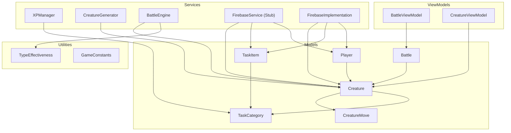
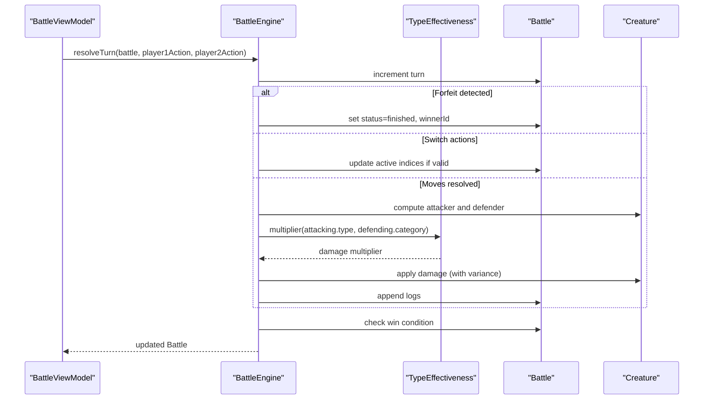
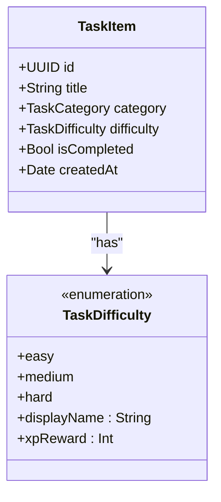
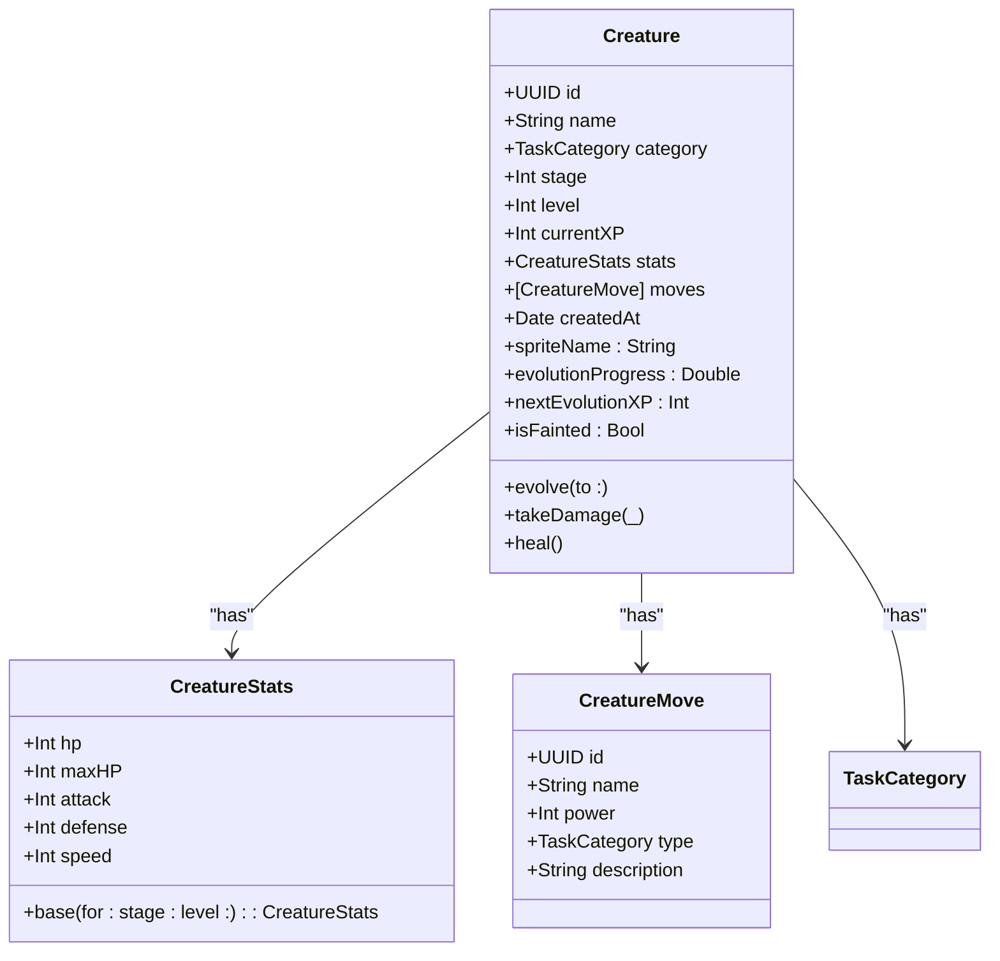
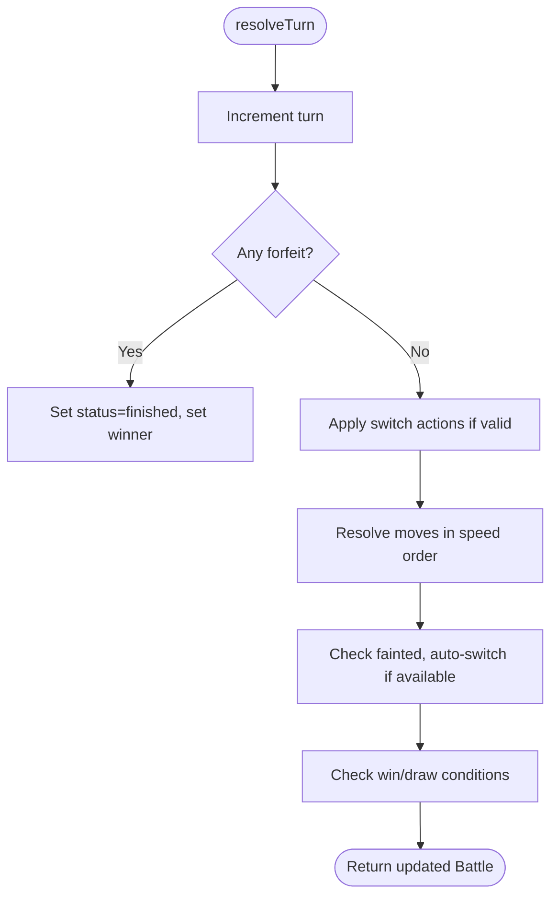
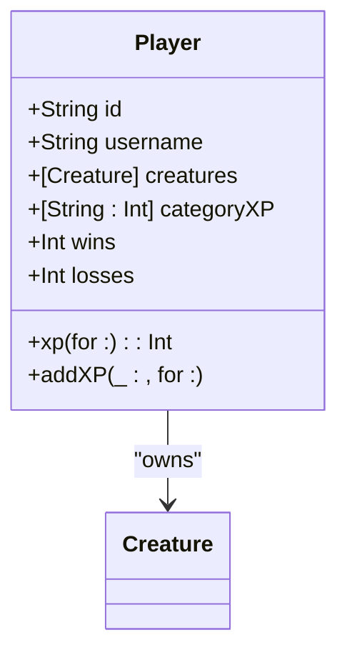
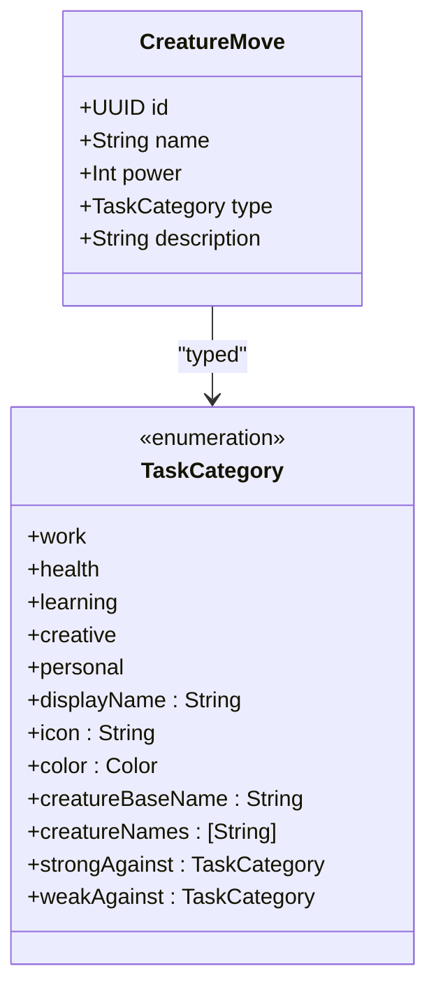
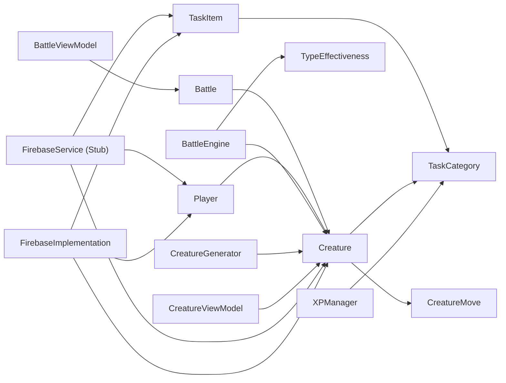

# Data Models & Persistence

<cite>
**Referenced Files in This Document**
- [TaskItem.swift](file://TaskMon/TaskMon/Models/TaskItem.swift)
- [TaskCategory.swift](file://TaskMon/TaskMon/Models/TaskCategory.swift)
- [Creature.swift](file://TaskMon/TaskMon/Models/Creature.swift)
- [CreatureMove.swift](file://TaskMon/TaskMon/Models/CreatureMove.swift)
- [Battle.swift](file://TaskMon/TaskMon/Models/Battle.swift)
- [Player.swift](file://TaskMon/TaskMon/Models/Player.swift)
- [TypeEffectiveness.swift](file://TaskMon/TaskMon/Utils/TypeEffectiveness.swift)
- [Constants.swift](file://TaskMon/TaskMon/Utils/Constants.swift)
- [XPManager.swift](file://TaskMon/TaskMon/Services/XPManager.swift)
- [CreatureGenerator.swift](file://TaskMon/TaskMon/Services/CreatureGenerator.swift)
- [BattleEngine.swift](file://TaskMon/TaskMon/Services/BattleEngine.swift)
- [FirebaseService.swift](file://TaskMon/TaskMon/Services/FirebaseService.swift)
- [FirebaseImplementation.swift](file://TaskMon/TaskMon/Services/FirebaseImplementation.swift)
- [BattleViewModel.swift](file://TaskMon/TaskMon/ViewModels/BattleViewModel.swift)
- [CreatureViewModel.swift](file://TaskMon/TaskMon/ViewModels/CreatureViewModel.swift)
</cite>

## Table of Contents
1. [Introduction](#introduction)
2. [Project Structure](#project-structure)
3. [Core Components](#core-components)
4. [Architecture Overview](#architecture-overview)
5. [Detailed Component Analysis](#detailed-component-analysis)
6. [Dependency Analysis](#dependency-analysis)
7. [Performance Considerations](#performance-considerations)
8. [Troubleshooting Guide](#troubleshooting-guide)
9. [Conclusion](#conclusion)
10. [Appendices](#appendices)

## Introduction
This document provides comprehensive data model documentation for TaskMon’s core entities and persistence strategies. It covers TaskItem, Creature, Battle, Player, TaskCategory, and CreatureMove, detailing their fields, data types, validation rules, and business constraints. It also documents the persistence strategy using UserDefaults for local storage, including serialization approaches, migration handling, and data lifecycle management. Security and privacy considerations are addressed alongside practical guidance for caching, performance, and matchmaking.

## Project Structure
The data models and related services are organized by domain:
- Models: TaskItem, TaskCategory, Creature, CreatureMove, Battle, Player
- Utilities: TypeEffectiveness, Constants
- Services: XPManager (XP tracking and persistence), CreatureGenerator (team generation), BattleEngine (combat resolution), FirebaseService/FirebaseImplementation (stub/local and Firebase-backed services)
- ViewModels: BattleViewModel, CreatureViewModel (UI state and persistence hooks)

**Diagram sources**
- [TaskItem.swift](file://TaskMon/TaskMon/Models/TaskItem.swift#L27-L43)
- [TaskCategory.swift](file://TaskMon/TaskMon/Models/TaskCategory.swift#L4-L84)
- [Creature.swift](file://TaskMon/TaskMon/Models/Creature.swift#L33-L97)
- [CreatureMove.swift](file://TaskMon/TaskMon/Models/CreatureMove.swift#L3-L67)
- [Battle.swift](file://TaskMon/TaskMon/Models/Battle.swift#L32-L68)
- [Player.swift](file://TaskMon/TaskMon/Models/Player.swift#L3-L28)
- [TypeEffectiveness.swift](file://TaskMon/TaskMon/Utils/TypeEffectiveness.swift#L3-L33)
- [Constants.swift](file://TaskMon/TaskMon/Utils/Constants.swift#L4-L24)
- [XPManager.swift](file://TaskMon/TaskMon/Services/XPManager.swift#L10-L95)
- [CreatureGenerator.swift](file://TaskMon/TaskMon/Services/CreatureGenerator.swift#L3-L43)
- [BattleEngine.swift](file://TaskMon/TaskMon/Services/BattleEngine.swift#L3-L169)
- [FirebaseService.swift](file://TaskMon/TaskMon/Services/FirebaseService.swift#L66-L98)
- [FirebaseImplementation.swift](file://TaskMon/TaskMon/Services/FirebaseImplementation.swift#L41-L94)
- [BattleViewModel.swift](file://TaskMon/TaskMon/ViewModels/BattleViewModel.swift#L10-L461)
- [CreatureViewModel.swift](file://TaskMon/TaskMon/ViewModels/CreatureViewModel.swift#L5-L89)

**Section sources**
- [TaskItem.swift](file://TaskMon/TaskMon/Models/TaskItem.swift#L1-L44)
- [TaskCategory.swift](file://TaskMon/TaskMon/Models/TaskCategory.swift#L1-L85)
- [Creature.swift](file://TaskMon/TaskMon/Models/Creature.swift#L1-L98)
- [CreatureMove.swift](file://TaskMon/TaskMon/Models/CreatureMove.swift#L1-L68)
- [Battle.swift](file://TaskMon/TaskMon/Models/Battle.swift#L1-L69)
- [Player.swift](file://TaskMon/TaskMon/Models/Player.swift#L1-L29)
- [TypeEffectiveness.swift](file://TaskMon/TaskMon/Utils/TypeEffectiveness.swift#L1-L34)
- [Constants.swift](file://TaskMon/TaskMon/Utils/Constants.swift#L1-L40)
- [XPManager.swift](file://TaskMon/TaskMon/Services/XPManager.swift#L1-L96)
- [CreatureGenerator.swift](file://TaskMon/TaskMon/Services/CreatureGenerator.swift#L1-L44)
- [BattleEngine.swift](file://TaskMon/TaskMon/Services/BattleEngine.swift#L1-L170)
- [FirebaseService.swift](file://TaskMon/TaskMon/Services/FirebaseService.swift#L1-L143)
- [FirebaseImplementation.swift](file://TaskMon/TaskMon/Services/FirebaseImplementation.swift#L1-L190)
- [BattleViewModel.swift](file://TaskMon/TaskMon/ViewModels/BattleViewModel.swift#L1-L462)
- [CreatureViewModel.swift](file://TaskMon/TaskMon/ViewModels/CreatureViewModel.swift#L1-L90)

## Core Components
This section defines each core entity, including fields, types, validation rules, and business constraints.

- TaskItem
  - Purpose: Represents a single task with metadata and completion state.
  - Fields:
    - id: UUID (unique identifier)
    - title: String (non-empty)
    - category: TaskCategory
    - difficulty: TaskDifficulty (easy, medium, hard)
    - isCompleted: Bool (default false)
    - createdAt: Date (immutable timestamp)
  - Validation:
    - title must be non-empty
    - difficulty determines XP reward
  - Business constraints:
    - Difficulty XP rewards are fixed per difficulty
    - Creation sets isCompleted=false and createdAt to now

- TaskCategory
  - Purpose: Enumerates task domains and provides metadata for UI and mechanics.
  - Values: work, health, learning, creative, personal
  - Properties:
    - displayName, icon, color, creatureBaseName, creatureNames
    - strongAgainst, weakAgainst (type effectiveness chart)
  - Validation: All cases are defined; defaults apply for missing values

- Creature
  - Purpose: Core battler with stats, moves, evolution, and XP.
  - Fields:
    - id: UUID
    - name: String
    - category: TaskCategory
    - stage: Int (1–3)
    - level: Int
    - currentXP: Int
    - stats: CreatureStats (hp, maxHP, attack, defense, speed)
    - moves: [CreatureMove]
    - createdAt: Date
  - Computed:
    - spriteName: "{category}_stage{stage}"
    - evolutionProgress: Double (0..1)
    - nextEvolutionXP: Int threshold
  - Methods:
    - evolve(to:), takeDamage(_:), heal(), isFainted
  - Validation:
    - stage clamped to at least 1
    - stats derived from category, stage, level

- CreatureMove
  - Purpose: Moves available to creatures.
  - Fields:
    - id: UUID
    - name: String
    - power: Int
    - type: TaskCategory
    - description: String
  - Validation:
    - power non-negative
    - type must be a valid TaskCategory

- Battle
  - Purpose: Encapsulates a turn-based combat session.
  - Fields:
    - id: String
    - player1Id, player2Id: String
    - player1Team, player2Team: [Creature] (size bound by GameConstants)
    - player1ActiveIndex, player2ActiveIndex: Int
    - currentTurn: Int
    - battleLog: [String]
    - status: BattleStatus (setup, active, finished)
    - winnerId: String?
    - player1Action, player2Action: BattleAction?
  - Computed:
    - player1Active, player2Active (active creatures)
    - isOver
  - Validation:
    - Active indices must be within team bounds and refer to non-fainted creatures
    - Actions constrained to ActionType

- Player
  - Purpose: User profile and progress statistics.
  - Fields:
    - id: String (user identifier)
    - username: String
    - creatures: [Creature]
    - categoryXP: [String: Int] (TaskCategory.rawValue -> XP)
    - wins, losses: Int
  - Methods:
    - xp(for:), addXP(_:for:)
  - Validation:
    - Defaults initialized on creation

- TaskDifficulty
  - Purpose: Enumerates difficulty levels for tasks.
  - Cases: easy, medium, hard
  - Properties:
    - displayName, xpReward (per difficulty)

- BattleAction
  - Purpose: Captures a single player action during a turn.
  - Fields:
    - type: ActionType (useMove, switchCreature, forfeit)
    - index: Int (move index or creature index; -1 for forfeit)
  - Static helpers:
    - useMove(_), switchCreature(_), forfeit

- BattleStatus
  - Purpose: Tracks overall battle lifecycle.
  - Cases: setup, active, finished

- XPManager
  - Purpose: Centralized XP tracking with persistence and events.
  - State:
    - categoryXP: [TaskCategory: Int]
  - Events:
    - xpGained, creatureUnlocked, creatureEvolved
  - Persistence:
    - Encodes [String: Int] mapping TaskCategory.rawValue to XP
    - Stored under a fixed UserDefaults key

- TypeEffectiveness
  - Purpose: Calculates damage multipliers based on move type vs defender category.
  - Multipliers: superEffective, neutral, notEffective
  - Effectiveness chart: Work > Learning > Creative > Health > Work; Personal is neutral

- Constants
  - Purpose: Global game constants.
  - Includes XP rewards, evolution thresholds, team size, turn timeout, UI metrics

**Section sources**
- [TaskItem.swift](file://TaskMon/TaskMon/Models/TaskItem.swift#L27-L43)
- [TaskCategory.swift](file://TaskMon/TaskMon/Models/TaskCategory.swift#L4-L84)
- [Creature.swift](file://TaskMon/TaskMon/Models/Creature.swift#L33-L97)
- [CreatureMove.swift](file://TaskMon/TaskMon/Models/CreatureMove.swift#L3-L17)
- [Battle.swift](file://TaskMon/TaskMon/Models/Battle.swift#L32-L68)
- [Player.swift](file://TaskMon/TaskMon/Models/Player.swift#L3-L28)
- [TypeEffectiveness.swift](file://TaskMon/TaskMon/Utils/TypeEffectiveness.swift#L3-L33)
- [Constants.swift](file://TaskMon/TaskMon/Utils/Constants.swift#L4-L24)
- [XPManager.swift](file://TaskMon/TaskMon/Services/XPManager.swift#L10-L95)

## Architecture Overview
The gamified task system integrates models with services and view models. XP gained from tasks triggers XPManager events that update Creature state and persistence. Battles are orchestrated by BattleViewModel, which delegates combat resolution to BattleEngine and persists or synchronizes state via FirebaseService or stub implementations.

**Diagram sources**
- [BattleViewModel.swift](file://TaskMon/TaskMon/ViewModels/BattleViewModel.swift#L125-L146)
- [BattleEngine.swift](file://TaskMon/TaskMon/Services/BattleEngine.swift#L5-L66)
- [TypeEffectiveness.swift](file://TaskMon/TaskMon/Utils/TypeEffectiveness.swift#L11-L22)
- [Battle.swift](file://TaskMon/TaskMon/Models/Battle.swift#L32-L68)
- [Creature.swift](file://TaskMon/TaskMon/Models/Creature.swift#L88-L96)

**Section sources**
- [BattleViewModel.swift](file://TaskMon/TaskMon/ViewModels/BattleViewModel.swift#L10-L461)
- [BattleEngine.swift](file://TaskMon/TaskMon/Services/BattleEngine.swift#L1-L170)
- [TypeEffectiveness.swift](file://TaskMon/TaskMon/Utils/TypeEffectiveness.swift#L1-L34)
- [Battle.swift](file://TaskMon/TaskMon/Models/Battle.swift#L1-L69)
- [Creature.swift](file://TaskMon/TaskMon/Models/Creature.swift#L1-L98)

## Detailed Component Analysis

### TaskItem Model
- Fields and types:
  - id: UUID
  - title: String
  - category: TaskCategory
  - difficulty: TaskDifficulty
  - isCompleted: Bool
  - createdAt: Date
- Validation and constraints:
  - title must be non-empty
  - Difficulty XP rewards are predefined
  - createdAt is immutable upon creation
- Persistence:
  - Saved via TaskViewModel to UserDefaults under a tasks key
  - Loaded on app launch

**Diagram sources**
- [TaskItem.swift](file://TaskMon/TaskMon/Models/TaskItem.swift#L27-L43)
- [TaskCategory.swift](file://TaskMon/TaskMon/Models/TaskCategory.swift#L4-L84)

**Section sources**
- [TaskItem.swift](file://TaskMon/TaskMon/Models/TaskItem.swift#L1-L44)
- [FirebaseService.swift](file://TaskMon/TaskMon/Services/FirebaseService.swift#L79-L87)

### Creature Model
- Fields and types:
  - id: UUID
  - name: String
  - category: TaskCategory
  - stage: Int (1–3)
  - level: Int
  - currentXP: Int
  - stats: CreatureStats (hp, maxHP, attack, defense, speed)
  - moves: [CreatureMove]
  - createdAt: Date
- Computed properties:
  - spriteName: "{category}_stage{stage}"
  - evolutionProgress: Double (0..1)
  - nextEvolutionXP: Int threshold
- Methods:
  - evolve(to:), takeDamage(_:), heal(), isFainted
- Stats derivation:
  - Base stats depend on category, stage multiplier, and level bonus
  - Moves pool increases with stage

**Diagram sources**
- [Creature.swift](file://TaskMon/TaskMon/Models/Creature.swift#L33-L97)
- [CreatureMove.swift](file://TaskMon/TaskMon/Models/CreatureMove.swift#L3-L17)
- [TaskCategory.swift](file://TaskMon/TaskMon/Models/TaskCategory.swift#L4-L84)

**Section sources**
- [Creature.swift](file://TaskMon/TaskMon/Models/Creature.swift#L1-L98)
- [CreatureMove.swift](file://TaskMon/TaskMon/Models/CreatureMove.swift#L1-L68)
- [CreatureGenerator.swift](file://TaskMon/TaskMon/Services/CreatureGenerator.swift#L3-L43)

### Battle Model
- Fields and types:
  - id: String
  - player1Id, player2Id: String
  - player1Team, player2Team: [Creature] (size bound by GameConstants)
  - player1ActiveIndex, player2ActiveIndex: Int
  - currentTurn: Int
  - battleLog: [String]
  - status: BattleStatus
  - winnerId: String?
  - player1Action, player2Action: BattleAction?
- Computed:
  - player1Active, player2Active (active creatures)
  - isOver
- Turn resolution:
  - Forfeits, switches, and moves processed with speed tiebreaker
  - Win condition checks after damage application

**Diagram sources**
- [BattleEngine.swift](file://TaskMon/TaskMon/Services/BattleEngine.swift#L5-L66)
- [Battle.swift](file://TaskMon/TaskMon/Models/Battle.swift#L32-L68)

**Section sources**
- [Battle.swift](file://TaskMon/TaskMon/Models/Battle.swift#L1-L69)
- [BattleEngine.swift](file://TaskMon/TaskMon/Services/BattleEngine.swift#L1-L170)

### Player Model
- Fields and types:
  - id: String
  - username: String
  - creatures: [Creature]
  - categoryXP: [String: Int] (TaskCategory.rawValue -> XP)
  - wins, losses: Int
- Methods:
  - xp(for:), addXP(_:for:)

**Diagram sources**
- [Player.swift](file://TaskMon/TaskMon/Models/Player.swift#L3-L28)

**Section sources**
- [Player.swift](file://TaskMon/TaskMon/Models/Player.swift#L1-L29)

### TaskCategory and CreatureMove
- TaskCategory:
  - Provides metadata for UI and mechanics (displayName, icon, color, creature names)
  - Defines type effectiveness relationships (strongAgainst, weakAgainst)
- CreatureMove:
  - Move definition with power and type
  - Move pools are generated per category and stage

**Diagram sources**
- [TaskCategory.swift](file://TaskMon/TaskMon/Models/TaskCategory.swift#L4-L84)
- [CreatureMove.swift](file://TaskMon/TaskMon/Models/CreatureMove.swift#L3-L17)

**Section sources**
- [TaskCategory.swift](file://TaskMon/TaskMon/Models/TaskCategory.swift#L1-L85)
- [CreatureMove.swift](file://TaskMon/TaskMon/Models/CreatureMove.swift#L1-L68)

## Dependency Analysis
The following diagram highlights key dependencies among models and services.

**Diagram sources**
- [TaskItem.swift](file://TaskMon/TaskMon/Models/TaskItem.swift#L27-L43)
- [TaskCategory.swift](file://TaskMon/TaskMon/Models/TaskCategory.swift#L4-L84)
- [Creature.swift](file://TaskMon/TaskMon/Models/Creature.swift#L33-L97)
- [CreatureMove.swift](file://TaskMon/TaskMon/Models/CreatureMove.swift#L3-L17)
- [Battle.swift](file://TaskMon/TaskMon/Models/Battle.swift#L32-L68)
- [Player.swift](file://TaskMon/TaskMon/Models/Player.swift#L3-L28)
- [TypeEffectiveness.swift](file://TaskMon/TaskMon/Utils/TypeEffectiveness.swift#L3-L33)
- [XPManager.swift](file://TaskMon/TaskMon/Services/XPManager.swift#L10-L95)
- [CreatureGenerator.swift](file://TaskMon/TaskMon/Services/CreatureGenerator.swift#L3-L43)
- [BattleEngine.swift](file://TaskMon/TaskMon/Services/BattleEngine.swift#L3-L169)
- [FirebaseService.swift](file://TaskMon/TaskMon/Services/FirebaseService.swift#L66-L98)
- [FirebaseImplementation.swift](file://TaskMon/TaskMon/Services/FirebaseImplementation.swift#L41-L94)
- [BattleViewModel.swift](file://TaskMon/TaskMon/ViewModels/BattleViewModel.swift#L10-L461)
- [CreatureViewModel.swift](file://TaskMon/TaskMon/ViewModels/CreatureViewModel.swift#L5-L89)

**Section sources**
- [BattleEngine.swift](file://TaskMon/TaskMon/Services/BattleEngine.swift#L1-L170)
- [TypeEffectiveness.swift](file://TaskMon/TaskMon/Utils/TypeEffectiveness.swift#L1-L34)
- [XPManager.swift](file://TaskMon/TaskMon/Services/XPManager.swift#L1-L96)
- [CreatureGenerator.swift](file://TaskMon/TaskMon/Services/CreatureGenerator.swift#L1-L44)
- [FirebaseService.swift](file://TaskMon/TaskMon/Services/FirebaseService.swift#L1-L143)
- [FirebaseImplementation.swift](file://TaskMon/TaskMon/Services/FirebaseImplementation.swift#L1-L190)

## Performance Considerations
- Data volume and caching:
  - Creature and Player collections are small; frequent reads/writes via UserDefaults are acceptable for local mode.
  - For larger datasets, consider batching writes and deferring to background threads.
- Serialization overhead:
  - JSON encoding/decoding is straightforward; avoid repeated re-encoding by updating only changed entities.
- UI responsiveness:
  - BattleViewModel batches log animations and defers heavy operations to background queues.
- Network vs local:
  - Stub services minimize latency; FirebaseImplementation introduces network round-trips—cache locally and sync asynchronously.

[No sources needed since this section provides general guidance]

## Troubleshooting Guide
- Missing or corrupted data:
  - UserDefaults keys: “creatures”, “player_{id}”, “tasks”, “categoryXP”, “localUserId”
  - Verify decoding failures and fallback to defaults
- Battle desynchronization:
  - Ensure both players submit actions before host resolves turns
  - Validate active indices and fainted creatures before applying switches
- XP progression:
  - Confirm XP thresholds align with GameConstants and that events are published and subscribed

**Section sources**
- [FirebaseService.swift](file://TaskMon/TaskMon/Services/FirebaseService.swift#L66-L98)
- [FirebaseImplementation.swift](file://TaskMon/TaskMon/Services/FirebaseImplementation.swift#L41-L94)
- [BattleViewModel.swift](file://TaskMon/TaskMon/ViewModels/BattleViewModel.swift#L311-L336)
- [XPManager.swift](file://TaskMon/TaskMon/Services/XPManager.swift#L79-L94)

## Conclusion
TaskMon’s data models form a cohesive gamified system centered around tasks, creatures, and battles. The models are designed for clarity and extensibility, with clear validation rules and business constraints. Persistence is handled via UserDefaults in stub implementations and JSON serialization, while Firebase-backed services provide scalable alternatives. BattleEngine encapsulates combat logic, and XPManager coordinates progress tracking and evolution events. Together, these components deliver a robust foundation for the TaskMon experience.

[No sources needed since this section summarizes without analyzing specific files]

## Appendices

### Persistence Strategy
- Local storage (UserDefaults):
  - Creatures: encoded array under key “creatures”
  - Player: encoded struct under key “player_{id}”
  - Tasks: encoded array under key “tasks”
  - XP: encoded dictionary [String: Int] under key “categoryXP”
  - Auth: local anonymous user ID under key “localUserId”
- Migration handling:
  - Decode dictionaries keyed by TaskCategory.rawValue; unknown keys are ignored
  - Defaults applied for missing fields
- Data lifecycle:
  - Completed tasks: persisted locally; consider pruning after a retention period (e.g., 30 days) or user-defined policy
  - Creature evolution history: store minimal deltas (stage transitions) or snapshots as needed
- Security and privacy:
  - Local-only mode stores sensitive progress data in UserDefaults; encryption is not implemented
  - When enabling Firebase, ensure secure transport and server-side validation
  - Access control: enforce ownership checks when loading/saving per-user resources

**Section sources**
- [FirebaseService.swift](file://TaskMon/TaskMon/Services/FirebaseService.swift#L66-L98)
- [FirebaseImplementation.swift](file://TaskMon/TaskMon/Services/FirebaseImplementation.swift#L41-L94)
- [XPManager.swift](file://TaskMon/TaskMon/Services/XPManager.swift#L79-L94)
- [BattleViewModel.swift](file://TaskMon/TaskMon/ViewModels/BattleViewModel.swift#L388-L414)

### Sample Data Structures and JSON Representations
Note: The following are conceptual representations for documentation purposes.

- TaskItem
  - Fields: id, title, category, difficulty, isCompleted, createdAt
  - Example JSON:
    {
      "id": "UUID",
      "title": "Sample task",
      "category": "work",
      "difficulty": "medium",
      "isCompleted": false,
      "createdAt": "2025-01-01T00:00:00Z"
    }

- TaskCategory
  - Example JSON (as part of a move or creature):
    {
      "rawValue": "creative"
    }

- Creature
  - Fields: id, name, category, stage, level, currentXP, stats, moves, createdAt
  - Example JSON:
    {
      "id": "UUID",
      "name": "Artflame",
      "category": "creative",
      "stage": 2,
      "level": 5,
      "currentXP": 120,
      "stats": {
        "hp": 120,
        "maxHP": 120,
        "attack": 95,
        "defense": 85,
        "speed": 110
      },
      "moves": [
        {
          "id": "UUID",
          "name": "Spark",
          "power": 20,
          "type": "creative",
          "description": "A flash of inspiration."
        }
      ],
      "createdAt": "2025-01-01T00:00:00Z"
    }

- CreatureMove
  - Fields: id, name, power, type, description
  - Example JSON:
    {
      "id": "UUID",
      "name": "Masterpiece Blast",
      "power": 70,
      "type": "creative",
      "description": "A once-in-a-lifetime creation."
    }

- Battle
  - Fields: id, player1Id, player2Id, player1Team, player2Team, player1ActiveIndex, player2ActiveIndex, currentTurn, battleLog, status, winnerId, player1Action, player2Action
  - Example JSON:
    {
      "id": "battle_abc",
      "player1Id": "user_123",
      "player2Id": "AI Trainer",
      "player1Team": [/* Creature[] */],
      "player2Team": [/* Creature[] */],
      "player1ActiveIndex": 0,
      "player2ActiveIndex": 0,
      "currentTurn": 3,
      "battleLog": ["You sent out Starbit!", "AI Trainer sent out Wisphoenix!"],
      "status": "active",
      "winnerId": null,
      "player1Action": null,
      "player2Action": null
    }

- Player
  - Fields: id, username, creatures, categoryXP, wins, losses
  - Example JSON:
    {
      "id": "user_123",
      "username": "Trainer",
      "creatures": [/* Creature[] */],
      "categoryXP": {
        "work": 150,
        "health": 0,
        "learning": 300,
        "creative": 0,
        "personal": 0
      },
      "wins": 2,
      "losses": 1
    }

- XPManager (internal state)
  - categoryXP: [TaskCategory.rawValue: Int]
  - Example JSON:
    {
      "work": 150,
      "learning": 300
    }

**Section sources**
- [TaskItem.swift](file://TaskMon/TaskMon/Models/TaskItem.swift#L27-L43)
- [TaskCategory.swift](file://TaskMon/TaskMon/Models/TaskCategory.swift#L4-L84)
- [Creature.swift](file://TaskMon/TaskMon/Models/Creature.swift#L33-L97)
- [CreatureMove.swift](file://TaskMon/TaskMon/Models/CreatureMove.swift#L3-L17)
- [Battle.swift](file://TaskMon/TaskMon/Models/Battle.swift#L32-L68)
- [Player.swift](file://TaskMon/TaskMon/Models/Player.swift#L3-L28)
- [XPManager.swift](file://TaskMon/TaskMon/Services/XPManager.swift#L10-L95)