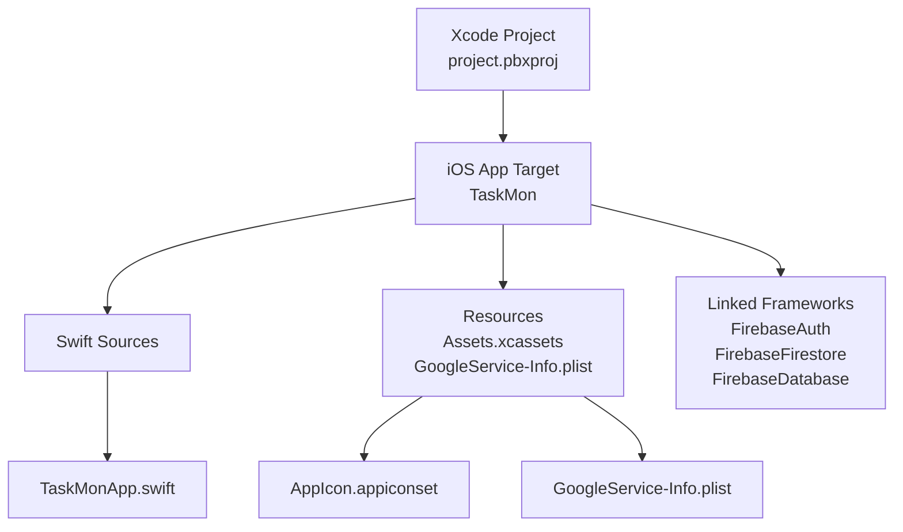
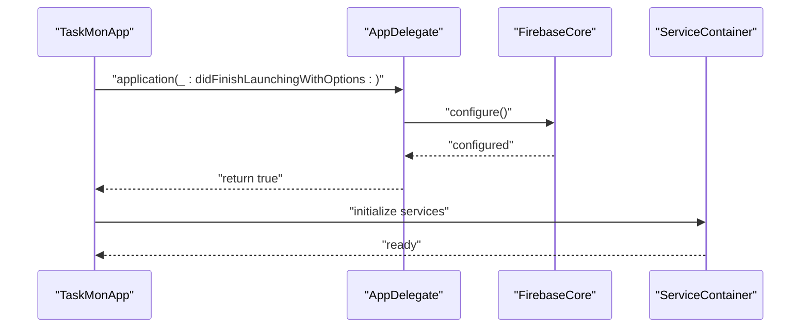
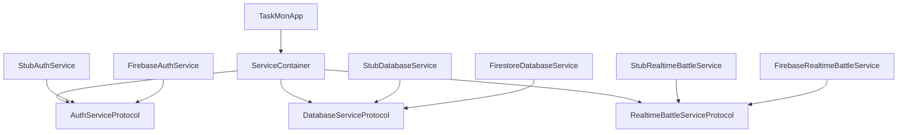

# Deployment & Distribution

<cite>
**Referenced Files in This Document**
- [project.pbxproj](file://TaskMon/TaskMon.xcodeproj/project.pbxproj)
- [GoogleService-Info.plist](file://TaskMon/TaskMon/GoogleService-Info.plist)
- [TaskMonApp.swift](file://TaskMon/TaskMon/TaskMonApp.swift)
- [FirebaseService.swift](file://TaskMon/TaskMon/Services/FirebaseService.swift)
- [FirebaseImplementation.swift](file://TaskMon/TaskMon/Services/FirebaseImplementation.swift)
- [AppIcon Contents.json](file://TaskMon/TaskMon/Assets.xcassets/AppIcon.appiconset/Contents.json)
- [xcschememanagement.plist](file://TaskMon/TaskMon.xcodeproj/xcuserdata/leeteckxian.xcuserdatad/xcschemes/xcschememanagement.plist)
- [Package.resolved](file://TaskMon/TaskMon.xcodeproj/project.xcworkspace/xcshareddata/swiftpm/Package.resolved)
</cite>

## Table of Contents
1. [Introduction](#introduction)
2. [Project Structure](#project-structure)
3. [Core Components](#core-components)
4. [Architecture Overview](#architecture-overview)
5. [Detailed Component Analysis](#detailed-component-analysis)
6. [Dependency Analysis](#dependency-analysis)
7. [Performance Considerations](#performance-considerations)
8. [Testing Procedures](#testing-procedures)
9. [Security Considerations](#security-considerations)
10. [CI/CD Automation](#cicd-automation)
11. [Rollback and Hotfix Procedures](#rollback-and-hotfix-procedures)
12. [Post-Release Monitoring](#post-release-monitoring)
13. [Troubleshooting Guide](#troubleshooting-guide)
14. [Conclusion](#conclusion)

## Introduction
This document provides comprehensive deployment and distribution guidance for the TaskMon iOS application. It covers Xcode build configuration, App Store submission prerequisites, Firebase configuration for production, performance optimization strategies, testing procedures, security considerations, CI/CD automation, rollback and hotfix processes, and troubleshooting for common deployment issues.

## Project Structure
TaskMon is a Swift-based SwiftUI iOS application built with Xcode. The project integrates Firebase services via Swift Package Manager and includes a dedicated GoogleService-Info.plist for Firebase configuration. The build system defines Debug and Release configurations with distinct compiler and linker settings suitable for development and production builds.

**Diagram sources**
- [project.pbxproj](file://TaskMon/TaskMon.xcodeproj/project.pbxproj#L235-L252)
- [project.pbxproj](file://TaskMon/TaskMon.xcodeproj/project.pbxproj#L89-L99)
- [project.pbxproj](file://TaskMon/TaskMon.xcodeproj/project.pbxproj#L289-L298)
- [AppIcon Contents.json](file://TaskMon/TaskMon/Assets.xcassets/AppIcon.appiconset/Contents.json#L1-L14)
- [GoogleService-Info.plist](file://TaskMon/TaskMon/GoogleService-Info.plist#L1-L30)

**Section sources**
- [project.pbxproj](file://TaskMon/TaskMon.xcodeproj/project.pbxproj#L235-L252)
- [project.pbxproj](file://TaskMon/TaskMon.xcodeproj/project.pbxproj#L89-L99)
- [project.pbxproj](file://TaskMon/TaskMon.xcodeproj/project.pbxproj#L289-L298)
- [AppIcon Contents.json](file://TaskMon/TaskMon/Assets.xcassets/AppIcon.appiconset/Contents.json#L1-L14)
- [GoogleService-Info.plist](file://TaskMon/TaskMon/GoogleService-Info.plist#L1-L30)

## Core Components
- Build configurations: Debug and Release with separate build settings for compilation, linking, and code signing.
- Target product type: iOS Application.
- Resource inclusion: App icons catalog and GoogleService-Info.plist.
- Firebase SDK integration via Swift Package Manager with FirebaseAuth, FirebaseFirestore, and FirebaseDatabase.

Key build settings differences:
- Debug configuration emphasizes diagnostics and development ergonomics (e.g., debug info format, testability, and lower optimization).
- Release configuration enables stricter validations and whole-module compilation for performance and binary size.

**Section sources**
- [project.pbxproj](file://TaskMon/TaskMon.xcodeproj/project.pbxproj#L344-L463)
- [project.pbxproj](file://TaskMon/TaskMon.xcodeproj/project.pbxproj#L235-L252)
- [project.pbxproj](file://TaskMon/TaskMon.xcodeproj/project.pbxproj#L289-L298)

## Architecture Overview
The app initializes Firebase during application launch and exposes environment objects for view models. Firebase services are abstracted behind protocol-based stub implementations, enabling seamless switching to production Firebase services when configured.

**Diagram sources**
- [TaskMonApp.swift](file://TaskMon/TaskMon/TaskMonApp.swift#L4-L10)
- [FirebaseImplementation.swift](file://TaskMon/TaskMon/Services/FirebaseImplementation.swift#L182-L189)

**Section sources**
- [TaskMonApp.swift](file://TaskMon/TaskMon/TaskMonApp.swift#L4-L10)
- [FirebaseImplementation.swift](file://TaskMon/TaskMon/Services/FirebaseImplementation.swift#L182-L189)

## Detailed Component Analysis

### Xcode Build Configuration
- Build targets: Single iOS application target named TaskMon.
- Build phases: Sources, Frameworks, and Resources.
- Debug vs Release:
  - Debug: Lower optimization (-Onone), debug info with DWARF, testability enabled, MTL fast math enabled, and active architecture filtering.
  - Release: Whole-module compilation, strict validations, optimized debug info, and Metal fast math disabled for correctness.

Optimization flags and settings:
- Swift optimization level: Debug uses -Onone; Release uses whole-module compilation.
- Compiler warnings and analyzer settings are enabled in both configurations.
- Deployment target: iOS 17.0.

Code signing and provisioning:
- Automatic signing is enabled with a development team identifier.
- Bundle identifier and marketing version are defined per configuration.

**Section sources**
- [project.pbxproj](file://TaskMon/TaskMon.xcodeproj/project.pbxproj#L344-L463)
- [project.pbxproj](file://TaskMon/TaskMon.xcodeproj/project.pbxproj#L235-L252)

### App Store Submission Requirements
- Provisioning profiles and certificates:
  - Automatic signing is configured; ensure a valid Apple Developer account and team are selected in Xcode.
- App icon requirements:
  - AppIcon asset catalog includes a universal 1024x1024 icon entry. Ensure all required sizes are provided in the asset catalog for App Store packaging.
- Metadata preparation:
  - Product bundle identifier, marketing version, and supported orientations are defined in build settings.
  - Launch screen and scene manifest keys are generated automatically.

Note: This section consolidates requirements inferred from project settings. For precise App Store guidelines, consult Apple’s official documentation.

**Section sources**
- [project.pbxproj](file://TaskMon/TaskMon.xcodeproj/project.pbxproj#L464-L517)
- [AppIcon Contents.json](file://TaskMon/TaskMon/Assets.xcassets/AppIcon.appiconset/Contents.json#L1-L14)

### Firebase Configuration for Production
- GoogleService-Info.plist:
  - Contains API key, GCM sender ID, bundle ID, project ID, storage bucket, and app ID.
  - Included as a resource in the target and frameworks build phase.
- Service abstraction:
  - Protocol-based stub implementations allow local-only operation.
  - Real Firebase implementations are gated by comments and imports; swap stubs with Firebase implementations when ready.
- Initialization:
  - Firebase is initialized in the application delegate during launch.

Production setup steps:
- Confirm GoogleService-Info.plist is present and included in the target resources.
- Link Firebase SDK via Swift Package Manager.
- Enable Firebase imports and replace stub services with Firebase implementations.
- Configure Firebase services in the ServiceContainer.

**Section sources**
- [GoogleService-Info.plist](file://TaskMon/TaskMon/GoogleService-Info.plist#L1-L30)
- [project.pbxproj](file://TaskMon/TaskMon.xcodeproj/project.pbxproj#L89-L99)
- [project.pbxproj](file://TaskMon/TaskMon.xcodeproj/project.pbxproj#L289-L298)
- [TaskMonApp.swift](file://TaskMon/TaskMon/TaskMonApp.swift#L4-L10)
- [FirebaseService.swift](file://TaskMon/TaskMon/Services/FirebaseService.swift#L37-L142)
- [FirebaseImplementation.swift](file://TaskMon/TaskMon/Services/FirebaseImplementation.swift#L11-L14)

### Performance Optimization Strategies
- Code signing verification:
  - Ensure automatic signing is configured and valid provisioning profiles are installed.
- App thinning:
  - Build for device architectures appropriate for your deployment target; Xcode manages bitcode and slicing for distribution.
- Bundle size reduction:
  - Remove unused assets from Assets.xcassets.
  - Consolidate images and leverage vector assets where possible.
  - Minimize third-party dependencies and verify their impact on binary size.
- Build-time optimizations:
  - Use Release configuration for production builds.
  - Keep whole-module compilation enabled for Release.
  - Disable debug symbols and assertions in Release.

**Section sources**
- [project.pbxproj](file://TaskMon/TaskMon.xcodeproj/project.pbxproj#L408-L463)
- [project.pbxproj](file://TaskMon/TaskMon.xcodeproj/project.pbxproj#L464-L517)

### Testing Procedures for Production Builds
- Device testing:
  - Validate builds on physical devices with the intended iOS version.
- Beta distribution:
  - Use TestFlight for internal and external beta testing via App Store Connect.
- Crash reporting:
  - Integrate Firebase Crashlytics or another crash reporting solution after enabling Firebase in production.

Note: Firebase Crashlytics integration requires additional setup beyond the current Firebase configuration.

**Section sources**
- [FirebaseImplementation.swift](file://TaskMon/TaskMon/Services/FirebaseImplementation.swift#L11-L14)

### Security Considerations for Production
- Keychain access:
  - Avoid storing sensitive credentials in the app bundle; rely on secure server-side authentication.
- Data encryption:
  - Use HTTPS/TLS for network communications; avoid transmitting secrets in cleartext.
- Privacy compliance:
  - Comply with applicable privacy regulations; provide a privacy policy and manage user consent appropriately.

**Section sources**
- [GoogleService-Info.plist](file://TaskMon/TaskMon/GoogleService-Info.plist#L1-L30)

### CI/CD Automation
- Swift Package Manager resolution:
  - The Package.resolved file pins Firebase SDK versions; keep this file under version control to ensure reproducible builds.
- Scheme management:
  - The project includes a shared scheme managed by Xcode; define CI-specific build scripts to archive and export signed binaries.

Recommended CI steps:
- Install dependencies and resolve SPM packages.
- Build the Release configuration for the desired platform.
- Archive the app and export an IPA for distribution.
- Upload to App Store Connect or distribute via TestFlight.

**Section sources**
- [Package.resolved](file://TaskMon/TaskMon.xcodeproj/project.xcworkspace/xcshareddata/swiftpm/Package.resolved#L1-L86)
- [xcschememanagement.plist](file://TaskMon/TaskMon.xcodeproj/xcuserdata/leeteckxian.xcuserdatad/xcschemes/xcschememanagement.plist#L1-L15)

## Dependency Analysis
The project links Firebase SDK products via Swift Package Manager and includes GoogleService-Info.plist as a resource. The ServiceContainer demonstrates dependency inversion, allowing stub implementations to be swapped for production services.

**Diagram sources**
- [FirebaseService.swift](file://TaskMon/TaskMon/Services/FirebaseService.swift#L8-L35)
- [FirebaseService.swift](file://TaskMon/TaskMon/Services/FirebaseService.swift#L37-L142)
- [FirebaseImplementation.swift](file://TaskMon/TaskMon/Services/FirebaseImplementation.swift#L182-L189)

**Section sources**
- [FirebaseService.swift](file://TaskMon/TaskMon/Services/FirebaseService.swift#L8-L35)
- [FirebaseService.swift](file://TaskMon/TaskMon/Services/FirebaseService.swift#L37-L142)
- [FirebaseImplementation.swift](file://TaskMon/TaskMon/Services/FirebaseImplementation.swift#L182-L189)

## Performance Considerations
- Build configuration:
  - Prefer Release for production to enable optimizations and stricter validations.
- Graphics and rendering:
  - Metal fast math is enabled in Debug but disabled in Release; maintain this separation to balance development diagnostics and runtime performance.
- Asset optimization:
  - Ensure app icons and images are sized appropriately to minimize memory footprint.

**Section sources**
- [project.pbxproj](file://TaskMon/TaskMon.xcodeproj/project.pbxproj#L374-L460)

## Testing Procedures
- Device testing:
  - Test on devices running the target iOS version to catch device-specific regressions.
- Beta distribution:
  - Use TestFlight for controlled beta releases; monitor feedback and crash reports.
- Crash reporting:
  - Integrate a crash reporting solution in production builds.

**Section sources**
- [FirebaseImplementation.swift](file://TaskMon/TaskMon/Services/FirebaseImplementation.swift#L11-L14)

## Security Considerations
- Avoid embedding secrets in the app bundle; use backend authentication and secure APIs.
- Ensure network traffic is encrypted and sensitive data is handled securely.

**Section sources**
- [GoogleService-Info.plist](file://TaskMon/TaskMon/GoogleService-Info.plist#L1-L30)

## CI/CD Automation
- Swift Package Manager:
  - Pin dependencies in Package.resolved to ensure deterministic builds.
- Scheme and automation:
  - Define CI jobs to build, archive, and export the app for distribution.

**Section sources**
- [Package.resolved](file://TaskMon/TaskMon.xcodeproj/project.xcworkspace/xcshareddata/swiftpm/Package.resolved#L1-L86)
- [xcschememanagement.plist](file://TaskMon/TaskMon.xcodeproj/xcuserdata/leeteckxian.xcuserdatad/xcschemes/xcschememanagement.plist#L1-L15)

## Rollback and Hotfix Procedures
- Version control:
  - Tag releases and maintain a changelog for quick rollbacks.
- Hotfix deployment:
  - Create a hotfix branch from the last known good commit, apply minimal changes, and rebuild with Release configuration.
- Distribution:
  - Re-upload the fixed build to TestFlight or App Store Connect as appropriate.

[No sources needed since this section provides general guidance]

## Post-Release Monitoring
- Monitor crash reports and user feedback.
- Track performance metrics and battery usage on real devices.
- Plan incremental updates and feature toggles if needed.

[No sources needed since this section provides general guidance]

## Troubleshooting Guide
- Build failures:
  - Verify Swift Package Manager dependencies are resolved and up-to-date.
  - Ensure GoogleService-Info.plist is included in the target resources.
- Provisioning profile errors:
  - Confirm automatic signing is enabled and a valid development team is selected.
- App Store rejections:
  - Review App Store Connect messages and ensure all icons and metadata meet requirements.

**Section sources**
- [project.pbxproj](file://TaskMon/TaskMon.xcodeproj/project.pbxproj#L289-L298)
- [project.pbxproj](file://TaskMon/TaskMon.xcodeproj/project.pbxproj#L464-L517)

## Conclusion
This guide outlines the deployment and distribution process for TaskMon, covering Xcode build configuration, App Store submission prerequisites, Firebase setup, performance optimization, testing, security, CI/CD automation, and operational procedures. By following these practices, teams can reliably deliver production-quality builds and maintain a robust release pipeline.