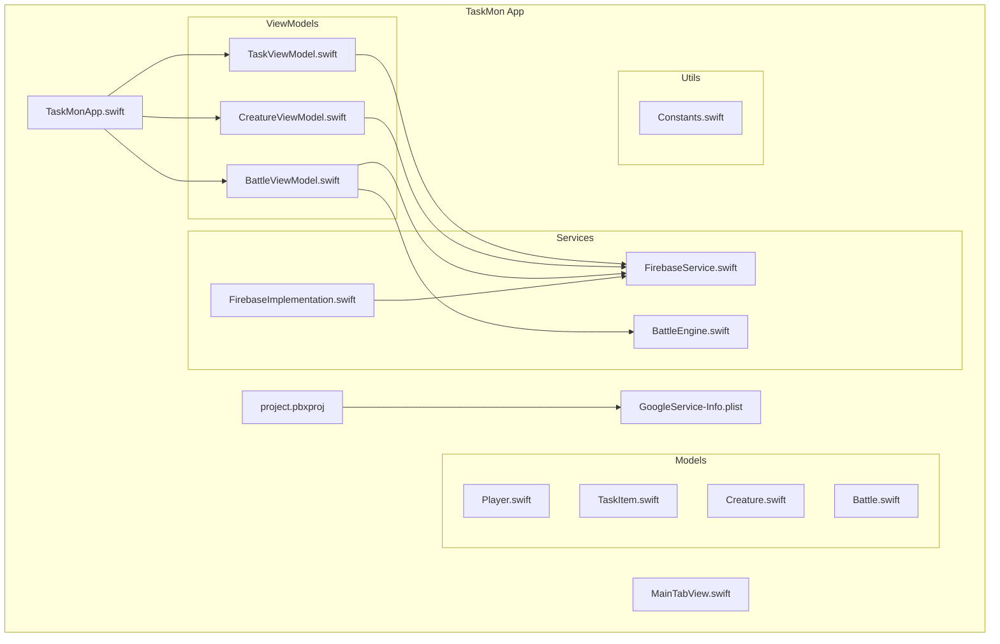
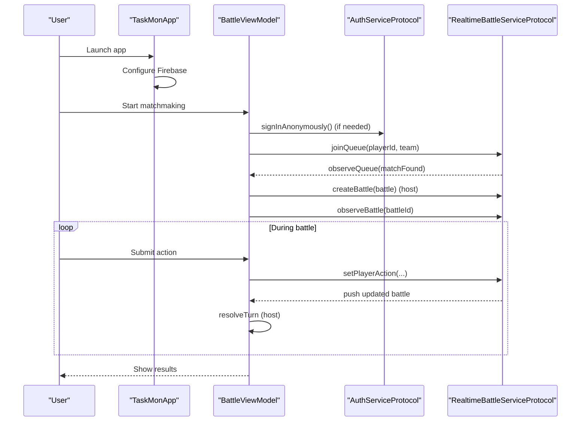
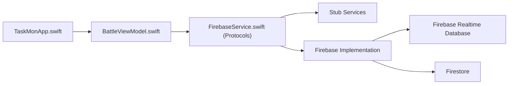
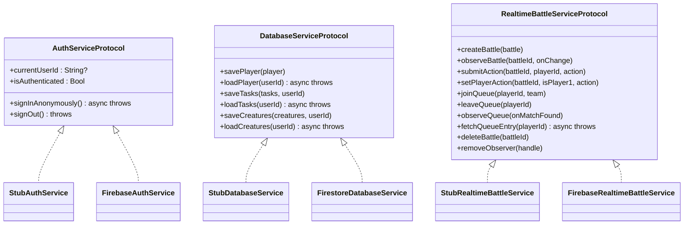

# Getting Started

<cite>
**Referenced Files in This Document**
- [project.pbxproj](file://TaskMon/TaskMon.xcodeproj/project.pbxproj)
- [GoogleService-Info.plist](file://TaskMon/TaskMon/GoogleService-Info.plist)
- [TaskMonApp.swift](file://TaskMon/TaskMon/TaskMonApp.swift)
- [FirebaseService.swift](file://TaskMon/TaskMon/Services/FirebaseService.swift)
- [FirebaseImplementation.swift](file://TaskMon/TaskMon/Services/FirebaseImplementation.swift)
- [BattleViewModel.swift](file://TaskMon/TaskMon/ViewModels/BattleViewModel.swift)
- [TaskViewModel.swift](file://TaskMon/TaskMon/ViewModels/TaskViewModel.swift)
- [CreatureViewModel.swift](file://TaskMon/TaskMon/ViewModels/CreatureViewModel.swift)
- [BattleEngine.swift](file://TaskMon/TaskMon/Services/BattleEngine.swift)
- [Constants.swift](file://TaskMon/TaskMon/Utils/Constants.swift)
- [MainTabView.swift](file://TaskMon/TaskMon/Views/MainTabView.swift)
</cite>

## Table of Contents
1. [Introduction](#introduction)
2. [Project Structure](#project-structure)
3. [Core Components](#core-components)
4. [Architecture Overview](#architecture-overview)
5. [Detailed Component Analysis](#detailed-component-analysis)
6. [Dependency Analysis](#dependency-analysis)
7. [Performance Considerations](#performance-considerations)
8. [Troubleshooting Guide](#troubleshooting-guide)
9. [Conclusion](#conclusion)
10. [Appendices](#appendices)

## Introduction
This guide helps you set up the TaskMon development environment, configure Firebase for optional real-time multiplayer features, and run the app on simulators and physical devices. It also covers code signing, team provisioning, and performance tips for faster iteration.

## Project Structure
TaskMon is a SwiftUI iOS application organized into Models, ViewModels, Views, Services, and Utils. The Xcode project integrates Firebase via Swift Package Manager and includes a GoogleService-Info.plist resource for Firebase configuration.

**Diagram sources**
- [project.pbxproj](file://TaskMon/TaskMon.xcodeproj/project.pbxproj#L255-L286)
- [GoogleService-Info.plist](file://TaskMon/TaskMon/GoogleService-Info.plist#L1-L30)
- [TaskMonApp.swift](file://TaskMon/TaskMon/TaskMonApp.swift#L1-L33)
- [FirebaseService.swift](file://TaskMon/TaskMon/Services/FirebaseService.swift#L1-L143)
- [FirebaseImplementation.swift](file://TaskMon/TaskMon/Services/FirebaseImplementation.swift#L1-L190)
- [BattleViewModel.swift](file://TaskMon/TaskMon/ViewModels/BattleViewModel.swift#L1-L462)
- [TaskViewModel.swift](file://TaskMon/TaskMon/ViewModels/TaskViewModel.swift#L1-L76)
- [CreatureViewModel.swift](file://TaskMon/TaskMon/ViewModels/CreatureViewModel.swift#L1-L90)
- [BattleEngine.swift](file://TaskMon/TaskMon/Services/BattleEngine.swift#L1-L170)
- [Constants.swift](file://TaskMon/TaskMon/Utils/Constants.swift#L1-L40)
- [MainTabView.swift](file://TaskMon/TaskMon/Views/MainTabView.swift#L1-L29)

**Section sources**
- [project.pbxproj](file://TaskMon/TaskMon.xcodeproj/project.pbxproj#L102-L233)
- [GoogleService-Info.plist](file://TaskMon/TaskMon/GoogleService-Info.plist#L1-L30)

## Core Components
- App entrypoint initializes Firebase and wires global ViewModels.
- Firebase abstractions provide stub implementations for offline/local play and real Firebase-backed implementations.
- BattleViewModel coordinates local and online battles, including matchmaking and real-time updates.
- ViewModels manage persistence and state for tasks, creatures, and battle sessions.
- BattleEngine performs turn resolution and AI actions deterministically.

**Section sources**
- [TaskMonApp.swift](file://TaskMon/TaskMon/TaskMonApp.swift#L4-L10)
- [FirebaseService.swift](file://TaskMon/TaskMon/Services/FirebaseService.swift#L8-L36)
- [FirebaseImplementation.swift](file://TaskMon/TaskMon/Services/FirebaseImplementation.swift#L18-L37)
- [BattleViewModel.swift](file://TaskMon/TaskMon/ViewModels/BattleViewModel.swift#L36-L47)
- [TaskViewModel.swift](file://TaskMon/TaskMon/ViewModels/TaskViewModel.swift#L64-L74)
- [CreatureViewModel.swift](file://TaskMon/TaskMon/ViewModels/CreatureViewModel.swift#L78-L88)
- [BattleEngine.swift](file://TaskMon/TaskMon/Services/BattleEngine.swift#L3-L66)

## Architecture Overview
The app supports two modes:
- Local mode: Uses stub services and UserDefaults for persistence.
- Online mode: Uses Firebase services for authentication, Firestore for user data, and Realtime Database for live battle coordination.

**Diagram sources**
- [TaskMonApp.swift](file://TaskMon/TaskMon/TaskMonApp.swift#L4-L10)
- [BattleViewModel.swift](file://TaskMon/TaskMon/ViewModels/BattleViewModel.swift#L167-L281)
- [FirebaseService.swift](file://TaskMon/TaskMon/Services/FirebaseService.swift#L39-L62)
- [FirebaseImplementation.swift](file://TaskMon/TaskMon/Services/FirebaseImplementation.swift#L19-L37)
- [FirebaseImplementation.swift](file://TaskMon/TaskMon/Services/FirebaseImplementation.swift#L98-L177)

## Detailed Component Analysis

### Development Environment Prerequisites
- Xcode: The project sets a minimum Xcode compatibility version and target tools version in the Xcode project file.
- iOS deployment target: Configured to 17.0 in build settings.
- Swift language: Swift 5.0 is declared in build settings.
- Firebase SDK: Integrated via Swift Package Manager with firebase-ios-sdk requirement.

**Section sources**
- [project.pbxproj](file://TaskMon/TaskMon.xcodeproj/project.pbxproj#L259-L266)
- [project.pbxproj](file://TaskMon/TaskMon.xcodeproj/project.pbxproj#L397-L397)
- [project.pbxproj](file://TaskMon/TaskMon.xcodeproj/project.pbxproj#L486-L486)
- [project.pbxproj](file://TaskMon/TaskMon.xcodeproj/project.pbxproj#L542-L549)

### Step-by-Step Setup

1) Clone the repository
- Use your preferred Git client to clone the repository to your machine.

2) Open the project
- Navigate to the repository root and open the Xcode workspace or project file located under TaskMon/TaskMon.xcodeproj.

3) Install dependencies
- Xcode will automatically fetch Swift Package Manager dependencies after opening the project. Confirm “Enable Firebase” steps below to integrate Firebase services.

4) Configure Firebase (optional)
- Add GoogleService-Info.plist to your project target and ensure it is included in the app bundle.
- Enable Firebase services by uncommenting the Firebase imports and switching to Firebase implementations in the ServiceContainer.

5) Build and run
- Select a simulator or connected device and run the TaskMon target.

**Section sources**
- [project.pbxproj](file://TaskMon/TaskMon.xcodeproj/project.pbxproj#L542-L549)
- [GoogleService-Info.plist](file://TaskMon/TaskMon/GoogleService-Info.plist#L1-L30)
- [FirebaseImplementation.swift](file://TaskMon/TaskMon/Services/FirebaseImplementation.swift#L11-L14)
- [FirebaseImplementation.swift](file://TaskMon/TaskMon/Services/FirebaseImplementation.swift#L182-L189)

### Xcode Project Configuration

- Build Settings
  - iOS Deployment Target: 17.0
  - Swift Language Version: 5.0
  - Code Signing Style: Automatic
  - Development Team: Set to your Apple Team ID

- Frameworks and Resources
  - FirebaseAuth, FirebaseFirestore, FirebaseDatabase are linked via Swift Package Manager.
  - GoogleService-Info.plist is included as a Resource.

- Targets and Schemes
  - Single target TaskMon app with Debug and Release configurations.

**Section sources**
- [project.pbxproj](file://TaskMon/TaskMon.xcodeproj/project.pbxproj#L397-L397)
- [project.pbxproj](file://TaskMon/TaskMon.xcodeproj/project.pbxproj#L486-L486)
- [project.pbxproj](file://TaskMon/TaskMon.xcodeproj/project.pbxproj#L469-L469)
- [project.pbxproj](file://TaskMon/TaskMon.xcodeproj/project.pbxproj#L496-L496)
- [project.pbxproj](file://TaskMon/TaskMon.xcodeproj/project.pbxproj#L90-L99)
- [project.pbxproj](file://TaskMon/TaskMon.xcodeproj/project.pbxproj#L255-L286)

### Firebase Integration Options

- Authentication
  - Stub: Anonymous sign-in with local persistence.
  - Firebase: FirebaseAuth integration enabled via imports and ServiceContainer.

- Database
  - Stub: UserDefaults-based persistence for tasks and creatures.
  - Firebase: Firestore for user data and Realtime Database for live battles.

- Real-time Multiplayer
  - Queue-based matchmaking and live battle updates via Firebase Realtime Database.

- Enabling Firebase
  - Add GoogleService-Info.plist to the app target.
  - Uncomment Firebase imports in FirebaseImplementation.swift.
  - Switch ServiceContainer implementations to Firebase-backed services.

**Section sources**
- [FirebaseService.swift](file://TaskMon/TaskMon/Services/FirebaseService.swift#L39-L62)
- [FirebaseService.swift](file://TaskMon/TaskMon/Services/FirebaseService.swift#L66-L98)
- [FirebaseService.swift](file://TaskMon/TaskMon/Services/FirebaseService.swift#L102-L142)
- [FirebaseImplementation.swift](file://TaskMon/TaskMon/Services/FirebaseImplementation.swift#L11-L14)
- [FirebaseImplementation.swift](file://TaskMon/TaskMon/Services/FirebaseImplementation.swift#L182-L189)
- [GoogleService-Info.plist](file://TaskMon/TaskMon/GoogleService-Info.plist#L1-L30)

### Running on Simulators and Devices
- Simulator: Select an iOS 17.0+ simulator and run.
- Physical Device: Connect a device, ensure your Apple Team is selected, and run with Automatic signing.

**Section sources**
- [project.pbxproj](file://TaskMon/TaskMon.xcodeproj/project.pbxproj#L397-L397)
- [project.pbxproj](file://TaskMon/TaskMon.xcodeproj/project.pbxproj#L469-L469)
- [project.pbxproj](file://TaskMon/TaskMon.xcodeproj/project.pbxproj#L496-L496)

### Troubleshooting Common Issues

- Dependency Resolution Failures
  - Ensure Xcode can reach the Swift Package Manager registry and that the firebase-ios-sdk package URL is reachable.
  - Verify the package requirement range allows updates.

- Build Errors
  - Confirm Swift Language Version is set to 5.0.
  - Ensure iOS Deployment Target is 17.0 or higher.

- Firebase Configuration Problems
  - Verify GoogleService-Info.plist is present in the target and copied into the app bundle.
  - Confirm Firebase imports are enabled and ServiceContainer uses Firebase implementations.
  - Check that the app configures Firebase during application launch.

- Real-time Multiplayer Not Working
  - Ensure anonymous sign-in is available when Firebase is enabled.
  - Verify queue and battle paths exist in your Firebase Realtime Database rules and Firestore security rules.

**Section sources**
- [project.pbxproj](file://TaskMon/TaskMon.xcodeproj/project.pbxproj#L542-L549)
- [project.pbxproj](file://TaskMon/TaskMon.xcodeproj/project.pbxproj#L486-L486)
- [project.pbxproj](file://TaskMon/TaskMon.xcodeproj/project.pbxproj#L397-L397)
- [GoogleService-Info.plist](file://TaskMon/TaskMon/GoogleService-Info.plist#L1-L30)
- [FirebaseImplementation.swift](file://TaskMon/TaskMon/Services/FirebaseImplementation.swift#L11-L14)
- [FirebaseImplementation.swift](file://TaskMon/TaskMon/Services/FirebaseImplementation.swift#L182-L189)
- [TaskMonApp.swift](file://TaskMon/TaskMon/TaskMonApp.swift#L4-L10)

### Code Signing and Team Provisioning
- Code Signing Style is Automatic.
- DEVELOPMENT_TEAM must be set to your Apple Team ID in build settings.
- Ensure your Apple ID is configured in Xcode Preferences > Accounts.

**Section sources**
- [project.pbxproj](file://TaskMon/TaskMon.xcodeproj/project.pbxproj#L469-L469)
- [project.pbxproj](file://TaskMon/TaskMon.xcodeproj/project.pbxproj#L496-L496)

## Dependency Analysis
The project relies on Swift Package Manager for Firebase SDK integration and includes GoogleService-Info.plist as a resource. The ViewModel layer depends on protocol-based services to support stub implementations and easy swapping to Firebase-backed implementations.

**Diagram sources**
- [project.pbxproj](file://TaskMon/TaskMon.xcodeproj/project.pbxproj#L542-L549)
- [GoogleService-Info.plist](file://TaskMon/TaskMon/GoogleService-Info.plist#L1-L30)
- [FirebaseService.swift](file://TaskMon/TaskMon/Services/FirebaseService.swift#L8-L36)
- [FirebaseImplementation.swift](file://TaskMon/TaskMon/Services/FirebaseImplementation.swift#L182-L189)

**Section sources**
- [project.pbxproj](file://TaskMon/TaskMon.xcodeproj/project.pbxproj#L542-L549)
- [FirebaseService.swift](file://TaskMon/TaskMon/Services/FirebaseService.swift#L8-L36)
- [FirebaseImplementation.swift](file://TaskMon/TaskMon/Services/FirebaseImplementation.swift#L182-L189)

## Performance Considerations
- Development builds
  - Debug configuration disables optimizations and enables strict diagnostics.
  - Only Active Architecture is enabled for faster builds on the host platform.
- Iteration tips
  - Use the simulator for rapid testing.
  - Keep Firebase disabled locally to avoid network overhead during development.
  - Use stub services for offline development and testing.

**Section sources**
- [project.pbxproj](file://TaskMon/TaskMon.xcodeproj/project.pbxproj#L386-L404)
- [project.pbxproj](file://TaskMon/TaskMon.xcodeproj/project.pbxproj#L408-L463)
- [project.pbxproj](file://TaskMon/TaskMon.xcodeproj/project.pbxproj#L401-L401)
- [FirebaseService.swift](file://TaskMon/TaskMon/Services/FirebaseService.swift#L39-L62)

## Troubleshooting Guide
- Firebase not initializing
  - Confirm GoogleService-Info.plist is added to the target and copied into the app bundle.
  - Ensure FirebaseApp.configure is called during application launch.

- Anonymous sign-in fails
  - Verify FirebaseAuth is linked and imported.
  - Check that ServiceContainer uses FirebaseAuthService.

- Real-time updates not received
  - Confirm queue and battle observers are registered and handles are retained until cleanup.
  - Ensure Realtime Database rules allow reads/writes for testing.

- Persistence not saving
  - For stub services, confirm UserDefaults keys are present.
  - For Firestore, verify Firestore rules permit writes.

**Section sources**
- [GoogleService-Info.plist](file://TaskMon/TaskMon/GoogleService-Info.plist#L1-L30)
- [TaskMonApp.swift](file://TaskMon/TaskMon/TaskMonApp.swift#L4-L10)
- [FirebaseImplementation.swift](file://TaskMon/TaskMon/Services/FirebaseImplementation.swift#L11-L14)
- [FirebaseImplementation.swift](file://TaskMon/TaskMon/Services/FirebaseImplementation.swift#L182-L189)
- [BattleViewModel.swift](file://TaskMon/TaskMon/ViewModels/BattleViewModel.swift#L285-L294)
- [TaskViewModel.swift](file://TaskMon/TaskMon/ViewModels/TaskViewModel.swift#L64-L74)
- [CreatureViewModel.swift](file://TaskMon/TaskMon/ViewModels/CreatureViewModel.swift#L78-L88)

## Conclusion
You now have the essentials to set up TaskMon, configure Firebase for optional multiplayer features, and run the app locally. Start with stub services for development, then enable Firebase when you want to test real-time features.

## Appendices

### Appendix A: Firebase Service Protocols and Implementations

**Diagram sources**
- [FirebaseService.swift](file://TaskMon/TaskMon/Services/FirebaseService.swift#L8-L36)
- [FirebaseService.swift](file://TaskMon/TaskMon/Services/FirebaseService.swift#L39-L62)
- [FirebaseService.swift](file://TaskMon/TaskMon/Services/FirebaseService.swift#L66-L98)
- [FirebaseService.swift](file://TaskMon/TaskMon/Services/FirebaseService.swift#L102-L142)
- [FirebaseImplementation.swift](file://TaskMon/TaskMon/Services/FirebaseImplementation.swift#L19-L37)
- [FirebaseImplementation.swift](file://TaskMon/TaskMon/Services/FirebaseImplementation.swift#L41-L94)
- [FirebaseImplementation.swift](file://TaskMon/TaskMon/Services/FirebaseImplementation.swift#L98-L177)