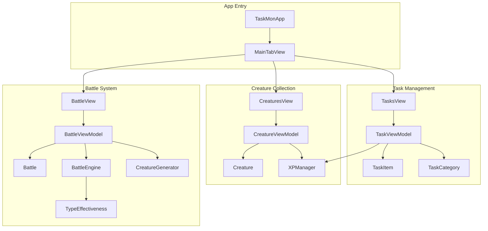
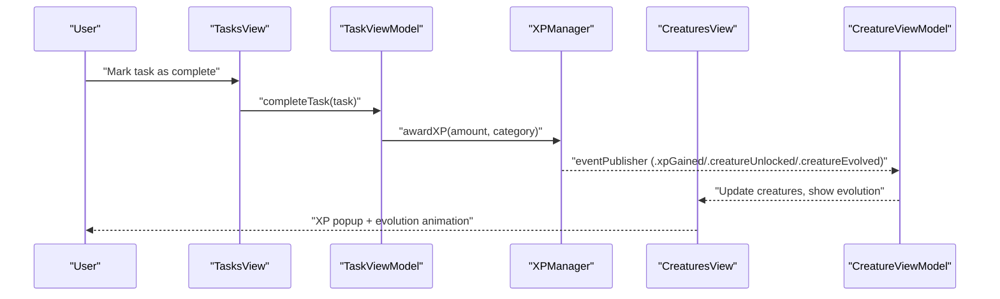
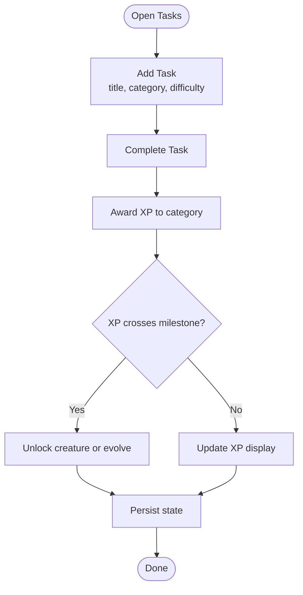
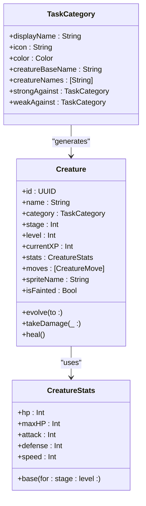
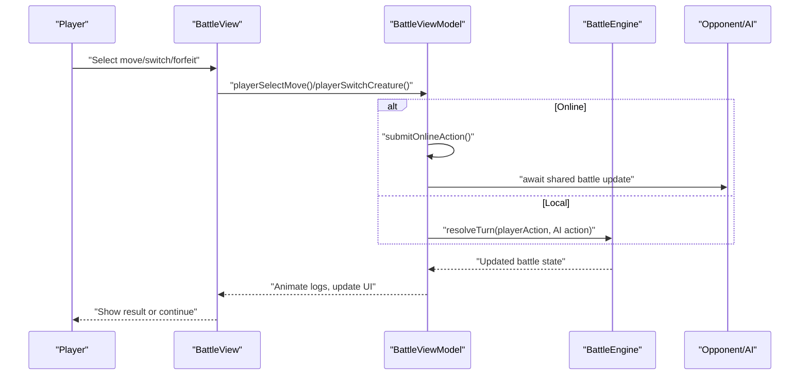
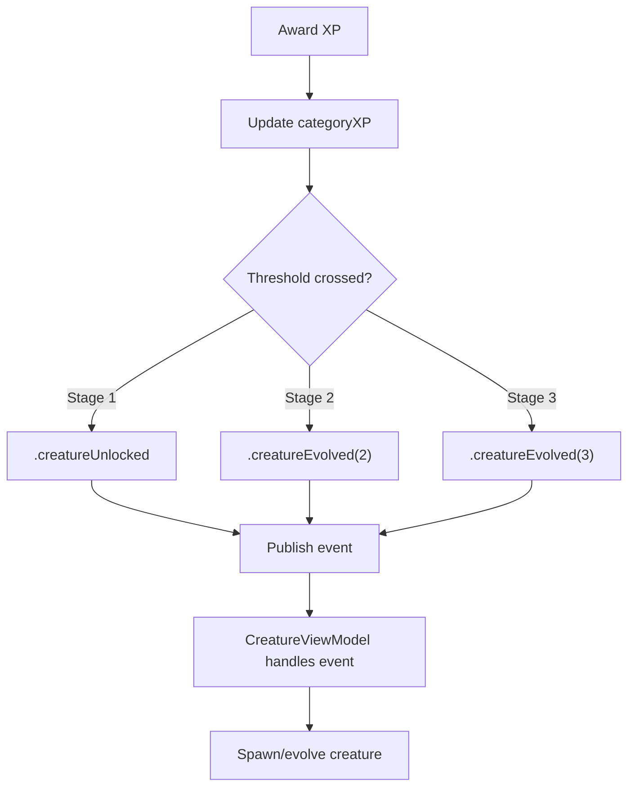
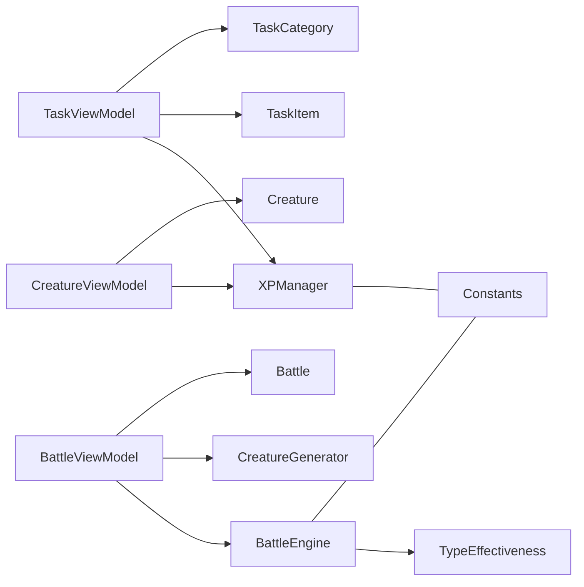

# Project Overview

<cite>
**Referenced Files in This Document**
- [TaskMonApp.swift](file://TaskMon/TaskMon/TaskMonApp.swift)
- [MainTabView.swift](file://TaskMon/TaskMon/Views/MainTabView.swift)
- [TaskViewModel.swift](file://TaskMon/TaskMon/ViewModels/TaskViewModel.swift)
- [CreatureViewModel.swift](file://TaskMon/TaskMon/ViewModels/CreatureViewModel.swift)
- [BattleViewModel.swift](file://TaskMon/TaskMon/ViewModels/BattleViewModel.swift)
- [TaskItem.swift](file://TaskMon/TaskMon/Models/TaskItem.swift)
- [TaskCategory.swift](file://TaskMon/TaskMon/Models/TaskCategory.swift)
- [Creature.swift](file://TaskMon/TaskMon/Models/Creature.swift)
- [Battle.swift](file://TaskMon/TaskMon/Models/Battle.swift)
- [XPManager.swift](file://TaskMon/TaskMon/Services/XPManager.swift)
- [BattleEngine.swift](file://TaskMon/TaskMon/Services/BattleEngine.swift)
- [CreatureGenerator.swift](file://TaskMon/TaskMon/Services/CreatureGenerator.swift)
- [TypeEffectiveness.swift](file://TaskMon/TaskMon/Utils/TypeEffectiveness.swift)
- [Constants.swift](file://TaskMon/TaskMon/Utils/Constants.swift)
- [TasksView.swift](file://TaskMon/TaskMon/Views/Tasks/TasksView.swift)
- [CreaturesView.swift](file://TaskMon/TaskMon/Views/Creatures/CreaturesView.swift)
- [BattleView.swift](file://TaskMon/TaskMon/Views/Battle/BattleView.swift)
</cite>

## Table of Contents
1. [Introduction](#introduction)
2. [Project Structure](#project-structure)
3. [Core Components](#core-components)
4. [Architecture Overview](#architecture-overview)
5. [Detailed Component Analysis](#detailed-component-analysis)
6. [Dependency Analysis](#dependency-analysis)
7. [Performance Considerations](#performance-considerations)
8. [Troubleshooting Guide](#troubleshooting-guide)
9. [Conclusion](#conclusion)

## Introduction
TaskMon is an iOS productivity gamification application that turns everyday task completion into an engaging journey of collecting and raising digital creatures. Its core value proposition is to increase motivation and consistency by rewarding productivity with XP, unlocking creatures per task category, and progressing them through evolutionary stages. Players can battle their creatures in turn-based duels, adding a strategic and social dimension to daily routines.

Target audience:
- Busy professionals seeking motivation to complete work tasks
- Learners and students aiming to build study habits
- Health-conscious users working on wellness routines
- Creative individuals and personal development enthusiasts

Key differentiators from traditional productivity apps:
- Gamified XP and evolution mechanics tied to task categories
- Pixel art aesthetic with a mobile-first SwiftUI interface
- Integrated creature collection and battle system
- Real-time matchmaking and online battles via Firebase

## Project Structure
TaskMon follows a SwiftUI-centric architecture with MVVM-style ViewModels, a centralized XP system, and modular services for battle logic and persistence. The app is organized around three primary tabs: Tasks, Creatures, and Battle, each backed by dedicated ViewModels and Views.

**Diagram sources**
- [TaskMonApp.swift](file://TaskMon/TaskMon/TaskMonApp.swift#L12-L32)
- [MainTabView.swift](file://TaskMon/TaskMon/Views/MainTabView.swift#L3-L28)
- [TasksView.swift](file://TaskMon/TaskMon/Views/Tasks/TasksView.swift#L3-L63)
- [CreaturesView.swift](file://TaskMon/TaskMon/Views/Creatures/CreaturesView.swift#L3-L70)
- [BattleView.swift](file://TaskMon/TaskMon/Views/Battle/BattleView.swift#L3-L52)
- [TaskViewModel.swift](file://TaskMon/TaskMon/ViewModels/TaskViewModel.swift#L5-L16)
- [CreatureViewModel.swift](file://TaskMon/TaskMon/ViewModels/CreatureViewModel.swift#L5-L18)
- [BattleViewModel.swift](file://TaskMon/TaskMon/ViewModels/BattleViewModel.swift#L10-L35)
- [TaskItem.swift](file://TaskMon/TaskMon/Models/TaskItem.swift#L27-L43)
- [TaskCategory.swift](file://TaskMon/TaskMon/Models/TaskCategory.swift#L4-L11)
- [Creature.swift](file://TaskMon/TaskMon/Models/Creature.swift#L33-L42)
- [Battle.swift](file://TaskMon/TaskMon/Models/Battle.swift#L32-L48)
- [XPManager.swift](file://TaskMon/TaskMon/Services/XPManager.swift#L10-L20)
- [BattleEngine.swift](file://TaskMon/TaskMon/Services/BattleEngine.swift#L3-L6)
- [TypeEffectiveness.swift](file://TaskMon/TaskMon/Utils/TypeEffectiveness.swift#L3-L22)
- [CreatureGenerator.swift](file://TaskMon/TaskMon/Services/CreatureGenerator.swift#L3-L22)

**Section sources**
- [TaskMonApp.swift](file://TaskMon/TaskMon/TaskMonApp.swift#L12-L32)
- [MainTabView.swift](file://TaskMon/TaskMon/Views/MainTabView.swift#L3-L28)

## Core Components
- Task management: Create, track, and complete tasks with difficulty-based XP rewards. Tasks are categorized to align with creature types.
- Creature collection: Earn XP per category to unlock creatures, evolve them through stages, and manage their stats and moves.
- Battle system: Select a team, choose moves or switch creatures, and engage in turn-based battles with AI or online opponents.
- XP progression: Centralized XP tracking with milestones that unlock creatures and trigger evolution animations.

Practical example: Completing a Medium-difficulty task earns XP, which may unlock a creature in that category or advance an existing creature’s evolution stage. The XP popup confirms the reward and any evolution events. Later, the player can use the creature in battles to practice strategy and compete.

**Section sources**
- [TaskViewModel.swift](file://TaskMon/TaskMon/ViewModels/TaskViewModel.swift#L26-L39)
- [TaskItem.swift](file://TaskMon/TaskMon/Models/TaskItem.swift#L18-L24)
- [TaskCategory.swift](file://TaskMon/TaskMon/Models/TaskCategory.swift#L43-L61)
- [CreatureViewModel.swift](file://TaskMon/TaskMon/ViewModels/CreatureViewModel.swift#L33-L63)
- [Creature.swift](file://TaskMon/TaskMon/Models/Creature.swift#L66-L86)
- [BattleViewModel.swift](file://TaskMon/TaskMon/ViewModels/BattleViewModel.swift#L66-L82)
- [BattleEngine.swift](file://TaskMon/TaskMon/Services/BattleEngine.swift#L5-L66)

## Architecture Overview
The app uses SwiftUI views orchestrated by ViewModels, with a central XP manager broadcasting progress events to update creature state. Battle logic is encapsulated in a dedicated engine and service layer, while constants and utilities define game balance and visuals.

**Diagram sources**
- [TasksView.swift](file://TaskMon/TaskMon/Views/Tasks/TasksView.swift#L106-L109)
- [TaskViewModel.swift](file://TaskMon/TaskMon/ViewModels/TaskViewModel.swift#L26-L39)
- [XPManager.swift](file://TaskMon/TaskMon/Services/XPManager.swift#L22-L50)
- [CreatureViewModel.swift](file://TaskMon/TaskMon/ViewModels/CreatureViewModel.swift#L33-L63)
- [CreaturesView.swift](file://TaskMon/TaskMon/Views/Creatures/CreaturesView.swift#L58-L68)

## Detailed Component Analysis

### Task Management Workflow
- Users add tasks with a title, category, and difficulty.
- Completing a task awards XP to the associated category.
- XPManager publishes events for XP gain, creature unlock, and evolution.
- TaskViewModel persists tasks locally and coordinates XP updates.

**Diagram sources**
- [TaskViewModel.swift](file://TaskMon/TaskMon/ViewModels/TaskViewModel.swift#L20-L39)
- [TaskItem.swift](file://TaskMon/TaskMon/Models/TaskItem.swift#L18-L24)
- [XPManager.swift](file://TaskMon/TaskMon/Services/XPManager.swift#L22-L50)
- [CreatureViewModel.swift](file://TaskMon/TaskMon/ViewModels/CreatureViewModel.swift#L33-L63)

**Section sources**
- [TaskViewModel.swift](file://TaskMon/TaskMon/ViewModels/TaskViewModel.swift#L20-L39)
- [TaskItem.swift](file://TaskMon/TaskMon/Models/TaskItem.swift#L27-L43)
- [TasksView.swift](file://TaskMon/TaskMon/Views/Tasks/TasksView.swift#L65-L81)

### Creature Collection and Evolution
- Creatures are generated per category and stage, with stats derived from base values scaled by stage and level.
- Evolution thresholds trigger automatic evolution animations and stat recalculations.
- Creatures can be filtered by category and viewed in a grid with detailed cards.

**Diagram sources**
- [TaskCategory.swift](file://TaskMon/TaskMon/Models/TaskCategory.swift#L4-L84)
- [Creature.swift](file://TaskMon/TaskMon/Models/Creature.swift#L3-L31)
- [Creature.swift](file://TaskMon/TaskMon/Models/Creature.swift#L66-L97)

**Section sources**
- [Creature.swift](file://TaskMon/TaskMon/Models/Creature.swift#L33-L97)
- [TaskCategory.swift](file://TaskMon/TaskMon/Models/TaskCategory.swift#L43-L61)
- [CreaturesView.swift](file://TaskMon/TaskMon/Views/Creatures/CreaturesView.swift#L21-L70)

### Battle System Mechanics
- Turn-based combat resolves actions with speed-based initiative and type effectiveness.
- Players can fight AI or join matchmaking queues for online battles.
- Battle logs animate turn-by-turn results with visual feedback.

**Diagram sources**
- [BattleView.swift](file://TaskMon/TaskMon/Views/Battle/BattleView.swift#L7-L33)
- [BattleViewModel.swift](file://TaskMon/TaskMon/ViewModels/BattleViewModel.swift#L86-L146)
- [BattleEngine.swift](file://TaskMon/TaskMon/Services/BattleEngine.swift#L5-L66)
- [TypeEffectiveness.swift](file://TaskMon/TaskMon/Utils/TypeEffectiveness.swift#L8-L32)

**Section sources**
- [BattleViewModel.swift](file://TaskMon/TaskMon/ViewModels/BattleViewModel.swift#L66-L146)
- [BattleEngine.swift](file://TaskMon/TaskMon/Services/BattleEngine.swift#L68-L103)
- [TypeEffectiveness.swift](file://TaskMon/TaskMon/Utils/TypeEffectiveness.swift#L8-L32)

### XP Progression and Milestones
- XPManager tracks category XP, publishes events when milestones are reached, and persists data locally.
- Milestones unlock creatures at Stage 1, evolve them to Stage 2, and finally to Stage 3.

**Diagram sources**
- [XPManager.swift](file://TaskMon/TaskMon/Services/XPManager.swift#L22-L50)
- [CreatureViewModel.swift](file://TaskMon/TaskMon/ViewModels/CreatureViewModel.swift#L33-L63)
- [Constants.swift](file://TaskMon/TaskMon/Utils/Constants.swift#L10-L13)

**Section sources**
- [XPManager.swift](file://TaskMon/TaskMon/Services/XPManager.swift#L10-L75)
- [Constants.swift](file://TaskMon/TaskMon/Utils/Constants.swift#L4-L24)

## Dependency Analysis
- TaskViewModel depends on TaskItem and TaskCategory models and integrates with XPManager for XP events.
- CreatureViewModel subscribes to XPManager events to unlock and evolve creatures.
- BattleViewModel orchestrates local and online battles, using BattleEngine for turn resolution and CreatureGenerator for AI teams.
- TypeEffectiveness defines category-based combat dynamics; Constants centralizes game balance values.

**Diagram sources**
- [TaskViewModel.swift](file://TaskMon/TaskMon/ViewModels/TaskViewModel.swift#L5-L16)
- [CreatureViewModel.swift](file://TaskMon/TaskMon/ViewModels/CreatureViewModel.swift#L5-L18)
- [BattleViewModel.swift](file://TaskMon/TaskMon/ViewModels/BattleViewModel.swift#L10-L35)
- [BattleEngine.swift](file://TaskMon/TaskMon/Services/BattleEngine.swift#L3-L6)
- [CreatureGenerator.swift](file://TaskMon/TaskMon/Services/CreatureGenerator.swift#L3-L22)
- [TypeEffectiveness.swift](file://TaskMon/TaskMon/Utils/TypeEffectiveness.swift#L3-L22)
- [Constants.swift](file://TaskMon/TaskMon/Utils/Constants.swift#L4-L24)

**Section sources**
- [TaskViewModel.swift](file://TaskMon/TaskMon/ViewModels/TaskViewModel.swift#L5-L16)
- [CreatureViewModel.swift](file://TaskMon/TaskMon/ViewModels/CreatureViewModel.swift#L5-L18)
- [BattleViewModel.swift](file://TaskMon/TaskMon/ViewModels/BattleViewModel.swift#L10-L35)

## Performance Considerations
- Use lazy grids and minimal re-renders in Views to maintain smooth scrolling on devices.
- Debounce or batch XP updates to reduce frequent UI refreshes during rapid task completion.
- Cache creature sprites and reuse assets to minimize memory footprint.
- Limit online battle polling intervals and leverage real-time observers efficiently.

## Troubleshooting Guide
- Tasks not persisting: Verify UserDefaults keys and JSON encoding/decoding in TaskViewModel and CreatureViewModel.
- XP not unlocking creatures: Confirm XPManager thresholds and event publishing order.
- Battle not resolving: Check BattleEngine turn resolution and AI action selection logic.
- Online battles timing out: Ensure matchmaking timers and observer cleanup are properly managed in BattleViewModel.

**Section sources**
- [TaskViewModel.swift](file://TaskMon/TaskMon/ViewModels/TaskViewModel.swift#L64-L74)
- [CreatureViewModel.swift](file://TaskMon/TaskMon/ViewModels/CreatureViewModel.swift#L78-L88)
- [XPManager.swift](file://TaskMon/TaskMon/Services/XPManager.swift#L79-L94)
- [BattleViewModel.swift](file://TaskMon/TaskMon/ViewModels/BattleViewModel.swift#L205-L221)

## Conclusion
TaskMon transforms productivity into a living, breathing world of creatures and battles. By combining intuitive task management with a pixel-perfect SwiftUI interface, it offers a fresh approach to habit formation. The modular architecture ensures scalability, while the XP-driven evolution and competitive battle system sustain long-term engagement.