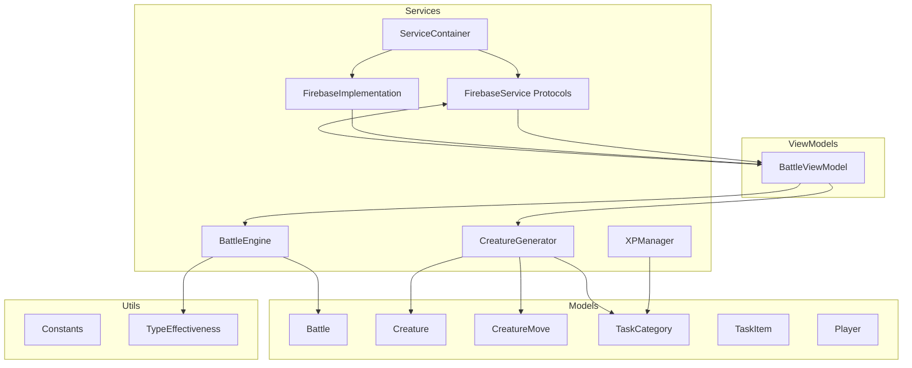
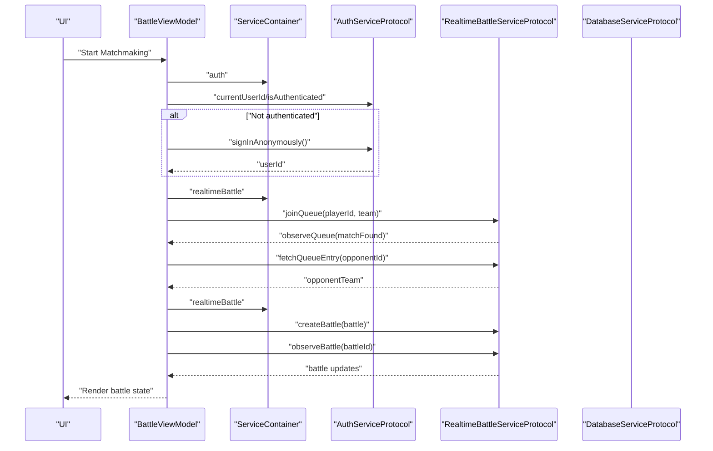
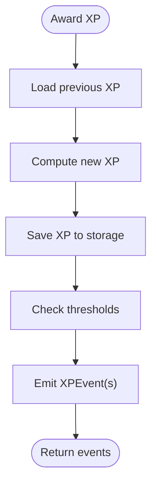
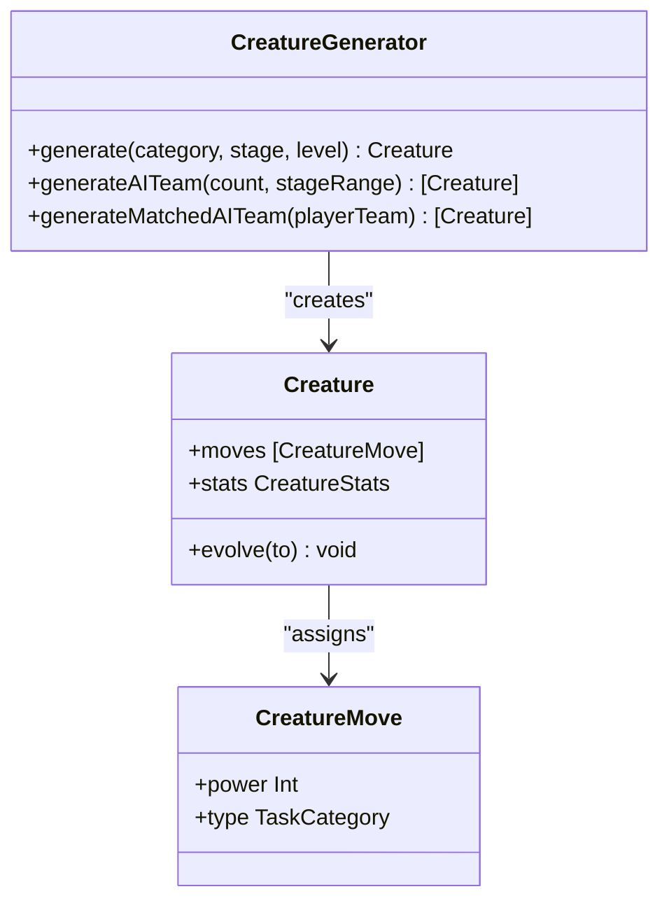
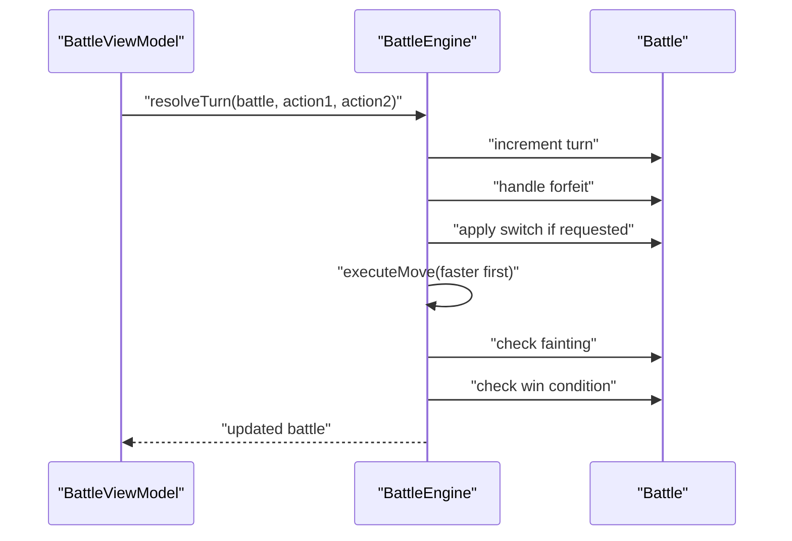
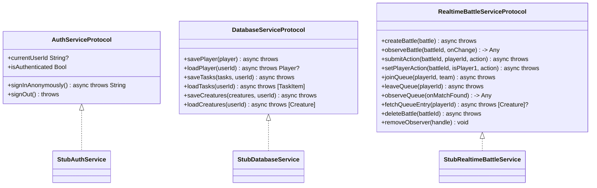
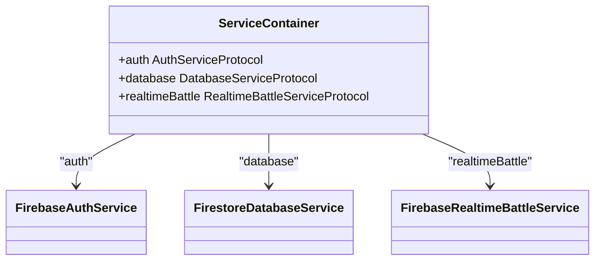
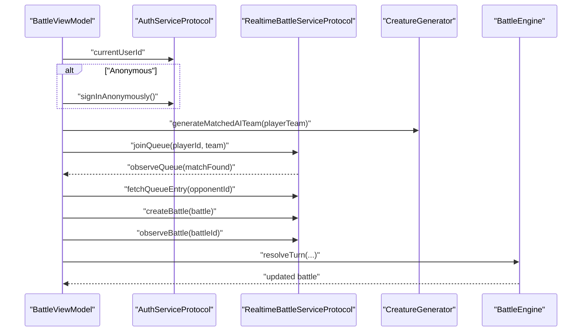
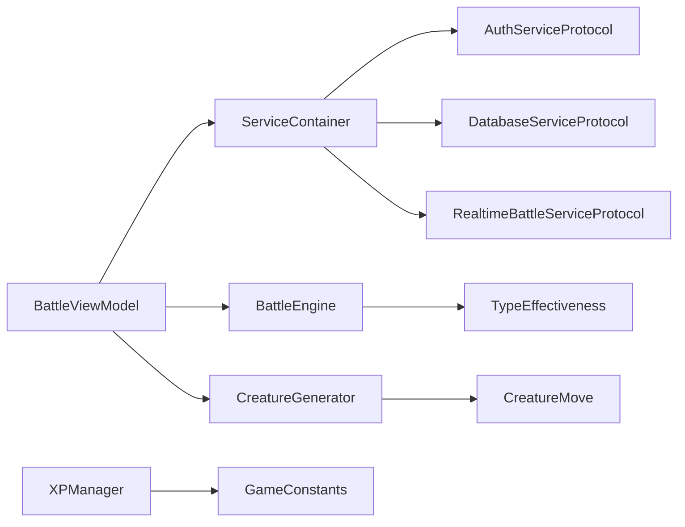

# Services Layer & External Integrations

<cite>
**Referenced Files in This Document**
- [XPManager.swift](file://TaskMon/TaskMon/Services/XPManager.swift)
- [CreatureGenerator.swift](file://TaskMon/TaskMon/Services/CreatureGenerator.swift)
- [BattleEngine.swift](file://TaskMon/TaskMon/Services/BattleEngine.swift)
- [FirebaseService.swift](file://TaskMon/TaskMon/Services/FirebaseService.swift)
- [FirebaseImplementation.swift](file://TaskMon/TaskMon/Services/FirebaseImplementation.swift)
- [Battle.swift](file://TaskMon/TaskMon/Models/Battle.swift)
- [Creature.swift](file://TaskMon/TaskMon/Models/Creature.swift)
- [CreatureMove.swift](file://TaskMon/TaskMon/Models/CreatureMove.swift)
- [TaskCategory.swift](file://TaskMon/TaskMon/Models/TaskCategory.swift)
- [TaskItem.swift](file://TaskMon/TaskMon/Models/TaskItem.swift)
- [Player.swift](file://TaskMon/TaskMon/Models/Player.swift)
- [Constants.swift](file://TaskMon/TaskMon/Utils/Constants.swift)
- [TypeEffectiveness.swift](file://TaskMon/TaskMon/Utils/TypeEffectiveness.swift)
- [BattleViewModel.swift](file://TaskMon/TaskMon/ViewModels/BattleViewModel.swift)
</cite>

## Table of Contents
1. [Introduction](#introduction)
2. [Project Structure](#project-structure)
3. [Core Components](#core-components)
4. [Architecture Overview](#architecture-overview)
5. [Detailed Component Analysis](#detailed-component-analysis)
6. [Dependency Analysis](#dependency-analysis)
7. [Performance Considerations](#performance-considerations)
8. [Troubleshooting Guide](#troubleshooting-guide)
9. [Conclusion](#conclusion)
10. [Appendices](#appendices)

## Introduction
This document explains TaskMon’s service layer architecture and external integration patterns. It focuses on:
- XPManager as the central event coordinator for experience point tracking and milestone notifications
- CreatureGenerator implementing factory patterns for creature creation, evolution mechanics, and move pool generation
- BattleEngine covering turn-based combat calculations, type effectiveness algorithms, AI decision-making, and battle state management
- Firebase service protocols enabling optional real-time multiplayer functionality, including matchmaking coordination, battle synchronization, and cloud data persistence
- Stub implementations for local-only operation without external dependencies
- Protocol-oriented design enabling easy swapping between local and cloud implementations
- Dependency injection strategies for service registration and lifecycle management
- Error handling, retry mechanisms, and graceful degradation
- Performance optimization techniques, caching strategies, and memory management
- Configuration options, logging and monitoring integration, and testing strategies

## Project Structure
The service layer resides under TaskMon/TaskMon/Services and integrates with Models, Utils, and ViewModels. The architecture separates concerns:
- Services encapsulate cross-cutting behaviors (XP, creature generation, battle engine, Firebase)
- Models define domain data and behaviors
- Utils provide constants and algorithms
- ViewModels orchestrate UI state and coordinate services

**Diagram sources**
- [XPManager.swift](file://TaskMon/TaskMon/Services/XPManager.swift#L1-L96)
- [CreatureGenerator.swift](file://TaskMon/TaskMon/Services/CreatureGenerator.swift#L1-L44)
- [BattleEngine.swift](file://TaskMon/TaskMon/Services/BattleEngine.swift#L1-L170)
- [FirebaseService.swift](file://TaskMon/TaskMon/Services/FirebaseService.swift#L1-L143)
- [FirebaseImplementation.swift](file://TaskMon/TaskMon/Services/FirebaseImplementation.swift#L1-L190)
- [Battle.swift](file://TaskMon/TaskMon/Models/Battle.swift#L1-L69)
- [Creature.swift](file://TaskMon/TaskMon/Models/Creature.swift#L1-L98)
- [CreatureMove.swift](file://TaskMon/TaskMon/Models/CreatureMove.swift#L1-L68)
- [TaskCategory.swift](file://TaskMon/TaskMon/Models/TaskCategory.swift#L1-L85)
- [TaskItem.swift](file://TaskMon/TaskMon/Models/TaskItem.swift#L1-L44)
- [Player.swift](file://TaskMon/TaskMon/Models/Player.swift#L1-L29)
- [Constants.swift](file://TaskMon/TaskMon/Utils/Constants.swift#L1-L40)
- [TypeEffectiveness.swift](file://TaskMon/TaskMon/Utils/TypeEffectiveness.swift#L1-L34)
- [BattleViewModel.swift](file://TaskMon/TaskMon/ViewModels/BattleViewModel.swift#L1-L462)

**Section sources**
- [FirebaseService.swift](file://TaskMon/TaskMon/Services/FirebaseService.swift#L1-L143)
- [FirebaseImplementation.swift](file://TaskMon/TaskMon/Services/FirebaseImplementation.swift#L180-L190)
- [BattleViewModel.swift](file://TaskMon/TaskMon/ViewModels/BattleViewModel.swift#L1-L60)

## Core Components
- XPManager: Central event coordinator for XP awards, milestone detection, and persistence. Emits Combine events for downstream subscribers.
- CreatureGenerator: Factory for creature creation, AI team generation, and matched difficulty teams. Handles evolution mechanics and move pool generation.
- BattleEngine: Turn-based combat resolver, AI decision-making, type effectiveness calculations, and win condition checks.
- FirebaseService: Protocol-oriented design for optional Firebase integration (auth, database, real-time battle).
- FirebaseImplementation: Concrete Firebase-backed implementations and ServiceContainer for dependency injection.

**Section sources**
- [XPManager.swift](file://TaskMon/TaskMon/Services/XPManager.swift#L10-L96)
- [CreatureGenerator.swift](file://TaskMon/TaskMon/Services/CreatureGenerator.swift#L3-L44)
- [BattleEngine.swift](file://TaskMon/TaskMon/Services/BattleEngine.swift#L3-L170)
- [FirebaseService.swift](file://TaskMon/TaskMon/Services/FirebaseService.swift#L8-L35)
- [FirebaseImplementation.swift](file://TaskMon/TaskMon/Services/FirebaseImplementation.swift#L182-L190)

## Architecture Overview
The service layer uses protocol-oriented design to decouple UI and business logic from external systems. BattleViewModel coordinates services for local and online play. ServiceContainer registers implementations for DI.

**Diagram sources**
- [BattleViewModel.swift](file://TaskMon/TaskMon/ViewModels/BattleViewModel.swift#L167-L281)
- [FirebaseService.swift](file://TaskMon/TaskMon/Services/FirebaseService.swift#L24-L35)
- [FirebaseImplementation.swift](file://TaskMon/TaskMon/Services/FirebaseImplementation.swift#L182-L190)

## Detailed Component Analysis

### XPManager: Experience Point Coordinator
- Responsibilities:
  - Track per-category XP
  - Award XP and compute milestones
  - Emit XPEvent for UI and persistence
  - Persist XP to UserDefaults
- Events:
  - XP gained
  - Creature unlocked at stage 1
  - Creature evolved at stage 2 and 3
- Persistence:
  - Encodes category XP dictionary to JSON and stores under a fixed key
- Complexity:
  - Awarding XP is O(n) for threshold checks where n is number of thresholds
  - Persistence is O(k) where k is number of categories

**Diagram sources**
- [XPManager.swift](file://TaskMon/TaskMon/Services/XPManager.swift#L22-L50)
- [Constants.swift](file://TaskMon/TaskMon/Utils/Constants.swift#L10-L13)

**Section sources**
- [XPManager.swift](file://TaskMon/TaskMon/Services/XPManager.swift#L10-L96)
- [Constants.swift](file://TaskMon/TaskMon/Utils/Constants.swift#L4-L24)

### CreatureGenerator: Factory, Evolution, and Move Pool
- Responsibilities:
  - Generate creatures by category and stage
  - Build AI teams with randomized but balanced stats
  - Match AI teams to player team strength
  - Populate move pools based on category and stage
- Evolution Mechanics:
  - Evolves creature to new stage and refreshes stats/moves
- Move Pool:
  - Stage-based expansion of available moves

**Diagram sources**
- [CreatureGenerator.swift](file://TaskMon/TaskMon/Services/CreatureGenerator.swift#L3-L44)
- [Creature.swift](file://TaskMon/TaskMon/Models/Creature.swift#L33-L98)
- [CreatureMove.swift](file://TaskMon/TaskMon/Models/CreatureMove.swift#L3-L68)

**Section sources**
- [CreatureGenerator.swift](file://TaskMon/TaskMon/Services/CreatureGenerator.swift#L3-L44)
- [Creature.swift](file://TaskMon/TaskMon/Models/Creature.swift#L33-L98)
- [CreatureMove.swift](file://TaskMon/TaskMon/Models/CreatureMove.swift#L19-L68)

### BattleEngine: Turn-Based Combat and AI
- Responsibilities:
  - Resolve turns given two actions
  - Handle forfeits, switches, and move execution
  - Calculate damage with type effectiveness and variance
  - Manage fainting and win conditions
  - Select AI actions based on type effectiveness
- Type Effectiveness:
  - Implements a cyclic chart with special handling for neutral personal category
- AI Decision:
  - Picks the move with highest damage considering type effectiveness

**Diagram sources**
- [BattleEngine.swift](file://TaskMon/TaskMon/Services/BattleEngine.swift#L5-L66)
- [TypeEffectiveness.swift](file://TaskMon/TaskMon/Utils/TypeEffectiveness.swift#L8-L32)
- [Battle.swift](file://TaskMon/TaskMon/Models/Battle.swift#L32-L69)

**Section sources**
- [BattleEngine.swift](file://TaskMon/TaskMon/Services/BattleEngine.swift#L3-L170)
- [TypeEffectiveness.swift](file://TaskMon/TaskMon/Utils/TypeEffectiveness.swift#L3-L34)
- [Battle.swift](file://TaskMon/TaskMon/Models/Battle.swift#L1-L69)

### Firebase Service Protocols and Stub Implementations
- Protocols:
  - AuthServiceProtocol: anonymous sign-in, sign-out, current user
  - DatabaseServiceProtocol: save/load player, tasks, creatures
  - RealtimeBattleServiceProtocol: create/join/delete battles, observe, submit actions, queue
- Stubs:
  - StubAuthService: local anonymous ID with UserDefaults persistence
  - StubDatabaseService: local-only persistence via UserDefaults
  - StubRealtimeBattleService: no-op stubs for local simulation
- Purpose:
  - Enable local-only operation without Firebase
  - Allow seamless replacement with Firebase implementations

**Diagram sources**
- [FirebaseService.swift](file://TaskMon/TaskMon/Services/FirebaseService.swift#L8-L35)
- [FirebaseService.swift](file://TaskMon/TaskMon/Services/FirebaseService.swift#L39-L62)
- [FirebaseService.swift](file://TaskMon/TaskMon/Services/FirebaseService.swift#L66-L98)
- [FirebaseService.swift](file://TaskMon/TaskMon/Services/FirebaseService.swift#L102-L142)

**Section sources**
- [FirebaseService.swift](file://TaskMon/TaskMon/Services/FirebaseService.swift#L1-L143)

### Firebase Implementation and ServiceContainer
- FirebaseAuthService: integrates with FirebaseAuth for anonymous sign-in
- FirestoreDatabaseService: saves and loads player, tasks, creatures using Firestore batches
- FirebaseRealtimeBattleService: manages queue, battle documents, and observers using FirebaseDatabase
- ServiceContainer: singleton registry for services; defaults to stub implementations; can be switched to Firebase implementations

**Diagram sources**
- [FirebaseImplementation.swift](file://TaskMon/TaskMon/Services/FirebaseImplementation.swift#L182-L190)
- [FirebaseImplementation.swift](file://TaskMon/TaskMon/Services/FirebaseImplementation.swift#L19-L37)
- [FirebaseImplementation.swift](file://TaskMon/TaskMon/Services/FirebaseImplementation.swift#L41-L94)
- [FirebaseImplementation.swift](file://TaskMon/TaskMon/Services/FirebaseImplementation.swift#L98-L177)

**Section sources**
- [FirebaseImplementation.swift](file://TaskMon/TaskMon/Services/FirebaseImplementation.swift#L1-L190)
- [FirebaseImplementation.swift](file://TaskMon/TaskMon/Services/FirebaseImplementation.swift#L182-L190)

### BattleViewModel: Orchestration of Services
- Responsibilities:
  - Local battles vs online battles
  - Matchmaking flow with queue observation and host/non-host roles
  - Battle observation and state synchronization
  - Perspective swapping for display
  - Graceful handling of timeouts and errors
- Integration:
  - Uses ServiceContainer.auth and ServiceContainer.realtimeBattle
  - Coordinates CreatureGenerator and BattleEngine
  - Persists logs and animates UI updates

**Diagram sources**
- [BattleViewModel.swift](file://TaskMon/TaskMon/ViewModels/BattleViewModel.swift#L167-L281)
- [BattleEngine.swift](file://TaskMon/TaskMon/Services/BattleEngine.swift#L5-L66)
- [CreatureGenerator.swift](file://TaskMon/TaskMon/Services/CreatureGenerator.swift#L24-L42)

**Section sources**
- [BattleViewModel.swift](file://TaskMon/TaskMon/ViewModels/BattleViewModel.swift#L10-L462)

## Dependency Analysis
- Coupling:
  - BattleViewModel depends on ServiceContainer for DI
  - BattleEngine depends on TypeEffectiveness and Battle models
  - CreatureGenerator depends on TaskCategory, Creature, and CreatureMove
  - XPManager depends on TaskCategory and GameConstants
- Cohesion:
  - Each service encapsulates a single responsibility
- External Dependencies:
  - Firebase SDKs (Auth, Firestore, Realtime Database) behind protocols
  - Combine publishers for event-driven updates
- Circular Dependencies:
  - None observed among services; services are layered appropriately

**Diagram sources**
- [BattleViewModel.swift](file://TaskMon/TaskMon/ViewModels/BattleViewModel.swift#L36-L38)
- [FirebaseImplementation.swift](file://TaskMon/TaskMon/Services/FirebaseImplementation.swift#L182-L190)
- [BattleEngine.swift](file://TaskMon/TaskMon/Services/BattleEngine.swift#L84-L87)
- [CreatureGenerator.swift](file://TaskMon/TaskMon/Services/CreatureGenerator.swift#L6-L7)
- [XPManager.swift](file://TaskMon/TaskMon/Services/XPManager.swift#L18-L20)

**Section sources**
- [BattleViewModel.swift](file://TaskMon/TaskMon/ViewModels/BattleViewModel.swift#L36-L38)
- [FirebaseImplementation.swift](file://TaskMon/TaskMon/Services/FirebaseImplementation.swift#L182-L190)
- [BattleEngine.swift](file://TaskMon/TaskMon/Services/BattleEngine.swift#L84-L87)
- [CreatureGenerator.swift](file://TaskMon/TaskMon/Services/CreatureGenerator.swift#L5-L7)
- [XPManager.swift](file://TaskMon/TaskMon/Services/XPManager.swift#L18-L20)

## Performance Considerations
- Caching Strategies:
  - Cache XP per category in memory; persist infrequently to reduce disk writes
  - Cache generated AI teams for repeated matchmaking sessions
- Memory Management:
  - BattleViewModel holds transient state; reset clears observers and references
  - Use weak references in timers and observers to prevent retain cycles
- Concurrency:
  - Use async/await for network-bound operations; avoid blocking UI thread
- Algorithmic Efficiency:
  - Type effectiveness multiplier lookup is O(1)
  - BattleEngine resolves turns with minimal allocations; avoid frequent copies of large structs
- Persistence:
  - Batch Firestore writes for tasks and creatures to reduce cost and latency

[No sources needed since this section provides general guidance]

## Troubleshooting Guide
- Authentication Issues:
  - If anonymous sign-in fails, verify Firebase configuration and network connectivity
  - Stub auth falls back to local ID generation
- Real-Time Battle Problems:
  - Ensure queue observer is removed on cancellation
  - Verify battle ID construction and host role assignment
- Data Persistence:
  - Confirm UserDefaults keys and JSON encoding/decoding paths
  - Validate Firestore security rules and database availability
- Graceful Degradation:
  - When Firebase is unavailable, the app continues using stub implementations
  - UI remains functional with local-only features

**Section sources**
- [FirebaseService.swift](file://TaskMon/TaskMon/Services/FirebaseService.swift#L39-L62)
- [FirebaseService.swift](file://TaskMon/TaskMon/Services/FirebaseService.swift#L102-L142)
- [BattleViewModel.swift](file://TaskMon/TaskMon/ViewModels/BattleViewModel.swift#L205-L221)

## Conclusion
TaskMon’s service layer leverages protocol-oriented design and dependency injection to cleanly separate local and cloud functionality. XPManager, CreatureGenerator, and BattleEngine encapsulate core game logic, while Firebase protocols and stubs enable optional real-time multiplayer. The architecture supports graceful degradation, efficient caching, and maintainable testing strategies.

[No sources needed since this section summarizes without analyzing specific files]

## Appendices

### Configuration Options
- GameConstants:
  - XP rewards per difficulty
  - Evolution thresholds per category
  - Max team size and turn timeout
- UI Constants:
  - Corner radii, border widths, and animation durations

**Section sources**
- [Constants.swift](file://TaskMon/TaskMon/Utils/Constants.swift#L4-L24)

### Logging and Monitoring Integration
- Use Combine publishers from XPManager and BattleEngine to feed analytics
- Record battle logs and XP events for telemetry
- Instrument ServiceContainer initialization for startup metrics

[No sources needed since this section provides general guidance]

### Testing Strategies
- Unit Tests:
  - Mock AuthServiceProtocol and DatabaseServiceProtocol to test offline scenarios
  - Test BattleEngine with deterministic inputs and type effectiveness
  - Validate XPManager thresholds and event emissions
- Integration Tests:
  - Use stub implementations to simulate Firebase behavior
  - Verify BattleViewModel matchmaking and battle observation flows
- UI Tests:
  - Assert animations and state transitions during battles
  - Validate team selection and evolution UI

[No sources needed since this section provides general guidance]