# Testing Strategy & Quality Assurance

<cite>
**Referenced Files in This Document**
- [TaskMonApp.swift](file://TaskMon/TaskMon/TaskMonApp.swift)
- [TaskViewModel.swift](file://TaskMon/TaskMon/ViewModels/TaskViewModel.swift)
- [CreatureViewModel.swift](file://TaskMon/TaskMon/ViewModels/CreatureViewModel.swift)
- [BattleViewModel.swift](file://TaskMon/TaskMon/ViewModels/BattleViewModel.swift)
- [XPManager.swift](file://TaskMon/TaskMon/Services/XPManager.swift)
- [CreatureGenerator.swift](file://TaskMon/TaskMon/Services/CreatureGenerator.swift)
- [BattleEngine.swift](file://TaskMon/TaskMon/Services/BattleEngine.swift)
- [FirebaseService.swift](file://TaskMon/TaskMon/Services/FirebaseService.swift)
- [FirebaseImplementation.swift](file://TaskMon/TaskMon/Services/FirebaseImplementation.swift)
- [Creature.swift](file://TaskMon/TaskMon/Models/Creature.swift)
- [Battle.swift](file://TaskMon/TaskMon/Models/Battle.swift)
- [TaskItem.swift](file://TaskMon/TaskMon/Models/TaskItem.swift)
- [TaskCategory.swift](file://TaskMon/TaskMon/Models/TaskCategory.swift)
- [Constants.swift](file://TaskMon/TaskMon/Utils/Constants.swift)
- [MainTabView.swift](file://TaskMon/TaskMon/Views/MainTabView.swift)
- [CreatureSpriteView.swift](file://TaskMon/TaskMon/Views/Components/CreatureSpriteView.swift)
- [EvolutionAnimationView.swift](file://TaskMon/TaskMon/Views/Creatures/EvolutionAnimationView.swift)
</cite>

## Table of Contents
1. [Introduction](#introduction)
2. [Project Structure](#project-structure)
3. [Core Components](#core-components)
4. [Architecture Overview](#architecture-overview)
5. [Detailed Component Analysis](#detailed-component-analysis)
6. [Dependency Analysis](#dependency-analysis)
7. [Performance Considerations](#performance-considerations)
8. [Troubleshooting Guide](#troubleshooting-guide)
9. [Conclusion](#conclusion)
10. [Appendices](#appendices)

## Introduction
This document defines TaskMon’s comprehensive testing strategy and quality assurance approach. It covers unit testing for ViewModels (task management, creature evolution, and battle state), service-layer testing (XPManager event coordination, CreatureGenerator factory methods, and BattleEngine combat calculations), SwiftUI view testing strategies, reactive programming patterns with Combine, async/await testing, and mock strategies for external dependencies. It also includes testing utilities, CI setup recommendations, debugging strategies, and regression testing guidelines tailored to iOS development constraints.

## Project Structure
TaskMon follows a layered architecture:
- Models define domain entities and constants.
- Services encapsulate business logic and platform integrations.
- ViewModels coordinate state and orchestrate service interactions.
- Views render UI and bind to ViewModel state.
- Utilities centralize constants and helpers.

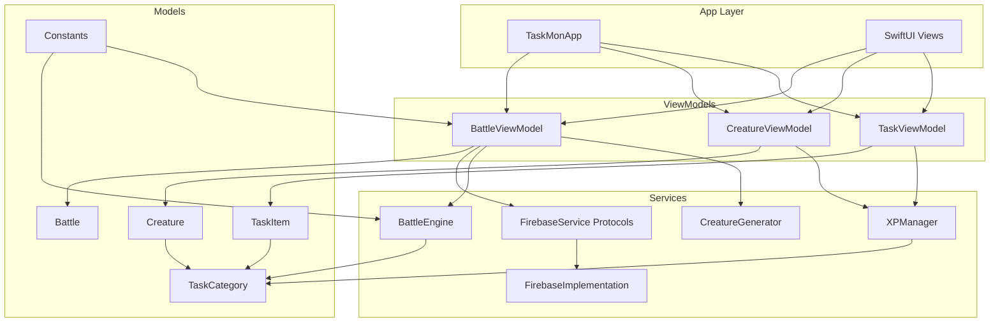

**Diagram sources**
- [TaskMonApp.swift](file://TaskMon/TaskMon/TaskMonApp.swift#L12-L32)
- [TaskViewModel.swift](file://TaskMon/TaskMon/ViewModels/TaskViewModel.swift#L5-L76)
- [CreatureViewModel.swift](file://TaskMon/TaskMon/ViewModels/CreatureViewModel.swift#L5-L90)
- [BattleViewModel.swift](file://TaskMon/TaskMon/ViewModels/BattleViewModel.swift#L10-L462)
- [XPManager.swift](file://TaskMon/TaskMon/Services/XPManager.swift#L10-L96)
- [CreatureGenerator.swift](file://TaskMon/TaskMon/Services/CreatureGenerator.swift#L3-L44)
- [BattleEngine.swift](file://TaskMon/TaskMon/Services/BattleEngine.swift#L3-L170)
- [FirebaseService.swift](file://TaskMon/TaskMon/Services/FirebaseService.swift#L8-L35)
- [FirebaseImplementation.swift](file://TaskMon/TaskMon/Services/FirebaseImplementation.swift#L19-L173)
- [Creature.swift](file://TaskMon/TaskMon/Models/Creature.swift#L33-L98)
- [Battle.swift](file://TaskMon/TaskMon/Models/Battle.swift#L32-L69)
- [TaskItem.swift](file://TaskMon/TaskMon/Models/TaskItem.swift#L27-L44)
- [TaskCategory.swift](file://TaskMon/TaskMon/Models/TaskCategory.swift#L4-L85)
- [Constants.swift](file://TaskMon/TaskMon/Utils/Constants.swift#L4-L24)

**Section sources**
- [TaskMonApp.swift](file://TaskMon/TaskMon/TaskMonApp.swift#L12-L32)
- [MainTabView.swift](file://TaskMon/TaskMon/Views/MainTabView.swift#L3-L28)

## Core Components
- TaskViewModel: Manages tasks, persistence, XP popup state, and delegates XP awarding to XPManager.
- CreatureViewModel: Subscribes to XPManager events, manages creature lifecycle, and persists creatures.
- BattleViewModel: Orchestrates local and online battles, matchmaking, turn resolution, animations, and state synchronization.
- XPManager: Central XP aggregator with Combine events for XP gained, creature unlock, and evolution milestones.
- CreatureGenerator: Factory methods for generating creatures and teams for AI and matched battles.
- BattleEngine: Static engine for turn resolution, move execution, fainting checks, and win conditions.
- FirebaseService/FirebaseImplementation: Protocol-based abstraction for auth, database, and realtime battle services with stub implementations.

**Section sources**
- [TaskViewModel.swift](file://TaskMon/TaskMon/ViewModels/TaskViewModel.swift#L5-L76)
- [CreatureViewModel.swift](file://TaskMon/TaskMon/ViewModels/CreatureViewModel.swift#L5-L90)
- [BattleViewModel.swift](file://TaskMon/TaskMon/ViewModels/BattleViewModel.swift#L10-L462)
- [XPManager.swift](file://TaskMon/TaskMon/Services/XPManager.swift#L10-L96)
- [CreatureGenerator.swift](file://TaskMon/TaskMon/Services/CreatureGenerator.swift#L3-L44)
- [BattleEngine.swift](file://TaskMon/TaskMon/Services/BattleEngine.swift#L3-L170)
- [FirebaseService.swift](file://TaskMon/TaskMon/Services/FirebaseService.swift#L8-L35)
- [FirebaseImplementation.swift](file://TaskMon/TaskMon/Services/FirebaseImplementation.swift#L19-L173)

## Architecture Overview
The app uses a reactive MVVM pattern with Combine publishers and async/await for service operations. ViewModels publish state changes consumed by SwiftUI views. Services expose protocol interfaces to support stub implementations during testing and offline development.

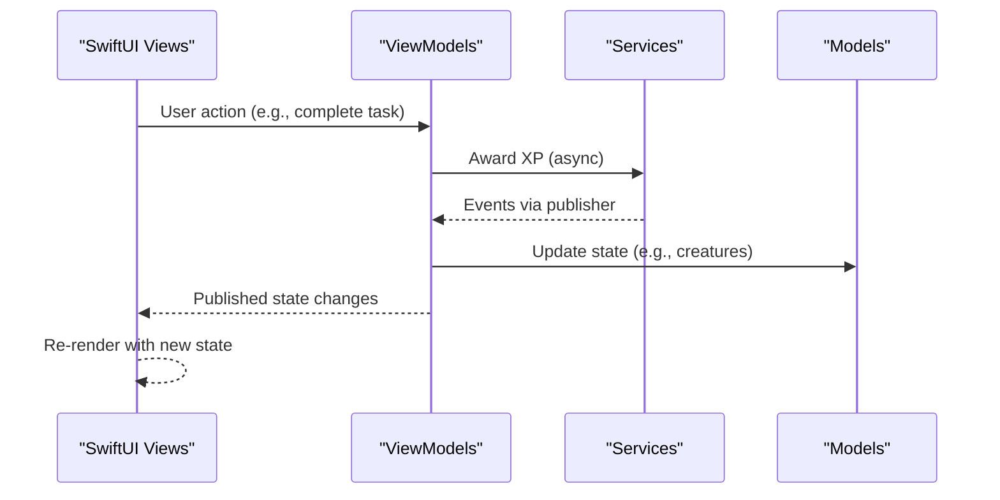

**Diagram sources**
- [TaskViewModel.swift](file://TaskMon/TaskMon/ViewModels/TaskViewModel.swift#L26-L39)
- [XPManager.swift](file://TaskMon/TaskMon/Services/XPManager.swift#L22-L50)
- [CreatureViewModel.swift](file://TaskMon/TaskMon/ViewModels/CreatureViewModel.swift#L33-L63)
- [BattleViewModel.swift](file://TaskMon/TaskMon/ViewModels/BattleViewModel.swift#L66-L82)
- [BattleEngine.swift](file://TaskMon/TaskMon/Services/BattleEngine.swift#L5-L66)

## Detailed Component Analysis

### Unit Testing ViewModels

#### TaskViewModel
- Test coverage areas:
  - CRUD operations: add, complete, delete tasks.
  - XP popup and event propagation via XPManager.
  - Persistence correctness using UserDefaults.
  - Filtering helpers for pending/completed tasks.
- Key test scenarios:
  - Complete a task and assert XP gain events and UI flags.
  - Load persisted tasks after initialization.
  - Attempt to complete already completed task (guard clause).
  - Verify counts and filters for categories.

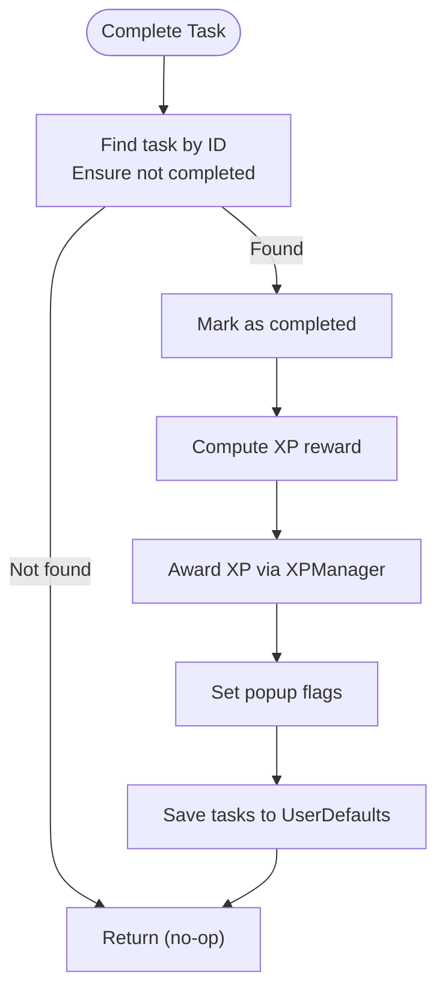

**Diagram sources**
- [TaskViewModel.swift](file://TaskMon/TaskMon/ViewModels/TaskViewModel.swift#L26-L39)
- [TaskItem.swift](file://TaskMon/TaskMon/Models/TaskItem.swift#L18-L24)
- [XPManager.swift](file://TaskMon/TaskMon/Services/XPManager.swift#L22-L50)

**Section sources**
- [TaskViewModel.swift](file://TaskMon/TaskMon/ViewModels/TaskViewModel.swift#L20-L76)
- [TaskItem.swift](file://TaskMon/TaskMon/Models/TaskItem.swift#L27-L44)

#### CreatureViewModel
- Test coverage areas:
  - Subscription to XPManager events and event-driven evolution.
  - Unlocking a new creature when XP crosses threshold.
  - Evolution progression and XP updates per category.
  - Healing all creatures and persistence.
- Key test scenarios:
  - Emit XP gained event and assert XP update on existing creature.
  - Emit creature unlocked event and assert new Stage 1 creature creation.
  - Emit evolution event and assert stage increment and XP sync.
  - Heal all and verify persistence.

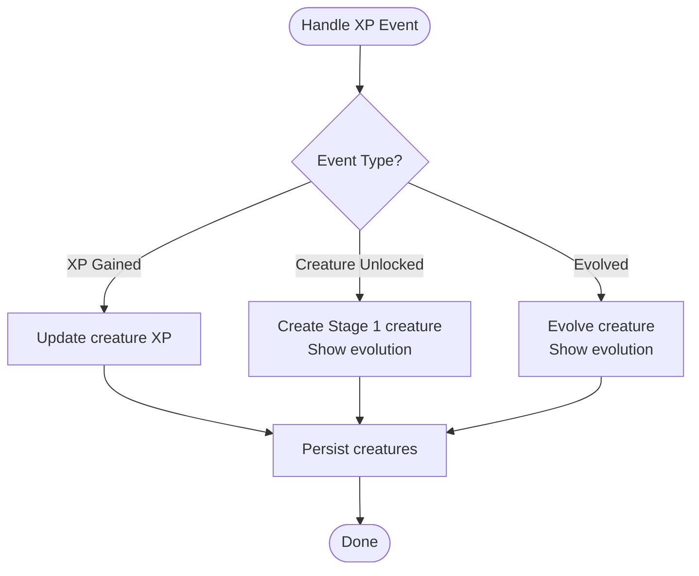

**Diagram sources**
- [CreatureViewModel.swift](file://TaskMon/TaskMon/ViewModels/CreatureViewModel.swift#L33-L63)
- [XPManager.swift](file://TaskMon/TaskMon/Services/XPManager.swift#L4-L8)

**Section sources**
- [CreatureViewModel.swift](file://TaskMon/TaskMon/ViewModels/CreatureViewModel.swift#L24-L89)
- [Creature.swift](file://TaskMon/TaskMon/Models/Creature.swift#L80-L86)

#### BattleViewModel
- Test coverage areas:
  - Local battle lifecycle: team selection, turn resolution, win/lose/draw.
  - Online matchmaking: queue join/leave, observer setup, match-found handling.
  - Action submission and turn resolution in hosted battles.
  - UI animations: log message animation and shake effects.
  - Reset and cleanup of observers and timers.
- Key test scenarios:
  - Start local battle with selected team and assert initial state.
  - Submit player move and verify turn resolution and log updates.
  - Simulate AI action selection and outcome.
  - Online flow: join queue, handle match-found, observe battle, resolve turns.
  - Forfeit and assert battle termination.
  - Reset battle and assert cleanup.

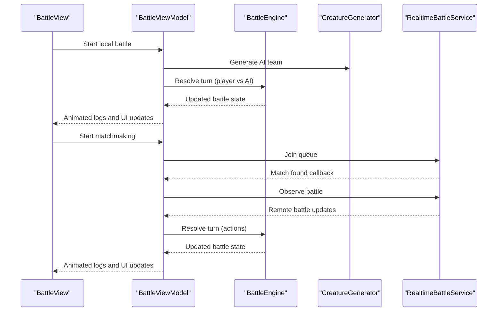

**Diagram sources**
- [BattleViewModel.swift](file://TaskMon/TaskMon/ViewModels/BattleViewModel.swift#L66-L82)
- [BattleViewModel.swift](file://TaskMon/TaskMon/ViewModels/BattleViewModel.swift#L167-L203)
- [BattleViewModel.swift](file://TaskMon/TaskMon/ViewModels/BattleViewModel.swift#L225-L281)
- [BattleEngine.swift](file://TaskMon/TaskMon/Services/BattleEngine.swift#L5-L66)
- [CreatureGenerator.swift](file://TaskMon/TaskMon/Services/CreatureGenerator.swift#L24-L42)
- [FirebaseService.swift](file://TaskMon/TaskMon/Services/FirebaseService.swift#L24-L35)

**Section sources**
- [BattleViewModel.swift](file://TaskMon/TaskMon/ViewModels/BattleViewModel.swift#L64-L462)
- [BattleEngine.swift](file://TaskMon/TaskMon/Services/BattleEngine.swift#L3-L170)
- [CreatureGenerator.swift](file://TaskMon/TaskMon/Services/CreatureGenerator.swift#L3-L44)

### Service Layer Testing

#### XPManager
- Test coverage areas:
  - Award XP and assert event emissions for XP gained and evolution milestones.
  - Milestone detection across thresholds.
  - Persistence of XP per category.
- Key test scenarios:
  - Award XP below threshold and assert XP gained event only.
  - Award XP crossing threshold and assert unlock/evolve events.
  - Load XP and verify persisted values.

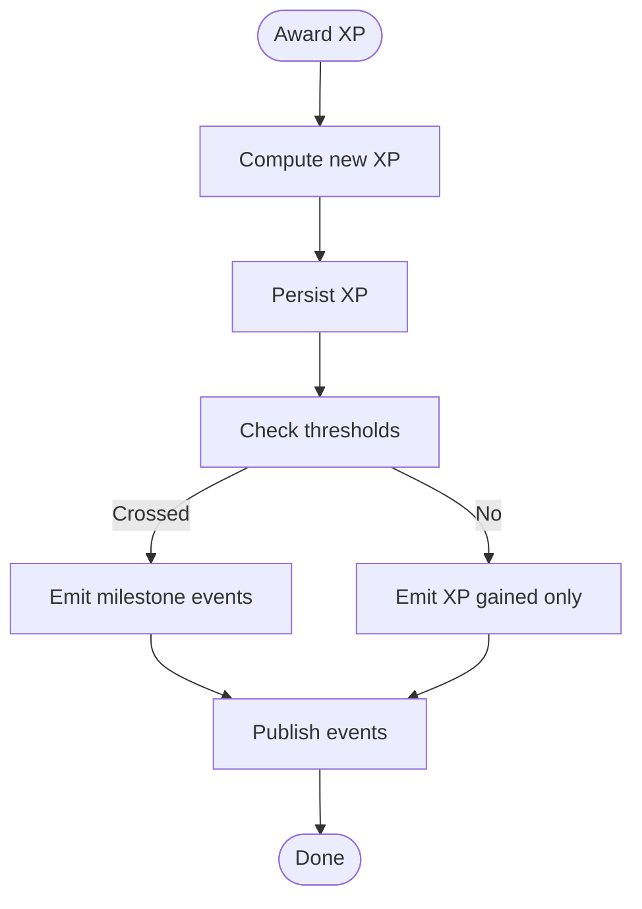

**Diagram sources**
- [XPManager.swift](file://TaskMon/TaskMon/Services/XPManager.swift#L22-L50)

**Section sources**
- [XPManager.swift](file://TaskMon/TaskMon/Services/XPManager.swift#L10-L96)

#### CreatureGenerator
- Test coverage areas:
  - Factory method generation for category/stage/level.
  - AI team generation with randomized levels and recalculated stats.
  - Matched AI team generation aligned to player team average stage/level.
- Key test scenarios:
  - Generate creature and assert stats derived from category/stage/level.
  - Generate AI team and assert team composition and stat recalculation.
  - Generate matched AI team and assert stage/level bounds around player averages.

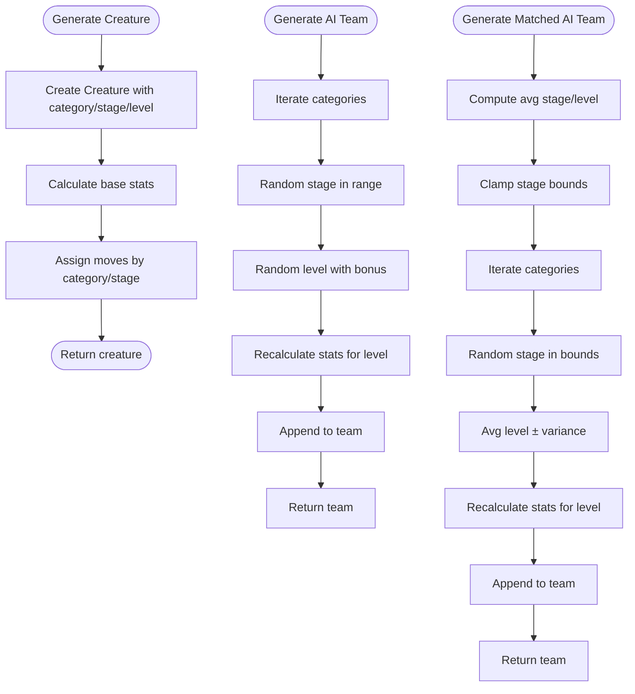

**Diagram sources**
- [CreatureGenerator.swift](file://TaskMon/TaskMon/Services/CreatureGenerator.swift#L5-L42)
- [Creature.swift](file://TaskMon/TaskMon/Models/Creature.swift#L10-L31)

**Section sources**
- [CreatureGenerator.swift](file://TaskMon/TaskMon/Services/CreatureGenerator.swift#L3-L44)
- [Creature.swift](file://TaskMon/TaskMon/Models/Creature.swift#L33-L98)

#### BattleEngine
- Test coverage areas:
  - Turn resolution with forfeit handling.
  - Switch actions and active creature updates.
  - Move execution with type effectiveness and variance.
  - Fainting and auto-switch logic.
  - Win condition checks (draw, win, loss).
  - AI action selection based on type effectiveness.
- Key test scenarios:
  - Resolve turn with player move vs AI move and assert damage application.
  - Resolve turn with switch actions and assert active index changes.
  - Resolve turn resulting in fainting and assert auto-switch.
  - Resolve turn with forfeit and assert immediate win/loss.
  - Select AI action and assert best move selection considering type effectiveness.

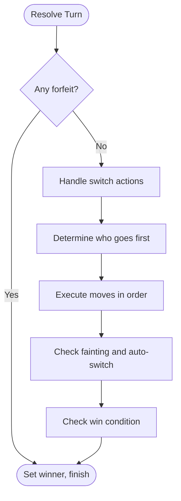

**Diagram sources**
- [BattleEngine.swift](file://TaskMon/TaskMon/Services/BattleEngine.swift#L5-L66)

**Section sources**
- [BattleEngine.swift](file://TaskMon/TaskMon/Services/BattleEngine.swift#L3-L170)

### SwiftUI View Testing Strategies
- Component rendering:
  - Render views in isolation with mocked environment objects (ViewModels).
  - Assert presence of images, labels, and icons using accessibility identifiers.
- User interaction handling:
  - Simulate button taps, tab selections, and navigation gestures.
  - Verify state changes (e.g., selected team, log messages).
- State change verification:
  - Bind views to @Published properties and assert UI updates.
  - For animations, verify intermediate states and completion handlers.
- Example targets:
  - MainTabView tabs and navigation.
  - CreatureSpriteView rendering and fallback icons.
  - EvolutionAnimationView flash and sparkle phases.

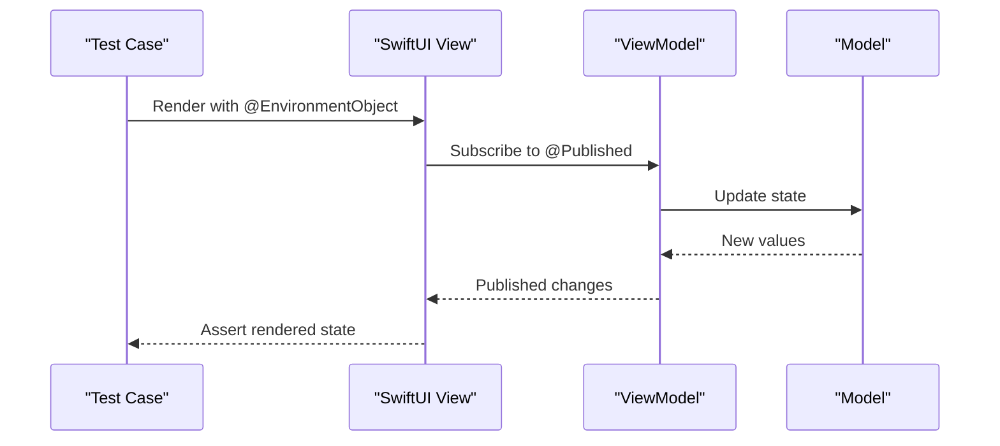

**Diagram sources**
- [MainTabView.swift](file://TaskMon/TaskMon/Views/MainTabView.swift#L3-L28)
- [CreatureSpriteView.swift](file://TaskMon/TaskMon/Views/Components/CreatureSpriteView.swift#L3-L19)
- [EvolutionAnimationView.swift](file://TaskMon/TaskMon/Views/Creatures/EvolutionAnimationView.swift#L3-L39)

**Section sources**
- [MainTabView.swift](file://TaskMon/TaskMon/Views/MainTabView.swift#L3-L28)
- [CreatureSpriteView.swift](file://TaskMon/TaskMon/Views/Components/CreatureSpriteView.swift#L3-L33)
- [EvolutionAnimationView.swift](file://TaskMon/TaskMon/Views/Creatures/EvolutionAnimationView.swift#L3-L39)

### Reactive Programming with Combine
- Publisher testing:
  - Use XCTestExpectation to await Combine emissions.
  - Assert emitted events in order and values.
- Cancellation and memory safety:
  - Store subscriptions in a test-specific container and cancel in teardown.
- Example targets:
  - XPManager.eventPublisher emissions.
  - CreatureViewModel subscription to XP events.

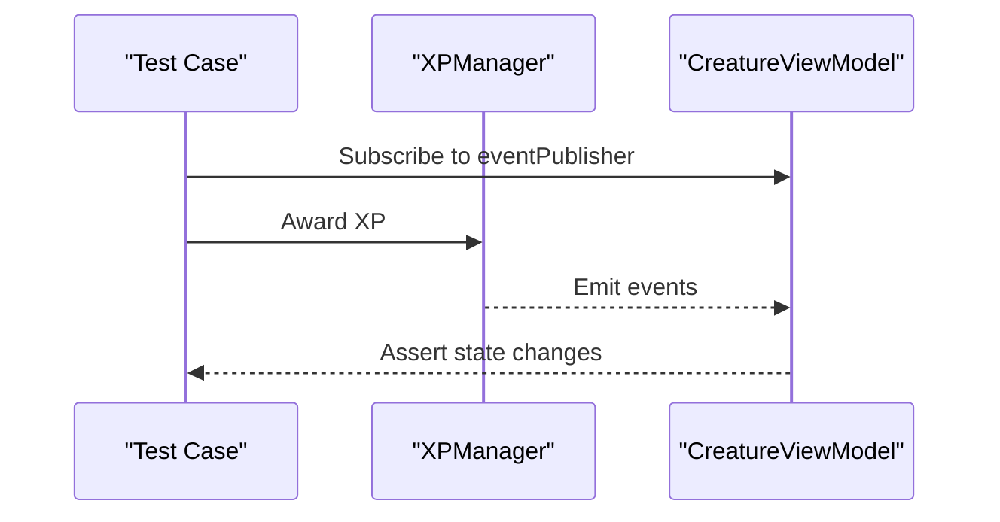

**Diagram sources**
- [XPManager.swift](file://TaskMon/TaskMon/Services/XPManager.swift#L14-L47)
- [CreatureViewModel.swift](file://TaskMon/TaskMon/ViewModels/CreatureViewModel.swift#L24-L31)

**Section sources**
- [XPManager.swift](file://TaskMon/TaskMon/Services/XPManager.swift#L10-L96)
- [CreatureViewModel.swift](file://TaskMon/TaskMon/ViewModels/CreatureViewModel.swift#L24-L63)

### Async/Await Testing for Service Operations
- Test strategies:
  - Use XCTUnwrap and XCTAssertNoThrow for awaited service calls.
  - Mock protocol implementations to simulate success/failure paths.
  - For online flows, stub queue observation and battle observation to trigger callbacks deterministically.
- Example targets:
  - BattleViewModel matchmaking and battle observation.
  - Auth and database operations via FirebaseService protocols.

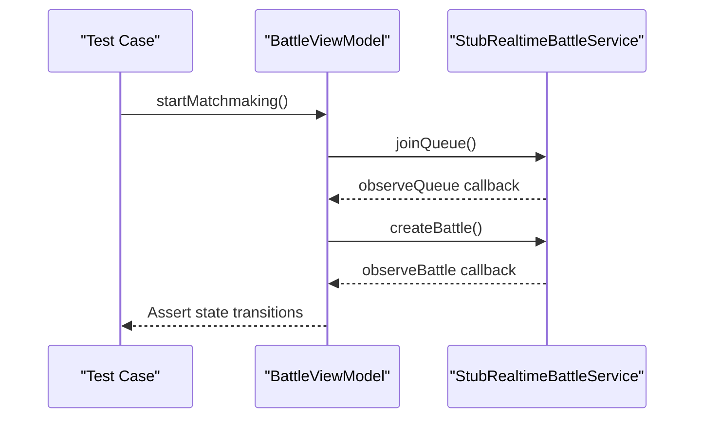

**Diagram sources**
- [BattleViewModel.swift](file://TaskMon/TaskMon/ViewModels/BattleViewModel.swift#L167-L203)
- [BattleViewModel.swift](file://TaskMon/TaskMon/ViewModels/BattleViewModel.swift#L225-L281)
- [FirebaseService.swift](file://TaskMon/TaskMon/Services/FirebaseService.swift#L102-L142)

**Section sources**
- [BattleViewModel.swift](file://TaskMon/TaskMon/ViewModels/BattleViewModel.swift#L167-L281)
- [FirebaseService.swift](file://TaskMon/TaskMon/Services/FirebaseService.swift#L24-L35)

### Mock Implementation Strategies for External Dependencies
- Protocol-first design:
  - Define AuthServiceProtocol, DatabaseServiceProtocol, RealtimeBattleServiceProtocol.
  - Provide Stub implementations for local-only testing.
- Conditional Firebase:
  - Keep stubs enabled by default; switch to Firebase implementations when configured.
- Test utilities:
  - Create lightweight mocks for services returning deterministic data.
  - Inject mocks via dependency injection or a ServiceContainer.

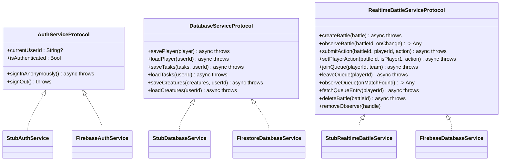

**Diagram sources**
- [FirebaseService.swift](file://TaskMon/TaskMon/Services/FirebaseService.swift#L8-L35)
- [FirebaseImplementation.swift](file://TaskMon/TaskMon/Services/FirebaseImplementation.swift#L19-L173)

**Section sources**
- [FirebaseService.swift](file://TaskMon/TaskMon/Services/FirebaseService.swift#L3-L143)
- [FirebaseImplementation.swift](file://TaskMon/TaskMon/Services/FirebaseImplementation.swift#L19-L173)

### Testing Utilities and Helper Functions
- Task completion workflows:
  - Helper to create a TaskItem with category and difficulty.
  - Helper to award XP and capture emitted events.
- Creature evolution sequences:
  - Helper to generate a creature at a specific stage and level.
  - Helper to simulate XP crossing thresholds and assert evolution.
- Battle outcomes:
  - Helper to construct a Battle with predefined teams and active indices.
  - Helper to simulate actions and assert turn resolution results.

[No sources needed since this section provides general guidance]

### iOS-Specific Testing Challenges and Approaches
- Simulator limitations:
  - Network latency and queue timing may differ; use stubbed services and controlled timers.
  - Image assets availability; test fallback rendering in CreatureSpriteView.
- Device-specific behaviors:
  - Animations and timing-sensitive UI; use XCTest expectation timeouts and MainActor assertions.
- Performance testing:
  - Measure turn resolution and animation durations under load.
  - Profile memory usage during long battle sessions.

[No sources needed since this section provides general guidance]

### Continuous Integration Setup Recommendations
- Automated testing pipeline:
  - Build and test on Xcode Cloud or GitHub Actions with iOS simulators.
  - Run unit tests, integration tests against stubbed services, and UI tests.
- Quality gates:
  - Enforce minimum test coverage thresholds.
  - Gate PRs on successful test runs and lint checks.
- Test environment configuration:
  - Provide empty GoogleService-Info.plist to ensure stub services activate.
  - Seed test data via UserDefaults for deterministic state.

[No sources needed since this section provides general guidance]

### Debugging Strategies
- Complex state management:
  - Log ViewModel state transitions and Combine emissions.
  - Use breakpoints in event handlers and timer callbacks.
- Race conditions in reactive streams:
  - Serialize async operations and assert ordering of emissions.
  - Use XCTest expectations with timeouts to detect stalled publishers.
- UI responsiveness problems:
  - Verify animations occur on MainActor and avoid blocking the main thread.
  - Instrument BattleViewModel animations and log timing.

[No sources needed since this section provides general guidance]

### Guidelines for Test Data Management and Regression Testing
- Test data management:
  - Use deterministic seeds for random number generators in CreatureGenerator and BattleEngine.
  - Persist minimal test fixtures to UserDefaults for ViewModels.
- Regression testing:
  - Maintain a suite of representative tasks, creatures, and battles.
  - Add tests for bug fixes and feature additions; run before merging.

[No sources needed since this section provides general guidance]

## Dependency Analysis
The following diagram highlights key dependencies among components and their testability via protocols.

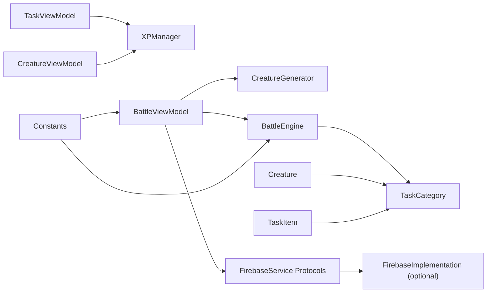

**Diagram sources**
- [TaskViewModel.swift](file://TaskMon/TaskMon/ViewModels/TaskViewModel.swift#L11-L33)
- [CreatureViewModel.swift](file://TaskMon/TaskMon/ViewModels/CreatureViewModel.swift#L13-L29)
- [BattleViewModel.swift](file://TaskMon/TaskMon/ViewModels/BattleViewModel.swift#L36-L37)
- [XPManager.swift](file://TaskMon/TaskMon/Services/XPManager.swift#L10-L20)
- [CreatureGenerator.swift](file://TaskMon/TaskMon/Services/CreatureGenerator.swift#L3-L10)
- [BattleEngine.swift](file://TaskMon/TaskMon/Services/BattleEngine.swift#L3-L5)
- [FirebaseService.swift](file://TaskMon/TaskMon/Services/FirebaseService.swift#L8-L35)
- [FirebaseImplementation.swift](file://TaskMon/TaskMon/Services/FirebaseImplementation.swift#L19-L37)
- [Creature.swift](file://TaskMon/TaskMon/Models/Creature.swift#L33-L42)
- [TaskItem.swift](file://TaskMon/TaskMon/Models/TaskItem.swift#L27-L33)
- [TaskCategory.swift](file://TaskMon/TaskMon/Models/TaskCategory.swift#L4-L11)
- [Constants.swift](file://TaskMon/TaskMon/Utils/Constants.swift#L4-L24)

**Section sources**
- [TaskViewModel.swift](file://TaskMon/TaskMon/ViewModels/TaskViewModel.swift#L11-L33)
- [CreatureViewModel.swift](file://TaskMon/TaskMon/ViewModels/CreatureViewModel.swift#L13-L29)
- [BattleViewModel.swift](file://TaskMon/TaskMon/ViewModels/BattleViewModel.swift#L36-L37)
- [FirebaseService.swift](file://TaskMon/TaskMon/Services/FirebaseService.swift#L8-L35)

## Performance Considerations
- Prefer stub services for fast, deterministic tests.
- Minimize UI animations in unit tests; test logic separately from rendering.
- Use small, focused test suites for reactive streams to reduce flakiness.

[No sources needed since this section provides general guidance]

## Troubleshooting Guide
- Combine publisher not emitting:
  - Verify sink is stored and not deallocated.
  - Ensure emissions occur on the expected scheduler (e.g., main).
- Battle state not updating:
  - Confirm MainActor usage for UI updates.
  - Check timer and observer handles are invalidated on reset.
- Stubs not being used:
  - Ensure Firebase SDK is not linked or stubs remain active.

**Section sources**
- [BattleViewModel.swift](file://TaskMon/TaskMon/ViewModels/BattleViewModel.swift#L285-L357)
- [FirebaseService.swift](file://TaskMon/TaskMon/Services/FirebaseService.swift#L3-L7)

## Conclusion
TaskMon’s testing strategy leverages protocol-based services, Combine publishers, and async/await to build a robust, testable architecture. By focusing on ViewModel logic, service behaviors, and SwiftUI rendering, teams can achieve high confidence in task management, creature evolution, and battle systems while maintaining portability across environments.

## Appendices
- Appendix A: Example test targets
  - TaskViewModel: addTask, completeTask, deleteTask, persistence.
  - CreatureViewModel: XP event handling, evolution, healing.
  - BattleViewModel: local battle, matchmaking, online actions, reset.
  - Services: XPManager awardXP, CreatureGenerator, BattleEngine.
- Appendix B: Mock checklist
  - Implement protocol stubs for all external services.
  - Provide deterministic random behavior for reproducibility.
  - Inject mocks via initializer or container for testability.

[No sources needed since this section provides general guidance]