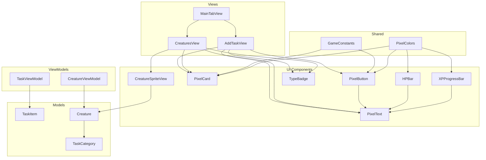
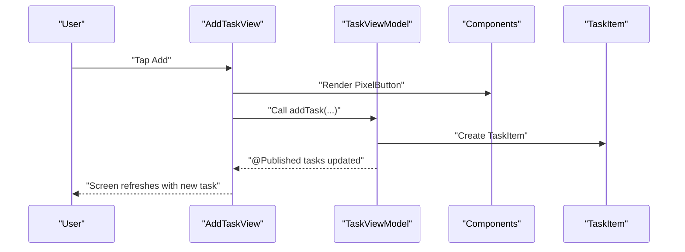
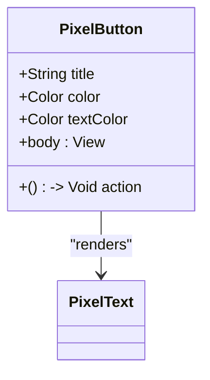
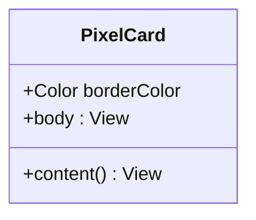
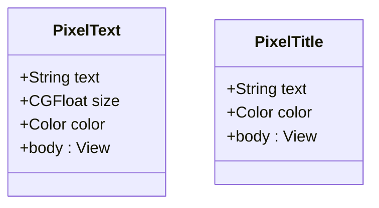
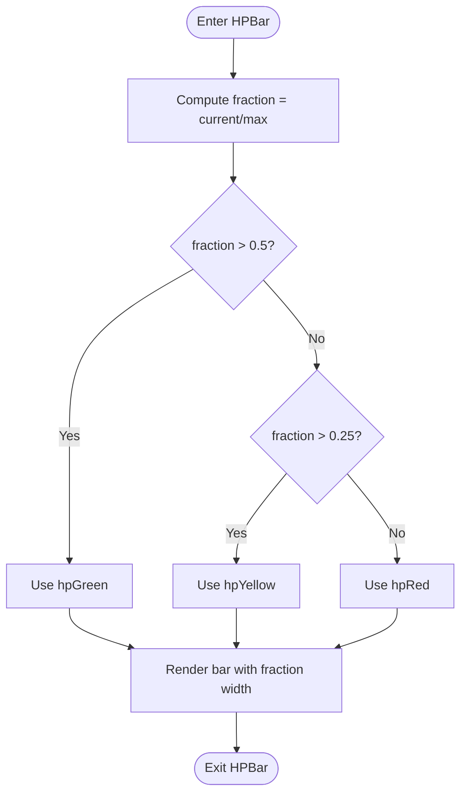
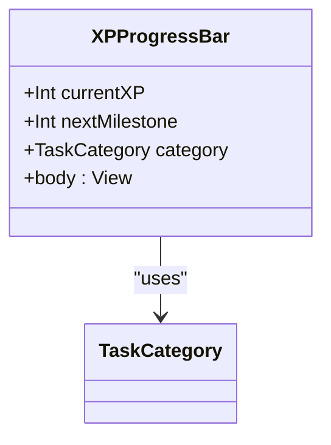
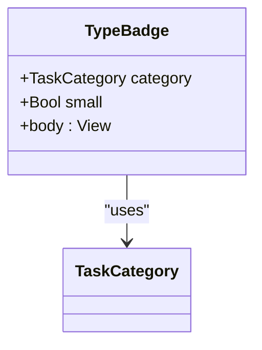
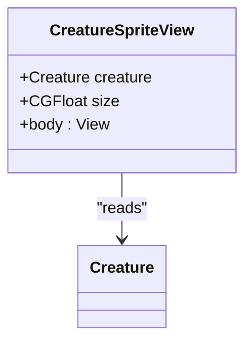
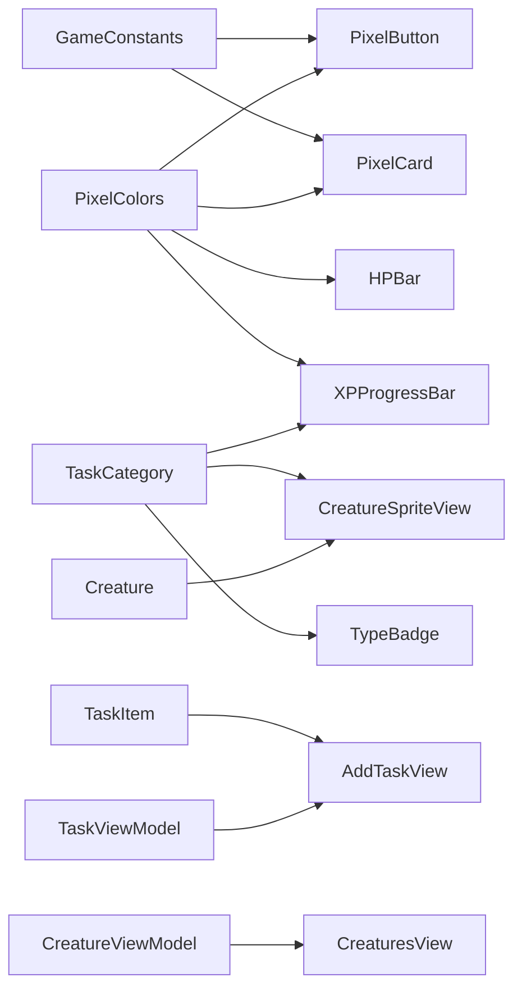

# Component Library Overview

<cite>
**Referenced Files in This Document**
- [PixelButton.swift](file://TaskMon/TaskMon/Views/Components/PixelButton.swift)
- [PixelText.swift](file://TaskMon/TaskMon/Views/Components/PixelText.swift)
- [HPBar.swift](file://TaskMon/TaskMon/Views/Components/HPBar.swift)
- [CreatureSpriteView.swift](file://TaskMon/TaskMon/Views/Components/CreatureSpriteView.swift)
- [Constants.swift](file://TaskMon/TaskMon/Utils/Constants.swift)
- [AddTaskView.swift](file://TaskMon/TaskMon/Views/Tasks/AddTaskView.swift)
- [CreaturesView.swift](file://TaskMon/TaskMon/Views/Creatures/CreaturesView.swift)
- [MainTabView.swift](file://TaskMon/TaskMon/Views/MainTabView.swift)
- [Creature.swift](file://TaskMon/TaskMon/Models/Creature.swift)
- [TaskCategory.swift](file://TaskMon/TaskMon/Models/TaskCategory.swift)
- [TaskItem.swift](file://TaskMon/TaskMon/Models/TaskItem.swift)
- [TaskViewModel.swift](file://TaskMon/TaskMon/ViewModels/TaskViewModel.swift)
- [CreatureViewModel.swift](file://TaskMon/TaskMon/ViewModels/CreatureViewModel.swift)
</cite>

## Table of Contents
1. [Introduction](#introduction)
2. [Project Structure](#project-structure)
3. [Core Components](#core-components)
4. [Architecture Overview](#architecture-overview)
5. [Detailed Component Analysis](#detailed-component-analysis)
6. [Dependency Analysis](#dependency-analysis)
7. [Performance Considerations](#performance-considerations)
8. [Accessibility Features](#accessibility-features)
9. [Component Selection and Usage Guidelines](#component-selection-and-usage-guidelines)
10. [Integration with SwiftUI](#integration-with-swiftui)
11. [Troubleshooting Guide](#troubleshooting-guide)
12. [Conclusion](#conclusion)

## Introduction
This document describes TaskMon’s custom UI component library and how it creates a cohesive pixel art–themed experience across the app. The design philosophy centers on a retro-futuristic aesthetic using sharp, blocky visuals, monospaced typography, and a consistent color palette. Components are intentionally small, composable, and reusable, enabling rapid construction of complex screens while maintaining visual consistency.

The library emphasizes:
- Pixel-perfect rendering and crisp edges
- Monospaced fonts for a “pixel font” feel
- Minimal borders and subtle shadows for depth
- Consistent corner radii and spacing
- Category-driven theming via colors and icons

## Project Structure
The component library lives under Views/Components and is consumed by higher-level views such as Tasks, Creatures, and Battle. Shared constants and colors are centralized in Utils/Constants.swift. Models and ViewModels manage domain data and state, feeding into the UI.

**Diagram sources**
- [PixelButton.swift](file://TaskMon/TaskMon/Views/Components/PixelButton.swift#L3-L27)
- [PixelText.swift](file://TaskMon/TaskMon/Views/Components/PixelText.swift#L3-L25)
- [HPBar.swift](file://TaskMon/TaskMon/Views/Components/HPBar.swift#L3-L48)
- [CreatureSpriteView.swift](file://TaskMon/TaskMon/Views/Components/CreatureSpriteView.swift#L3-L19)
- [AddTaskView.swift](file://TaskMon/TaskMon/Views/Tasks/AddTaskView.swift#L11-L130)
- [CreaturesView.swift](file://TaskMon/TaskMon/Views/Creatures/CreaturesView.swift#L21-L70)
- [MainTabView.swift](file://TaskMon/TaskMon/Views/MainTabView.swift#L6-L27)
- [Constants.swift](file://TaskMon/TaskMon/Utils/Constants.swift#L4-L39)
- [TaskCategory.swift](file://TaskMon/TaskMon/Models/TaskCategory.swift#L4-L41)
- [TaskItem.swift](file://TaskMon/TaskMon/Models/TaskItem.swift#L27-L43)
- [Creature.swift](file://TaskMon/TaskMon/Models/Creature.swift#L33-L97)
- [TaskViewModel.swift](file://TaskMon/TaskMon/ViewModels/TaskViewModel.swift#L5-L75)
- [CreatureViewModel.swift](file://TaskMon/TaskMon/ViewModels/CreatureViewModel.swift#L5-L89)

**Section sources**
- [PixelButton.swift](file://TaskMon/TaskMon/Views/Components/PixelButton.swift#L1-L44)
- [PixelText.swift](file://TaskMon/TaskMon/Views/Components/PixelText.swift#L1-L26)
- [HPBar.swift](file://TaskMon/TaskMon/Views/Components/HPBar.swift#L1-L110)
- [CreatureSpriteView.swift](file://TaskMon/TaskMon/Views/Components/CreatureSpriteView.swift#L1-L52)
- [Constants.swift](file://TaskMon/TaskMon/Utils/Constants.swift#L1-L40)
- [AddTaskView.swift](file://TaskMon/TaskMon/Views/Tasks/AddTaskView.swift#L1-L148)
- [CreaturesView.swift](file://TaskMon/TaskMon/Views/Creatures/CreaturesView.swift#L1-L139)
- [MainTabView.swift](file://TaskMon/TaskMon/Views/MainTabView.swift#L1-L29)

## Core Components
This section documents the foundational components and their shared patterns.

- PixelText: Provides monospaced, bold typography with configurable size and color. Used widely for labels, titles, and numeric displays.
- PixelButton: A styled button with pixel-border styling, optional press feedback, and a plain button style for clean hit targets.
- PixelCard: A reusable container with rounded corners, border, and background, parameterized with a content builder for composition.
- HPBar: Progress visualization for HP with animated fill and category-aware color zones.
- XPProgressBar: Progress visualization for XP toward milestones, aligned with TaskCategory.
- TypeBadge: Lightweight tag representing a TaskCategory with icon and label.
- CreatureSpriteView: Displays a creature sprite with crisp interpolation and fallback visuals.

Common props and patterns:
- Shared styling: All components consistently use GameConstants for corner radii and border widths, and PixelColors for theming.
- Composition: PixelCard wraps arbitrary content via a generic @ViewBuilder, enabling flexible layouts.
- Typography: Monospaced fonts are used for a pixel-like appearance.
- Interactions: Buttons provide subtle haptic feedback on press.

**Section sources**
- [PixelText.swift](file://TaskMon/TaskMon/Views/Components/PixelText.swift#L3-L25)
- [PixelButton.swift](file://TaskMon/TaskMon/Views/Components/PixelButton.swift#L3-L27)
- [HPBar.swift](file://TaskMon/TaskMon/Views/Components/HPBar.swift#L3-L48)
- [Constants.swift](file://TaskMon/TaskMon/Utils/Constants.swift#L4-L39)

## Architecture Overview
The component library sits beneath SwiftUI views and integrates with ViewModels and Models. The flow is:
- Views declare layout and bind to ViewModel state.
- Components consume models and present them with consistent styling.
- Shared constants and colors unify the look and feel.

**Diagram sources**
- [AddTaskView.swift](file://TaskMon/TaskMon/Views/Tasks/AddTaskView.swift#L132-L138)
- [TaskViewModel.swift](file://TaskMon/TaskMon/ViewModels/TaskViewModel.swift#L20-L24)
- [PixelButton.swift](file://TaskMon/TaskMon/Views/Components/PixelButton.swift#L3-L27)

## Detailed Component Analysis

### PixelButton
- Purpose: Interactive control with pixel-border styling and press feedback.
- Props: title, color, textColor, action.
- Behavior: Wraps a SwiftUI Button with a plain style, adds shadow and stroke effects, triggers haptic feedback before invoking action.
- Composition: Often used inside PixelCard or standalone for actions.

**Diagram sources**
- [PixelButton.swift](file://TaskMon/TaskMon/Views/Components/PixelButton.swift#L3-L27)
- [PixelText.swift](file://TaskMon/TaskMon/Views/Components/PixelText.swift#L3-L13)

**Section sources**
- [PixelButton.swift](file://TaskMon/TaskMon/Views/Components/PixelButton.swift#L1-L44)

### PixelCard
- Purpose: Container with consistent border, background, and corner radius.
- Props: borderColor, content (generic).
- Behavior: Applies padding, background, overlay stroke, and clips to rounded rectangle.

**Diagram sources**
- [PixelButton.swift](file://TaskMon/TaskMon/Views/Components/PixelButton.swift#L29-L43)

**Section sources**
- [PixelButton.swift](file://TaskMon/TaskMon/Views/Components/PixelButton.swift#L29-L43)

### PixelText and PixelTitle
- Purpose: Typography primitives with monospaced, bold weights.
- Differences: PixelTitle uses larger size and tracking for emphasis.

**Diagram sources**
- [PixelText.swift](file://TaskMon/TaskMon/Views/Components/PixelText.swift#L3-L25)

**Section sources**
- [PixelText.swift](file://TaskMon/TaskMon/Views/Components/PixelText.swift#L1-L26)

### HPBar
- Purpose: Visualize HP with animated fill and color-coded segments.
- Props: currentHP, maxHP, height, showLabel.
- Behavior: Computes fraction, selects color based on threshold, animates width change.

**Diagram sources**
- [HPBar.swift](file://TaskMon/TaskMon/Views/Components/HPBar.swift#L9-L47)

**Section sources**
- [HPBar.swift](file://TaskMon/TaskMon/Views/Components/HPBar.swift#L1-L110)

### XPProgressBar
- Purpose: Visualize XP progress per TaskCategory with category color.
- Props: currentXP, nextMilestone, category.
- Behavior: Displays category icon and name, renders progress bar with category opacity.

**Diagram sources**
- [HPBar.swift](file://TaskMon/TaskMon/Views/Components/HPBar.swift#L50-L88)
- [TaskCategory.swift](file://TaskMon/TaskMon/Models/TaskCategory.swift#L4-L41)

**Section sources**
- [HPBar.swift](file://TaskMon/TaskMon/Views/Components/HPBar.swift#L50-L88)

### TypeBadge
- Purpose: Lightweight tag indicating TaskCategory with icon and optional label.
- Props: category, small.
- Behavior: Uses category icon and color, applies rounded clipping.

**Diagram sources**
- [HPBar.swift](file://TaskMon/TaskMon/Views/Components/HPBar.swift#L90-L110)
- [TaskCategory.swift](file://TaskMon/TaskMon/Models/TaskCategory.swift#L4-L41)

**Section sources**
- [HPBar.swift](file://TaskMon/TaskMon/Views/Components/HPBar.swift#L90-L110)

### CreatureSpriteView
- Purpose: Display creature sprites with crisp pixel scaling and fallback visuals.
- Props: creature, size.
- Behavior: Uses spriteName from Creature; falls back to category-based icon with colored ring.

**Diagram sources**
- [CreatureSpriteView.swift](file://TaskMon/TaskMon/Views/Components/CreatureSpriteView.swift#L3-L19)
- [Creature.swift](file://TaskMon/TaskMon/Models/Creature.swift#L33-L46)

**Section sources**
- [CreatureSpriteView.swift](file://TaskMon/TaskMon/Views/Components/CreatureSpriteView.swift#L1-L52)

## Dependency Analysis
- Shared styling: All components depend on GameConstants and PixelColors for consistent visuals.
- Category theming: TaskCategory drives colors and icons used across components.
- Data models: Creature and TaskItem inform component rendering and state.
- ViewModels: TaskViewModel and CreatureViewModel publish state updates that views react to.

**Diagram sources**
- [Constants.swift](file://TaskMon/TaskMon/Utils/Constants.swift#L4-L39)
- [PixelButton.swift](file://TaskMon/TaskMon/Views/Components/PixelButton.swift#L3-L27)
- [PixelCard.swift](file://TaskMon/TaskMon/Views/Components/PixelButton.swift#L29-L43)
- [HPBar.swift](file://TaskMon/TaskMon/Views/Components/HPBar.swift#L3-L48)
- [TaskCategory.swift](file://TaskMon/TaskMon/Models/TaskCategory.swift#L4-L41)
- [CreatureSpriteView.swift](file://TaskMon/TaskMon/Views/Components/CreatureSpriteView.swift#L3-L19)
- [TaskItem.swift](file://TaskMon/TaskMon/Models/TaskItem.swift#L27-L43)
- [TaskViewModel.swift](file://TaskMon/TaskMon/ViewModels/TaskViewModel.swift#L5-L75)
- [CreatureViewModel.swift](file://TaskMon/TaskMon/ViewModels/CreatureViewModel.swift#L5-L89)

**Section sources**
- [Constants.swift](file://TaskMon/TaskMon/Utils/Constants.swift#L1-L40)
- [TaskCategory.swift](file://TaskMon/TaskMon/Models/TaskCategory.swift#L1-L85)
- [Creature.swift](file://TaskMon/TaskMon/Models/Creature.swift#L1-L98)
- [TaskItem.swift](file://TaskMon/TaskMon/Models/TaskItem.swift#L1-L44)
- [TaskViewModel.swift](file://TaskMon/TaskMon/ViewModels/TaskViewModel.swift#L1-L76)
- [CreatureViewModel.swift](file://TaskMon/TaskMon/ViewModels/CreatureViewModel.swift#L1-L90)

## Performance Considerations
- Pixel scaling: CreatureSpriteView uses nearest-neighbor interpolation to maintain crispness at scale.
- Animations: HPBar and XPProgressBar use short, easing animations for smooth transitions without heavy computations.
- GeometryReader: Used sparingly for responsive bars; ensure minimal recomputation by anchoring to stable values.
- Lazy grids: CreaturesView uses LazyVGrid to efficiently render large lists.
- Haptics: PixelButton triggers lightweight feedback; limit frequency to avoid user fatigue.
- Published state: ViewModels publish granular state changes to minimize unnecessary view rebuilds.

[No sources needed since this section provides general guidance]

## Accessibility Features
- Dynamic Type: Components use system fonts with scalable sizes; ensure content respects Dynamic Type by avoiding fixed absolute sizes where possible.
- VoiceOver: Buttons and interactive elements inherit semantic roles from SwiftUI; ensure labels and hierarchy are clear.
- Contrast: PixelColors and category colors are designed for readability; verify sufficient contrast for text overlays.
- Focus order: Maintain logical tab order in forms and grids; avoid hidden interactive elements.
- Motion sensitivity: Keep animations subtle and configurable; provide reduced motion options where feasible.

[No sources needed since this section provides general guidance]

## Component Selection and Usage Guidelines
- Choose PixelText for labels and titles; use PixelTitle for section headers.
- Use PixelButton for primary actions; pair with PixelCard for contained layouts.
- Use HPBar to display creature health; use XPProgressBar for task XP milestones.
- Use TypeBadge to indicate task categories; combine with icons for clarity.
- Use CreatureSpriteView for creature avatars; pair with rounded backgrounds for visibility.
- Compose PixelCard around content blocks to maintain consistent spacing and borders.

[No sources needed since this section provides general guidance]

## Integration with SwiftUI
- Declarative bindings: Bind component props to ViewModel state using @State/@Binding/@Published.
- Environment: Access environment values (e.g., dismiss) through @Environment or @EnvironmentObject.
- Navigation: Use NavigationStack and toolbar items with PixelTitle for consistent headers.
- Sheets and overlays: Use .sheet and .overlay with z-indexing for modal or ephemeral content.

**Section sources**
- [AddTaskView.swift](file://TaskMon/TaskMon/Views/Tasks/AddTaskView.swift#L3-L130)
- [CreaturesView.swift](file://TaskMon/TaskMon/Views/Creatures/CreaturesView.swift#L55-L68)
- [MainTabView.swift](file://TaskMon/TaskMon/Views/MainTabView.swift#L6-L27)

## Troubleshooting Guide
- Crisp sprite scaling: If images appear blurry, confirm interpolation and scaledToFit are applied in CreatureSpriteView.
- Animation stutter: Reduce animation duration or disable where not essential; anchor values to stable state.
- Layout overflow: Ensure PixelCard padding and corner radii align with content insets; clip shapes prevent overflow.
- Haptics not firing: Verify UIImpactFeedbackGenerator is initialized and called before action dispatch.
- XP progress not updating: Confirm XPManager events are published and CreatureViewModel subscribes and updates state.

**Section sources**
- [CreatureSpriteView.swift](file://TaskMon/TaskMon/Views/Components/CreatureSpriteView.swift#L8-L18)
- [HPBar.swift](file://TaskMon/TaskMon/Views/Components/HPBar.swift#L38-L38)
- [PixelButton.swift](file://TaskMon/TaskMon/Views/Components/PixelButton.swift#L10-L14)
- [CreatureViewModel.swift](file://TaskMon/TaskMon/ViewModels/CreatureViewModel.swift#L24-L63)

## Conclusion
TaskMon’s component library delivers a unified, pixel-inspired UI through small, composable primitives and shared styling. By centralizing constants and colors, leveraging category-driven theming, and integrating with SwiftUI’s declarative paradigm, the library enables fast iteration and consistent experiences across Tasks, Creatures, and Battle.

[No sources needed since this section summarizes without analyzing specific files]