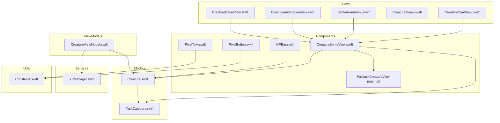
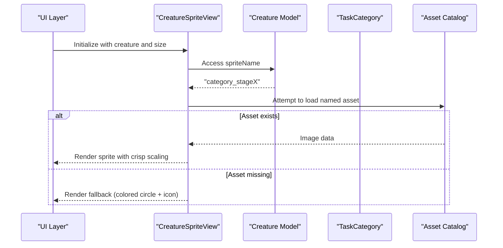
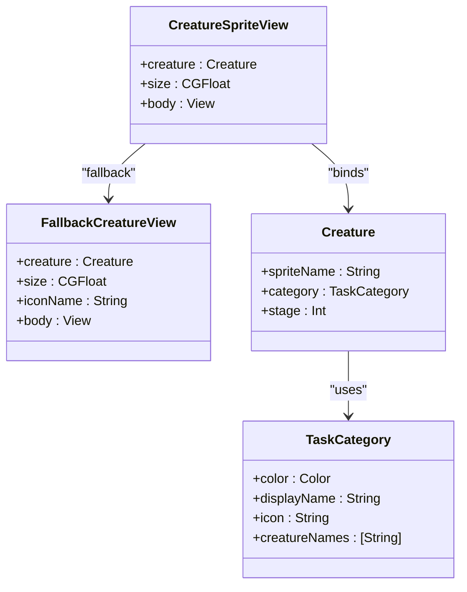
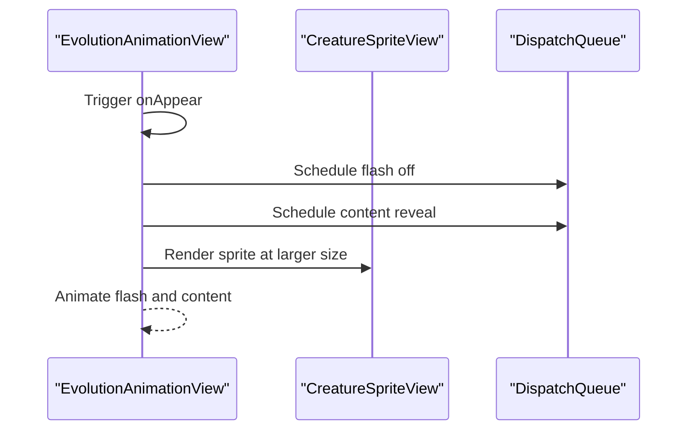
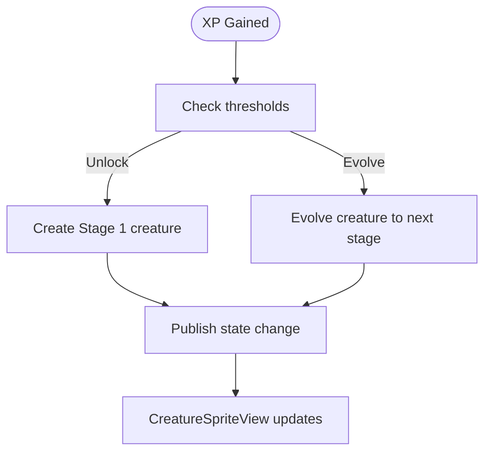
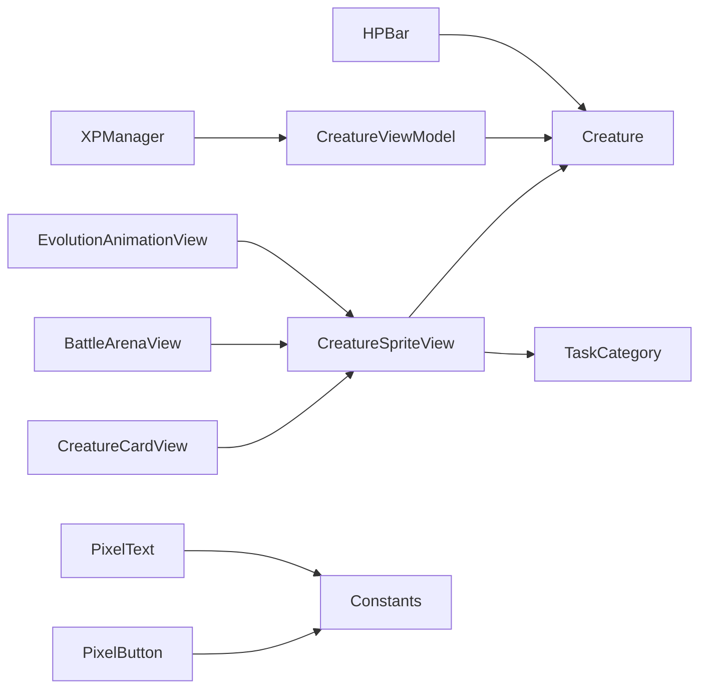

# Creature Sprite View

<cite>
**Referenced Files in This Document**
- [CreatureSpriteView.swift](file://TaskMon/TaskMon/Views/Components/CreatureSpriteView.swift)
- [Creature.swift](file://TaskMon/TaskMon/Models/Creature.swift)
- [TaskCategory.swift](file://TaskMon/TaskMon/Models/TaskCategory.swift)
- [CreatureCardView.swift](file://TaskMon/TaskMon/Views/Creatures/CreatureCardView.swift)
- [BattleArenaView.swift](file://TaskMon/TaskMon/Views/Battle/BattleArenaView.swift)
- [EvolutionAnimationView.swift](file://TaskMon/TaskMon/Views/Creatures/EvolutionAnimationView.swift)
- [CreatureViewModel.swift](file://TaskMon/TaskMon/ViewModels/CreatureViewModel.swift)
- [XPManager.swift](file://TaskMon/TaskMon/Services/XPManager.swift)
- [Constants.swift](file://TaskMon/TaskMon/Utils/Constants.swift)
- [HPBar.swift](file://TaskMon/TaskMon/Views/Components/HPBar.swift)
- [PixelButton.swift](file://TaskMon/TaskMon/Views/Components/PixelButton.swift)
- [PixelText.swift](file://TaskMon/TaskMon/Views/Components/PixelText.swift)
- [CreaturesView.swift](file://TaskMon/TaskMon/Views/Creatures/CreaturesView.swift)
- [CreatureDetailView.swift](file://TaskMon/TaskMon/Views/Creatures/CreatureDetailView.swift)
</cite>

## Table of Contents
1. [Introduction](#introduction)
2. [Project Structure](#project-structure)
3. [Core Components](#core-components)
4. [Architecture Overview](#architecture-overview)
5. [Detailed Component Analysis](#detailed-component-analysis)
6. [Dependency Analysis](#dependency-analysis)
7. [Performance Considerations](#performance-considerations)
8. [Troubleshooting Guide](#troubleshooting-guide)
9. [Accessibility Considerations](#accessibility-considerations)
10. [Visual Design Standards](#visual-design-standards)
11. [Usage Examples](#usage-examples)
12. [Conclusion](#conclusion)

## Introduction
This document provides comprehensive documentation for the CreatureSpriteView component, focusing on sprite rendering, animation handling, and integration with the broader creature artwork system. It explains the component's props, sprite loading mechanisms, fallback rendering, and how sprites are organized by category and evolution stage. It also covers performance optimizations, accessibility considerations, and practical usage examples across different UI contexts such as creature cards, battle arenas, and collection views.

## Project Structure
The CreatureSpriteView resides within the Components layer and integrates with Models, Views, and Services across the application. The sprite assets are organized by category and evolution stage under the app's asset catalog, while the component dynamically selects images based on creature data.

**Diagram sources**
- [CreatureSpriteView.swift](file://TaskMon/TaskMon/Views/Components/CreatureSpriteView.swift#L1-L52)
- [Creature.swift](file://TaskMon/TaskMon/Models/Creature.swift#L1-L98)
- [TaskCategory.swift](file://TaskMon/TaskMon/Models/TaskCategory.swift#L1-L85)
- [CreatureCardView.swift](file://TaskMon/TaskMon/Views/Creatures/CreatureCardView.swift#L1-L53)
- [BattleArenaView.swift](file://TaskMon/TaskMon/Views/Battle/BattleArenaView.swift#L1-L287)
- [EvolutionAnimationView.swift](file://TaskMon/TaskMon/Views/Creatures/EvolutionAnimationView.swift#L1-L93)
- [CreatureViewModel.swift](file://TaskMon/TaskMon/ViewModels/CreatureViewModel.swift#L1-L90)
- [XPManager.swift](file://TaskMon/TaskMon/Services/XPManager.swift#L1-L96)
- [Constants.swift](file://TaskMon/TaskMon/Utils/Constants.swift#L1-L40)
- [HPBar.swift](file://TaskMon/TaskMon/Views/Components/HPBar.swift#L1-L48)
- [PixelButton.swift](file://TaskMon/TaskMon/Views/Components/PixelButton.swift#L1-L44)
- [PixelText.swift](file://TaskMon/TaskMon/Views/Components/PixelText.swift#L1-L26)
- [CreaturesView.swift](file://TaskMon/TaskMon/Views/Creatures/CreaturesView.swift#L1-L120)
- [CreatureDetailView.swift](file://TaskMon/TaskMon/Views/Creatures/CreatureDetailView.swift#L1-L120)

**Section sources**
- [CreatureSpriteView.swift](file://TaskMon/TaskMon/Views/Components/CreatureSpriteView.swift#L1-L52)
- [Creature.swift](file://TaskMon/TaskMon/Models/Creature.swift#L1-L98)
- [TaskCategory.swift](file://TaskMon/TaskMon/Models/TaskCategory.swift#L1-L85)

## Core Components
- CreatureSpriteView: Renders a creature sprite with crisp pixel scaling, circular clipping, and a fallback rendering system when the asset is missing.
- FallbackCreatureView: Provides a fallback UI using category-specific icons and colored circles when the sprite asset is unavailable.
- Creature model: Supplies sprite naming conventions and evolution metadata used by the sprite view.
- TaskCategory: Defines category-based artwork naming and color palettes used by both sprites and fallbacks.
- Integration points: Used across CreatureCardView, BattleArenaView, EvolutionAnimationView, and CreatureDetailView.

Key responsibilities:
- Prop-driven rendering via creature data binding
- Category-based artwork selection through spriteName
- Size control via configurable size parameter
- Asset fallback and graceful degradation

**Section sources**
- [CreatureSpriteView.swift](file://TaskMon/TaskMon/Views/Components/CreatureSpriteView.swift#L3-L18)
- [Creature.swift](file://TaskMon/TaskMon/Models/Creature.swift#L44-L46)
- [TaskCategory.swift](file://TaskMon/TaskMon/Models/TaskCategory.swift#L33-L41)

## Architecture Overview
The sprite rendering pipeline is data-driven:
- Creature data determines the sprite asset name and category.
- The view renders the named asset with pixel-perfect scaling and circular clipping.
- If the asset is missing, a fallback view renders category-specific icons with colored backgrounds.

**Diagram sources**
- [CreatureSpriteView.swift](file://TaskMon/TaskMon/Views/Components/CreatureSpriteView.swift#L7-L17)
- [Creature.swift](file://TaskMon/TaskMon/Models/Creature.swift#L44-L46)
- [TaskCategory.swift](file://TaskMon/TaskMon/Models/TaskCategory.swift#L23-L31)

## Detailed Component Analysis

### CreatureSpriteView
Props:
- creature: Creature — Data binding for sprite selection and fallback iconography.
- size: CGFloat — Controls rendered size of the sprite.

Rendering behavior:
- Uses the creature's spriteName to select the appropriate asset.
- Applies resizable, interpolation, scaledToFit, and circular clipping for pixel-perfect presentation.
- Includes a background fallback rendering when the asset is not found.

**Diagram sources**
- [CreatureSpriteView.swift](file://TaskMon/TaskMon/Views/Components/CreatureSpriteView.swift#L3-L18)
- [Creature.swift](file://TaskMon/TaskMon/Models/Creature.swift#L33-L46)
- [TaskCategory.swift](file://TaskMon/TaskMon/Models/TaskCategory.swift#L4-L41)

**Section sources**
- [CreatureSpriteView.swift](file://TaskMon/TaskMon/Views/Components/CreatureSpriteView.swift#L3-L18)
- [Creature.swift](file://TaskMon/TaskMon/Models/Creature.swift#L44-L46)

### FallbackCreatureView
Behavior:
- Selects an icon based on category and stage.
- Renders a semi-transparent colored circle outline with a foreground icon centered.

Integration:
- Automatically invoked when the primary asset is missing.

**Section sources**
- [CreatureSpriteView.swift](file://TaskMon/TaskMon/Views/Components/CreatureSpriteView.swift#L21-L51)
- [TaskCategory.swift](file://TaskMon/TaskMon/Models/TaskCategory.swift#L23-L31)

### Sprite Loading and Asset Management
- Naming convention: category_stageX (e.g., work_stage1, creative_stage3).
- Asset organization: Imagesets under the Creatures asset folder.
- Lazy loading: SwiftUI loads images on demand; no explicit caching is implemented in the view.
- Memory optimization: Circular clipping reduces overdraw; crisp interpolation preserves quality without scaling artifacts.

**Section sources**
- [Creature.swift](file://TaskMon/TaskMon/Models/Creature.swift#L44-L46)
- [CreatureSpriteView.swift](file://TaskMon/TaskMon/Views/Components/CreatureSpriteView.swift#L8-L12)

### Animation Framework and Evolution Transitions
- Idle animations: Not implemented in the sprite view itself; handled by higher-level views.
- Attack animations: Demonstrated in BattleArenaView with shake effects applied conditionally to the active creature sprite.
- Evolution transitions: Implemented in EvolutionAnimationView with flash, scale, and sparkle effects around the sprite.

**Diagram sources**
- [EvolutionAnimationView.swift](file://TaskMon/TaskMon/Views/Creatures/EvolutionAnimationView.swift#L72-L91)
- [CreatureSpriteView.swift](file://TaskMon/TaskMon/Views/Components/CreatureSpriteView.swift#L4-L5)

**Section sources**
- [BattleArenaView.swift](file://TaskMon/TaskMon/Views/Battle/BattleArenaView.swift#L65-L80)
- [EvolutionAnimationView.swift](file://TaskMon/TaskMon/Views/Creatures/EvolutionAnimationView.swift#L1-L93)

### Integration with Creature Artwork System
- Category-based artwork: Each category defines creature names and colors used by the sprite and fallback systems.
- Evolution stage mapping: Stage 1–3 assets are supported; evolution progress and thresholds are computed in the model.
- XP-driven evolution: XPManager emits events that CreatureViewModel listens to, triggering UI updates and evolution animations.

**Diagram sources**
- [XPManager.swift](file://TaskMon/TaskMon/Services/XPManager.swift#L22-L50)
- [CreatureViewModel.swift](file://TaskMon/TaskMon/ViewModels/CreatureViewModel.swift#L33-L63)
- [Creature.swift](file://TaskMon/TaskMon/Models/Creature.swift#L48-L64)

**Section sources**
- [TaskCategory.swift](file://TaskMon/TaskMon/Models/TaskCategory.swift#L53-L61)
- [Creature.swift](file://TaskMon/TaskMon/Models/Creature.swift#L48-L64)
- [XPManager.swift](file://TaskMon/TaskMon/Services/XPManager.swift#L1-L96)
- [CreatureViewModel.swift](file://TaskMon/TaskMon/ViewModels/CreatureViewModel.swift#L1-L90)

## Dependency Analysis
- Direct dependencies:
  - CreatureSpriteView depends on Creature for spriteName and on TaskCategory for fallback iconography.
  - Higher-level views depend on CreatureSpriteView for rendering.
- Indirect dependencies:
  - XPManager and CreatureViewModel orchestrate evolution and state changes that affect sprite visibility and animations.
  - UI constants influence sizing and styling consistency.

**Diagram sources**
- [CreatureSpriteView.swift](file://TaskMon/TaskMon/Views/Components/CreatureSpriteView.swift#L3-L18)
- [Creature.swift](file://TaskMon/TaskMon/Models/Creature.swift#L33-L46)
- [TaskCategory.swift](file://TaskMon/TaskMon/Models/TaskCategory.swift#L4-L41)
- [CreatureCardView.swift](file://TaskMon/TaskMon/Views/Creatures/CreatureCardView.swift#L10)
- [BattleArenaView.swift](file://TaskMon/TaskMon/Views/Battle/BattleArenaView.swift#L65-L80)
- [EvolutionAnimationView.swift](file://TaskMon/TaskMon/Views/Creatures/EvolutionAnimationView.swift#L41)
- [CreatureViewModel.swift](file://TaskMon/TaskMon/ViewModels/CreatureViewModel.swift#L5-L11)
- [XPManager.swift](file://TaskMon/TaskMon/Services/XPManager.swift#L10-L14)
- [HPBar.swift](file://TaskMon/TaskMon/Views/Components/HPBar.swift#L1-L48)
- [PixelButton.swift](file://TaskMon/TaskMon/Views/Components/PixelButton.swift#L1-L26)
- [PixelText.swift](file://TaskMon/TaskMon/Views/Components/PixelText.swift#L1-L25)
- [Constants.swift](file://TaskMon/TaskMon/Utils/Constants.swift#L1-L40)

**Section sources**
- [CreatureSpriteView.swift](file://TaskMon/TaskMon/Views/Components/CreatureSpriteView.swift#L1-L52)
- [Creature.swift](file://TaskMon/TaskMon/Models/Creature.swift#L1-L98)
- [TaskCategory.swift](file://TaskMon/TaskMon/Models/TaskCategory.swift#L1-L85)
- [CreatureViewModel.swift](file://TaskMon/TaskMon/ViewModels/CreatureViewModel.swift#L1-L90)
- [XPManager.swift](file://TaskMon/TaskMon/Services/XPManager.swift#L1-L96)

## Performance Considerations
- Pixel scaling: Interpolation is set to maintain crispness, preventing blur during scaling.
- Circular clipping: Reduces overdraw and improves rendering efficiency for round avatars.
- Lazy loading: Assets are loaded on demand by SwiftUI; no manual caching is implemented.
- Frame rate management: Animations in higher-level views use short durations and predefined constants for consistent timing.
- GPU acceleration: SwiftUI leverages system rendering; avoid heavy per-frame computations in the sprite view.

Recommendations:
- Prefer pre-scaling assets to reduce runtime scaling overhead.
- Consider implementing an image cache layer if frequent re-renders occur in scroll-heavy contexts.
- Keep fallback rendering lightweight by minimizing nested views.

**Section sources**
- [CreatureSpriteView.swift](file://TaskMon/TaskMon/Views/Components/CreatureSpriteView.swift#L10-L13)
- [Constants.swift](file://TaskMon/TaskMon/Utils/Constants.swift#L23)

## Troubleshooting Guide
Common issues and resolutions:
- Missing sprite asset:
  - Symptom: Fallback icon appears instead of sprite.
  - Cause: Asset name mismatch or missing imageset.
  - Resolution: Verify spriteName matches the asset folder naming convention and ensure the imageset exists.
- Incorrect category or stage:
  - Symptom: Wrong artwork displayed.
  - Cause: Incorrect category or stage values in Creature.
  - Resolution: Confirm category.rawValue and stage align with expected naming.
- Blurry sprite scaling:
  - Symptom: Sprite appears blurry after resize.
  - Cause: Interpolation settings or incorrect frame sizing.
  - Resolution: Ensure interpolation is crisp and frame sizes match intended display size.
- Animation conflicts:
  - Symptom: Unexpected shaking or scaling in battle.
  - Cause: Conditional animations applied to the sprite view.
  - Resolution: Review higher-level view animations and ensure they target the correct state.

**Section sources**
- [CreatureSpriteView.swift](file://TaskMon/TaskMon/Views/Components/CreatureSpriteView.swift#L8-L17)
- [Creature.swift](file://TaskMon/TaskMon/Models/Creature.swift#L44-L46)
- [BattleArenaView.swift](file://TaskMon/TaskMon/Views/Battle/BattleArenaView.swift#L65-L80)

## Accessibility Considerations
- Creature identification:
  - Pair sprites with textual labels (name, stage stars) in UIs like CreatureCardView and CreatureDetailView.
  - Use TypeBadge to indicate category for context.
- Animation control:
  - Respect motion sensitivity preferences; avoid persistent flashing or rapid animations.
  - EvolutionAnimationView uses controlled flashes; ensure they are brief and optional.
- Alternative visual indicators:
  - Rely on category colors and icons in fallback rendering to convey meaning when images are unavailable.
  - Provide sufficient contrast between background and foreground elements.

**Section sources**
- [CreatureCardView.swift](file://TaskMon/TaskMon/Views/Creatures/CreatureCardView.swift#L10-L28)
- [CreatureDetailView.swift](file://TaskMon/TaskMon/Views/Creatures/CreatureDetailView.swift#L14-L38)
- [EvolutionAnimationView.swift](file://TaskMon/TaskMon/Views/Creatures/EvolutionAnimationView.swift#L17-L22)

## Visual Design Standards
- Consistent sizing:
  - Use predefined sizes across contexts: e.g., 48 for cards, 80 for main views, 120 for hero displays.
- Pixel art fidelity:
  - Maintain crisp edges by avoiding smooth interpolation and using appropriate frame sizes.
- Category harmony:
  - Align colors and icons with TaskCategory definitions for consistent brand identity.
- UI spacing:
  - Complement sprites with HP bars and badges for balanced layouts.

**Section sources**
- [CreatureCardView.swift](file://TaskMon/TaskMon/Views/Creatures/CreatureCardView.swift#L10)
- [BattleArenaView.swift](file://TaskMon/TaskMon/Views/Battle/BattleArenaView.swift#L65-L80)
- [CreatureDetailView.swift](file://TaskMon/TaskMon/Views/Creatures/CreatureDetailView.swift#L19)
- [HPBar.swift](file://TaskMon/TaskMon/Views/Components/HPBar.swift#L1-L48)
- [TaskCategory.swift](file://TaskMon/TaskMon/Models/TaskCategory.swift#L33-L41)

## Usage Examples
- Creature cards:
  - Use size 48 for compact, grid-friendly displays.
  - Combine with name, stage stars, and mini stats.
- Battle arenas:
  - Use sizes 72–80 for active creatures; apply shake animations conditionally.
  - Include HP bars and type badges alongside sprites.
- Collection and detail views:
  - Use larger sizes (e.g., 120) for hero displays; pair with evolution progress and stat cards.
- Evolution transitions:
  - Center the sprite in a modal overlay with controlled animations and sparkle effects.

**Section sources**
- [CreatureCardView.swift](file://TaskMon/TaskMon/Views/Creatures/CreatureCardView.swift#L10-L28)
- [BattleArenaView.swift](file://TaskMon/TaskMon/Views/Battle/BattleArenaView.swift#L65-L80)
- [CreatureDetailView.swift](file://TaskMon/TaskMon/Views/Creatures/CreatureDetailView.swift#L14-L38)
- [EvolutionAnimationView.swift](file://TaskMon/TaskMon/Views/Creatures/EvolutionAnimationView.swift#L41-L70)

## Conclusion
CreatureSpriteView provides a concise, data-driven mechanism for rendering creature sprites with robust fallback handling. Its integration with the creature model, category system, and higher-level views enables consistent visuals across diverse UI contexts. By adhering to the documented props, sizing guidelines, and performance recommendations, developers can ensure reliable, accessible, and visually coherent sprite rendering throughout the application.