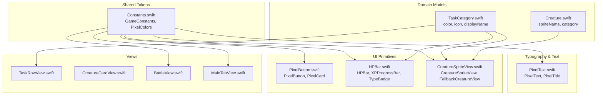
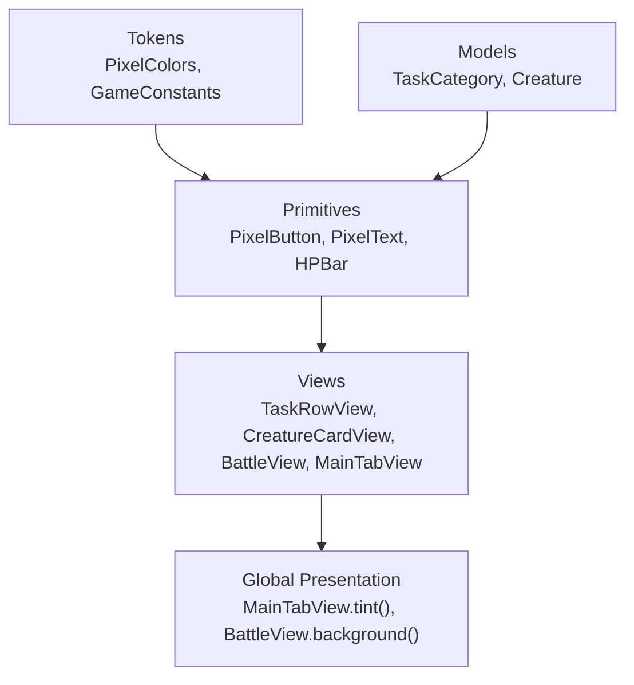
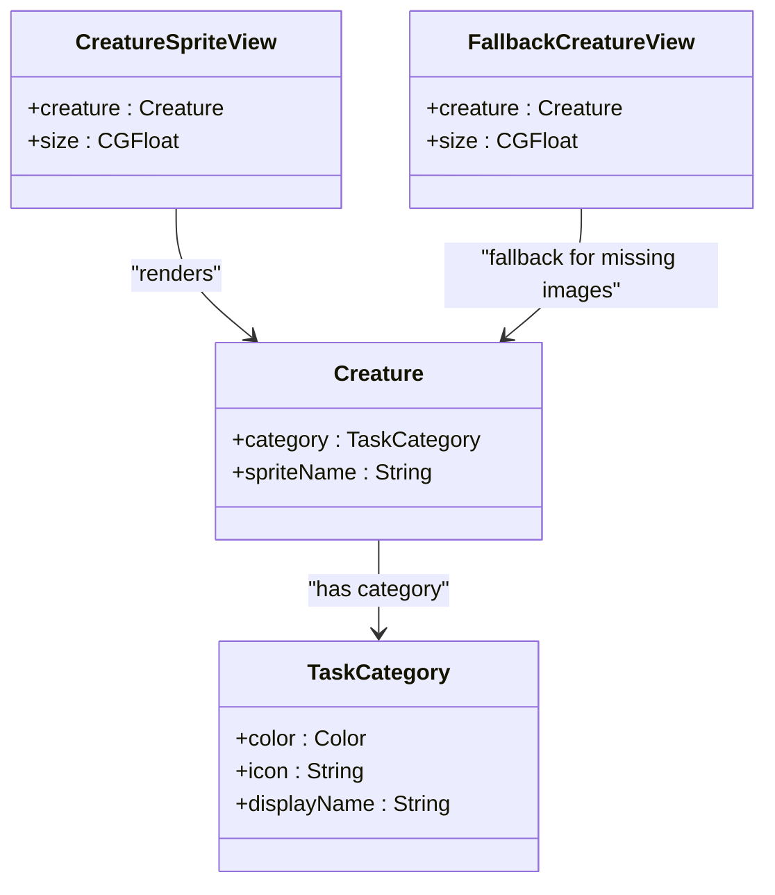
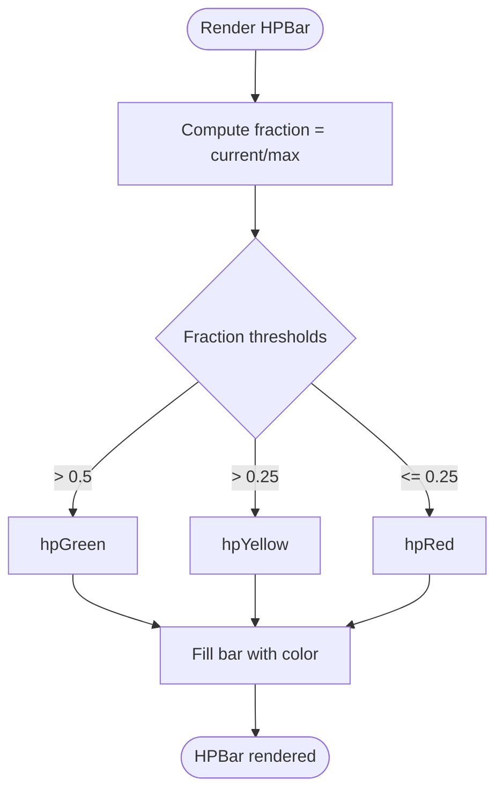
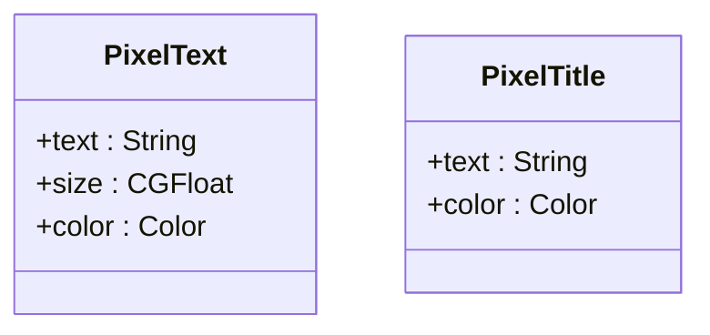
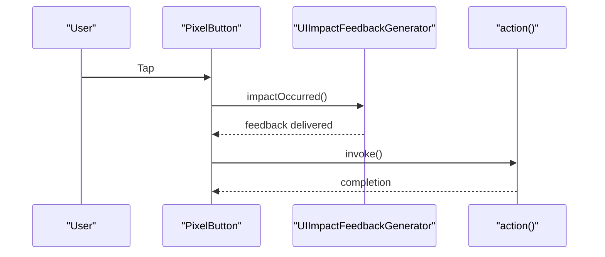
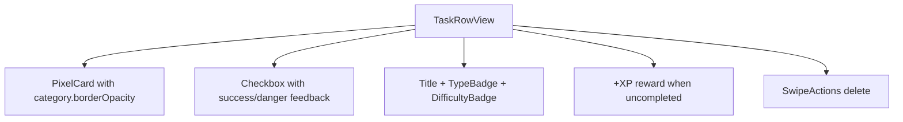
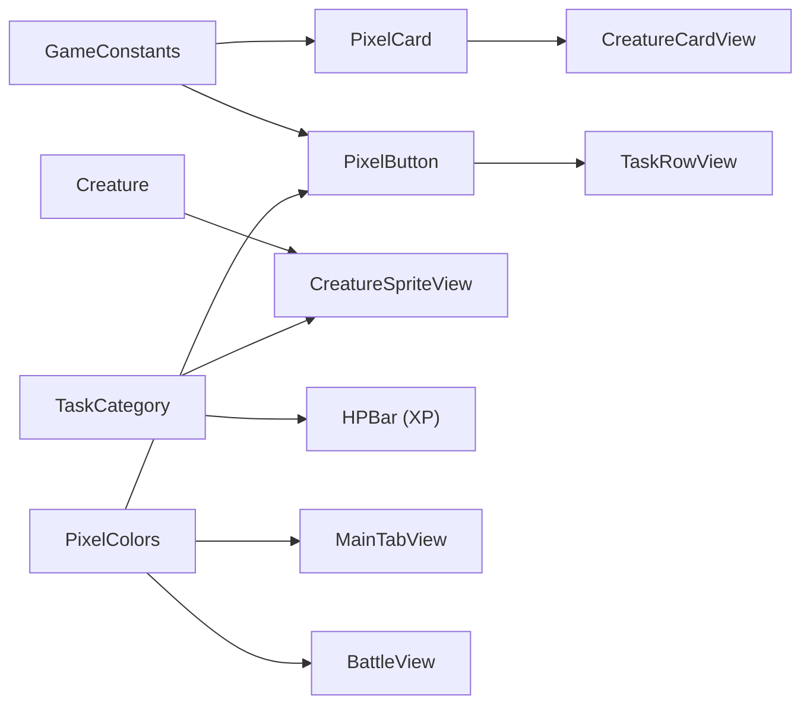

# Design System Guidelines

<cite>
**Referenced Files in This Document**
- [Constants.swift](file://TaskMon/TaskMon/Utils/Constants.swift)
- [PixelButton.swift](file://TaskMon/TaskMon/Views/Components/PixelButton.swift)
- [PixelText.swift](file://TaskMon/TaskMon/Views/Components/PixelText.swift)
- [HPBar.swift](file://TaskMon/TaskMon/Views/Components/HPBar.swift)
- [CreatureSpriteView.swift](file://TaskMon/TaskMon/Views/Components/CreatureSpriteView.swift)
- [TaskRowView.swift](file://TaskMon/TaskMon/Views/Tasks/TaskRowView.swift)
- [MainTabView.swift](file://TaskMon/TaskMon/Views/MainTabView.swift)
- [CreatureCardView.swift](file://TaskMon/TaskMon/Views/Creatures/CreatureCardView.swift)
- [BattleView.swift](file://TaskMon/TaskMon/Views/Battle/BattleView.swift)
- [TaskCategory.swift](file://TaskMon/TaskMon/Models/TaskCategory.swift)
- [Creature.swift](file://TaskMon/TaskMon/Models/Creature.swift)
- [Contents.json](file://TaskMon/TaskMon/Assets.xcassets/Contents.json)
</cite>

## Table of Contents
1. [Introduction](#introduction)
2. [Project Structure](#project-structure)
3. [Core Components](#core-components)
4. [Architecture Overview](#architecture-overview)
5. [Detailed Component Analysis](#detailed-component-analysis)
6. [Dependency Analysis](#dependency-analysis)
7. [Performance Considerations](#performance-considerations)
8. [Troubleshooting Guide](#troubleshooting-guide)
9. [Conclusion](#conclusion)
10. [Appendices](#appendices)

## Introduction
This document defines TaskMon’s design system with a focus on the pixel art theme, color palettes, typography, spacing, and component styling. It explains how creature categories map to color schemes, how UI states are represented, and how design tokens are consistently applied across components. It also outlines accessibility considerations, evolution of the design system, and guidelines for maintaining consistency as new components and features are added.

## Project Structure
TaskMon organizes design system assets and components under a clear module structure:
- Shared design tokens and constants live in a central utilities file.
- Reusable UI primitives (buttons, text, bars, sprites) are implemented as SwiftUI views.
- Category-specific visuals and fallbacks are handled via models and asset catalogs.
- Global app presentation (tabs, navigation) applies consistent tints and backgrounds.

**Diagram sources**
- [Constants.swift](file://TaskMon/TaskMon/Utils/Constants.swift#L4-L39)
- [PixelButton.swift](file://TaskMon/TaskMon/Views/Components/PixelButton.swift#L3-L43)
- [PixelText.swift](file://TaskMon/TaskMon/Views/Components/PixelText.swift#L3-L25)
- [HPBar.swift](file://TaskMon/TaskMon/Views/Components/HPBar.swift#L3-L109)
- [CreatureSpriteView.swift](file://TaskMon/TaskMon/Views/Components/CreatureSpriteView.swift#L3-L51)
- [TaskCategory.swift](file://TaskMon/TaskMon/Models/TaskCategory.swift#L4-L41)
- [Creature.swift](file://TaskMon/TaskMon/Models/Creature.swift#L33-L46)
- [TaskRowView.swift](file://TaskMon/TaskMon/Views/Tasks/TaskRowView.swift#L3-L72)
- [CreatureCardView.swift](file://TaskMon/TaskMon/Views/Creatures/CreatureCardView.swift#L3-L52)
- [BattleView.swift](file://TaskMon/TaskMon/Views/Battle/BattleView.swift#L3-L52)
- [MainTabView.swift](file://TaskMon/TaskMon/Views/MainTabView.swift#L3-L39)

**Section sources**
- [Constants.swift](file://TaskMon/TaskMon/Utils/Constants.swift#L4-L39)
- [TaskCategory.swift](file://TaskMon/TaskMon/Models/TaskCategory.swift#L4-L41)
- [Creature.swift](file://TaskMon/TaskMon/Models/Creature.swift#L33-L46)
- [Contents.json](file://TaskMon/TaskMon/Assets.xcassets/Contents.json#L1-L7)

## Core Components
This section documents the foundational design tokens and reusable components that enforce visual consistency.

- Color palette
  - Backgrounds and cards use dark, high-contrast tones for readability.
  - Accent color provides primary interactive feedback.
  - Semantic colors indicate states: success, danger, XP, and HP thresholds.
  - Category colors define thematic identity per creature type.

- Typography scale
  - Monospaced fonts emphasize pixel aesthetics.
  - Titles and body sizes are standardized for hierarchy and legibility.

- Spacing and corner radii
  - Corner radii and border widths are defined centrally for consistent framing.
  - Padding and gaps are applied uniformly within cards and rows.

- Interactive feedback
  - Buttons include subtle shadows and borders with tactile haptic feedback.
  - Animations smooth transitions for XP and HP updates.

**Section sources**
- [Constants.swift](file://TaskMon/TaskMon/Utils/Constants.swift#L26-L39)
- [PixelText.swift](file://TaskMon/TaskMon/Views/Components/PixelText.swift#L3-L25)
- [PixelButton.swift](file://TaskMon/TaskMon/Views/Components/PixelButton.swift#L3-L26)
- [HPBar.swift](file://TaskMon/TaskMon/Views/Components/HPBar.swift#L3-L48)
- [TaskRowView.swift](file://TaskMon/TaskMon/Views/Tasks/TaskRowView.swift#L3-L72)

## Architecture Overview
The design system is enforced through a layered approach:
- Tokens: Centralized enums and constants define colors, typography, and layout metrics.
- Components: Primitive views encapsulate styling and behavior.
- Domain: Models provide category and creature metadata for theming.
- Views: Screens assemble primitives and apply global tints and backgrounds.

**Diagram sources**
- [Constants.swift](file://TaskMon/TaskMon/Utils/Constants.swift#L4-L39)
- [TaskCategory.swift](file://TaskMon/TaskMon/Models/TaskCategory.swift#L4-L41)
- [Creature.swift](file://TaskMon/TaskMon/Models/Creature.swift#L33-L46)
- [PixelButton.swift](file://TaskMon/TaskMon/Views/Components/PixelButton.swift#L3-L43)
- [PixelText.swift](file://TaskMon/TaskMon/Views/Components/PixelText.swift#L3-L25)
- [HPBar.swift](file://TaskMon/TaskMon/Views/Components/HPBar.swift#L3-L109)
- [TaskRowView.swift](file://TaskMon/TaskMon/Views/Tasks/TaskRowView.swift#L3-L72)
- [CreatureCardView.swift](file://TaskMon/TaskMon/Views/Creatures/CreatureCardView.swift#L3-L52)
- [BattleView.swift](file://TaskMon/TaskMon/Views/Battle/BattleView.swift#L3-L52)
- [MainTabView.swift](file://TaskMon/TaskMon/Views/MainTabView.swift#L3-L39)

## Detailed Component Analysis

### Pixel Art Theme and Category Color Schemes
- Category identity
  - Each task category defines a semantic color, icon, and display name.
  - These are used to tint badges, XP bars, and UI elements consistently.

- Creature sprites and fallbacks
  - Primary sprites are drawn from the asset catalog.
  - Fallbacks render category-specific icons with category color overlays.
  - Interpolation is set to maintain crisp pixel art edges.

**Diagram sources**
- [TaskCategory.swift](file://TaskMon/TaskMon/Models/TaskCategory.swift#L4-L41)
- [Creature.swift](file://TaskMon/TaskMon/Models/Creature.swift#L33-L46)
- [CreatureSpriteView.swift](file://TaskMon/TaskMon/Views/Components/CreatureSpriteView.swift#L3-L51)

**Section sources**
- [TaskCategory.swift](file://TaskMon/TaskMon/Models/TaskCategory.swift#L33-L41)
- [CreatureSpriteView.swift](file://TaskMon/TaskMon/Views/Components/CreatureSpriteView.swift#L21-L51)

### UI States and Progress Indicators
- Health bar
  - Uses threshold-based color transitions to communicate HP state.
  - Animated width reflects real-time updates.

- XP progress
  - Shows current XP toward the next milestone with category color branding.

- Type badge
  - Lightweight tag displaying category identity with rounded corners and opacity.

**Diagram sources**
- [HPBar.swift](file://TaskMon/TaskMon/Views/Components/HPBar.swift#L9-L18)

**Section sources**
- [HPBar.swift](file://TaskMon/TaskMon/Views/Components/HPBar.swift#L3-L48)
- [HPBar.swift](file://TaskMon/TaskMon/Views/Components/HPBar.swift#L50-L88)
- [HPBar.swift](file://TaskMon/TaskMon/Views/Components/HPBar.swift#L90-L109)

### Typography and Text Components
- PixelText
  - Monospaced bold system font with configurable size and color.
- PixelTitle
  - Larger monospaced title with tracking for emphasis.

**Diagram sources**
- [PixelText.swift](file://TaskMon/TaskMon/Views/Components/PixelText.swift#L3-L25)

**Section sources**
- [PixelText.swift](file://TaskMon/TaskMon/Views/Components/PixelText.swift#L3-L25)

### Interactive Button and Card Patterns
- PixelButton
  - Centered label with padding, background fill, bordered stroke, and subtle shadow.
  - Haptic feedback on press.
- PixelCard
  - Content container with background, border stroke, and clipped rounded corners.

**Diagram sources**
- [PixelButton.swift](file://TaskMon/TaskMon/Views/Components/PixelButton.swift#L9-L26)

**Section sources**
- [PixelButton.swift](file://TaskMon/TaskMon/Views/Components/PixelButton.swift#L3-L26)
- [PixelButton.swift](file://TaskMon/TaskMon/Views/Components/PixelButton.swift#L29-L43)

### Task Row and Difficulty Indicators
- TaskRowView
  - Uses category color for card border.
  - Completion state toggles strikethrough and icon color.
  - Difficulty badges use semantic colors (success, gold, danger).
  - Swipe-to-delete action with destructive styling.

**Diagram sources**
- [TaskRowView.swift](file://TaskMon/TaskMon/Views/Tasks/TaskRowView.swift#L3-L72)

**Section sources**
- [TaskRowView.swift](file://TaskMon/TaskMon/Views/Tasks/TaskRowView.swift#L3-L72)

### Global Presentation and Accessibility Tint
- MainTabView
  - Applies global tint to unify interactive elements.
- BattleView
  - Sets background color and clears navigation title for immersive pixel art feel.

**Section sources**
- [MainTabView.swift](file://TaskMon/TaskMon/Views/MainTabView.swift#L3-L39)
- [BattleView.swift](file://TaskMon/TaskMon/Views/Battle/BattleView.swift#L3-L52)

## Dependency Analysis
The design system exhibits low coupling and high cohesion:
- Tokens are consumed by primitives and views.
- Models supply category metadata used by both sprites and UI components.
- Global views apply consistent tints and backgrounds.

**Diagram sources**
- [Constants.swift](file://TaskMon/TaskMon/Utils/Constants.swift#L26-L39)
- [PixelButton.swift](file://TaskMon/TaskMon/Views/Components/PixelButton.swift#L3-L43)
- [HPBar.swift](file://TaskMon/TaskMon/Views/Components/HPBar.swift#L50-L88)
- [CreatureSpriteView.swift](file://TaskMon/TaskMon/Views/Components/CreatureSpriteView.swift#L3-L51)
- [TaskRowView.swift](file://TaskMon/TaskMon/Views/Tasks/TaskRowView.swift#L3-L72)
- [CreatureCardView.swift](file://TaskMon/TaskMon/Views/Creatures/CreatureCardView.swift#L3-L52)
- [MainTabView.swift](file://TaskMon/TaskMon/Views/MainTabView.swift#L3-L39)
- [BattleView.swift](file://TaskMon/TaskMon/Views/Battle/BattleView.swift#L3-L52)

**Section sources**
- [Constants.swift](file://TaskMon/TaskMon/Utils/Constants.swift#L4-L39)
- [TaskCategory.swift](file://TaskMon/TaskMon/Models/TaskCategory.swift#L4-L41)
- [Creature.swift](file://TaskMon/TaskMon/Models/Creature.swift#L33-L46)

## Performance Considerations
- Pixel art crispness
  - Interpolation is disabled for sprites to preserve sharp edges.
- Animation budgets
  - Short durations for button and progress animations balance responsiveness with performance.
- Asset catalog
  - Pre-scaled pixel art images reduce runtime scaling overhead.

Recommendations:
- Keep sprite sizes consistent to minimize layout recalculations.
- Prefer geometry-based progress bars for dynamic widths.
- Avoid deep nesting in cards to reduce clipping and compositing costs.

**Section sources**
- [CreatureSpriteView.swift](file://TaskMon/TaskMon/Views/Components/CreatureSpriteView.swift#L8-L12)
- [Constants.swift](file://TaskMon/TaskMon/Utils/Constants.swift#L20-L24)

## Troubleshooting Guide
Common issues and resolutions:
- Missing sprite image
  - Fallback renders category icon with category color overlay.
- Low contrast text
  - Use semantic colors or adjust opacity; ensure readable weights and sizes.
- Inconsistent spacing
  - Apply predefined paddings and corner radii from tokens.
- Haptics not triggering
  - Verify feedback generator initialization and invocation within button action.

**Section sources**
- [CreatureSpriteView.swift](file://TaskMon/TaskMon/Views/Components/CreatureSpriteView.swift#L14-L18)
- [PixelButton.swift](file://TaskMon/TaskMon/Views/Components/PixelButton.swift#L9-L26)

## Conclusion
TaskMon’s design system centers on a cohesive pixel art theme with category-driven color schemes, a compact color palette, and consistent typography and spacing. Components encapsulate styling and behavior, while tokens ensure uniformity across the app. The system supports clear UI states, accessible interactions, and scalable growth through shared design tokens and component primitives.

## Appendices

### Accessibility Guidelines
- Contrast ratios
  - Ensure foreground/background combinations meet minimum contrast thresholds for readability.
- Font sizing
  - Use the documented sizes for titles and body text to maintain hierarchy.
- Interaction feedback
  - Provide visible and haptic feedback for presses and selections.
- Motion considerations
  - Keep animations short and avoid unnecessary motion for user comfort.

[No sources needed since this section provides general guidance]

### Maintaining Design Consistency
- Centralize tokens
  - Define all colors, typography, and spacing in a single place.
- Enforce component usage
  - Prefer primitives over ad-hoc styling.
- Review new components
  - Validate against category colors, semantic colors, and spacing tokens.
- Versioning and updates
  - Track design system changes alongside feature releases.
  - Communicate breaking changes to contributors.

[No sources needed since this section provides general guidance]

### Examples of Proper Component Usage
- Buttons
  - Use PixelButton with appropriate semantic colors and sizes.
- Cards
  - Wrap content in PixelCard and apply category border opacity.
- Text
  - Use PixelText for labels and PixelTitle for headings.
- Progress
  - Use HPBar for health and XPProgressBar for experience milestones.
- Sprites
  - Render CreatureSpriteView with consistent sizes and fallback behavior.

**Section sources**
- [PixelButton.swift](file://TaskMon/TaskMon/Views/Components/PixelButton.swift#L3-L26)
- [PixelText.swift](file://TaskMon/TaskMon/Views/Components/PixelText.swift#L3-L25)
- [HPBar.swift](file://TaskMon/TaskMon/Views/Components/HPBar.swift#L3-L48)
- [CreatureSpriteView.swift](file://TaskMon/TaskMon/Views/Components/CreatureSpriteView.swift#L3-L18)