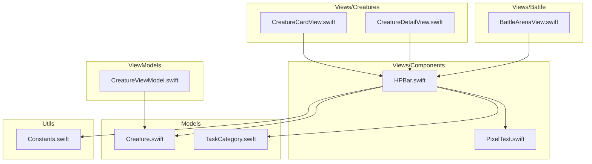
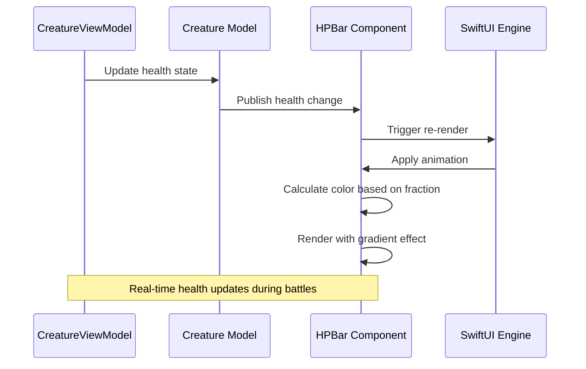
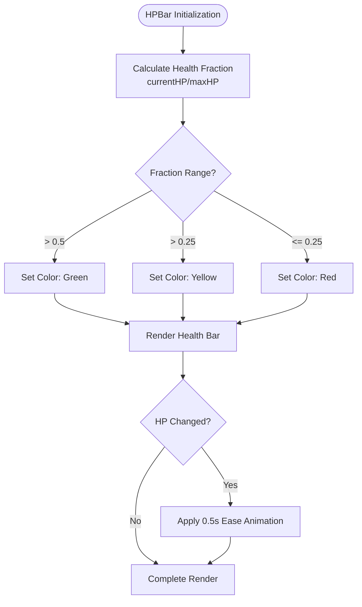
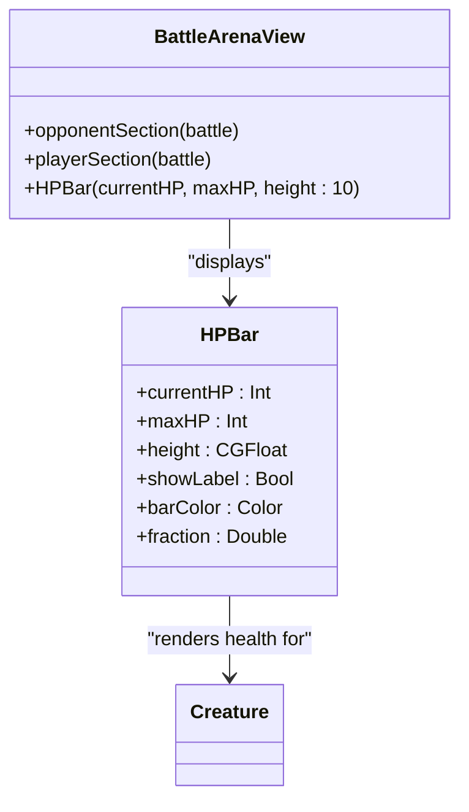
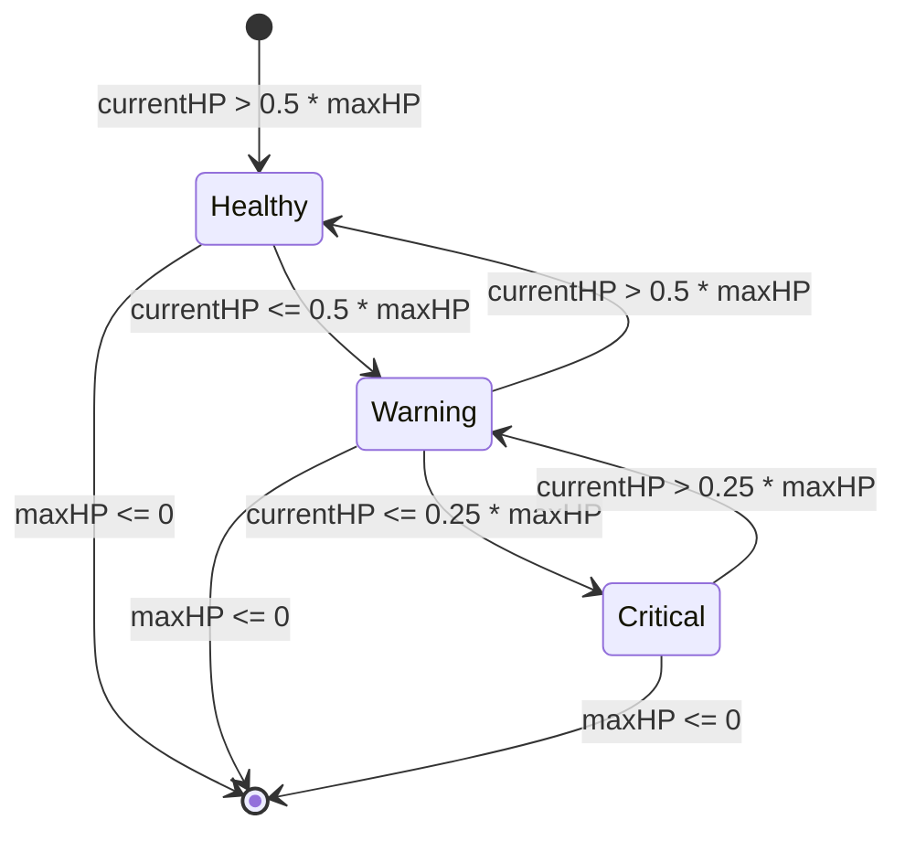

# Health Bar Component

<cite>
**Referenced Files in This Document**
- [HPBar.swift](file://TaskMon/TaskMon/Views/Components/HPBar.swift)
- [PixelText.swift](file://TaskMon/TaskMon/Views/Components/PixelText.swift)
- [Constants.swift](file://TaskMon/TaskMon/Utils/Constants.swift)
- [TaskCategory.swift](file://TaskMon/TaskMon/Models/TaskCategory.swift)
- [Creature.swift](file://TaskMon/TaskMon/Models/Creature.swift)
- [BattleArenaView.swift](file://TaskMon/TaskMon/Views/Battle/BattleArenaView.swift)
- [CreatureDetailView.swift](file://TaskMon/TaskMon/Views/Creatures/CreatureDetailView.swift)
- [CreatureCardView.swift](file://TaskMon/TaskMon/Views/Creatures/CreatureCardView.swift)
- [CreatureViewModel.swift](file://TaskMon/TaskMon/ViewModels/CreatureViewModel.swift)
</cite>

## Table of Contents
1. [Introduction](#introduction)
2. [Project Structure](#project-structure)
3. [Core Components](#core-components)
4. [Architecture Overview](#architecture-overview)
5. [Detailed Component Analysis](#detailed-component-analysis)
6. [Dependency Analysis](#dependency-analysis)
7. [Performance Considerations](#performance-considerations)
8. [Troubleshooting Guide](#troubleshooting-guide)
9. [Conclusion](#conclusion)
10. [Appendices](#appendices)

## Introduction
This document provides comprehensive documentation for the HPBar component used to display creature health and status indicators throughout the TaskMon application. The HPBar component renders a pixel-perfect health indicator with gradient-like color transitions, animated updates, and responsive design patterns. It integrates seamlessly with SwiftUI's declarative framework and Combine publishers for real-time health updates during battles and creature management scenarios.

The component supports multiple UI contexts including creature cards, battle screens, and detailed status displays, while maintaining consistent visual hierarchy and accessibility standards.

## Project Structure
The HPBar component is part of the Components module within the Views layer, alongside other UI primitives like PixelText and PixelButton. The component integrates with game models, categories, and view models to provide dynamic health visualization.



**Diagram sources**
- [HPBar.swift](file://TaskMon/TaskMon/Views/Components/HPBar.swift#L1-L110)
- [PixelText.swift](file://TaskMon/TaskMon/Views/Components/PixelText.swift#L1-L26)
- [Creature.swift](file://TaskMon/TaskMon/Models/Creature.swift#L1-L98)
- [TaskCategory.swift](file://TaskMon/TaskMon/Models/TaskCategory.swift#L1-L85)
- [BattleArenaView.swift](file://TaskMon/TaskMon/Views/Battle/BattleArenaView.swift#L1-L287)
- [CreatureDetailView.swift](file://TaskMon/TaskMon/Views/Creatures/CreatureDetailView.swift#L1-L160)
- [CreatureCardView.swift](file://TaskMon/TaskMon/Views/Creatures/CreatureCardView.swift#L1-L53)
- [CreatureViewModel.swift](file://TaskMon/TaskMon/ViewModels/CreatureViewModel.swift#L1-L90)
- [Constants.swift](file://TaskMon/TaskMon/Utils/Constants.swift#L1-L40)

**Section sources**
- [HPBar.swift](file://TaskMon/TaskMon/Views/Components/HPBar.swift#L1-L110)
- [Constants.swift](file://TaskMon/TaskMon/Utils/Constants.swift#L1-L40)

## Core Components
The HPBar component consists of several key elements that work together to provide a cohesive health visualization experience:

### Primary Props and Configuration
- **currentHP**: Current health value displayed (Int)
- **maxHP**: Maximum health threshold (Int)
- **height**: Bar height in points (CGFloat, default: 12)
- **showLabel**: Toggle for HP value display (Bool, default: true)

### Visual Design Elements
- **Gradient-like Color System**: Transitions from green (healthy) to yellow (warning) to red (critical)
- **Pixel-Perfect Rendering**: Uses monospaced fonts and precise geometry
- **Border Styling**: Subtle stroke overlay with card border color
- **Background Layer**: Darkened base for depth perception

### Animation System
- **Smooth Transitions**: 0.5-second ease-in-out animations for HP changes
- **Real-time Updates**: SwiftUI's automatic re-rendering on state changes
- **Warning States**: Color transitions trigger at 50% and 25% thresholds

**Section sources**
- [HPBar.swift](file://TaskMon/TaskMon/Views/Components/HPBar.swift#L3-L48)

## Architecture Overview
The HPBar component follows SwiftUI's reactive architecture pattern, integrating with Combine publishers for real-time updates and state management.



**Diagram sources**
- [CreatureViewModel.swift](file://TaskMon/TaskMon/ViewModels/CreatureViewModel.swift#L1-L90)
- [Creature.swift](file://TaskMon/TaskMon/Models/Creature.swift#L88-L97)
- [HPBar.swift](file://TaskMon/TaskMon/Views/Components/HPBar.swift#L9-L18)

## Detailed Component Analysis

### HPBar Implementation
The HPBar component implements a sophisticated health visualization system with the following characteristics:

#### Color Transition Logic
The component uses a tiered color system based on health percentage:
- **Healthy (50%+)**: Green (#hpGreen)
- **Warning (25%-50%)**: Yellow (#hpYellow)  
- **Critical (<25%)**: Red (#hpRed)

#### Layout Structure
The component uses a VStack with precise spacing to accommodate optional labels and the health bar itself. The layout includes:
- Optional HP label header (when showLabel is true)
- GeometryReader-based width calculation
- ZStack for layered rendering
- Overlay stroke for border definition

#### Animation Implementation
The component leverages SwiftUI's built-in animation system with a custom ease-in-out timing function. The animation triggers automatically when the currentHP property changes, providing smooth visual feedback for health modifications.



**Diagram sources**
- [HPBar.swift](file://TaskMon/TaskMon/Views/Components/HPBar.swift#L9-L18)
- [HPBar.swift](file://TaskMon/TaskMon/Views/Components/HPBar.swift#L38-L38)

**Section sources**
- [HPBar.swift](file://TaskMon/TaskMon/Views/Components/HPBar.swift#L1-L110)

### Integration Patterns
The HPBar component integrates with multiple UI contexts throughout the application:

#### Battle Screen Integration
In battle scenarios, the HPBar appears in both player and opponent sections with reduced height for compact display:



**Diagram sources**
- [BattleArenaView.swift](file://TaskMon/TaskMon/Views/Battle/BattleArenaView.swift#L42-L105)
- [HPBar.swift](file://TaskMon/TaskMon/Views/Components/HPBar.swift#L3-L48)

#### Detailed View Integration
In creature detail views, the HPBar is used within stat bars alongside other creature statistics, demonstrating consistent visual patterns across different contexts.

**Section sources**
- [BattleArenaView.swift](file://TaskMon/TaskMon/Views/Battle/BattleArenaView.swift#L50-L88)
- [CreatureDetailView.swift](file://TaskMon/TaskMon/Views/Creatures/CreatureDetailView.swift#L80-L106)

### Reactive Behavior and State Management
The HPBar component benefits from SwiftUI's reactive architecture without requiring explicit Combine publishers. Changes to the underlying data automatically trigger component re-rendering with smooth animations.



**Diagram sources**
- [HPBar.swift](file://TaskMon/TaskMon/Views/Components/HPBar.swift#L9-L18)

**Section sources**
- [HPBar.swift](file://TaskMon/TaskMon/Views/Components/HPBar.swift#L38-L38)

## Dependency Analysis
The HPBar component maintains loose coupling with other system components while leveraging shared resources:

```mermaid
graph LR
HPBar[HPBar Component] --> PixelText[PixelText Utility]
HPBar --> PixelColors[PixelColors Constants]
HPBar --> TaskCategory[TaskCategory Enum]
HPBar --> Creature[Creature Model]
BattleArena[Battle Arena View] --> HPBar
CreatureDetail[Creature Detail View] --> HPBar
CreatureCard[Creature Card View] --> HPBar
CreatureVM[Creature ViewModel] --> Creature
Creature --> HPBar : "provides data"
```

**Diagram sources**
- [HPBar.swift](file://TaskMon/TaskMon/Views/Components/HPBar.swift#L1-L110)
- [PixelText.swift](file://TaskMon/TaskMon/Views/Components/PixelText.swift#L1-L26)
- [Constants.swift](file://TaskMon/TaskMon/Utils/Constants.swift#L26-L39)
- [TaskCategory.swift](file://TaskMon/TaskMon/Models/TaskCategory.swift#L1-L85)
- [Creature.swift](file://TaskMon/TaskMon/Models/Creature.swift#L33-L98)
- [BattleArenaView.swift](file://TaskMon/TaskMon/Views/Battle/BattleArenaView.swift#L1-L287)
- [CreatureDetailView.swift](file://TaskMon/TaskMon/Views/Creatures/CreatureDetailView.swift#L1-L160)
- [CreatureCardView.swift](file://TaskMon/TaskMon/Views/Creatures/CreatureCardView.swift#L1-L53)
- [CreatureViewModel.swift](file://TaskMon/TaskMon/ViewModels/CreatureViewModel.swift#L1-L90)

### External Dependencies
- **SwiftUI**: Declarative UI framework for component rendering
- **Combine**: Publisher/subscriber pattern for reactive updates
- **Foundation**: Basic data structures and Codable protocols

**Section sources**
- [HPBar.swift](file://TaskMon/TaskMon/Views/Components/HPBar.swift#L1-L110)
- [CreatureViewModel.swift](file://TaskMon/TaskMon/ViewModels/CreatureViewModel.swift#L1-L90)

## Performance Considerations
The HPBar component is designed for optimal performance through several mechanisms:

### Efficient Rendering
- **GeometryReader**: Calculates widths dynamically without manual layout management
- **ZStack Layering**: Minimizes redundant drawing operations
- **Automatic Animations**: Leverages SwiftUI's optimized animation engine

### Memory Management
- **Immutable Props**: All component properties are passed as immutable values
- **No Retain Cycles**: No closures capture self, preventing memory leaks
- **Efficient Color Access**: Uses predefined color constants from PixelColors

### Animation Optimization
- **Single Animation Target**: Animates only the changing width property
- **Consistent Timing**: Uses fixed duration for predictable performance
- **Conditional Rendering**: Only animates when health values change

## Troubleshooting Guide

### Common Issues and Solutions

#### Zero Division Errors
**Problem**: HPBar shows incorrect behavior when maxHP is zero
**Solution**: The component includes a guard clause that returns 0 when maxHP <= 0

#### Animation Not Triggering
**Problem**: Health changes don't animate smoothly
**Solution**: Ensure currentHP changes are published through @Published properties or SwiftUI state updates

#### Color Transition Delays
**Problem**: Color changes feel sluggish during rapid health fluctuations
**Solution**: Adjust the animation duration in the component's animation modifier

#### Accessibility Concerns
**Problem**: Screen readers don't announce health status changes
**Solution**: Consider adding accessibility labels to communicate health state changes

**Section sources**
- [HPBar.swift](file://TaskMon/TaskMon/Views/Components/HPBar.swift#L9-L12)
- [HPBar.swift](file://TaskMon/TaskMon/Views/Components/HPBar.swift#L38-L38)

## Conclusion
The HPBar component provides a robust, visually appealing solution for displaying creature health across multiple UI contexts. Its implementation demonstrates best practices in SwiftUI development, including reactive state management, efficient rendering, and consistent visual design. The component's integration with the broader application architecture ensures seamless functionality in battle scenarios, creature management, and detailed status displays.

The component's design prioritizes both visual appeal and technical efficiency, making it a cornerstone element of the application's user interface system. Its modular architecture allows for easy customization and extension while maintaining consistency with the overall design language.

## Appendices

### Usage Examples and Configuration Guidelines

#### Basic Usage
```swift
// Standard HP bar with labels
HPBar(currentHP: creature.stats.hp, maxHP: creature.stats.maxHP)

// Compact HP bar for team displays
HPBar(currentHP: creature.stats.hp, maxHP: creature.stats.maxHP, height: 8, showLabel: false)
```

#### UI Context Recommendations
- **Creature Cards**: Use default height (12pt) with labels enabled
- **Battle Screens**: Use compact height (10pt) with labels disabled
- **Team Displays**: Use smallest height (8pt) for space efficiency
- **Status Displays**: Use medium height (11pt) for readability

#### Color Contrast and Accessibility
- **Color Blind Friendly**: Uses distinct color transitions (green → yellow → red)
- **Visual Hierarchy**: Maintains sufficient contrast against dark backgrounds
- **Alternative Indicators**: Consider combining color with text labels for accessibility

### Integration Best Practices
- **State Management**: Ensure health values are managed through @Published properties
- **Animation Consistency**: Maintain uniform animation durations across similar components
- **Performance Monitoring**: Monitor frame rates during rapid health changes in battle scenarios
- **Testing Coverage**: Verify color transitions at 50% and 25% thresholds