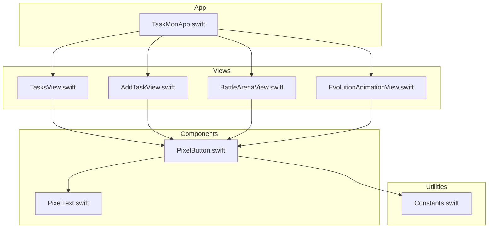
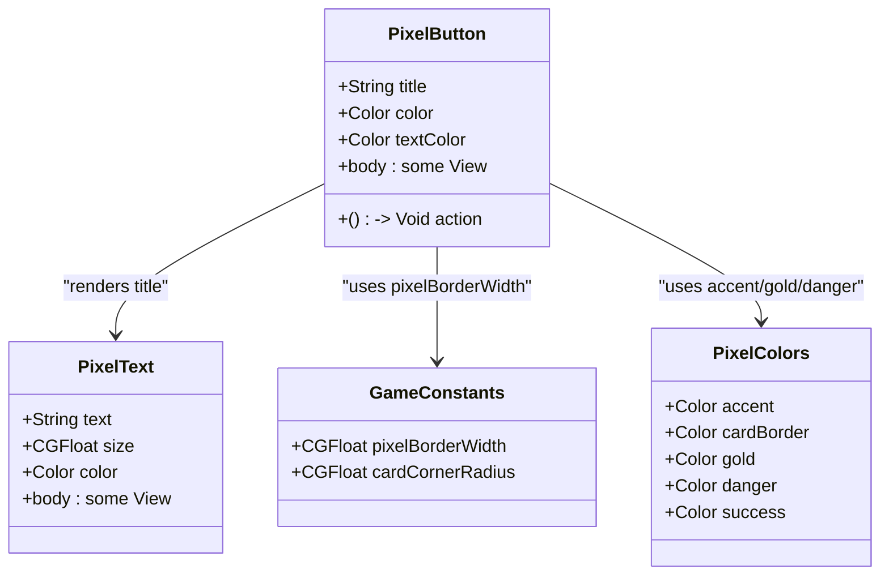
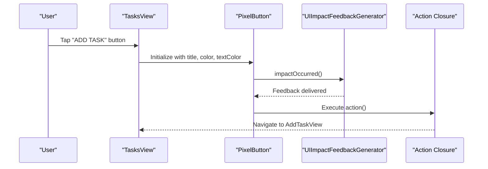
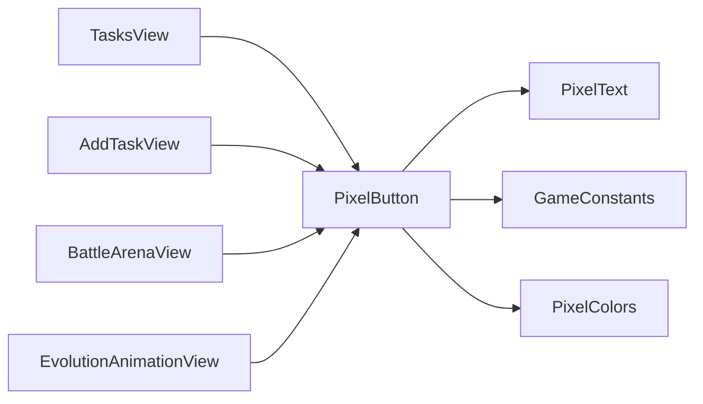

# PixelButton Component

<cite>
**Referenced Files in This Document**
- [PixelButton.swift](file://TaskMon/TaskMon/Views/Components/PixelButton.swift)
- [PixelText.swift](file://TaskMon/TaskMon/Views/Components/PixelText.swift)
- [Constants.swift](file://TaskMon/TaskMon/Utils/Constants.swift)
- [TasksView.swift](file://TaskMon/TaskMon/Views/Tasks/TasksView.swift)
- [AddTaskView.swift](file://TaskMon/TaskMon/Views/Tasks/AddTaskView.swift)
- [BattleArenaView.swift](file://TaskMon/TaskMon/Views/Battle/BattleArenaView.swift)
- [EvolutionAnimationView.swift](file://TaskMon/TaskMon/Views/Creatures/EvolutionAnimationView.swift)
- [TaskMonApp.swift](file://TaskMon/TaskMon/TaskMonApp.swift)
</cite>

## Table of Contents
1. [Introduction](#introduction)
2. [Project Structure](#project-structure)
3. [Core Components](#core-components)
4. [Architecture Overview](#architecture-overview)
5. [Detailed Component Analysis](#detailed-component-analysis)
6. [Dependency Analysis](#dependency-analysis)
7. [Performance Considerations](#performance-considerations)
8. [Troubleshooting Guide](#troubleshooting-guide)
9. [Conclusion](#conclusion)
10. [Appendices](#appendices)

## Introduction
PixelButton is a SwiftUI component designed to provide a pixel-art-inspired button interface within the TaskMon application. It integrates haptic feedback for tactile responsiveness, maintains consistent pixel-perfect styling, and supports customization through color themes and text options. The component is built to align with the game-like aesthetic of the app while ensuring usability across different contexts such as task creation, navigation, and confirmation dialogs.

## Project Structure
The PixelButton component resides within the Components module alongside other UI primitives like PixelText. It leverages shared constants and color palettes defined in the application utilities to maintain visual consistency.

**Diagram sources**
- [PixelButton.swift](file://TaskMon/TaskMon/Views/Components/PixelButton.swift#L1-L43)
- [PixelText.swift](file://TaskMon/TaskMon/Views/Components/PixelText.swift#L1-L26)
- [Constants.swift](file://TaskMon/TaskMon/Utils/Constants.swift#L1-L40)
- [TasksView.swift](file://TaskMon/TaskMon/Views/Tasks/TasksView.swift#L83-L96)
- [AddTaskView.swift](file://TaskMon/TaskMon/Views/Tasks/AddTaskView.swift#L118-L128)
- [BattleArenaView.swift](file://TaskMon/TaskMon/Views/Battle/BattleArenaView.swift#L172-L179)
- [EvolutionAnimationView.swift](file://TaskMon/TaskMon/Views/Creatures/EvolutionAnimationView.swift#L65-L67)
- [TaskMonApp.swift](file://TaskMon/TaskMon/TaskMonApp.swift#L1-L43)

**Section sources**
- [PixelButton.swift](file://TaskMon/TaskMon/Views/Components/PixelButton.swift#L1-L43)
- [Constants.swift](file://TaskMon/TaskMon/Utils/Constants.swift#L1-L40)
- [TaskMonApp.swift](file://TaskMon/TaskMon/TaskMonApp.swift#L1-L43)

## Core Components
PixelButton is a lightweight SwiftUI struct that encapsulates:
- Title text display using PixelText
- Background color customization
- Text color customization
- Action handler callback
- Haptic feedback integration via UIImpactFeedbackGenerator
- Pixel-perfect visual styling with borders and shadows

Props:
- title: String - The label displayed on the button
- color: Color (default: PixelColors.accent) - Background color of the button
- textColor: Color (default: .black) - Color of the button text
- action: () -> Void - Callback executed when the button is pressed

Behavior:
- On press, triggers medium-impact haptic feedback before invoking the action
- Uses a plain button style to remove default system styling
- Applies padding, background, stroke overlay, and subtle shadow for depth

**Section sources**
- [PixelButton.swift](file://TaskMon/TaskMon/Views/Components/PixelButton.swift#L3-L26)
- [PixelText.swift](file://TaskMon/TaskMon/Views/Components/PixelText.swift#L3-L12)
- [Constants.swift](file://TaskMon/TaskMon/Utils/Constants.swift#L26-L39)

## Architecture Overview
PixelButton composes PixelText to render monospaced, bold typography and applies a pixel-inspired visual treatment. It integrates with SwiftUI's Button modifier system through .buttonStyle(.plain) to achieve a clean, custom appearance. The component relies on shared constants for pixel border width and corner radius to ensure consistent styling across the application.

**Diagram sources**
- [PixelButton.swift](file://TaskMon/TaskMon/Views/Components/PixelButton.swift#L3-L26)
- [PixelText.swift](file://TaskMon/TaskMon/Views/Components/PixelText.swift#L3-L12)
- [Constants.swift](file://TaskMon/TaskMon/Utils/Constants.swift#L4-L24)
- [Constants.swift](file://TaskMon/TaskMon/Utils/Constants.swift#L26-L39)

## Detailed Component Analysis

### Props and Behavior
- title: Passed to PixelText for rendering
- color: Applied as background and influences border opacity
- textColor: Controls the foreground color of the text
- action: Executed after haptic feedback occurs

Interactive behavior:
- Haptic feedback: Medium-impact feedback is triggered immediately upon press
- Action execution: The provided closure runs after feedback
- Visual styling: Padding, background, stroke overlay, and shadow create a raised, pixel-like appearance

Accessibility considerations:
- Focus states and keyboard navigation: Not explicitly implemented in the component
- Screen reader announcements: Not explicitly configured in the component

**Section sources**
- [PixelButton.swift](file://TaskMon/TaskMon/Views/Components/PixelButton.swift#L9-L26)

### Visual Styling and Pixel-Perfect Design
- Padding: Horizontal 16pt, Vertical 10pt for comfortable touch targets
- Background: Solid color derived from props
- Border: Stroke overlay with 0.5 opacity and pixelBorderWidth constant
- Shadow: Subtle offset (x: 3, y: 3) with 0.3 opacity for depth perception
- Typography: PixelText with monospaced, bold font at size 14

Consistency:
- Uses GameConstants.pixelBorderWidth for uniform border thickness
- Aligns with the app's dark theme and color palette

**Section sources**
- [PixelButton.swift](file://TaskMon/TaskMon/Views/Components/PixelButton.swift#L15-L23)
- [Constants.swift](file://TaskMon/TaskMon/Utils/Constants.swift#L20-L22)
- [PixelText.swift](file://TaskMon/TaskMon/Views/Components/PixelText.swift#L9-L11)

### Usage Examples Across the Application
- Task creation: Used in the empty state of TasksView to trigger adding new tasks
- Navigation: Integrated into toolbar items for confirmation actions
- Confirmation dialogs: Deployed in evolution animations for dismissal actions

Examples:
- TasksView empty state: Adds a task button with accent color
- AddTaskView toolbar: Confirmation button with conditional text color
- EvolutionAnimationView: Dismiss button with gold color

**Diagram sources**
- [TasksView.swift](file://TaskMon/TaskMon/Views/Tasks/TasksView.swift#L90-L92)
- [PixelButton.swift](file://TaskMon/TaskMon/Views/Components/PixelButton.swift#L10-L14)

**Section sources**
- [TasksView.swift](file://TaskMon/TaskMon/Views/Tasks/TasksView.swift#L83-L96)
- [AddTaskView.swift](file://TaskMon/TaskMon/Views/Tasks/AddTaskView.swift#L118-L128)
- [EvolutionAnimationView.swift](file://TaskMon/TaskMon/Views/Creatures/EvolutionAnimationView.swift#L65-L67)

### Integration with SwiftUI Button Modifier System
- Plain button style: Removes default system styling for a custom appearance
- Compositional design: Integrates with PixelText and overlays for borders and shadows
- Seamless composition: Works within VStack/HStack layouts and toolbar configurations

**Section sources**
- [PixelButton.swift](file://TaskMon/TaskMon/Views/Components/PixelButton.swift#L25)
- [AddTaskView.swift](file://TaskMon/TaskMon/Views/Tasks/AddTaskView.swift#L122-L127)

### Accessibility Considerations
Current implementation does not include explicit accessibility features such as focus states, keyboard navigation support, or screen reader announcements. Recommendations for enhancement:
- Add focus ring or highlight effect for keyboard navigation
- Provide dynamic text color contrast based on background
- Announce button purpose and state changes for VoiceOver users
- Ensure sufficient touch target size per platform guidelines

[No sources needed since this section provides general guidance]

## Dependency Analysis
PixelButton depends on:
- PixelText for typography rendering
- GameConstants for pixel border width
- PixelColors for color definitions

Usage patterns across views demonstrate:
- Consistent color usage for primary actions (accent)
- Specialized colors for secondary or destructive actions (gold, danger)
- Conditional text colors based on state (enabled/disabled)

**Diagram sources**
- [PixelButton.swift](file://TaskMon/TaskMon/Views/Components/PixelButton.swift#L1-L43)
- [PixelText.swift](file://TaskMon/TaskMon/Views/Components/PixelText.swift#L1-L26)
- [Constants.swift](file://TaskMon/TaskMon/Utils/Constants.swift#L1-L40)
- [TasksView.swift](file://TaskMon/TaskMon/Views/Tasks/TasksView.swift#L83-L96)
- [AddTaskView.swift](file://TaskMon/TaskMon/Views/Tasks/AddTaskView.swift#L118-L128)
- [BattleArenaView.swift](file://TaskMon/TaskMon/Views/Battle/BattleArenaView.swift#L172-L179)
- [EvolutionAnimationView.swift](file://TaskMon/TaskMon/Views/Creatures/EvolutionAnimationView.swift#L65-L67)

**Section sources**
- [PixelButton.swift](file://TaskMon/TaskMon/Views/Components/PixelButton.swift#L1-L43)
- [Constants.swift](file://TaskMon/TaskMon/Utils/Constants.swift#L1-L40)

## Performance Considerations
- Haptic feedback: Minimal overhead; UIImpactFeedbackGenerator is lightweight
- Rendering: PixelText uses monospaced fonts; ensure minimal re-layouts by avoiding frequent prop changes
- Animations: No implicit animations; keep action closures efficient to prevent jank during transitions

[No sources needed since this section provides general guidance]

## Troubleshooting Guide
Common issues and resolutions:
- Haptic feedback not triggering: Verify the device supports UIImpactFeedbackGenerator and the app has proper permissions
- Text color not visible: Adjust textColor against the chosen background color to meet contrast requirements
- Touch target too small: Increase padding or adjust font size to improve accessibility
- Visual inconsistency: Ensure GameConstants.pixelBorderWidth remains consistent across components

**Section sources**
- [PixelButton.swift](file://TaskMon/TaskMon/Views/Components/PixelButton.swift#L10-L14)
- [Constants.swift](file://TaskMon/TaskMon/Utils/Constants.swift#L20-L22)

## Conclusion
PixelButton delivers a cohesive, pixel-inspired button experience with integrated haptic feedback and customizable styling. Its compositional design enables consistent usage across the application while maintaining visual coherence with shared constants and color palettes. Future enhancements should focus on accessibility compliance and expanded interaction states to improve user experience across diverse input methods.

## Appendices

### Best Practices for Consistent Button Usage
- Primary actions: Use accent color for main calls-to-action
- Secondary actions: Use gold for special or celebratory actions
- Destructive actions: Use danger color with white text for emphasis
- Disabled states: Apply reduced opacity and grayed text color
- Accessibility: Ensure sufficient contrast and provide focus indicators

[No sources needed since this section provides general guidance]