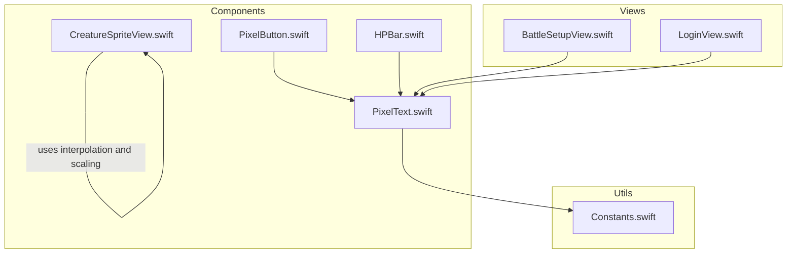
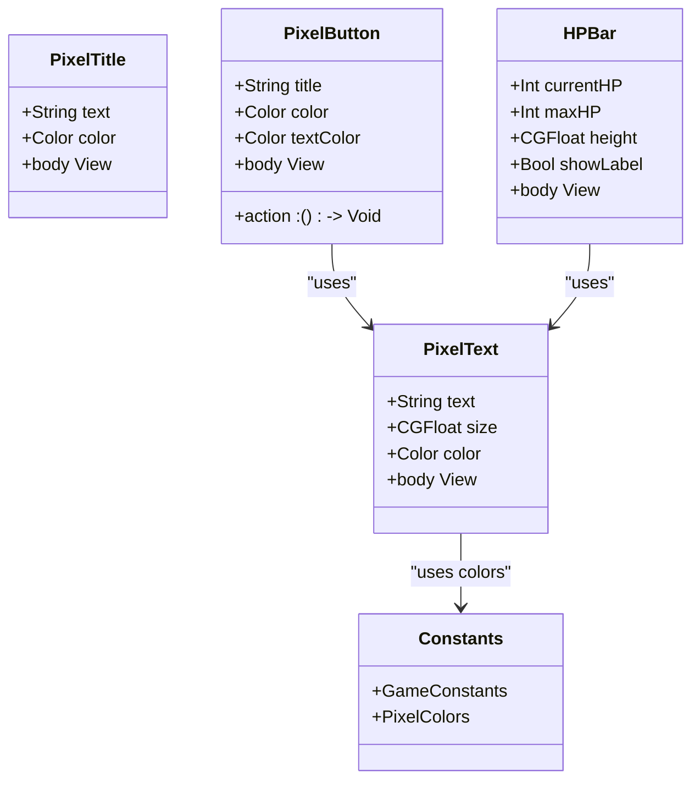
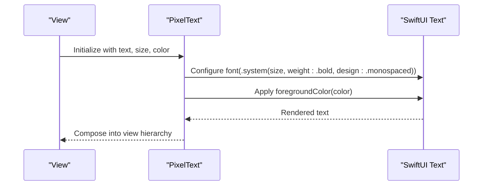
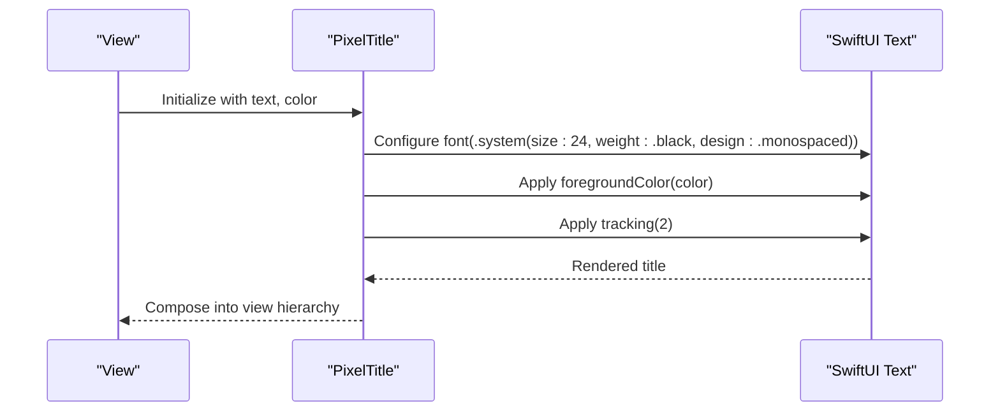
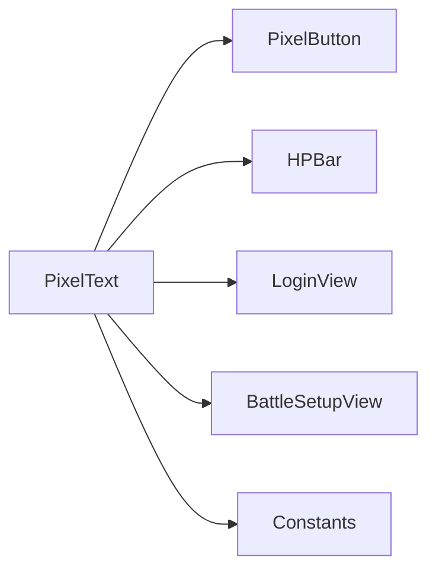
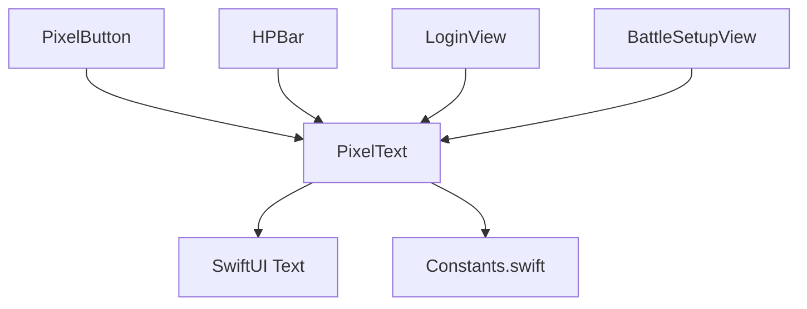

# PixelText Component

<cite>
**Referenced Files in This Document**
- [PixelText.swift](file://TaskMon/TaskMon/Views/Components/PixelText.swift)
- [PixelButton.swift](file://TaskMon/TaskMon/Views/Components/PixelButton.swift)
- [HPBar.swift](file://TaskMon/TaskMon/Views/Components/HPBar.swift)
- [Constants.swift](file://TaskMon/TaskMon/Utils/Constants.swift)
- [LoginView.swift](file://TaskMon/TaskMon/Views/Auth/LoginView.swift)
- [BattleSetupView.swift](file://TaskMon/TaskMon/Views/Battle/BattleSetupView.swift)
- [CreatureSpriteView.swift](file://TaskMon/TaskMon/Views/Components/CreatureSpriteView.swift)
</cite>

## Table of Contents
1. [Introduction](#introduction)
2. [Project Structure](#project-structure)
3. [Core Components](#core-components)
4. [Architecture Overview](#architecture-overview)
5. [Detailed Component Analysis](#detailed-component-analysis)
6. [Dependency Analysis](#dependency-analysis)
7. [Performance Considerations](#performance-considerations)
8. [Troubleshooting Guide](#troubleshooting-guide)
9. [Conclusion](#conclusion)
10. [Appendices](#appendices)

## Introduction
PixelText is a SwiftUI component designed to render crisp, pixel-art–inspired typography across the TaskMon application. It provides a consistent, monospaced, bold typographic foundation suitable for UI labels, headings, and interactive elements. The component emphasizes clarity and readability at various sizes while maintaining a cohesive visual identity aligned with the game’s pixel aesthetic.

Key characteristics:
- Monospaced font rendering for consistent character width
- Bold weight for strong legibility
- Configurable size and color
- Lightweight composition built on SwiftUI’s native Text view

## Project Structure
PixelText resides in the Components module alongside other UI primitives such as buttons and cards. It integrates with shared design assets and constants to ensure consistent visuals across the app.

**Diagram sources**
- [PixelText.swift](file://TaskMon/TaskMon/Views/Components/PixelText.swift#L1-L25)
- [PixelButton.swift](file://TaskMon/TaskMon/Views/Components/PixelButton.swift#L1-L44)
- [HPBar.swift](file://TaskMon/TaskMon/Views/Components/HPBar.swift#L1-L48)
- [Constants.swift](file://TaskMon/TaskMon/Utils/Constants.swift#L1-L40)
- [LoginView.swift](file://TaskMon/TaskMon/Views/Auth/LoginView.swift#L25-L112)
- [BattleSetupView.swift](file://TaskMon/TaskMon/Views/Battle/BattleSetupView.swift#L15-L164)
- [CreatureSpriteView.swift](file://TaskMon/TaskMon/Views/Components/CreatureSpriteView.swift#L1-L33)

**Section sources**
- [PixelText.swift](file://TaskMon/TaskMon/Views/Components/PixelText.swift#L1-L25)
- [Constants.swift](file://TaskMon/TaskMon/Utils/Constants.swift#L1-L40)

## Core Components
PixelText consists of two primary views:
- PixelText: A configurable monospaced, bold text element with adjustable size and color.
- PixelTitle: A larger, heavier-weight variant with subtle tracking for prominent headings.

Both leverage SwiftUI’s Text view with system fonts configured for monospaced design and bold weights to achieve crisp, pixel-aligned rendering.

Props:
- text: The string content to render.
- size: Font size for PixelText; PixelTitle uses a fixed size.
- color: Foreground color of the text.

Behavior:
- Uses a monospaced design for consistent character widths.
- Applies bold weight for enhanced readability.
- Integrates seamlessly with SwiftUI layout and styling APIs.

**Section sources**
- [PixelText.swift](file://TaskMon/TaskMon/Views/Components/PixelText.swift#L3-L12)
- [PixelText.swift](file://TaskMon/TaskMon/Views/Components/PixelText.swift#L15-L24)

## Architecture Overview
PixelText is a leaf-level UI primitive that composes SwiftUI’s Text view. It does not introduce external dependencies and relies on shared design tokens from Constants.swift for colors and spacing.

**Diagram sources**
- [PixelText.swift](file://TaskMon/TaskMon/Views/Components/PixelText.swift#L3-L24)
- [PixelButton.swift](file://TaskMon/TaskMon/Views/Components/PixelButton.swift#L3-L26)
- [HPBar.swift](file://TaskMon/TaskMon/Views/Components/HPBar.swift#L3-L18)
- [Constants.swift](file://TaskMon/TaskMon/Utils/Constants.swift#L26-L39)

## Detailed Component Analysis

### PixelText Implementation
PixelText wraps SwiftUI’s Text view with a monospaced, bold font configuration. This ensures consistent character widths and sharp edges across sizes, aligning with the pixel-art theme.

**Diagram sources**
- [PixelText.swift](file://TaskMon/TaskMon/Views/Components/PixelText.swift#L8-L12)

Key implementation notes:
- Monospaced design guarantees equal spacing between characters, preventing visual jitter during animations or layout shifts.
- Bold weight improves readability on varied backgrounds and enhances contrast.
- The component exposes size and color as parameters, enabling flexible reuse across contexts.

**Section sources**
- [PixelText.swift](file://TaskMon/TaskMon/Views/Components/PixelText.swift#L3-L12)

### PixelTitle Implementation
PixelTitle extends the base typography concept with a larger, heavier-weight variant and slight letter spacing for emphasis.

**Diagram sources**
- [PixelText.swift](file://TaskMon/TaskMon/Views/Components/PixelText.swift#L15-L24)

Usage scenarios:
- Prominent headers and section titles where emphasis is required.
- Logos and branding elements benefiting from increased tracking.

**Section sources**
- [PixelText.swift](file://TaskMon/TaskMon/Views/Components/PixelText.swift#L15-L24)

### Integration with Other Components
PixelText is widely used across the application to maintain consistent typography. Notable integrations include:

- Buttons: PixelButton embeds PixelText for label text, ensuring uniform sizing and color within interactive controls.
- Health and XP bars: HPBar uses PixelText for labels and numeric displays, maintaining readability in compact spaces.
- Login and battle screens: PixelText renders promotional text, instructions, and status messages with appropriate sizes and colors.

**Diagram sources**
- [PixelButton.swift](file://TaskMon/TaskMon/Views/Components/PixelButton.swift#L15-L15)
- [HPBar.swift](file://TaskMon/TaskMon/Views/Components/HPBar.swift#L24-L26)
- [LoginView.swift](file://TaskMon/TaskMon/Views/Auth/LoginView.swift#L32-L36)
- [BattleSetupView.swift](file://TaskMon/TaskMon/Views/Battle/BattleSetupView.swift#L20-L21)

**Section sources**
- [PixelButton.swift](file://TaskMon/TaskMon/Views/Components/PixelButton.swift#L15-L15)
- [HPBar.swift](file://TaskMon/TaskMon/Views/Components/HPBar.swift#L24-L26)
- [LoginView.swift](file://TaskMon/TaskMon/Views/Auth/LoginView.swift#L32-L36)
- [BattleSetupView.swift](file://TaskMon/TaskMon/Views/Battle/BattleSetupView.swift#L20-L21)

### Typography Capabilities and Formatting
Current capabilities:
- Monospaced font family for consistent character widths.
- Bold weight for improved legibility.
- Adjustable font size and foreground color.
- Tracking adjustment in PixelTitle for visual emphasis.

Formatting options not currently exposed:
- Italic style
- Custom font weights beyond bold and black
- Alignment settings (left, center, right) are handled by parent layouts

Recommendations for future enhancements:
- Add italic and custom weight toggles for richer text hierarchy.
- Expose alignment prop to simplify centering and justification.
- Support dynamic type scaling for accessibility compliance.

**Section sources**
- [PixelText.swift](file://TaskMon/TaskMon/Views/Components/PixelText.swift#L10-L11)
- [PixelText.swift](file://TaskMon/TaskMon/Views/Components/PixelText.swift#L23-L23)

### Accessibility Considerations
Accessibility features observed:
- Dynamic Type: While not explicitly configured in PixelText, SwiftUI’s system font stack supports Dynamic Type out of the box. Ensure parent views enable Dynamic Type to scale text appropriately.
- VoiceOver: SwiftUI Text integrates with VoiceOver automatically; labels and content are announced as part of the accessibility tree.
- Text scaling behavior: Monospaced fonts adapt to Dynamic Type, preserving character width consistency.

Recommendations:
- Enable Dynamic Type in app-level settings to allow users to scale text globally.
- Provide sufficient color contrast against backgrounds, especially for smaller sizes.
- Test with VoiceOver to confirm announcements of text content and context.

**Section sources**
- [PixelText.swift](file://TaskMon/TaskMon/Views/Components/PixelText.swift#L10-L11)

### Usage Examples and Style Guidelines
Common usage patterns across the app:

- Headings and Titles
  - Use PixelTitle for prominent section headers and logos.
  - Example locations: Login screen title, battle setup header.

- Body and Label Text
  - Use PixelText with appropriate sizes for instructions, status messages, and metadata.
  - Example locations: Login subtitle, team selection instructions, creature level labels.

- Interactive Elements
  - Use PixelText inside buttons and badges for consistent labeling.
  - Example locations: Button labels, mode selection labels.

- Numeric and Compact Displays
  - Use smaller sizes for stats and counters to maintain readability in tight spaces.
  - Example locations: HP and XP display labels.

Best practices:
- Maintain consistent sizes across similar UI roles (e.g., all labels use the same size).
- Prefer monospaced fonts for numeric or code-like content to improve scanning speed.
- Ensure adequate spacing around text to prevent visual crowding.

**Section sources**
- [LoginView.swift](file://TaskMon/TaskMon/Views/Auth/LoginView.swift#L32-L36)
- [BattleSetupView.swift](file://TaskMon/TaskMon/Views/Battle/BattleSetupView.swift#L20-L21)
- [PixelButton.swift](file://TaskMon/TaskMon/Views/Components/PixelButton.swift#L15-L15)
- [HPBar.swift](file://TaskMon/TaskMon/Views/Components/HPBar.swift#L24-L26)

## Dependency Analysis
PixelText depends on:
- SwiftUI Text for rendering
- Shared design tokens from Constants.swift for colors and spacing

**Diagram sources**
- [PixelText.swift](file://TaskMon/TaskMon/Views/Components/PixelText.swift#L1-L1)
- [Constants.swift](file://TaskMon/TaskMon/Utils/Constants.swift#L26-L39)
- [PixelButton.swift](file://TaskMon/TaskMon/Views/Components/PixelButton.swift#L15-L15)
- [HPBar.swift](file://TaskMon/TaskMon/Views/Components/HPBar.swift#L24-L26)
- [LoginView.swift](file://TaskMon/TaskMon/Views/Auth/LoginView.swift#L32-L36)
- [BattleSetupView.swift](file://TaskMon/TaskMon/Views/Battle/BattleSetupView.swift#L20-L21)

**Section sources**
- [PixelText.swift](file://TaskMon/TaskMon/Views/Components/PixelText.swift#L1-L1)
- [Constants.swift](file://TaskMon/TaskMon/Utils/Constants.swift#L26-L39)

## Performance Considerations
Rendering characteristics:
- Lightweight composition: PixelText is a thin wrapper around SwiftUI Text, minimizing overhead.
- Monospaced fonts: Consistent character widths reduce layout thrashing and improve performance in grids or lists.
- Bold weight: Ensures crisp edges without expensive rasterization.

Memory usage:
- Minimal memory footprint due to simple composition.
- Reuse of shared font resources through system fonts.

Optimization tips:
- Prefer monospaced fonts for repeated use in tight UI spaces to avoid re-layouts.
- Avoid unnecessary nesting; compose PixelText directly within parent views.
- Use appropriate sizes to minimize overdraw and maintain readability.

[No sources needed since this section provides general guidance]

## Troubleshooting Guide
Common issues and resolutions:
- Blurry or pixelated text
  - Ensure interpolation and scaling are set appropriately in surrounding views (e.g., sprite rendering uses nearest-neighbor interpolation to preserve crispness).
  - Verify that monospaced fonts are used consistently for numeric or code-like content.

- Insufficient contrast
  - Adjust text color or background contrast to meet accessibility standards.
  - Use shared color tokens from Constants.swift for consistency.

- Dynamic Type not scaling
  - Confirm that Dynamic Type is enabled in the app’s accessibility settings.
  - Avoid hardcoding font sizes when possible; rely on system font scaling.

- Truncated or overlapping text
  - Use line limits and minimum scale factors for compact labels.
  - Apply appropriate padding and spacing around text elements.

**Section sources**
- [CreatureSpriteView.swift](file://TaskMon/TaskMon/Views/Components/CreatureSpriteView.swift#L10-L10)
- [BattleSetupView.swift](file://TaskMon/TaskMon/Views/Battle/BattleSetupView.swift#L124-L125)

## Conclusion
PixelText delivers a focused, consistent typographic foundation for the TaskMon application. Its monospaced, bold design supports readability across diverse UI contexts, while its lightweight composition enables efficient rendering. By integrating with shared design tokens and leveraging SwiftUI’s native capabilities, PixelText contributes to a cohesive and accessible user experience.

[No sources needed since this section summarizes without analyzing specific files]

## Appendices

### Props Reference
- text: String content to render.
- size: CGFloat font size (PixelText only).
- color: Color for text foreground.

**Section sources**
- [PixelText.swift](file://TaskMon/TaskMon/Views/Components/PixelText.swift#L4-L6)
- [PixelText.swift](file://TaskMon/TaskMon/Views/Components/PixelText.swift#L16-L17)

### Integration Patterns
- Buttons: Embed PixelText for labels within interactive controls.
- Bars and Cards: Use PixelText for labels and numeric displays in compact UIs.
- Screens: Use PixelTitle for prominent headers and PixelText for secondary text.

**Section sources**
- [PixelButton.swift](file://TaskMon/TaskMon/Views/Components/PixelButton.swift#L15-L15)
- [HPBar.swift](file://TaskMon/TaskMon/Views/Components/HPBar.swift#L24-L26)
- [LoginView.swift](file://TaskMon/TaskMon/Views/Auth/LoginView.swift#L32-L36)
- [BattleSetupView.swift](file://TaskMon/TaskMon/Views/Battle/BattleSetupView.swift#L20-L21)