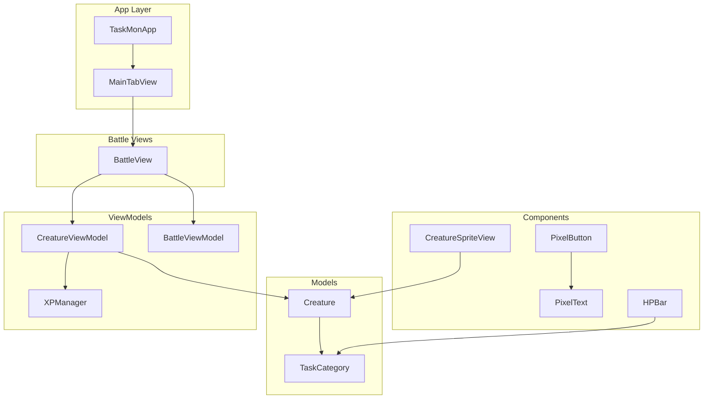
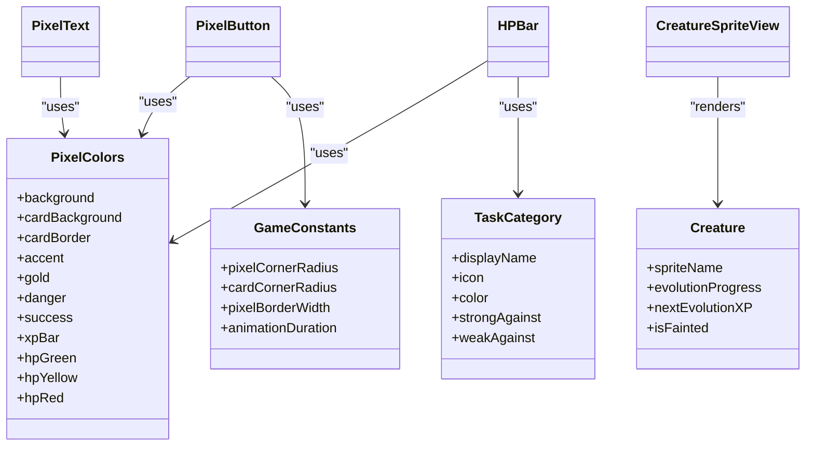
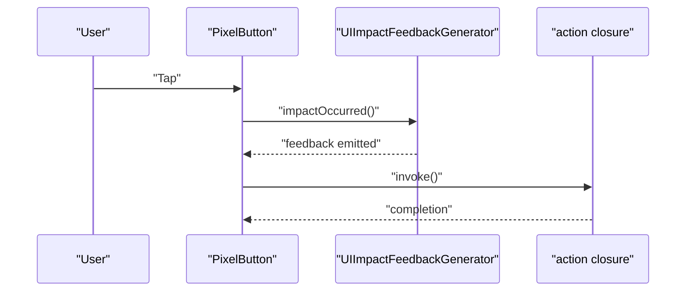
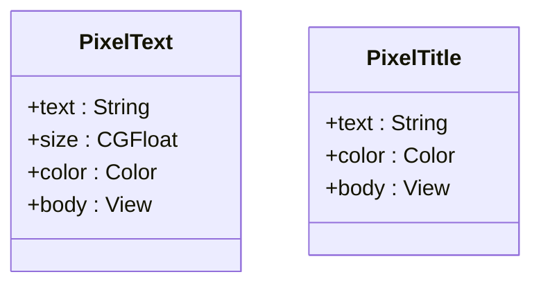
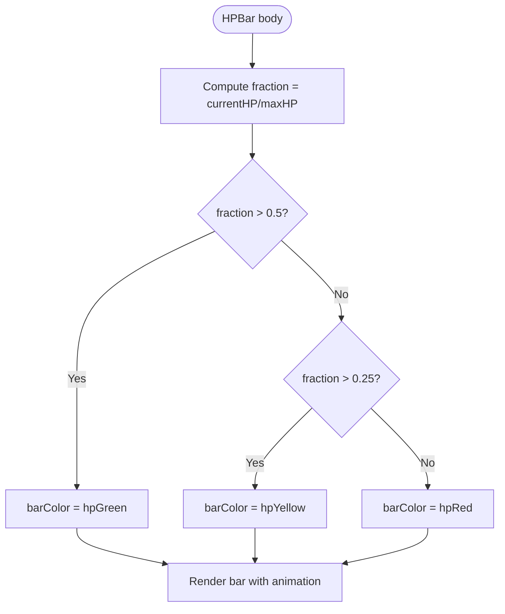
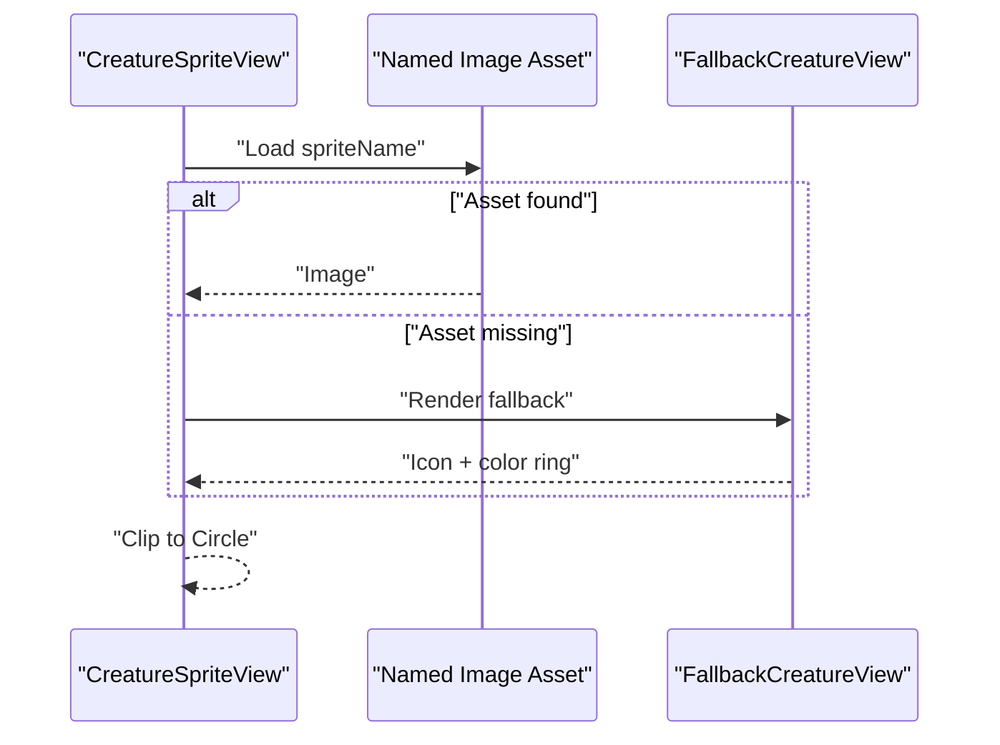
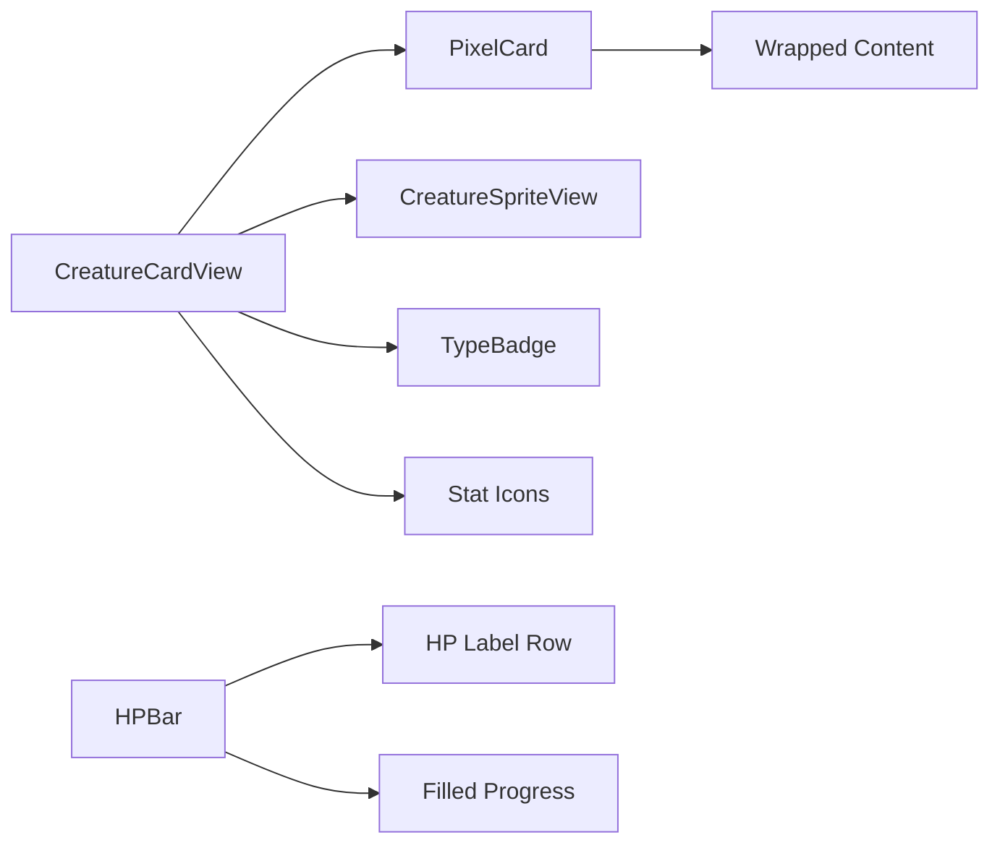
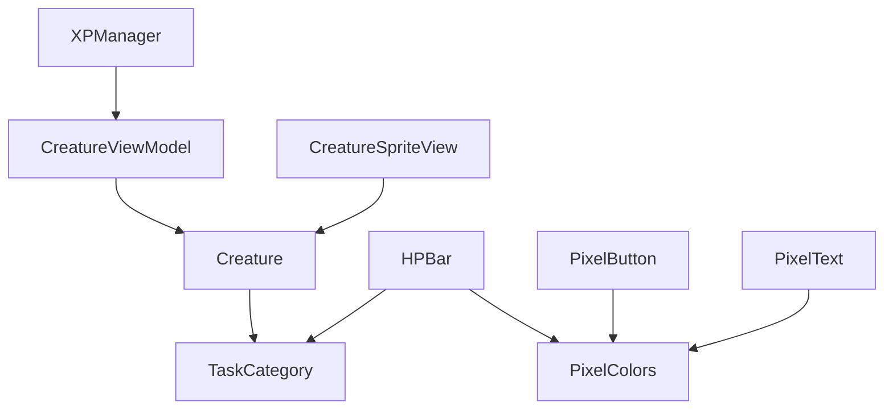

# UI Components & Design System

<cite>
**Referenced Files in This Document**
- [PixelButton.swift](file://TaskMon/TaskMon/Views/Components/PixelButton.swift)
- [PixelText.swift](file://TaskMon/TaskMon/Views/Components/PixelText.swift)
- [HPBar.swift](file://TaskMon/TaskMon/Views/Components/HPBar.swift)
- [CreatureSpriteView.swift](file://TaskMon/TaskMon/Views/Components/CreatureSpriteView.swift)
- [Constants.swift](file://TaskMon/TaskMon/Utils/Constants.swift)
- [TaskCategory.swift](file://TaskMon/TaskMon/Models/TaskCategory.swift)
- [Creature.swift](file://TaskMon/TaskMon/Models/Creature.swift)
- [CreatureCardView.swift](file://TaskMon/TaskMon/Views/Creatures/CreatureCardView.swift)
- [BattleView.swift](file://TaskMon/TaskMon/Views/Battle/BattleView.swift)
- [MainTabView.swift](file://TaskMon/TaskMon/Views/MainTabView.swift)
- [TaskMonApp.swift](file://TaskMon/TaskMon/TaskMonApp.swift)
- [XPManager.swift](file://TaskMon/TaskMon/Services/XPManager.swift)
- [CreatureViewModel.swift](file://TaskMon/TaskMon/ViewModels/CreatureViewModel.swift)
- [BattleViewModel.swift](file://TaskMon/TaskMon/ViewModels/BattleViewModel.swift)
</cite>

## Table of Contents
1. [Introduction](#introduction)
2. [Project Structure](#project-structure)
3. [Core Components](#core-components)
4. [Architecture Overview](#architecture-overview)
5. [Detailed Component Analysis](#detailed-component-analysis)
6. [Dependency Analysis](#dependency-analysis)
7. [Performance Considerations](#performance-considerations)
8. [Troubleshooting Guide](#troubleshooting-guide)
9. [Conclusion](#conclusion)
10. [Appendices](#appendices)

## Introduction
This document describes TaskMon’s custom UI component library and design system with a pixel art theme. It covers color palettes, typography choices, and visual consistency across components. It documents four primary UI components: PixelButton, PixelText, HPBar, and CreatureSpriteView. It also explains how these components integrate with the app’s data models and view models, and outlines patterns for composition, responsiveness, accessibility, and theming.

## Project Structure
The UI components live under Views/Components and are supported by shared constants and models. The app initializes view models at the app level and exposes them via environment objects to descendant views.

**Diagram sources**
- [TaskMonApp.swift](file://TaskMon/TaskMon/TaskMonApp.swift#L12-L32)
- [MainTabView.swift](file://TaskMon/TaskMon/Views/MainTabView.swift#L3-L28)
- [BattleView.swift](file://TaskMon/TaskMon/Views/Battle/BattleView.swift#L3-L52)
- [PixelButton.swift](file://TaskMon/TaskMon/Views/Components/PixelButton.swift#L3-L27)
- [PixelText.swift](file://TaskMon/TaskMon/Views/Components/PixelText.swift#L3-L25)
- [HPBar.swift](file://TaskMon/TaskMon/Views/Components/HPBar.swift#L3-L48)
- [CreatureSpriteView.swift](file://TaskMon/TaskMon/Views/Components/CreatureSpriteView.swift#L3-L19)
- [Creature.swift](file://TaskMon/TaskMon/Models/Creature.swift#L33-L97)
- [TaskCategory.swift](file://TaskMon/TaskMon/Models/TaskCategory.swift#L4-L84)
- [CreatureViewModel.swift](file://TaskMon/TaskMon/ViewModels/CreatureViewModel.swift#L5-L89)
- [BattleViewModel.swift](file://TaskMon/TaskMon/ViewModels/BattleViewModel.swift#L10-L461)
- [XPManager.swift](file://TaskMon/TaskMon/Services/XPManager.swift#L10-L95)

**Section sources**
- [TaskMonApp.swift](file://TaskMon/TaskMon/TaskMonApp.swift#L12-L32)
- [MainTabView.swift](file://TaskMon/TaskMon/Views/MainTabView.swift#L3-L28)
- [BattleView.swift](file://TaskMon/TaskMon/Views/Battle/BattleView.swift#L3-L52)

## Core Components
This section introduces the four core UI components and their roles in the design system.

- PixelButton: A themed button with pixel-border styling, monospaced text, and haptic feedback.
- PixelText: A monospaced, bold text component with configurable size and color.
- HPBar: A progress-like health indicator with color transitions and animated width changes.
- CreatureSpriteView: A circular sprite container with fallback icons based on creature category and stage.

**Section sources**
- [PixelButton.swift](file://TaskMon/TaskMon/Views/Components/PixelButton.swift#L3-L27)
- [PixelText.swift](file://TaskMon/TaskMon/Views/Components/PixelText.swift#L3-L25)
- [HPBar.swift](file://TaskMon/TaskMon/Views/Components/HPBar.swift#L3-L48)
- [CreatureSpriteView.swift](file://TaskMon/TaskMon/Views/Components/CreatureSpriteView.swift#L3-L19)

## Architecture Overview
The design system centers around a shared palette and constants, with components consuming these values for consistent visuals. View models manage state and publish changes consumed by views. The XP system emits events that drive evolution and creature creation.

**Diagram sources**
- [Constants.swift](file://TaskMon/TaskMon/Utils/Constants.swift#L26-L39)
- [Constants.swift](file://TaskMon/TaskMon/Utils/Constants.swift#L4-L24)
- [TaskCategory.swift](file://TaskMon/TaskMon/Models/TaskCategory.swift#L4-L84)
- [Creature.swift](file://TaskMon/TaskMon/Models/Creature.swift#L33-L97)
- [PixelButton.swift](file://TaskMon/TaskMon/Views/Components/PixelButton.swift#L3-L27)
- [PixelText.swift](file://TaskMon/TaskMon/Views/Components/PixelText.swift#L3-L25)
- [HPBar.swift](file://TaskMon/TaskMon/Views/Components/HPBar.swift#L3-L48)
- [CreatureSpriteView.swift](file://TaskMon/TaskMon/Views/Components/CreatureSpriteView.swift#L3-L19)

## Detailed Component Analysis

### PixelButton
- Purpose: A pixel-styled button with monospaced text, border, and shadow.
- Props:
  - title: String label
  - color: Background color (defaults to accent)
  - textColor: Foreground color (defaults to black)
  - action: Closure executed on tap
- Behavior:
  - Triggers medium-impact haptic feedback on press
  - Uses plain button style to preserve custom styling
  - Applies pixel-border overlay and subtle shadow
- Composition:
  - Internally wraps PixelText with padding and background
  - Uses GameConstants.pixelBorderWidth for stroke thickness

**Diagram sources**
- [PixelButton.swift](file://TaskMon/TaskMon/Views/Components/PixelButton.swift#L9-L26)

**Section sources**
- [PixelButton.swift](file://TaskMon/TaskMon/Views/Components/PixelButton.swift#L3-L27)
- [Constants.swift](file://TaskMon/TaskMon/Utils/Constants.swift#L19-L24)

### PixelText
- Purpose: Monospaced, bold text rendering for pixel-art consistency.
- Props:
  - text: String content
  - size: CGFloat font size (default 16)
  - color: Foreground color (default white)
- Variants:
  - PixelTitle: Larger, tracking-adjusted monospaced headline

**Diagram sources**
- [PixelText.swift](file://TaskMon/TaskMon/Views/Components/PixelText.swift#L3-L25)

**Section sources**
- [PixelText.swift](file://TaskMon/TaskMon/Views/Components/PixelText.swift#L3-L25)

### HPBar
- Purpose: Visual health indicator with animated width and color-coded segments.
- Props:
  - currentHP: Current health value
  - maxHP: Maximum health value
  - height: Bar height (default 12)
  - showLabel: Toggle for HP label row
- Behavior:
  - Computes fraction and selects color: green (>50%), yellow (>25%), red otherwise
  - Animates width change on currentHP updates
  - Renders label row with “HP” and “current/max”
- Related components:
  - XPProgressBar: Category XP progress with category icon and color
  - TypeBadge: Category badge with icon and label

**Diagram sources**
- [HPBar.swift](file://TaskMon/TaskMon/Views/Components/HPBar.swift#L9-L18)
- [HPBar.swift](file://TaskMon/TaskMon/Views/Components/HPBar.swift#L20-L47)

**Section sources**
- [HPBar.swift](file://TaskMon/TaskMon/Views/Components/HPBar.swift#L3-L48)
- [HPBar.swift](file://TaskMon/TaskMon/Views/Components/HPBar.swift#L50-L88)
- [HPBar.swift](file://TaskMon/TaskMon/Views/Components/HPBar.swift#L90-L110)
- [Constants.swift](file://TaskMon/TaskMon/Utils/Constants.swift#L26-L39)
- [TaskCategory.swift](file://TaskMon/TaskMon/Models/TaskCategory.swift#L4-L84)

### CreatureSpriteView
- Purpose: Circular sprite container for creatures with crisp pixel rendering.
- Props:
  - creature: Creature model
  - size: CGFloat frame size (default 80)
- Behavior:
  - Displays named asset image with interpolation disabled for crisp pixels
  - Clips to circle and falls back to a category-based icon with color ring
- Fallback logic:
  - Selects icon based on category and stage
  - Uses category color for background and foreground

**Diagram sources**
- [CreatureSpriteView.swift](file://TaskMon/TaskMon/Views/Components/CreatureSpriteView.swift#L7-L18)
- [CreatureSpriteView.swift](file://TaskMon/TaskMon/Views/Components/CreatureSpriteView.swift#L21-L51)
- [Creature.swift](file://TaskMon/TaskMon/Models/Creature.swift#L44-L46)

**Section sources**
- [CreatureSpriteView.swift](file://TaskMon/TaskMon/Views/Components/CreatureSpriteView.swift#L3-L19)
- [CreatureSpriteView.swift](file://TaskMon/TaskMon/Views/Components/CreatureSpriteView.swift#L21-L51)
- [Creature.swift](file://TaskMon/TaskMon/Models/Creature.swift#L33-L97)

### Component Composition Patterns
- Card containers: PixelCard wraps content with rounded borders and background, enabling consistent spacing and clipping.
- Badge and stats: TypeBadge displays category identity; stat icons combine icons and values for compact info.
- Health and XP: HPBar and XPProgressBar share similar layout patterns (label + progress bar) with category-aware colors.

**Diagram sources**
- [PixelButton.swift](file://TaskMon/TaskMon/Views/Components/PixelButton.swift#L29-L43)
- [CreatureCardView.swift](file://TaskMon/TaskMon/Views/Creatures/CreatureCardView.swift#L3-L30)
- [HPBar.swift](file://TaskMon/TaskMon/Views/Components/HPBar.swift#L20-L47)

**Section sources**
- [PixelButton.swift](file://TaskMon/TaskMon/Views/Components/PixelButton.swift#L29-L43)
- [CreatureCardView.swift](file://TaskMon/TaskMon/Views/Creatures/CreatureCardView.swift#L3-L52)
- [HPBar.swift](file://TaskMon/TaskMon/Views/Components/HPBar.swift#L20-L47)

## Dependency Analysis
- Shared resources:
  - PixelColors and GameConstants are used across components for consistent visuals and spacing.
  - TaskCategory supplies category metadata for badges, XP bars, and sprite fallbacks.
- State and events:
  - XPManager publishes XP events that CreatureViewModel consumes to unlock and evolve creatures.
  - BattleViewModel coordinates battle state and animations, integrating with UI components for feedback.

**Diagram sources**
- [XPManager.swift](file://TaskMon/TaskMon/Services/XPManager.swift#L10-L95)
- [CreatureViewModel.swift](file://TaskMon/TaskMon/ViewModels/CreatureViewModel.swift#L5-L89)
- [Creature.swift](file://TaskMon/TaskMon/Models/Creature.swift#L33-L97)
- [TaskCategory.swift](file://TaskMon/TaskMon/Models/TaskCategory.swift#L4-L84)
- [HPBar.swift](file://TaskMon/TaskMon/Views/Components/HPBar.swift#L3-L48)
- [PixelButton.swift](file://TaskMon/TaskMon/Views/Components/PixelButton.swift#L3-L27)
- [PixelText.swift](file://TaskMon/TaskMon/Views/Components/PixelText.swift#L3-L25)
- [Constants.swift](file://TaskMon/TaskMon/Utils/Constants.swift#L26-L39)

**Section sources**
- [XPManager.swift](file://TaskMon/TaskMon/Services/XPManager.swift#L10-L95)
- [CreatureViewModel.swift](file://TaskMon/TaskMon/ViewModels/CreatureViewModel.swift#L5-L89)
- [HPBar.swift](file://TaskMon/TaskMon/Views/Components/HPBar.swift#L3-L48)
- [PixelButton.swift](file://TaskMon/TaskMon/Views/Components/PixelButton.swift#L3-L27)
- [PixelText.swift](file://TaskMon/TaskMon/Views/Components/PixelText.swift#L3-L25)
- [Constants.swift](file://TaskMon/TaskMon/Utils/Constants.swift#L26-L39)

## Performance Considerations
- Pixel rendering:
  - Interpolation disabled for sprites ensures crisp pixel art at various sizes.
- Animations:
  - HPBar animates width changes; XPProgressBar animates XP fills; BattleViewModel uses staggered message animations and targeted shake triggers.
- Computation:
  - Fraction calculations and color selection are lightweight; avoid frequent reflows by minimizing unnecessary recomputations.

[No sources needed since this section provides general guidance]

## Troubleshooting Guide
- Button feedback not triggering:
  - Verify haptic feedback generator initialization and that the action closure executes.
- HPBar not animating:
  - Ensure currentHP changes cause recomputation; confirm animation modifier targets the changing value.
- Sprite not appearing:
  - Confirm spriteName matches asset naming; fallback icon appears when asset is missing.
- XP-driven evolution not updating:
  - Check XPManager event emissions and CreatureViewModel subscription pipeline.

**Section sources**
- [PixelButton.swift](file://TaskMon/TaskMon/Views/Components/PixelButton.swift#L9-L26)
- [HPBar.swift](file://TaskMon/TaskMon/Views/Components/HPBar.swift#L35-L38)
- [CreatureSpriteView.swift](file://TaskMon/TaskMon/Views/Components/CreatureSpriteView.swift#L7-L18)
- [XPManager.swift](file://TaskMon/TaskMon/Services/XPManager.swift#L22-L50)
- [CreatureViewModel.swift](file://TaskMon/TaskMon/ViewModels/CreatureViewModel.swift#L24-L63)

## Conclusion
TaskMon’s UI components implement a cohesive pixel-art design system with consistent colors, typography, and spacing. Components are composable, reactive, and accessible through SwiftUI’s environment objects and Combine publishers. The system scales across device sizes and orientations while maintaining visual fidelity and performance.

[No sources needed since this section summarizes without analyzing specific files]

## Appendices

### Usage Examples and Integration Patterns
- Using PixelButton:
  - Wrap actions with haptic feedback and pass color/textColor to match context.
  - Reference: [PixelButton.swift](file://TaskMon/TaskMon/Views/Components/PixelButton.swift#L3-L27)
- Using PixelText and PixelTitle:
  - Use PixelTitle for headings and PixelText for body content; adjust size and color for contrast.
  - Reference: [PixelText.swift](file://TaskMon/TaskMon/Views/Components/PixelText.swift#L3-L25)
- Using HPBar:
  - Provide currentHP and maxHP; showLabel toggles the header row; adjust height for density.
  - Reference: [HPBar.swift](file://TaskMon/TaskMon/Views/Components/HPBar.swift#L3-L48)
- Using CreatureSpriteView:
  - Pass a Creature and size; rely on fallback when asset is missing.
  - Reference: [CreatureSpriteView.swift](file://TaskMon/TaskMon/Views/Components/CreatureSpriteView.swift#L3-L19)
- Composition example:
  - CreatureCardView demonstrates combining PixelCard, CreatureSpriteView, TypeBadge, and stat icons.
  - Reference: [CreatureCardView.swift](file://TaskMon/TaskMon/Views/Creatures/CreatureCardView.swift#L3-L52)

### Responsive Design Guidelines
- Adaptive sizing:
  - Use size parameters on CreatureSpriteView and HPBar to scale with container width.
- Orientation handling:
  - Prefer GeometryReader-based layouts for dynamic width-dependent progress bars.
- Typography scaling:
  - Use Dynamic Type by leveraging system fonts; avoid fixed sizes when possible.
- Dark mode:
  - App-wide dark mode is set; ensure sufficient contrast with PixelColors.

[No sources needed since this section provides general guidance]

### Accessibility Compliance
- VoiceOver:
  - Provide meaningful labels for interactive elements; use semantic labels for images.
- Dynamic Type:
  - Prefer system fonts with scalable sizes; avoid hard-coded sizes for text.
- Contrast:
  - Use PixelColors for backgrounds and text; ensure text color contrasts with backgrounds.

[No sources needed since this section provides general guidance]

### Style Customization and Theming
- Centralized palette:
  - Modify PixelColors for global theme changes.
- Spacing and borders:
  - Adjust GameConstants for consistent corner radii and border widths.
- Category-aware styles:
  - Use TaskCategory.color and icon for badges and XP bars to maintain thematic coherence.

**Section sources**
- [Constants.swift](file://TaskMon/TaskMon/Utils/Constants.swift#L26-L39)
- [Constants.swift](file://TaskMon/TaskMon/Utils/Constants.swift#L4-L24)
- [TaskCategory.swift](file://TaskMon/TaskMon/Models/TaskCategory.swift#L4-L84)

### Component State Management and SwiftUI Integration
- Environment objects:
  - TaskMonApp exposes TaskViewModel, CreatureViewModel, and BattleViewModel to views.
  - References: [TaskMonApp.swift](file://TaskMon/TaskMon/TaskMonApp.swift#L16-L25)
- Reactive updates:
  - CreatureViewModel subscribes to XPManager events and publishes changes.
  - References: [CreatureViewModel.swift](file://TaskMon/TaskMon/ViewModels/CreatureViewModel.swift#L24-L63)
- Battle state:
  - BattleViewModel manages phases, turns, animations, and online matchmaking.
  - References: [BattleViewModel.swift](file://TaskMon/TaskMon/ViewModels/BattleViewModel.swift#L10-L461)

**Section sources**
- [TaskMonApp.swift](file://TaskMon/TaskMon/TaskMonApp.swift#L16-L25)
- [CreatureViewModel.swift](file://TaskMon/TaskMon/ViewModels/CreatureViewModel.swift#L24-L63)
- [BattleViewModel.swift](file://TaskMon/TaskMon/ViewModels/BattleViewModel.swift#L10-L461)